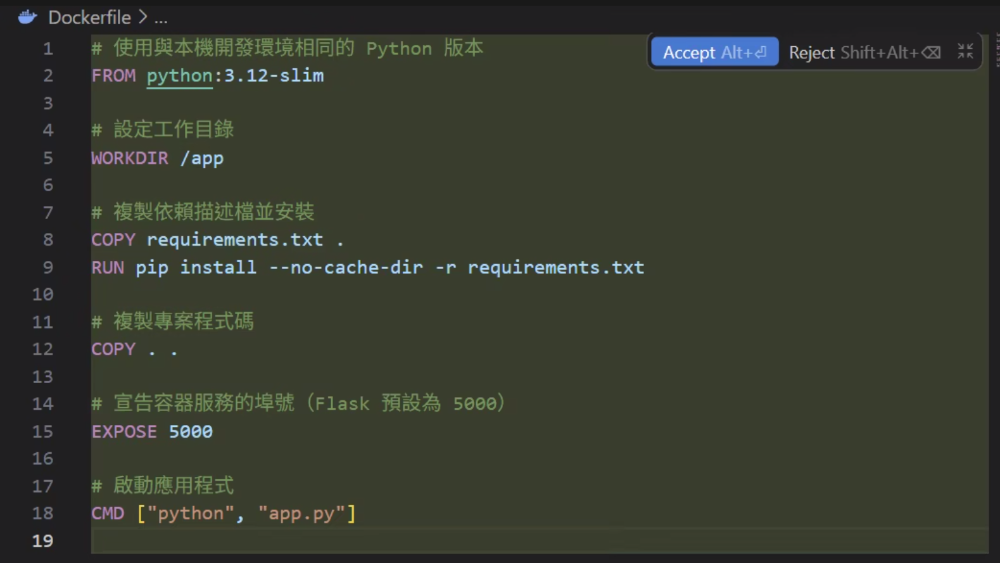

# Image
**Image（映像檔）**→ 就像是「軟體安裝包 + 作業系統環境的快照」
Image= Ubuntu + Python + Flask + 你的程式 + 所有套件
## 建立image
1. 在專案中建立dockerfile
內容:
```python
FROM python:3.11 # 下載 python:3.11 這個image 沒有的話會 自動 docker pull python:3.11

WORKDIR /app  #在image裡面建立 /app

COPY . .  #複製當前目錄

RUN pip install flask

CMD ["python", "app.py"] #以後 Container 啟動時 預設執行-> CMD #執行一次後存進iamge -> RUN 
```
最終產生:
Image<br>└── my-flask
2. 在終端機執行 path → 專案:
`docker build -t my-flask` 
## 檢視image
`docker images`
# Container
**Container 微電腦 → **執行image的地方
`docker run my-flask ` 在container中執行image my-flask
Docker 用來\*\*下載映像檔（Image）\*\*的指令
`docker pull 映像檔名稱`

設定防火牆tags
你在 GCP（Google Cloud）中設定的「標籤」，官方術語叫做 **Labels**（注意：GCP 還有另一種叫 Tags 的東西，兩者不同）。
簡單來說，GCP 的標籤就像是「貼紙」。當你的雲端資源（例如：虛擬機、儲存桶、資料庫）越來越多時，你可以透過貼上這些貼紙，把資源分門別類，方便日後管理。
---
### 🏷️ 標籤的長相：鍵值對（Key-Value Pairs）
每一張標籤貼紙都由兩個部分組成：
- **鍵（Key）：** 類別名稱（例如：`environment` 環境、`department` 部門）。
- **值（Value）：** 具體內容（例如：`production` 正式環境、`marketing` 行銷部）。
> **舉例：** \> 你有一台主機是給會計部測試用的，你就可以幫它貼上兩張標籤：<br>`env: testdept: finance`
---
### 🎯 設定標籤的三大核心核心用途
1. **帳單分析（最常用的功能！💰）：**<br>這是企業最看重的功能。當你所有的資源都貼上標籤後，你可以匯出帳單到 BigQuery 或在 Billing 控制台中過濾。例如：一鍵查詢「今年行銷部（`dept: marketing`）總共花了我多少雲端費用？」
2. **資源過濾與搜尋（🔍）：**<br>當專案裡有幾百台虛擬機時，你可以在網頁控制台或使用 `gcloud` 指令，直接過濾出所有 `env: production`（正式環境）的機器，方便批次檢查。
3. **自動化運維（🤖）：**<br>你可以寫腳本去辨識標籤。例如：寫一個自動化程式，每天晚上 12 點自動把所有貼有 `temporary: true`（臨時測試用）的虛擬機關機，幫公司省錢。
---
### ⚠️ 補充：GCP 裡容易搞混的「Labels」與「Tags」
在 GCP 裡，這兩個詞都被翻成標籤，但功能完全不同，千萬別混淆：
- **Labels（你目前設定的）：** 用於**管理、分類和算帳（帳單）**。它不會影響網路或安全安全性。
- **Tags（或稱 Network Tags / Secure Tags）：** 專門用於**網路防火牆**。例如，你在 VM 貼上一個名為 `web-server` 的 Tag，防火牆規則就會認這個 Tag，並對這台 VM 開放外網 80/443 連接埠。它**跟帳單完全無關**。

SSH → 下載docker → git clone → 
## 開啟 SSH

## 下載docker
```python
## ⚡ 快速安裝指令（推薦）

請在 GCE Ubuntu 終端機中，複製並執行以下指令：

```bash
# 1. 下載並執行 Docker 官方的一鍵安裝腳本（自動設定金鑰與安裝最新版 Docker & Docker Compose）
curl -fsSL https://get.docker.com -o get-docker.sh
sudo sh get-docker.sh

# 2. 建立相容性軟連結（讓習慣使用有橫線的 docker-compose 指令也能運作）
sudo ln -sf /usr/libexec/docker/cli-plugins/docker-compose /usr/local/bin/docker-compose

# 3. 將當前使用者加入 Docker 群組以實現免 sudo 執行
sudo usermod -aG docker $USER
```

> 💡 **重要提示**：執行完上述指令後，請**斷開 SSH 連線並重新連線**，免 `sudo` 的設定才會生效。

---

## 🔍 驗證安裝

重新連線後，執行以下指令確認是否成功安裝最新版：

```bash
# 1. 測試 Docker 運作狀態與版本
docker ps
docker --version

# 2. 測試新版 Docker Compose V2 運作狀態
docker compose version

# 3. 測試相容的舊版 docker-compose 指令運作狀態
docker-compose version
```

### 📝 說明：
* **`docker compose` (新版 V2，推薦)**：使用 Go 語言重寫的 CLI 插件，效能與整合度更好。
* **`docker-compose` (舊版 V1)**：原本是 Python 寫的獨立工具，本指南已透過軟連結將其指向 V2 插件，因此兩者指令目前都將指向最新版 V2 執行。
```

## git clone 取得專案
```python
## ⬇️ 取得專案

### 步驟 1：Clone 專案（含 Dify 子模組）

```bash
git clone --recurse-submodules https://github.com/cxcxc-io/tibame_python_docker_tutorial.git
cd tibame_python_docker_tutorial
```

> 如果您已經 Clone 但忘記帶子模組，請補執行：
> ```bash
> git submodule update --init --recursive
> ```
```
sh [start-all.sh](http://start-all.sh/)
# AI agent 客服機器人
虛擬機要接Vertex AI
1. IAM 找default servce account
2. 給權限 vertex AI user
3. dify設定 → GCE 從虛擬機SSH進入連線
```python
SSH 指令
dumpling8877@ai-web:~$ ls
get-docker.sh  tibame_python_docker_tutorial
dumpling8877@ai-web:~$ cd ^C
dumpling8877@ai-web:~$ cd tibame_python_docker_tutorial/
dumpling8877@ai-web:~/tibame_python_docker_tutorial$ sh start-all.sh
```
1. 模型供應商 Vertex AI

`gcloud auth application-default login ` → 

雲端
GCP 新專案
建立新的service account

地端

