- [tensenflow語法紀錄](https://app.notion.com/p/37f83f385f3a80c0b043d805fc201f2f)
- [Questions](https://app.notion.com/p/37d83f385f3a805c8fdef4512d0e3627)
## 人工智慧歷史介紹
<table header-row="true">
<tr>
<td>時間</td>
<td>階段</td>
<td>主要特徵</td>
<td>興盛原因</td>
<td>衰退原因</td>
</tr>
<tr>
<td>**1956年**</td>
<td>人工智慧誕生</td>
<td>AI（Artificial Intelligence）一詞正式提出</td>
<td>科學家開始研究讓機器模仿人類思考</td>
<td>—</td>
</tr>
<tr>
<td>**1956～1973年**</td>
<td>**第一次高峰**</td>
<td>大量研究與演算法出現</td>
<td>政府與研究機構投入大量資金，對AI充滿期待</td>
<td>—</td>
</tr>
<tr>
<td>**1974～1980年**</td>
<td>**第一次低潮（AI寒冬）**</td>
<td>AI研究發展停滯</td>
<td>—</td>
<td>電腦運算速度慢、記憶體容量不足，成果未達預期</td>
</tr>
<tr>
<td>**1980～1987年**</td>
<td>**第二次高峰（專家系統時代）**</td>
<td>利用專家知識建立規則庫進行推理</td>
<td>企業開始將AI應用於醫療診斷、故障排除等領域</td>
<td>—</td>
</tr>
<tr>
<td>**1987～1993年**</td>
<td>**第二次低潮（AI寒冬）**</td>
<td>專家系統逐漸失去市場吸引力</td>
<td>—</td>
<td>維護成本高、規則難以擴充、無法自行學習</td>
</tr>
<tr>
<td>**1993年至今**</td>
<td>**第三次浪潮**</td>
<td>機器學習、深度學習、生成式AI快速發展</td>
<td>電腦效能提升、大數據普及、演算法突破</td>
<td>持續發展中</td>
</tr>
</table>
 

## 起始：
John McCarthy(約翰·麥卡錫) 在 1955 年創造了人工智慧這個詞彙(當年 8月，麥卡錫（John McCarthy，達特茅斯）、明斯基（Marvin Minsky，哈佛）、羅切斯特（Nathaniel Rochester，IBM）和香農（Claude Shannon，貝爾電話實驗室）四人寫了一份提案《達特茅斯關於人工智慧的夏季研究項目的提案》)。隔年(1956年)於美國達特茅斯學院（Dartmouth College）所召開的第一次人工智慧會議，現在大家普遍將 1956 年視為人工智慧學科的創立，定為人工智慧元年。

## 浪潮的興起
第一次人工智慧浪潮起於 1950 年，由於出現在網路之前，因此又被稱為「古典人工智慧」。只不過，雖然當時的成果已能解開拼圖或簡單的遊戲，卻幾乎無法解決實用的問題。

## 第一次低潮：
1974年起，因為受限於由於限於計算機內存有限與處理速度慢，人工智慧過了好幾年都沒有重要的突破，而且應用面沒有之前想像中的廣泛與無法回答人類不知道的問題。

## 第二次興起：
1. 1986年，Hinton(辛頓)等人提出反向傳播法，降低了類神經網路的計算量，讓類神經網路一度興起（但隨即又發現反向傳播仍受到梯度消失的問題(vanishing gradient problem)，因此又漸漸的凋零）
2. 淺層深度學習-支持向量機(SVM)等的興起，能從資料學到一套能把郵件分成垃圾郵件與非垃圾郵件兩種類別的技能，因此廣受矚目
3. 另一個分支，第一套專家系統(Expert System) DENDRAL也在這時代誕生

## 第二次低潮：
專家系統是由大量的知識庫與推理規則堆疊而成的才能模擬由領域專家才能解決的覆雜問題，需要大量的維護，但其應用範圍仍有侷限性，加上電腦不斷的進步，因此專家系統漸漸走下坡

## 第三次興起：
從1993年起，由於硬體運算能力也大幅提升，機器學習的演算法於語音辨識與影像辨識的能力也隨之增強

## **深度學習（Deep Learning）發展過程中的兩個重要模型：RBM 與 DBN**。
2006年，Hinton發展了限制玻爾茲曼機（restricted Boltzmann machine;RBM）模型與深度信念網路 (Deep Belief Network;DBN)成功訓練多層神經網路，並把多層類神經網路正式命名深度學習(Deep learning)

<table header-row="true">
<tr>
<td>項目</td>
<td>RBM（Restricted Boltzmann Machine）</td>
<td>DBN（Deep Belief Network）</td>
</tr>
<tr>
<td>中文名稱</td>
<td>限制玻爾茲曼機</td>
<td>深度信念網路</td>
</tr>
<tr>
<td>結構</td>
<td>一層可見層 + 一層隱藏層</td>
<td>多個RBM堆疊而成</td>
</tr>
<tr>
<td>層數</td>
<td>淺層網路</td>
<td>深層網路</td>
</tr>
<tr>
<td>學習方式</td>
<td>學習資料特徵</td>
<td>逐層學習更抽象特徵</td>
</tr>
<tr>
<td>用途</td>
<td>特徵提取、降維</td>
<td>影像辨識、語音辨識</td>
</tr>
<tr>
<td>提出時間</td>
<td>約1986年</td>
<td>約2006年</td>
</tr>
<tr>
<td>與深度學習關係</td>
<td>基礎元件</td>
<td>深度學習早期代表模型</td>
</tr>
</table>
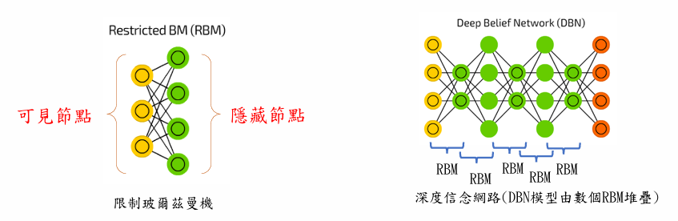
### 解釋圖
# 左圖：RBM（限制玻爾茲曼機）
## 結構
```plain text
可見層 (Visible Layer)
    ○ ○ ○
      ↕
      ↕
隱藏層 (Hidden Layer)
    ● ● ● ●
```
圖中：
🟡 黃色節點
= 可見節點（Visible Nodes）
代表：
- 圖片像素
- 聲音資料
- 文字資料
也就是輸入資料。
---
🟢 綠色節點
= 隱藏節點（Hidden Nodes）
負責：
- 找出資料中的規律
- 學習重要特徵
例如：
輸入手寫數字：
```plain text
0
1
2
3
...
```
隱藏層可能學到：
- 圓形特徵
- 直線特徵
- 彎曲特徵
---
## 為什麼叫 Restricted？
一般神經網路：
```plain text
A ↔ B ↔ C
```
同一層節點可能互相連接。
---
RBM規定：
```plain text
可見層 ←→ 隱藏層

可見層 × 可見層
隱藏層 × 隱藏層
```
同層不能連接。
因此稱為：
**Restricted（限制）Boltzmann Machine**
---
# 右圖：DBN（深度信念網路）
DBN由多個RBM堆疊而成。
圖中：
```plain text
輸入層
 ↓
RBM1
 ↓
RBM2
 ↓
RBM3
 ↓
RBM4
 ↓
輸出層
```
---
## 工作方式
### 第一層RBM
學習最簡單特徵
例如人臉照片：
```plain text
邊緣
線條
角落
```
---
### 第二層RBM
學習較複雜特徵
```plain text
眼睛
鼻子
嘴巴
```
---
### 第三層RBM
學習更高階特徵
```plain text
表情
臉型
髮型
```
---
### 最後
辨識：
```plain text
這是一張人臉
```
---
# 為什麼DBN重要？
在2006年以前：
神經網路通常只有：
```plain text
輸入層
 ↓
隱藏層
 ↓
輸出層
```
層數太多會遇到：
- 梯度消失（Vanishing Gradient）
- 訓練困難
- 容易失敗
---
2006年，
Geoffrey Hinton 提出利用RBM逐層預訓練（Pre-training）的方法。
使得：
```plain text
多層神經網路
可以成功訓練
```
這被認為是：
**深度學習復興的重要里程碑。**

- 2012年AlexNet(CNN在圖像識別方面的重要分水領)在ImageNet訓練集上圖像識別精度取得重大突破，直接推升了新一輪人工智能發展的浪潮。
- 2016年，AlphaGo打敗圍棋職業選手(李世乭)後人工智能再次收穫了空前的關注度。
## 何謂深度學習?
- AI研究的範圍非常廣泛，目前最流行的機器學習只是AI的一個子領域，而深度學習（Deep Learning）又是機器學習底下的一個分支
- 人類的大腦大約一公斤多，結構非常複雜，估計大約有860億個神經元，以及超過100兆條神經相連。
- 因為人類的神經網路太過複雜，為了方便模擬，因此會把網路分成很多層，因此稱之深度學習。

## 何謂神經元?
- 人工神經網路（英語：Artificial Neural Network，ANN），簡稱神經網路（Neural Network，NN）或類神經網路，是一種模擬生物神經網路（動物的中樞神經系統，特別是大腦）的結構和功能的數學模型或計算模型，用於對函數進行估計或計算模型。
- 神經系統由神經元構成，彼此間透過突觸以電流傳遞訊號。是否傳遞訊號、取決於神經細胞接收到的訊號量，當訊號量超過了某個閥值(Threshold)時，細胞體就會產生電流、通過突觸傳到其他<br>神經元。單個神經細胞可被視為一種只有兩種狀態的機器——激動時為『是』，而未激動時為『否』。
- 為模擬神經細胞行為，科學家設定每個神經元都是一個「激勵函數」，就是一個運算公式 (如下式)，當對神經元輸入一組輸入值(input)後，經過激勵函數運算後傳出輸出值 (output)，這個輸出<br>值會再傳入下個神經元，成為下個神經元的輸入值。
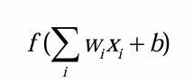

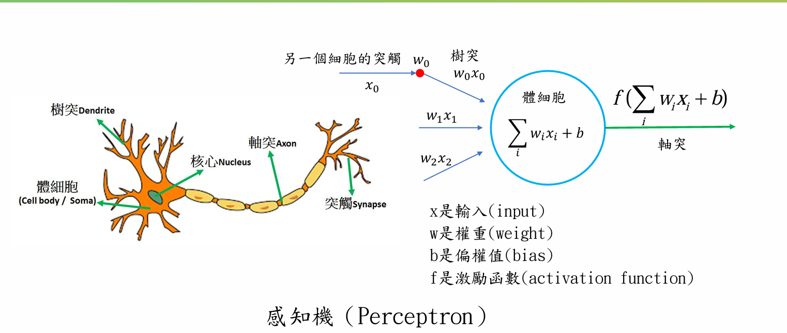
- 感知機 (Perceptron) 是 Frank Rosenblatt(弗蘭克·羅森布拉特)於 1957 年在康奈爾航空實驗室 (Cornell Aeronautical Laboratory) 時所提出的第一個神經網路模型。它可以被視為一種最簡單形式的單層神經網路，是一種線性的二分類器。
- 「感」就是感受，必然要輸入；「知」就是知道，一定有輸出。所以感知機就可以理解為對輸入進行處理，得到並輸出結果的機器。
- 例如，一個人朝你走來，他/她的五官信息作為輸入被你的眼睛感受到，然後大腦經過綜合分析、處理，得到美還是丑的結論。在這個過程中，大腦就扮演著感知機的角色。
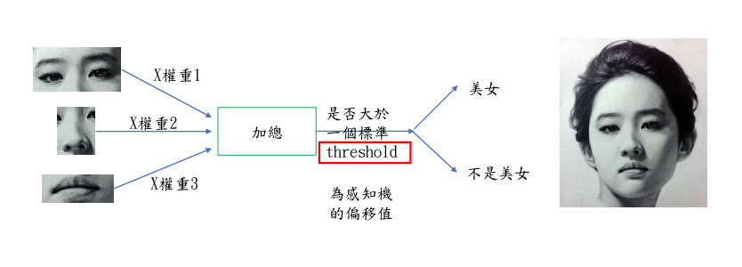
- 可以經由多個輸入的數據(特徵)，透過運算產生一個非黑即白的結果，用途相當廣泛。
- 例如：透過收入、負債的數據，協助銀行判斷顧客是否可以核辦信用卡 (可發/不可發)、或是可以找出潛在消費者(潛在/非潛在)、判斷股票未來的走勢(漲/跌)等等。
- 感知機的輸入為樣本的特徵向量，輸出則為樣本的類別，取 +1 和-1 二值。
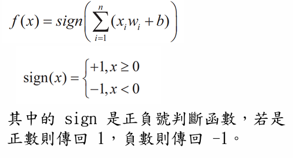

## 尋找目標函數
如何找到目標函數(感知器演算法 Perceptron Learning Algorithm(PLA))：
- 簡單感知機演算法（Perceptron Learning Algorithm，PLA）的思路很簡單，首先隨便找一條直線，然後遍歷每一個已知點，如果正確，則跳過；如果錯誤，則利用這個點的信息對直線進行修正。
- 如何找到這樣一條最好的直線呢？這裡使用逐點修正的思想，首先在平面上隨意取一條直線，看看哪些點分類錯誤。然後開始對第一個錯誤點就行修正，即變換直線的位置，使個錯誤點變成分類正確的點。
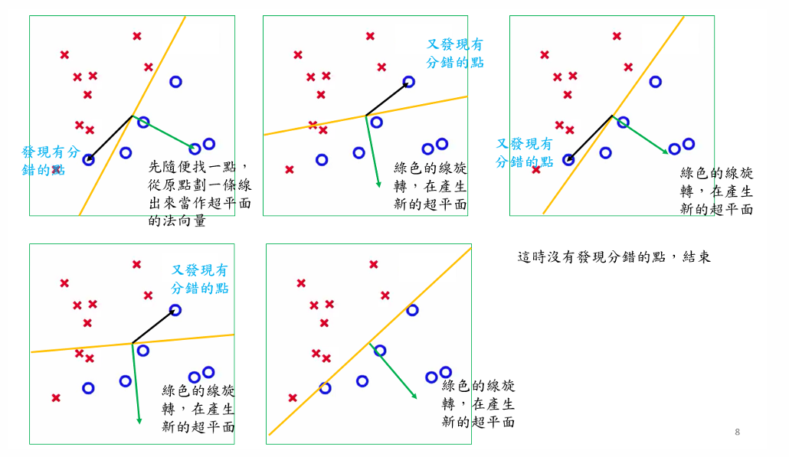
目標函數 y = ax + b
用座標( x, y)去找到最佳的線，所以目標要算出 a 和 b
- 感知器演算法只是一個單一神經元模型，訊號輸入後，輸出最終結果，與大腦神經元是相互連結運作的實際情形差異甚遠，後有「多層感知器」(Multi-player Perceptron, MLP) 多層神經網路演算法模型提出。
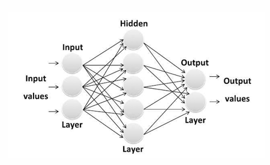
## 激勵函數:讓線性變成非線性
- 線性與非線性：在日常生活當中太多非線性的問題
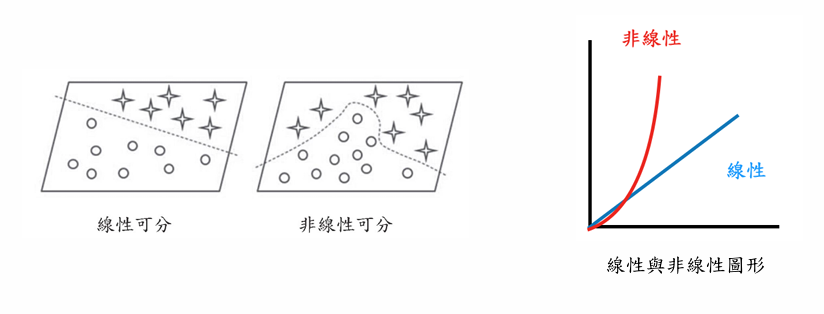
• 在單層神經網絡中（感知機），輸入和輸出計算關係如下圖所示：
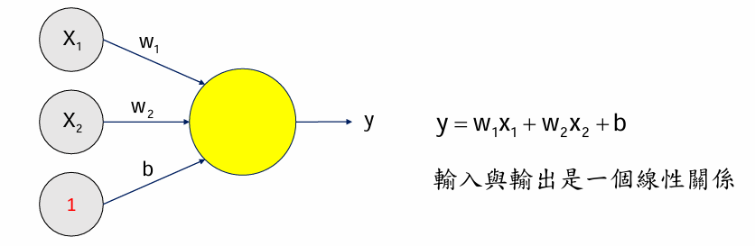
• 對於增加了多個神經元之後，計算公式也是類似，如下圖：
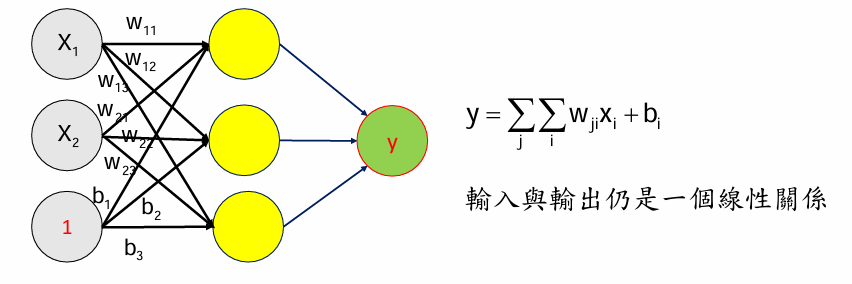
- 因此，通過在神經網絡中加入非線性激勵函數(ActivationFunction)後，神經網絡就有可能學習到平滑的曲線來實現對非線性數據的處理了。
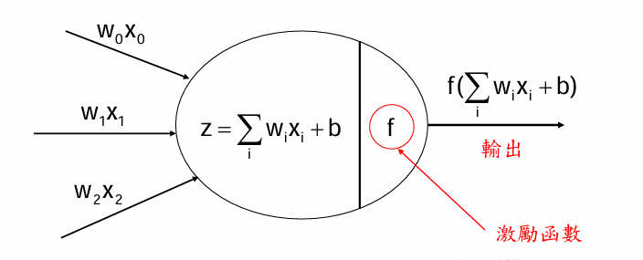
- 理想的激勵函數是如圖下的階躍函數，可將任意輸入值轉換為輸出值「0」或「1」，「1」對應神經元興奮，「0」對應神經元抑制。
- 這種情況符合生物神經元的傳遞特性，但階躍函數具有不連續、不光滑等性質，所以無法被用於神經網路結構。
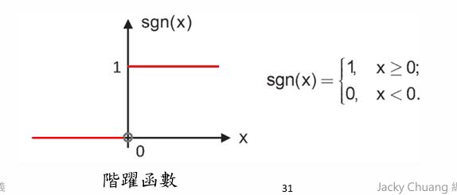

## 激勵函數
### 激勵函數(一)- sigmoid 函數
此函數具有指數函數的形狀，它在物理意義上最為接近生物神經元。其自身的缺陷，最明顯的就是飽和性。
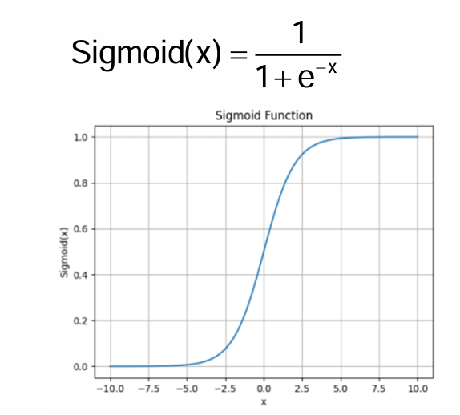
- sigmoid 函數的優點：
- 它能夠把輸入的連續實值變換爲 0 和 1 之間的輸出，特別的，如果是非常大的負數，那麼輸出就是 0；如果是非常大的正數，輸出就是 1。從程式結果可以看到，向量中元素值的 x 值的範圍由\[-10,10\]映射到輸出(0,1)的區間。(適合用於將預測概率作為輸出的模型)
- 連續的函數，方便求導數。
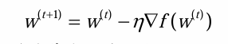
- sigmoid 函數的缺點：
- sigmoid 函數在變量取絕對值非常大的正值或負值時會出現飽和現象(接近1)，意味著函數值的左右兩端會變得很平坦，並且對輸入的微小改變會變得不敏感。
- 在反向傳播時，當梯度接近於 0，權重基本不會更新，很容易就會出現梯度消失（Vanishing gradient）的情況，從而無法完成深層網路的訓練。
- 計算複雜度高，因為 sigmoid 函數是指數形式。
- sigmoid 函數的輸出不是 0 均值的，會導致後層的神經元的輸入是非 0 均值的訊號，這會對梯度產生影響。
Sigmoid 會造成梯度消失的原因是：
> **當輸入很大或很小時，Sigmoid 的導數接近 0，而反向傳播需要不斷相乘這些導數，導致梯度越傳越小，最後幾乎變成 0，使前面層的權重無法有效更新。**
### 激勵函數(二)- Tanh(雙曲正切) 函數
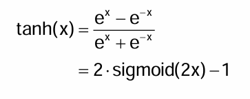
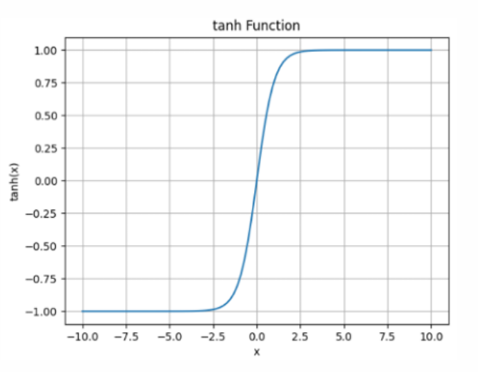
此函數順利解決 Sigmoid 函數中 zero-centered(均值)的輸出問題，但是梯度消失問題以及需要指數運算的問題依然存在，但相較於 Sigmoid 函數，可用性還是相差不小。
### 激勵函數(三)-ReLU(REctified Linear Unit，修正線性單元)
- 在 ReLU 激活函數提出之前，Sigmoid 函數通常是神經網路的激勵函數首選。但是Sigmoid 函數在輸入值較大或較小時容易出現梯度值接近於 0 的現象，稱為梯度消失現象。
-  2012 年提出的 8 層 AlexNet 模型，它使用了非飽和的 ReLU 啟用功能，顯示出比 tanh 和 sigmoid 更好的訓練效能，自此 ReLU 函數應用的越來越廣泛。
- ReLU 函數定義為：
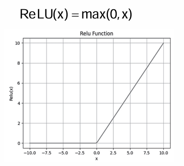
ReLU 缺點為壞死，由於 ReLU 在 x \< 0 時梯度為 0，導致負的梯度在這個 ReLU 被設置零，且這個神經元有可能再也不會被任何數據激活，稱神經元「壞死」。
- 為何可以解決梯度消失的問題：以下圖網路來說，當每層的 Z ≤ 0，<br>就等於讓神經元失去作用停止傳播(下面右圖)，整個變成稀疏線性<br>的網路。當 Z \> 0 則 a=Z ，此時梯度不會衰減。這樣就避免梯度<br>消失的問題。
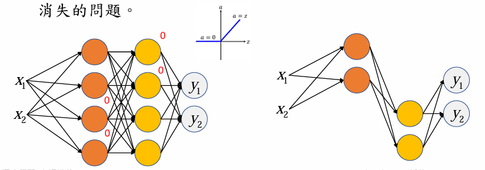
- 總結一下 ReLU 代替傳統的 Tanh 或 Sigmoid 的好處:
- ReLU本質上是分段線性模型，前向計算非常簡單，無需指數之類操作。
- ReLU的偏導也很簡單，反向傳播梯度，無需指數或者除法之類操作。
- ReLU不容易發生梯度發散問題，Tanh 和 Sigmoid 函數在兩端的時候導數容易趨近於零，多級連乘後梯度更加約等於0。
- ReLU會使很多的隱藏層輸出為0，即網絡變得稀疏，起到了類似L1的正則化作用，可以在一定程度上緩解過擬合(單元九會解釋)。
### 激勵函數(四)- LeakyReLU
ReLU 函數在 x \< 0 時導數值恆為 0，也可能造成梯度彌散現象，為克服這個問題，LeakyReLU 函數被提出
LeakyReLU 的表達式為：
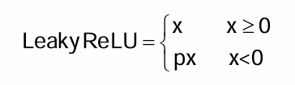
p 參數為自行設置的超參數，如 0.02 等。
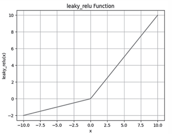
### 激勵函數(五)-Parameterized-ReLU(PReLU)
PReLU也是ReLU的改進版本：
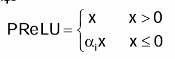
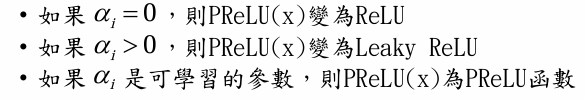
### 激勵函數(六)- Exponential Linear Unit(ELU)
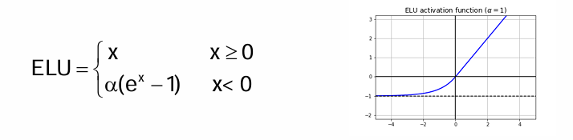
與Leaky Relu類似，優點缺點都與ReLu一樣，也解決了：<br>• 解決 Dead ReLU Problem<br>• 融合了Sigmoid和ReLU，左側具有軟飽和性，右側無飽和性。<br>• 計算速度會比Lekay Relu & Relu慢一點，比Sigmoid & tanh快一點<br>• 實際操作當中，也沒有完全證明 Leaky ReLU 總是好於 ReLU

### 激勵函數(七)-Softmax {color="yellow_bg"}
- 在輸出層，有時我們需要一個函數，它可以接受任何值並將它們轉換<br>為概率分佈，這時就可以使用Softmax 函數
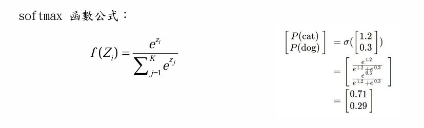
**Softmax 的作用是：**
> 把神經網路輸出的原始分數（Logits）轉換成各類別的機率，並保證所有機率加總等於 1，因此非常適合多分類（Multi-class Classification）問題。
### 計算過程範例
Softmax 範例：
輸入 Logits：
\[2,  1,  0\]\[2,\\;1,\\;0\]
\[2,1,0\]
### Step 1：計算指數 ezie\^\{z_i\}ezi
<table header-row="true">
<tr>
<td>類別</td>
<td>Logit ziz_izi</td>
<td>ezie\^\{z_i\}ezi</td>
</tr>
<tr>
<td>類別1</td>
<td>2</td>
<td>7.389</td>
</tr>
<tr>
<td>類別2</td>
<td>1</td>
<td>2.718</td>
</tr>
<tr>
<td>類別3</td>
<td>0</td>
<td>1.000</td>
</tr>
</table>
---
### Step 2：計算分母（所有指數值總和）
∑ezi=7.389+2.718+1=11.107\\sum e\^\{z_i\}<br>=<br>7.389+2.718+1<br>=<br>11.107
∑ezi=7.389+2.718+1=11.107
<table header-row="true">
<tr>
<td>類別</td>
<td>ezie\^\{z_i\}ezi</td>
</tr>
<tr>
<td>類別1</td>
<td>7.389</td>
</tr>
<tr>
<td>類別2</td>
<td>2.718</td>
</tr>
<tr>
<td>類別3</td>
<td>1.000</td>
</tr>
<tr>
<td>**總和**</td>
<td>**11.107**</td>
</tr>
</table>
---
### Step 3：計算 Softmax 機率
P(y=i)=ezi∑ezjP(y=i)=\\frac\{e\^\{z_i\}\}\{\\sum e\^\{z_j\}\}
P(y=i)=∑ezjezi
<table header-row="true">
<tr>
<td>類別</td>
<td>ezie\^\{z_i\}ezi</td>
<td>分母 11.10711.10711.107</td>
<td>Softmax 機率</td>
</tr>
<tr>
<td>類別1</td>
<td>7.389</td>
<td>11.107</td>
<td>0.665</td>
</tr>
<tr>
<td>類別2</td>
<td>2.718</td>
<td>11.107</td>
<td>0.245</td>
</tr>
<tr>
<td>類別3</td>
<td>1.000</td>
<td>11.107</td>
<td>0.090</td>
</tr>
</table>
---
### 最終結果
<table header-row="true">
<tr>
<td>類別</td>
<td>Logit</td>
<td>Softmax 機率</td>
</tr>
<tr>
<td>類別1</td>
<td>2</td>
<td>66.5%</td>
</tr>
<tr>
<td>類別2</td>
<td>1</td>
<td>24.5%</td>
</tr>
<tr>
<td>類別3</td>
<td>0</td>
<td>9.0%</td>
</tr>
</table>
驗證：
0.665+0.245+0.090=1.0000.665+0.245+0.090<br>=<br>1.000
0.665+0.245+0.090=1.000
---
你也可以把整個 Softmax 計算濃縮成一張表：
<table header-row="true">
<tr>
<td>類別</td>
<td>Logit ziz_izi</td>
<td>ezie\^\{z_i\}ezi</td>
<td>Softmax</td>
</tr>
<tr>
<td>類別1</td>
<td>2</td>
<td>7.389</td>
<td>0.665</td>
</tr>
<tr>
<td>類別2</td>
<td>1</td>
<td>2.718</td>
<td>0.245</td>
</tr>
<tr>
<td>類別3</td>
<td>0</td>
<td>1.000</td>
<td>0.090</td>
</tr>
<tr>
<td>**總計**</td>
<td>-</td>
<td>**11.107**</td>
<td>**1.000**</td>
</tr>
</table>
### 在 TensorFlow 中對應的流程
<table header-row="true">
<tr>
<td>階段</td>
<td>輸出</td>
</tr>
<tr>
<td>Dense Layer 輸出（Logits）</td>
<td>\[2, 1, 0\]</td>
</tr>
<tr>
<td>指數運算 exe\^xex</td>
<td>\[7.389, 2.718, 1.000\]</td>
</tr>
<tr>
<td>計算總和</td>
<td>11.107</td>
</tr>
<tr>
<td>正規化（除以總和）</td>
<td>\[0.665, 0.245, 0.090\]</td>
</tr>
<tr>
<td>預測類別</td>
<td>類別1（機率最高）</td>
</tr>
</table>
這張表格就是神經網路最後一層使用 Softmax 時，從 **Logits → 機率 → 預測結果** 的完整計算流程。
### 激勵函數(八)-Maxout
- Maxout出現在ICML2013上，作者Goodfellow將maxout和dropout結合後，號稱在MNIST，CIFAR-10，CIFAR-100，SVHN這4個資料上都取得<br>了start-of-art的辨識率。
- 什麼是 Maxout？
- Maxout 可以說是一個激活函數，但與其他激活函數所不同的是，它本身是擁有參數的(k值)，因此它可以擬合任意的凸函數(凸函數：如果函數圖形上任兩點之間的線段位於圖形上方或圖形上，則函數稱為凸函數。)
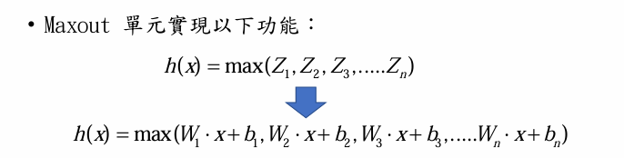
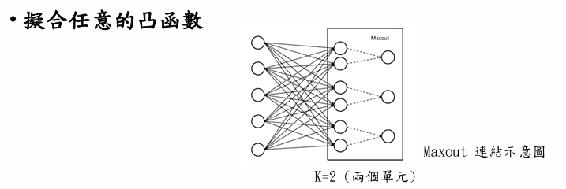
- 注意：這裡不是真的連接，因為該條線上並不涉及參數，那麼如何從兩個單元得到一個單元的值呢？其實只需要比較兩個單元(如果k=2)的值即可，大的數值就可以通過(這就是Max Out)
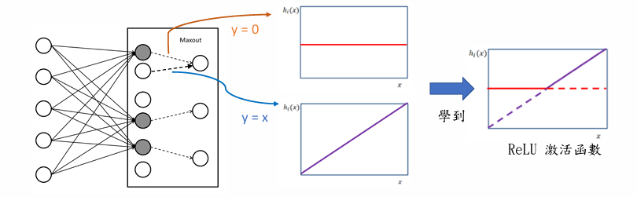
- 因此，Maxout 可以學習到更多段的分段函數作為激活函數，當k 夠大時，理論上可以擬合任何凸函數
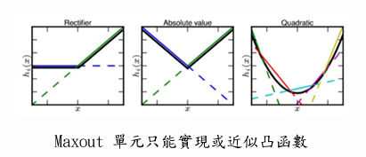

### 運用方法整理
<table header-row="true">
<tr>
<td>激活函數</td>
<td>數學公式</td>
<td>輸出範圍</td>
<td>優點</td>
<td>缺點</td>
<td>常見用途</td>
</tr>
<tr>
<td>**Linear**</td>
<td>(f(x)=x)</td>
<td>((-\\infty,+\\infty))</td>
<td>簡單、不限制輸出</td>
<td>無法學習非線性</td>
<td>回歸輸出層</td>
</tr>
<tr>
<td>**Sigmoid**</td>
<td>(\\frac\{1\}\{1+e\^\{-x\}\})</td>
<td>(0,1)</td>
<td>可表示機率</td>
<td>梯度消失、訓練慢</td>
<td>二元分類輸出</td>
</tr>
<tr>
<td>**Tanh**</td>
<td>(\\tanh(x))</td>
<td>(-1,1)</td>
<td>輸出中心在0</td>
<td>梯度消失</td>
<td>RNN早期常用</td>
</tr>
<tr>
<td>**ReLU**</td>
<td>(\\max(0,x))</td>
<td>\[0,+∞)</td>
<td>計算快、收斂快</td>
<td>Dead ReLU</td>
<td>隱藏層最常用</td>
</tr>
<tr>
<td>**Leaky ReLU**</td>
<td>(x) 或 (0.01x)</td>
<td>(-∞,+∞)</td>
<td>改善Dead ReLU</td>
<td>需設定斜率</td>
<td>深層神經網路</td>
</tr>
<tr>
<td>**PReLU**</td>
<td>(x) 或 (ax)</td>
<td>(-∞,+∞)</td>
<td>斜率可學習</td>
<td>參數增加</td>
<td>進階模型</td>
</tr>
<tr>
<td>**ELU**</td>
<td>(x) 或 (\\alpha(e\^x-1))</td>
<td>(-∞,+∞)</td>
<td>收斂穩定</td>
<td>計算較慢</td>
<td>深度網路</td>
</tr>
<tr>
<td>**SELU**</td>
<td>Self-Normalizing</td>
<td>(-∞,+∞)</td>
<td>自動正規化</td>
<td>使用限制較多</td>
<td>特殊網路</td>
</tr>
<tr>
<td>**Swish**</td>
<td>(x \\cdot sigmoid(x))</td>
<td>(-∞,+∞)</td>
<td>比ReLU平滑</td>
<td>計算較複雜</td>
<td>Google模型</td>
</tr>
<tr>
<td>**GELU**</td>
<td>(x\\Phi(x))</td>
<td>(-∞,+∞)</td>
<td>效果佳</td>
<td>計算較重</td>
<td>Transformer、GPT</td>
</tr>
<tr>
<td>**Softmax**</td>
<td>(\\frac\{e\^\{z_i\}\}\{\\sum e\^\{z_j\}\})</td>
<td>(0,1)且總和=1</td>
<td>產生機率分布</td>
<td>只能用於輸出層</td>
<td>多分類輸出</td>
</tr>
</table>
## 多層感知機
- 感知機的目的是模仿人類大腦利用神經網路模型進行對物件的認知與學習，單一個感知機就類似單一個神經元，但人類有辦法學習並解決複雜的事物主要是因為人類大腦神經網路非常複雜，因此科學家開始發展多層感知機 (Multilayer perceptron, MLP) 試著模擬人類學習怎麼解決複雜問題。
- 多層感知機在單層神經網絡的基礎引入一到多個隱藏層 (hiddenlayer)。一個多層感知器包含三種不同功能的節點，分別是『輸入層』、『隱藏層』及『輸出層』，結構如圖下
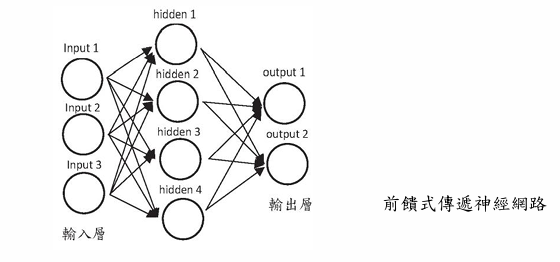
- 輸入層(有時又稱輸入節點)：輸入節點的任務是從外部世界接收訊息，將訊息往下一層傳遞。輸入層的節點中，不進行任何計算，僅向隱藏層節點傳遞訊息。
- 隱藏層：隱藏層的節點和外部沒有直接聯繫。這些節點的主要功能是進行各種計算，並將計算後的訊息傳到下個隱藏層或輸出節點。
- 輸出層：負責計算最後結果，並將網路計算結果傳出。

## 全連接神經網路 (fully connected neural network)
- 全連接神經網路 (fully connected neural network)，是相鄰兩層間任意兩個節點間都有連接(如圖下)。 神經元間都有線段連接
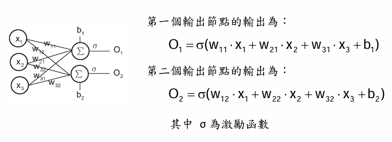
轉換成矩陣的樣子
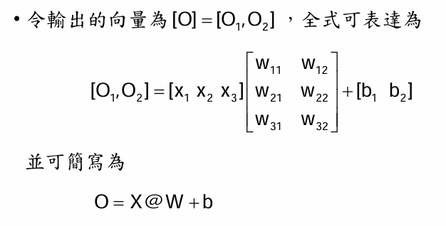

## TensorFlow
- TensorFlow 是一套由 Google 所發展的開放原始碼機器學習函式庫，其以流程圖的概念呈現整個資料分析流程，在流程圖中的每一個節點都代表一個運算，連接不同節點的連線則代表資料的傳遞，程式設計者可以運用各種不同的運算節點（不同的演算法），組合成適用於各種問題的分析系統，運用 CPU 或 GPU 進行運算。
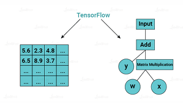
- Cuda：<br>• CUDA 是一種由 NVIDIA 公司開發的運算平台和程式設計模型， 全稱為Compute Unified Device Architecture，旨在充分利用 GPU 的高度平行運算能力，加速各種複雜的運算任務。<br>• CUDA 的核心處理器是稱為串流多處理器（Streaming Multiprocessors, SM）的單位，每個 SM 包含多個 CUDA 核心，這些核心能夠並行執行數百甚至數千個線程。<br>• 這種結構基於 SIMT（Single Instruction, Multiple Threads）模型，即一個指令能夠同時作用於多個線程，實現高效的並行運算。每個 SM 還包含專用的寄存器文件和共享記憶體，用於提高數據存取速度和計算效率。<br>• 它允許開發者使用C/C++、Fortran等編程語言在NVIDIA的GPU上進行通用計算。CUDA最初是為了加速圖形和圖像處理而設計的，但隨著GPGPU技術的發展，它已經成為了一種廣泛應用於科學計算、數據分析、機器學習等領域的計算平台。
- cuDNN：深度學習加速庫<br>• cuDNN（CUDA Deep Neural Network library）是一個用于深度神經網路的GPU加速庫。它包含了為神經網路中常見的計算任務提供高度優化的實現，如卷積、池化、歸一化等。cuDNN的最常見用途是在深度學習框架（如TensorFlow或PyTorch）的開發中。這些框架在編寫時會調用cuDNN，使得開發者可以專注於神經網路的設計和實現，而不需要關注底層的性能優化。
- Anconda：<br>• 簡單來說 Anconda就像是 Python的懶人包，它內建了許多 Python的熱門套件，如此一來使用者就不用在安裝套件時面鄰種種錯誤訊息與漫長的 debug過程(尤其是在 windows作業系統下)。換句話說，能讓 coder不用花費心力在處理系統環境端的問題，而是能直接捲起袖子開始寫程式，進行現實問題的分析。他還有內建 Spyder IDE與 Jupyter Notebook，這兩個編譯器對於新手而言相對友善。
## 甚麼是TensorFlow?
- Tensorflow 一開始由 Google Brain Team 團隊開發。原本是一個內部的機器學習工具。在2015年11月宣布開源，並遵守 Apache 2.0 開源協議，為現今重要深度學習框架之一，支援各式不同的深度學習演算法。
- Tensorflow 為目前最受歡迎的機器學習、深度學習的學習工具之一。命名為Tensorflow，主要是因為其輸入與輸出資料型態都是一種稱為『張量 (Tensor)』的資料結構。
- 張量 (Tensor) 範例:
```python
import tensorflow as tf
w = tf.Variable([3.], dtype = tf.float32)
x = tf.Variable([2.], dtype = tf.float32)
b = tf.Variable([5.], dtype = tf.float32)
print(w*x+b) # z=wx+b 的線性公式
o = tf.sigmoid(w*x+b) #用sigmoid把結果的數值壓縮到0~1之間
print(o)

#sigmoid 用在二分法 多少機率是 多少機率不是

#keras 的寫法
# Dense(1, activation='sigmoid')

result:
tf.Tensor([11.], shape=(1,), dtype=float32)
tf.Tensor([0.9999833], shape=(1,), dtype=float32)
```
tf.Variable：tf.variable 就是放置可學習的變數或者說將可求導的變數，例如: Neural Network 的 weight(權重) 或者bias(偏移值)。
- 上述程式被繪製成稱為計算圖 (Computational Graphs) 的圖形(如圖下)，是一種低階運算描述的圖形，建立的資料張量就是在圖路徑上流動 (Flow)，最後得到結果，因此 Tensor + Flow 加起來就是 Tensorflow。
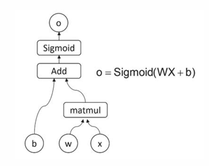
- 比較 tf.constant(常量) 與 tf.Variable(變量) 差異：
- tf.constant：是一個constant的類別，你可以放入各式的資料型態，做一些基礎運算(固定值的tf.Tensor實例，但值不可更改)
```python
import tensorflow as tf
import numpy as np
# 創建一個 tf.constant
a = tf.constant([1,2,3])
print(a)
b = np.array([1,2,3])
c = tf.convert_to_tensor(b)
print(c)

result:
tf.Tensor([1 2 3], shape=(3,), dtype=int32)
tf.Tensor([1 2 3], shape=(3,), dtype=int32)
```

- tf.Variable： tf.variable就是放置可學習的變數或者說將可求導的變數(可以被更新的張量)，例如: Neural Network 的 weight 或者 bias。
```python
import tensorflow as tf
x = tf.Variable(initial_value=3.) #一個可以被變更的數字 預設值為3
# 在 tf.GradientTape() 的上下文內,所有的計算步驟都會被記錄以用於推導
with tf.GradientTape() as tape:
    y = tf.square(x) # square就是平方
y_grad = tape.gradient(y,x) #求梯度就是求斜率，求斜率就是求導數，求導數就是做微分
print(y,y_grad)

result:
tf.Tensor(9.0, shape=(), dtype=float32) tf.Tensor(6.0, shape=(), dtype=float32)
```

## Keras
- Keras是一個開放原始碼，是基於TensorFlow和Theano（由加拿大蒙特利爾大學開發的機器學習框架）的深度學習庫。
- 是由純python編寫而成的高層神經網絡API，也僅支持python開發。
- Koras可以快速有方便運算的主要原因是，它已經將訓練模型的輸入層、隱藏層、輸出層，做好架構，使用者只需要加入並且填寫正確的參數ex.神經元個數、activation function的函式…等。
- Keras 默認的後端為 tensorflow，如果想要使用theano可以自行更改。tensorflow和theano都可以使用GPU進行硬件加速，往往可以比CPU運算快很多倍。因此如果你的顯卡支持cuda的話，建議盡可能利<br>用cuda加速模型訓練。
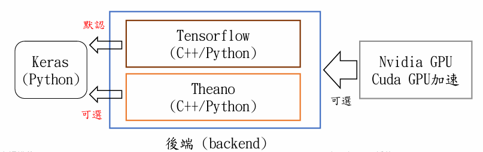
- 由於Keras非常好用，又可跟Tensorflow無縫合作，於是Tensorflow(2.0之後版本)就直接將其納入到自己的函式庫中，並命名為tf.keras。因此我們可以將其視之為Tensorflow的子套件或子函式庫。
## Jupyter Notebook 使用
- 範例：以張量實現全連接層：
- 假設輸入有三個樣本，每個樣本是 28×28 的圖形，因此每個樣本的<br>輸入特徵長度為 28×28 = 784，且輸出的節點數為 10(假設有十個<br>結果)，因此輸入矩陣的大小為 \[3,784\]
- 權重的矩陣大小為 \[784,10\]，偏移值大小為 \[10\]
- 最後一個輸出的大小為 \[3,10\]
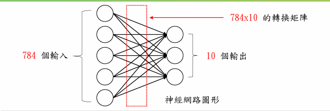
```python
import tensorflow as tf
x = tf.random.normal([3,784])
# stddev 標準差
w1 = tf.Variable(tf.random.truncated_normal([784,10],stddev=0.1))
b1 = tf.Variable(tf.zeros([10]))
o1 = tf.matmul(x,w1)+b1
o1 = tf.nn.relu(o1)
print(o1.shape)

result:
(3, 10)
```

## 深度神經網路(Deep Neural Networks，DNNs)
- 廣泛地說，深度學習是指具有層次性的機器學習法，能透過層層處理將大量無序的訊號漸漸轉為有用的資訊並解決問題。但通常提到深度學習，人們指的是一種特定的機器學習法─「深度神經網路」(Deep Neural Network)。
- 基本上，神經網路只需擁有2層隱藏層，再加上輸入層與輸出層共四層，就可以稱為深度神經網路。
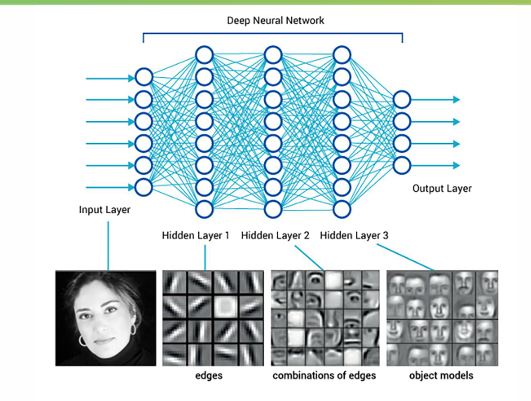
## 如何建立DNN網路
- 想要以張量方式設計多層的全連接神經網路 (如圖下)，需分別定義各層的權值矩陣 W 和偏移值向量 b。有多少個全連接層，需定義數量相對的 W 和 b，且每層權值矩陣與偏移值只能在當層使用，不能混淆。
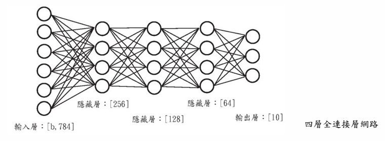
- 設計網路時，只需按照網路層順序，將上一層的輸出作為當前層的輸入，重複直至最後一層，並將輸出層的輸出作為網路的輸出
```python
import tensorflow as tf
x = tf.random.normal([3,784])
# 隱藏層1權重與偏移值設定
w1 = tf.Variable(tf.random.truncated_normal([784,256],stddev=0.1))
b1 = tf.Variable(tf.zeros([256]))
# 隱藏層2權重與偏移值設定
w2 = tf.Variable(tf.random.truncated_normal([256,128],stddev=0.1))
b2 = tf.Variable(tf.zeros([128]))
# 隱藏層3權重與偏移值設定
w3 = tf.Variable(tf.random.truncated_normal([128,64],stddev=0.1))
b3 = tf.Variable(tf.zeros([64]))
# 輸出層權重與偏移值設定
w4 = tf.Variable(tf.random.truncated_normal([64,10],stddev=0.1))
b4 = tf.Variable(tf.zeros([10]))
# 前向計算
o1 = x@w1 + b1
s1 = tf.nn.sigmoid(o1)
o2 = s1@w2 + b2
s2 = tf.nn.sigmoid(o2)
o3 = s2@w3 + b3
s3 = tf.nn.sigmoid(o3)
o4 = s3@w4 + b4
print(o4.shape)

result:
(3, 10)
```
- TensorFlow 2.0 版本提供三種快速創建網路的方式，分別為Functional API、Sequential API 與 Subclassing 子類化，以這三種方法建立全連接層網路
### Functional API：
- 全連接層是最常用的網路層之一，在 TensorFlow 有更方便的實現方式：利用 layers.Dense() 函式。
- 以層接層的方式設計多層全連接神經網路。
- 方法為先以 Dense() 函式新建各層網路，並指定各層的激活函數類型，再利用前向計算，依序通過各個網路層。
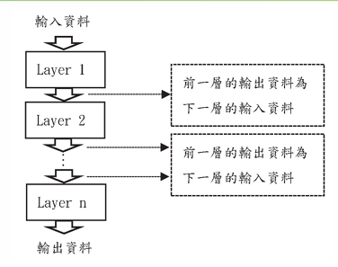
```python
import tensorflow as tf
from tensorflow.keras import layers  # 導入 layer 類

fc1 = layers.Dense(256,activation = tf.sigmoid)  # 隱藏層 1
fc2 = layers.Dense(128,activation = tf.sigmoid)  # 隱藏層 2
fc3 = layers.Dense(64,activation = tf.sigmoid)  # 隱藏層 3
fc4 = layers.Dense(10,activation = None)  # 輸出層

X = tf.random.normal([3,784])
h1 = fc1(X)
h2 = fc2(h1)
h3 = fc3(h2)
out = fc4(h3)
print(out.shape)

result:
(3, 10)
```

### Sequential API
- 除了用 Keras Functional API 方式( 如上例 ) 建立需要的模型，還可通過<br>Keras 提供的網路容器 Sequential，將多個網路層封裝成一個大的網路模組( 如圖右之虛線框 )，最後只需調用網路模型的實體名稱即可完成資料從第一層到最末層的順序傳播運算。
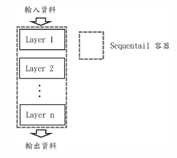
```python
import tensorflow as tf
from tensorflow.keras import layers, Sequential  # 導入 layer 類

x = tf.random.normal([3,784])
# 通過 Sequential 容器封裝為一個網路類
model = Sequential([
    layers.Dense(256,activation=tf.nn.relu),
    layers.Dense(128,activation=tf.nn.relu),
    layers.Dense(64,activation=tf.nn.relu),
    layers.Dense(10,activation=None),
])    

#向前計算
out = model(x)
print(out.shape)

result
(3, 10)
```

- Sequential 容器也可通過 add() 方法加入新的網路層，實現動態創建網路功能
- 在程式中通過 model.summary() 輸出模型各層的參數狀況
```python
import tensorflow as tf
from tensorflow.keras import layers, Sequential  # 導入 layer 類

x = tf.random.normal([3,784])
model = Sequential([])    # 創建一個空的網路容器
model.add(layers.Dense(256,activation=tf.nn.relu))  # 加入隱藏層 1
model.add(layers.Dense(128,activation=tf.nn.relu))  # 加入隱藏層 2
model.add(layers.Dense(64,activation=tf.nn.relu))  # 加入隱藏層 3
model.add(layers.Dense(10,activation=None))  # 加入輸入層

out = model(x)
print(out.shape)
print(model.summary())

result:

(3, 10)
Model: "sequential_2"
_________________________________________________________________
Layer (type)                 Output Shape              Param #   
=================================================================
dense_8 (Dense)              (3, 256)                  200960    
_________________________________________________________________
dense_9 (Dense)              (3, 128)                  32896     
_________________________________________________________________
dense_10 (Dense)             (3, 64)                   8256      
_________________________________________________________________
dense_11 (Dense)             (3, 10)                   650       
=================================================================
Total params: 242,762 總參數
Trainable params: 242,762 有訓練參數
Non-trainable params: 0 無訓練參數
_________________________________________________________________
None
```
- 如何計算參數量：
- 第一個 Dense 層，其輸入數據維度為 784，此層神經元有 256 個，共有參數 784 × 256 +256 ( 偏移值 ) = 200960。
- 第二個 Dense 層，其輸入數據維度為 256 ( 前一層神經元個數 )，此層神經元有 128 個，共有參數 256 × 128 + 128 ( 偏移值 ) = 32896。
- 第三個 Dense 層，其輸入數據維度為 128 ( 前一層神經元個數 )，此層神經元有 64 個，共有參數 128 × 64 + 64 ( 偏移值 ) = 8256。
- 第四個 Dense 層，其輸入數據維度為 64 ( 前一層神經元個數 )，此層神經元有 10 個，共有參數 64 × 10 + 10 ( 偏移值 ) = 650。
### Subclassing 子類化
- 簡單來說你可以透過建立一個類別，而此類別繼承了 model 類別來搭建一個你自己客製化的網路模型 (如圖下所示)。
可以在__init__()方法中創建類子層（tf.keras的內置層API，或者是自定義的），並可以在call()中進行調用。
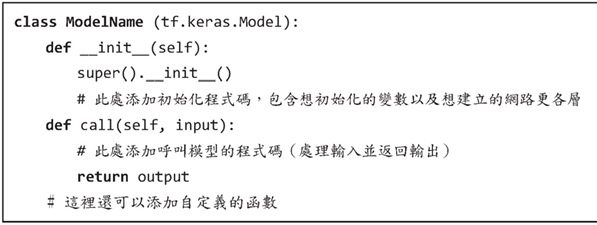
• 利用 Model 繼承方式建立網路模型
```python
import tensorflow as tf
from tensorflow.keras import layers # 導入 layer 類

class netModel(tf.keras.Model):
    def __init__(self):
        super().__init__()
        # 創建四個全連接網路
        self.fc1 = layers.Dense(256,activation=tf.nn.relu)
        self.fc2 = layers.Dense(128,activation=tf.nn.relu)
        self.fc3 = layers.Dense(64,activation=tf.nn.relu)
        self.fc4 = layers.Dense(10)
    
    def call(self, inputs, training = None, mask = None):
        # 撰寫網路各層順序
        x = self.fc1(inputs)
        x = self.fc2(x)
        x = self.fc3(x)
        out = self.fc4(x)
        return out
```
• 利用 Model 繼承方式建立主網路模型架構後，接著要實體化網路，程式碼如下：
```python
input = tf.random.normal([3,784])
myModel = netModel()   # 建立網路
out = myModel(input)
print(out.shape)       # 將輸出維度大小印出
print(myModel.summary())  # 印出網路架構訊息
```
利用 myModel = netModel() 實體化建立的網路，並利用 out = myModel(input)讓網路知道輸入資料維度大小是多少
```plain text
(3, 10)
Model: "net_model"
_________________________________________________________________
Layer (type)                 Output Shape              Param #
=================================================================
dense (Dense)                multiple                  200960
_________________________________________________________________
dense_1 (Dense)              multiple                  32896
_________________________________________________________________
dense_2 (Dense)              multiple                  8256
_________________________________________________________________
dense_3 (Dense)              multiple                  650
=================================================================
Total params: 242,762
Trainable params: 242,762
Non-trainable params: 0
_________________________________________________________________
None
```

## 神經網路的訓練方式
1. 考慮在空間中有兩類資料樣本，如圖下所示，假設希望建造一個網路模型可將此二類資料樣本分開，會先給定(建立)一模型，模型假設定義如下：
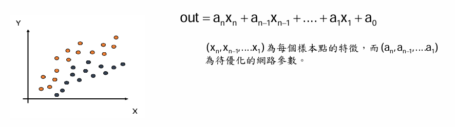
1. 而第二步會給予網路模型參數一個初始值，此時給予的參數畫出的網路模型如圖左。
2. 由於一開始給定的初始值對此二類的數據分類誤差太大，因此網路開始進行訓練，每次訓練過程會根據估計(損失)進而調整參數，經過不停疊代後，如果到達設定的訓練次數或損失計算達最小，會得到一組優化參數，最後網路訓練完成，如圖右。
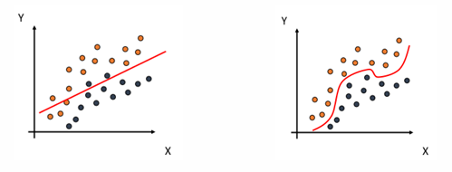
- 神經網路的學習目標就是找出正確的權重值（這邊的權重通常包含偏向量）來縮小損失(Loss，也就是實際值與預測值之差異)
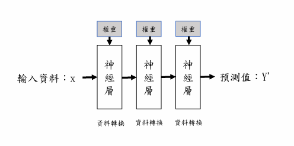
- 利用損失函數(Loss Function)計算損失與利用優化器(Optimizer)更新權重
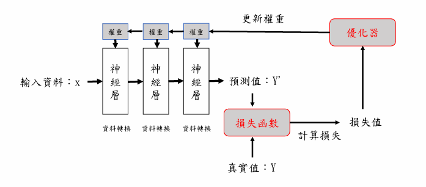
- 在神經網路的訓練迴圈可以分為『正向傳播(Forward Propagation)』、『評估損失（Estimate the Loss）』和『反向傳播（BackwardPropagation)』三大階段，如下圖所示：
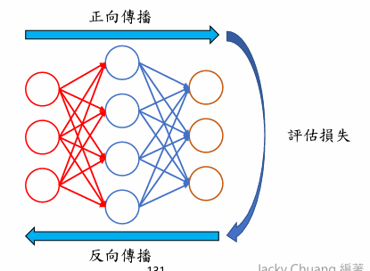
- 神經網路本身是一張計算圖，決定如何從輸入資料計算出預測值，和反過來計算各層權重的更新比例，事實上，整個訓練迴圈的步驟都是圍繞著權重的初始、使用和更新操作，如下圖所示：
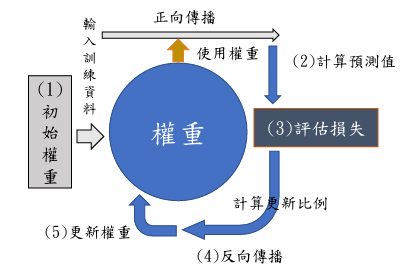
- 反向傳播 (Backward-Propagation)
- 當預測結果和真實結果不一致時，兩者間的差距越大就會讓代價函數越大；因此，為了讓預測結果越接近目標值、也就是代價函數達到最小，我們會將這個結果從右到左反向傳遞回去，調整神經元的權重以找到代價函數的最小值。
- 簡單來講，類神經網路就是先讓資料訊號通過網路，輸出結果後、計算其與真實情況的誤差。再將誤差訊號反向傳遞回去、對每一個神經元都往正確的方向調整一下權重；如此來回個數千萬遍後，機器就學會如何辨識一隻貓了。
###  網路參數的優化
- 要怎麼去計算模型產生的誤差？
- 直接想法：求出當前模型的所有樣本點上的類別預測(ax +b 所得得到 y )<br>與真實標籤值y 間差的和或平方和為總誤差，而總誤差的值越小越好。
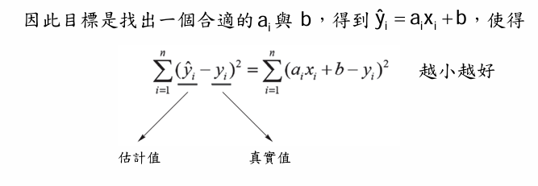
- 上面的衡量標準跟 n 有關，n 代表樣本點的個數，因此可以把上面的式子改寫為
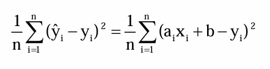
這樣的定義方式是均方誤差(MSE)。接下來希望找一個優化方式找出一組最好的 a 與 b。

### 損失函數
- 機器學習演算法基本都希望極大化或極小化一個函數，幫助我們來測量模型的品質，稱為『目標函數 (Object Function)』，而在深度學習使用的目標函數就是損失函數，損失函數可以評估預測值和真實值之問的差異，這是一個非負實數的函數，當損失函數愈小，表示預測模型愈好。
- 一般來說，深度學習的迴歸問題經常使用均方誤差，而分類問題則是使用交叉嫡。
#### 均方誤差(Mean Square Error) →回歸問題
• 均方誤差(簡稱 MSE)是計算預設值和真實值之間的差異平方，其公式如下：
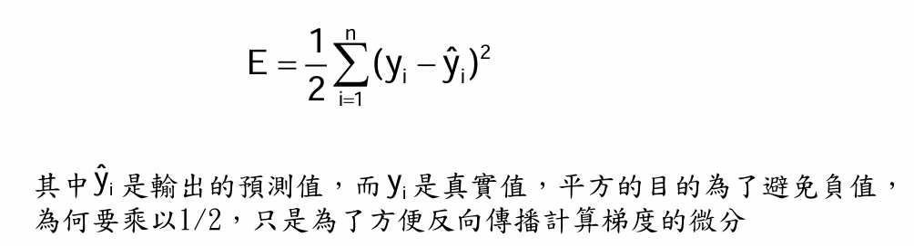
#### 交叉熵 Cross-Entropy → 分類問題
- 在說明交叉熵前，我們需要先了解「熵」(Entropy）和「資訊熵」(Infoimation Entropy)。基本上，熵是源於物理學的名詞，主要是用來測量混亂的程度，熵低表示混亂程度低；熵高表示混亂程度高，在資訊理論的熵就是用來測量不確定性。
- 資訊量
- 假設我們聽到了兩件事，分別如下：<br>• 事件一：法國打入2022世界盃決賽<br>• 事件二：台灣打入2022世界盃決賽<br>• 僅憑直覺來說，事件二的資訊量比事件一的資訊量要大。
- 原因是因為事件一發生的概率很大，事件二發生的概率很小。所以當越不可能的事件發生了，我們獲取到的資訊量就越大。越可能發生的事件發生了，我們獲取到的資訊量就越小。
- 資訊量是使用對數log表示，可以用log2 （通常多使用底數為2，也可以使用loge )，其公式如下所示：
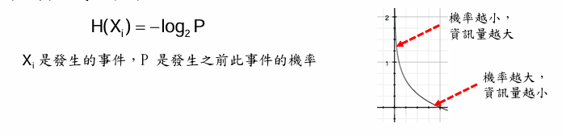
- <span color="yellow_bg">資訊熵 Information Entropy</span>
- <span color="yellow_bg">資訊熵（Information Entropy）的主要目的是量化隨機事件的不確定性（uncertainty）或資訊的不確定程度，其數學意義為事件所包含資訊量的期望值（expected information content）。</span>

- 上述公式是所有X可能機率乘以該機率的資訊量總和
- 當資訊確定，其愈不混亂，其資訊熵小。
- 當資訊愈不確定，其愈混亂，其資訊熵大。
- KL散度
- 相對熵又稱KL散度，如果我們對於同一個隨機變量x有兩個單獨的概率分佈P(x)和Q(x)，我們可以使用KL散度（Kuliback-Leibler (KL) divergence)來衡量這兩個分佈的差異
- 在機器學習中，P往往用來表示樣本的真實分佈，比如\[1,0,0\]表示當前樣本。
- Q用來表示模型所預測的分佈，比如\[0.7,0.2,0.1\]


P代表真實模型，他是確定的值，所以它是固定的值，如果要縮短兩者差距，要讓交叉商越小越好，所以交叉商可以拿來當作損失函數
- 在機器學習中，我們需要評估label和predicts之間的差距，因此可以使用KL散度，即

由於KL散度中的前一部分−H(y)不變，故在優化過程中，只需要關注交叉熵就可以了。所以一般在機器學習中直接用用交叉熵做loss來評估模型。
Keras內建了許多損失函數（或稱目標函數），我們可依照要解決的問題類型來選擇損失函數。
- 二元交叉熵（Binary Cross Entropy, BCE）：其實就是從剛剛講的 資訊熵（Entropy）→ 交叉熵（Cross Entropy） 推導出來的，只是它專門用在二分類問題（binary classification）。


```python
import tensorflow as tf

y_true = [0.,1.,0.,1.] # 標籤: 真實數據
y_pred1 = [0.5,0.8,0.3,0.5]
# 利用數學定義去算二分類交叉熵
def BCE(output,target):
    n = len(output)
    total_value = 0
    
    for i in range(n):
        total_value += (target[i]*tf.math.log(output[i])+(1-target[i])*tf.math.log(1-output[i]))
        
    total_value *= -1/n
    print(total_value)
    
# 呼叫自定義函數
BCE(y_pred1, y_true)
# 呼叫 tf.keras 帶的 binary_crossentropy
loss1 = tf.keras.losses.binary_crossentropy(y_true,y_pred1)
print(loss1)

result
tf.Tensor(0.4915282, shape=(), dtype=float32)
tf.Tensor(0.49152803, shape=(), dtype=float32)

## 用公式算跟直接套karas API的差異不大，所以直接套API就好
```
### 二分類：binary_crossentropy(二元交叉熵)
- 適用於二分類，其輸出值是一個介於0-1之間的浮點數。<br>BCE在進行計算之前會對原始輸出進行sigmoid處理，若是多分類中，每個類別的概率在(0,1)之間，其類別間的概率是獨立的
- binary_crossentropy損失函數的公式如下（一般搭配sigmoid激活函數使用）：


### 多分類：categorical_crossentropy(分類交叉熵)
- 適用於one-hot編碼的標籤值，例如標籤值為10個元素的向量（有10種類別），其中只能有一個元素為1（代表答案為該類別），其他元素均為0。我們通常會將輸出層的啟動函數設為softmax，以便輸出每個類別可能的機率（這些機率的總和為1)。

```python
import tensorflow as tf

y_pred = [0.1,0.1,0.7,0.1]   # 假設已經通過 softmax, 所以必須和為0
Y_true = [0,0,1,0]      #One_hot 編碼
loss = tf.keras.losses.categorical_crossentropy(Y_true,y_pred)
print(loss)

result
tf.Tensor(0.35667497, shape=(), dtype=float32)
```
### 多分類：sparse_categorical_crossentropy （稀疏分類交叉謫）
如果多元分類的標籤值不是one-hot編碼，而是一個整數值（例如2或5)，則可改用此損失函數，但輸出層的啟動函數仍要設為softmax。例如我們要將樣本做0、1、2的分類，則標籤的儲存格式要改為0-2的整數，如下表的最右一欄：
```python
import tensorflow as tf

y_pred = ([0.2,0.8,0.],[0.2,0.6,0.2])   # 類別編號 (從 0 開始)
y_true = [1,2]      #真實標籤編碼
loss = tf.keras.losses.sparse_categorical_crossentropy(y_true,y_pred)
print(loss)

result

tf.Tensor([0.22314365 1.6094378 ], shape=(2,), dtype=float32) #損失值
```

```python
import tensorflow as tf
# 整數編碼
y_true1 = [1,2]      
# One_hot 編碼
y_true2 = [[0,1,0],[0,0,1]] 
# 機率分布
y_pred = [[0.05,0.95,0],[0.1,0.8,0.1]]
# sparse_categorical_crossentropy 用在整數編碼
loss1 = tf.keras.losses.sparse_categorical_crossentropy(y_true1,y_pred)
# categorical_crossentropy 用在One_hot 編碼
loss2 = tf.keras.losses.categorical_crossentropy(y_true2,y_pred)
print(loss1)
print(loss2)

result
tf.Tensor([0.05129344 2.3025851 ], shape=(2,), dtype=float32)
tf.Tensor([0.05129331 2.3025851 ], shape=(2,), dtype=float32)
```

## 優化算法
優化算法的功能，是通過改善訓練方式，來最小化(或最大化)損失函數E(x)。
比如說，權重(W)和偏差(b)就是這樣的內部參數，一般用於計算輸出值，在訓練神經網絡模型時起到主要作用。
## 梯度下降法(gradient descent，GD)：
是最佳化理論裡面的一個一階找最佳解的一種方法，主要是希望用梯度下降值去找到函數的局部最小值，因為梯度的方向是走向局部最大的方向，所以在梯度下降法中是往梯度的反方向走。

### tensorflew的自動求導機制：
使用 GradientTape 類的方法(方法一)(另外一種是使用fit()函數)：
- (1)在計算圖的上下文中創建一個 GradientTape 對象。(使用GradientTape 對象的 watch 方法監視計算圖中的變量。)
- (2)執行計算圖，並在計算圖中使用 TensorFlow 的運算符操作張量。
- (3)使用 GradientTape 對象的 gradient 方法計算模型的梯度。

```python
import tensorflow as tf
x = tf. Variable (initial_value=3.) # 初始權重
with tf.GradientTape () as tape:      # (1)
    #所有計算步驟都會被記錄以用於求導
    y=tf.square(x)     # (2)損失函數
y_grad = tape.gradient (y, x)#計算y關於x的導數   # (3)
print (y, y_grad) 

result
tf.Tensor(9.0, shape=(), dtype=float32) tf.Tensor(6.0, shape=(), dtype=float32)

import tensorflow as tf
x = tf. Variable(3.0) # 初始權重
with tf.GradientTape() as tape:      # (1)
    #所有計算步驟都會被記錄以用於求導
    y=x*x     # (2)損失函數
dy_dx = tape.gradient(y, x)#計算y關於x的導數   # (3)
print(y, dy_dx)

import tensorflow as tf
x = tf. constant(3.0) # 初始權重
with tf.GradientTape() as tape:      # (1) 沒有watch只會紀錄y 不會記錄x
    #所有計算步驟都會被記錄以用於求導
    y=x*x     # (2)損失函數
dy_dx = tape.gradient(y, x)#計算y關於x的導數   # (3)
print (y, dy_dx) 

import tensorflow as tf
x = tf. constant(3.0) # 初始權重
with tf.GradientTape() as tape:      # (1)
    #所有計算步驟都會被記錄以用於求導
    tape.watch(x)
    y=x*x     # (2)損失函數
dy_dx = tape.gradient(y, x)#計算y關於x的導數   # (3)
print (dy, dx) 

import tensorflow as tf
x = tf. constant(3.0) # 初始權重
with tf.GradientTape() as tape1:      # (1)
    #所有計算步驟都會被記錄以用於求導
    tape1.watch(x)
    with tf.GradientTape() as tape2:
    tape2.watch(x)
    y=x*x     # (2)損失函數
dy_dx = tape2.gradient(y, x)#計算y關於x的導數   # (3)
dy2_dx2 = tape1.gradient(dy_dx, x)
print (dy_dx) 
print(dy2_dx2)
```

```python
import tensorflow as tf
import matplotlib.pyplot as plt
import numpy as np

# 設定超參數(Hyperparameters)值
x_init = -10    # 起始權重
epochs = 10     # 執行週期數 
lr = 0.3        # 學習率 

# 定義損失函數  y = x^2 - 10x +1
def Loss(x): 
    y = x ** 2-10*x+1    
    return  y  

#對損失函數做微分
def dLoss(x_value): 
    # 宣告 TensorFlow 變數(Variable)
    x = tf.Variable(x_value, dtype=tf.float32) 
    with tf.GradientTape() as g:   #  自動微分
        y = Loss(x)                
    dy_dx = g.gradient(y, x)       #  取得梯度
    return dy_dx.numpy()           #  轉成 NumPy array

# 梯度下降法 
def GD(x_init, df, epochs, lr):    
    xs = np.zeros(epochs+1)    
    x = x_init    
    xs[0] b= x    
    for i in range(epochs):         
        dx = df(x)        
        # 更新 x_new = x — learning_rate * gradient        
        x += - dx * lr         
        xs[i+1] = x    
    return xs

# 傳入 dLoss 
w = GD(x_init, dLoss , epochs, lr=lr) 
print (np.around(w, 2))

t = np.arange(-10.0, 20.0, 0.001)
plt.plot(t, Loss(t), c='b')
plt.plot(w, Loss(w), c='r', marker ='o', markersize=5)    

# 設定中文字型
plt.rcParams['font.sans-serif'] = ['Microsoft JhengHei'] # 正黑體 
plt.rcParams['axes.unicode_minus'] = False # 矯正負號
plt.title('梯度下降法', fontsize=18)
plt.xlabel('X 參數值', fontsize=18)
plt.ylabel('損失函數值', fontsize=18)
plt.show()
```
- 若每次都隨機取出一個樣本來做梯度下降，則稱為隨機梯度下降法（SGD，Stochastic Gradient Descent)。但 Keras 的SGD優化器是使用小批次SGD (mini-batch SOD)，也就是每次會取一小批的樣本來做梯度下降法。
```python
import tensorflow as tf
import matplotlib.pyplot as plt
import numpy as np

x = tf.Variable(-8.00000)
y = tf.Variable(5.00000)

def ObjFun():   # 定義目標函數
    output = (0.5)*(x**2)+2.5*(y**2)  
    return  output

def Draw_fun(x,y):  # 要繪圖的函數, 與目標函數同
    z = (0.5)*(x**2)+2.5*(y**2)
    return z

opt = tf.keras.optimizers.SGD(learning_rate = 0.3)

epochs = 10    # 疊代次數
xValueArr=[-8]   # x 的初始值
yValueArr=[5]    # y 的初始值
for epoch in range(epochs):
    opt.minimize(ObjFun, var_list=[x,y])
    xValueArr.append(x.numpy())
    yValueArr.append(y.numpy())
    
x = np.arange(-10.0, 10.0, 0.01)
y = np.arange(-10.0, 10.0, 0.01)
X, Y = np.meshgrid(x, y)
Z = Draw_fun(X,Y)
plt.figure(figsize = (10,5))
CS = plt.contour(X,Y,Z, colors = 'gray')
plt.title("SGD Optimizer")
plt.xlabel("x")
plt.ylabel("y")
plt.plot(xValueArr, yValueArr, c='r')
for xt, yt in zip(xValueArr,yValueArr):
    plt.scatter(xt, yt , c='r')
plt.show()
```
- 問題：由於前面提到的梯度下降算法的學習率是固定的，因此在迭代優化<br>的過程中有可能出現這幾種情況：<br>• 設置的學習率太小，導致一直出於下降優化過程，但是直到達到了最大迭代<br>次數，也沒能優化到最優值。如左圖所示，正因為學習率設置的太低而導致<br>迭代過程無法收斂。<br>• 由於設置的學習率太大，導致出現“震盪”現象，同樣無法盡快優化到收斂<br>值。如右圖所示
- 因此，這裡可以引入衰減參數的概念，使得梯度下降的過程中，學習率也<br>逐步的在衰減，越靠近收斂值跳動就越緩慢。
### RMSprop優化器：
- RMSprop（方均根反向傳播）是一種「自適應（自動調整）學習速率」的優化器，它<br>是利用過去所有梯度的方均根（RMS, Root Mean Squared)來調整各權重參數的學習<br>速率，以保持一致的學習步調，如此可以減少梯度下降中的震盪，進行更有效率的<br>學習。
- RMSprop是Keras推薦使用的優化器，尤其適用於循環神經網路（RNN)。

```python
import tensorflow as tf
import matplotlib.pyplot as plt
import numpy as np

x = tf.Variable(-8.00000)
y = tf.Variable(5.00000)

def ObjFun():   # 定義目標函數
    output = (0.5)*(x**2)+2.5*(y**2)  
    return  output

def Draw_fun(x,y):  # 要繪圖的函數, 與目標函數同
    z = (0.5)*(x**2)+2.5*(y**2)
    return z

# rho : 衰減因子, 也就是梯度方均根的衰減率
opt = tf.keras.optimizers.RMSprop(learning_rate = 0.3,rho=0.9)

epochs = 50    # 疊代次數
xValueArr=[-8]   # x 的初始值
yValueArr=[5]    # y 的初始值
for epoch in range(epochs):
    opt.minimize(ObjFun, var_list=[x,y])
    xValueArr.append(x.numpy())
    yValueArr.append(y.numpy())
    
x = np.arange(-10.0, 10.0, 0.01)
y = np.arange(-10.0, 10.0, 0.01)
X, Y = np.meshgrid(x, y)
Z = Draw_fun(X,Y)
plt.figure(figsize = (10,5))
CS = plt.contour(X,Y,Z, colors = 'gray')
plt.title("RMSprop Optimizer")
plt.xlabel("x")
plt.ylabel("y")
plt.plot(xValueArr, yValueArr, c='r')
for xt, yt in zip(xValueArr,yValueArr):
    plt.scatter(xt, yt , c='r')
plt.show()
```
##  動量(Momentum)法：
- 可以解決2個在優化時可能發生的問題：
- 問題一：收斂速度太慢。如果連續幾次的梯度都很斜，則動量可讓移動速度加快，因此可以增加收斂的速度，並抑制震盪
- 問題二：停留在區域最低點。假設有一顆小球在下圖中由最高點往下滾，那麼加上動量(慣性）因素後，小球就比較有可能衝出區域最低點，而到達全域最低點

###  Adam 優化器：
Adam本質上是RMSprop與momentum的結合(Adam其實就是帶有動量(momentum)項的 RMSprop)。
```python
import tensorflow as tf
import matplotlib.pyplot as plt
import numpy as np

x = tf.Variable(-8.00000)
y = tf.Variable(5.00000)

def ObjFun():   # 定義目標函數
    output = (0.5)*(x**2)+2.5*(y**2)  
    return  output

def Draw_fun(x,y):  # 要繪圖的函數, 與目標函數同
    z = (0.5)*(x**2)+2.5*(y**2)
    return z
# beta_1 : 第一動量的指數衰退率  beta_2 : 第二動量的指數衰退率
opt = tf.keras.optimizers.Adam(learning_rate = 0.3, beta_1=0.9,beta_2=0.999)

epochs = 50    # 疊代次數
xValueArr=[-8]   # x 的初始值
yValueArr=[5]    # y 的初始值
for epoch in range(epochs):
    opt.minimize(ObjFun, var_list=[x,y])
    xValueArr.append(x.numpy())
    yValueArr.append(y.numpy())
    
x = np.arange(-10.0, 10.0, 0.01)
y = np.arange(-10.0, 10.0, 0.01)
X, Y = np.meshgrid(x, y)
Z = Draw_fun(X,Y)
plt.figure(figsize = (10,5))
CS = plt.contour(X,Y,Z, colors = 'gray')
plt.title("Adam Optimizer")
plt.xlabel("x")
plt.ylabel("y")
plt.plot(xValueArr, yValueArr, c='r')
for xt, yt in zip(xValueArr,yValueArr):
    plt.scatter(xt, yt , c='r')
plt.show()
```

## 梯度消失與梯度爆炸
- 神經網絡的訓練過程包括前向傳播和反向傳播兩個部分，如果前向傳播得到的預測結果和實際結果不符，這就說明網絡沒有訓練好，要用反向傳播去重新調整各個權重。
- 這之中涉及各種常見的優化算法，以梯度下降為例，它的思路是把當前梯度的負值方向作為搜索方向，通過調整權重使目標函數趨近局部最小值，也就是讓代價函數/損失函數越來越小。


sigmoid會造成梯度消失，所以深度網路不使用
## 自己訓練一個神經網路
神經網路訓練實例(MNIST 手寫數字辨識)
- MNIST是一個1988年LeCun等人在美國郵務局為了自動辨識郵遞區號手寫號碼<br>而發展出來的資料集，現今作為許多圖片辨識系統的標準測試集。<br>• 這個資料集中包含了從0到9的手寫數字圖片(如圖下)，總共有60000張訓練<br>圖片及10000張測試圖片。<br>• MNIST的資料大小適中(大小為28x28)，而且皆為灰階影像，十分適合做為初<br>學者第一個建立模型、訓練、與預測的資料集。
- 訓練步驟：<br>• 下載MNIST資料：這邊利用TF.Keras dataset抓取MNIST手寫辨識資料集
```python
from tensorflow.keras.datasets import mnist
(train_Data, train_Label),(test_Data, test_Label) = mnist.load_data()
# 查看 mnist 資料集大小
print('train data =',len(train_Data))
print('test data =',len(test_Data))
# 查看 mnist 資料集維度
print('train data dim =',train_Data.shape)
print('test data dim =',test_Data.shape)
```
• 這邊可以使用matplotlib輸出images數字影像，代碼如下：
```python
import matplotlib.pyplot as plt

def plot_image(data):
    fig = plt.gcf()
    fig.set_size_inches(4,4)
    plt.imshow(data, cmap = 'binary')
    plt.show()

plot_image(train_Data[0])
```
- 設置超參數與資料訓練前處裡<br>• 接下來要設定訓練網路所需要的超參數跟資料大小轉換，代碼如下：
```python
import tensorflow as tf
learning_rate = 0.01   # 學習率
training_epoch = 50   # 訓練次數
batch_size = 500      # 每次訓練大小
# mnist 資料的前置處理
# 將原本是 28x28 的影像大小攤平成 784, 未來要當作輸入特徵
train_Data_R, test_Data_R = train_Data.reshape([-1,784]).astype('float32')\
                           ,test_Data.reshape([-1,784]).astype('float32')
# 資料正規化
train_Data_R, test_Data_R = train_Data_R/255., test_Data_R/255.
# 將資料打散並分批
train_Data_M = tf.data.Dataset.from_tensor_slices((train_Data_R,train_Label))
train_Data_M = train_Data_M.shuffle(5000).batch(batch_size)
```
- 設計網路：<br>• 這裡我們利用四層全連接層網路來當作是我們MNIST手寫文字辨識網路架構，輸入層有784筆資料，第一層隱藏層有256個節點，第二層隱藏層有128個節點，第三層隱藏層有64個節點，最後的輸出有十個節點，分別代表十個數字的機率大小。
- 最後一層接softmax激勵函數的主要原因是希望當784個特徵經由網路前向處裡後最後能算出每個類別的預測<br>機率
```python
# 最後的 Dense(10) 且 activation 用 softmax
# 代表最後 output 為 10 個 class （0~9）的機率
model = tf.keras.models.Sequential([
    tf.keras.layers.Dense(256, activation='relu'),
    tf.keras.layers.Dense(128, activation='relu'),
    tf.keras.layers.Dense(64, activation='relu'),
    tf.keras.layers.Dense(10, activation='softmax')
])
```

- 選擇優化器、損失函數：範例中選擇keras.optimizers.SGD()優化器，此<br>優化器使用的是最簡單的 gradient decent 方法<br>• 另外損失函數這邊選用SparseCategoricalCrossentropy()
```python
# 隨機梯度下降優化器。 learning_rate 步進率
optimizer = tf.keras.optimizers.SGD(learning_rate)
# 定義損失計算
def cross_entropy_loss(x, y):
    # 選擇交叉熵當損失函數.
    scce = tf.keras.losses.SparseCategoricalCrossentropy()
    loss = scce(y,x)
    # 計算平均損失
    return tf.reduce_mean(loss)
```
• 定義正確率函數來判斷測試後的正確程度
```python
# 計算準確率
def accuracy(y_pred, y_true):
    # tf.argmax(y_pred, 1) 返回 y_pred 維度為 1 的最大索引跟正確值做比較
    correct_prediction = tf.equal(tf.argmax(y_pred, 1),
                                  tf.cast(y_true, tf.int64))
    # 計算平均正確率
    return tf.reduce_mean(tf.cast(correct_prediction,
                                  tf.float32), axis=-1)
```
• 定義訓練與測試方法
```python
for epoch in range(training_epoch):
# step 分幾批
    for step, (batch_data, batch_label) in enumerate(train_Data_M):
        with tf.GradientTape() as tape:
            pre_data = model(batch_data)
            # Compute loss.
            loss = cross_entropy_loss(pre_data, batch_label)
            acc = accuracy(pre_data, batch_label)
            # 抓出所有的參數和偏異數
            trainable_variables = model.trainable_variables
            
            # 計算梯度
            gradients = tape.gradient(loss, trainable_variables)
        # 優化函數 根據梯度值 重新計算權重
        optimizer.apply_gradients(zip(gradients, trainable_variables))

    # 每訓練完一個 EPOCH, 就拿測試集來測試準確率
    Testprec = model(test_Data_R)
    Testloss = cross_entropy_loss(Testprec, test_Label)
    Testacc = accuracy(Testprec, test_Label)
    print("Testloss: %f, Testaccuracy: %f" % (Testloss, Testacc))
```
- 為了消除數據特徵之間的量綱影響，我們需要對特徵進行歸一化處理，使得不同指標之間具有可比性。
- 例如：使用米（m）和公斤（kg）作為衡量單位，身高特徵約會在1.6-1.8m的數值範圍內，體重特徵會在50\~100kg的範圍內(此時特徵計算會偏向體重)
- 歸一化(Normalization) :
- 目的：把數據變成某區間內的數(通常是\[0,1\])
- 作法：(線型函數歸一化)

- 標準化(Standardization)(z-score歸一化) :
- 目的 : 把數據變成同一個單位，讓原本不同單位的數據可比較。
- 作法 :

- 特徵歸一化的使用範圍
- 在實際應用中，通過梯度下降法求解的模型通常是需要歸一化的，包括線性回歸、邏輯回鍋、支持向量機、神經網絡等模型。


### 過擬合與欠擬合問題
#### 泛化能力 -辨識能力
所謂的泛化能力 (generalization ability) 是指一個機器學習算法對於沒有見過的樣本資料有很好的識別能力。也就是此算法在定義的範圍內都能夠使用。

- 過擬合：當模型過度地學習訓練樣本中的細節與噪音，把訓練樣本自身的一些特點當做了所有潛在樣本都會具有的一般性質，這樣就會導致泛化效能的下降，以至於模型在新的資料上表現很差。
- 欠擬合：對訓練樣本的一般性質尚未學好。

#### 如何識別模型過擬合
對於機器學習或深度學習的模型而言，我們不僅要求它對訓練數據集有比較小的訓練誤差，同時也希望它可以對未知數據（也就是我們用的測試集）也有很好的擬合結果（泛化能力），這樣所產生的測試誤差被稱為泛化誤差(如圖下)。

- 當給定一個訓練數據集，如果模型的複雜度過低，很容易出現欠擬合狀況；如果模型複雜度過高，很容易出現過擬合狀況。因此解決欠擬合和過擬合的一個辦法是針對數據集選擇合適複雜度的模型(中間那條虛線)。
- 此外，以訓練集跟驗證集的訓練週數與準確度來說(如圖下)，由於模型在訓練過程中對於訓練資料反覆學習，因此準確度會逐漸上升，但驗證資料集不會參與訓練，因此過了某個週期後(如圖下中間那條虛線)準確度會開始下降，而這個狀況也是代表模型開始產生過擬合，因此可以提早停止訓練避免過擬合。

### 利用Keras提供的API建立模型


```python
from tensorflow.keras.models import Sequential
from tensorflow.keras import layers
# 匯入Keras的mnist模組
from tensorflow.keras.datasets import mnist
(train_Data, train_Label), (test_Data, test_Label) = mnist.load_data()

# 把28*28的矩陣展開成一維
model = Sequential([
    layers.Flatten(input_shape=(28, 28)),   # 將輸入資料從 28x28 攤平成 784
    layers.Dense(256, activation='relu'),
    layers.Dense(128, activation='relu'),
    layers.Dense(64, activation='relu'),
    #激勵函數
    layers.Dense(10, activation='softmax') # output 為 10 個 class
])

# model 每層定義好後需要經過 compile
# sparse_categorical_crossentropy 的標籤是 integer
model.compile(optimizer='adam', #優化器
              loss='sparse_categorical_crossentropy', #損失函式
              metrics=['accuracy'])#怎麼SHOW
             

# 將建立好的 model 去 fit 我們的 training data
# 訓練值資料，訓練標籤，訓練次數
model.fit(train_Data, train_Label, epochs=10)
# 利用 test_Data 去進行模型評估
# verbose = 2 為每個 epoch 輸出一行紀錄
# 考試時間:要給沒有看過的資料
model.evaluate(test_Data, test_Label, verbose=2)
```
- 建構好模型後，接下來必須用compile函數指定優化函數(optimizer)，定義損失函數(loss)及成效衡量指標(mertrics)。compile()函式定義如下：

其中：optimizer可以是字串形式給出的優化器名字(法一)，也可以是函<br>數形式(法二)，使用函數形式可以設置學習率、動量和超參數(法三)
- 法一：傳遞預定優化器名稱至compile函數，在此情形下，優化器的參數<br>將使用默認值。

-  法二：初始化一個優化器對象，然後傳入該函數

- 法三：或者也可以直接把優化函數代入

- sgd 為 tf.optimizers.SGD 預定優化器名稱
- Adagrad 為tf.keras.optimizers.Adagrad 預定優化器名稱
- Adadelta 為tf.keras.optimizers.Adadelta 預定優化器名稱
- Adam 為 tf.keras.optimizers.Adam 預定優化器名稱
### metrics： 監控指標
此參數用來在訓練過程中監測一些性能的指標(<span color="yellow_bg">評價模型好壞的指標</span>)，指定的方式有兩種：
- 直接使用字串

- 使用 tf.keras.metrics 下的類別: 可以單純去看特定的損失函式的值，跟你的LOSS無關，LOSS的損失，用來調整權重，METRICS看調整完後的損失，跟權重無關。

- 例如改寫程式CH8_1內model.compile()函式內的 metrics 參數
```python
from tensorflow.keras.models import Sequential
from tensorflow.keras import layers
# 匯入Keras的mnist模組
from tensorflow.keras.datasets import mnist
(train_Data, train_Label), (test_Data, test_Label) = mnist.load_data()

model = Sequential([
    layers.Flatten(input_shape=(28, 28)),   # 將輸入資料從 28x28 攤平成 784
    layers.Dense(256, activation='relu'),
    layers.Dense(128, activation='relu'),
    layers.Dense(64, activation='relu'),
    layers.Dense(10, activation='softmax') # output 為 10 個 class
])

from tensorflow.keras import metrics
# model 每層定義好後需要經過 compile
# sparse_categorical_crossentropy 的標籤是 integer
model.compile(optimizer='adam',
              loss='sparse_categorical_crossentropy',
              metrics=['acc','mse',metrics.sparse_categorical_crossentropy])

# 將建立好的 model 去 fit 我們的 training data
model.fit(train_Data, train_Label, epochs=10)
# 利用 test_Data 去進行模型評估
# verbose = 2 為每個 epoch 輸出一行紀錄
model.evaluate(test_Data, test_Label, verbose=2)
```
- 在metrics的指定中，第一項與第二項是字串指定方式，第三項則是利用函式名稱指定。

### 模型的訓練
#### fit()函數
- 當模型編譯完成之後，接下來就要使用fit()函式進行訓練動作。
- Keras Model.fit()方法會傳回一個History對象。history.history屬性是一個記錄了連續疊代的訓練/驗證（如果存在）損失值和評估成效的字典。
- 當完成了網路的建置、設定優化器、損失函數與評估指標，再來進行訓練後，接下來就要進行模型的預測(預測函式predict())與評估(評估函式evaluate())了。
## 皮馬印第安人糖尿病資料集 {toggle="true" color="yellow_bg"}
此資料集是UCI 機器學習資料庫一個標準的機器學習資料集。它描述了病人醫療記錄和他們是否在五年內發病。
- 本資料集總共有九個描述項，其描述如下：<br>• pregnants：懷孕次數<br>• Plasma_glucose_concentration：口服葡萄糖耐量試驗中2小時後的血漿葡萄糖濃度<br>• blood_pressure：舒張壓，單位:mm Hg<br>• Triceps_skin_fold_thickness：三頭肌皮褶厚度，單位：mm<br>• serum_insulin：餐後血清胰島素，單位:mm<br>• BMI：體重指數（體重（公斤）/ 身高（米）\^2）<br>• Diabetes_pedigree_function：糖尿病家系作用<br>• Age：年齡<br>• Target：標籤， 0表示不發病，1表示發病
- 這邊我們將拿最後一個描述項當作標籤，而其他的描述項當作輸入<br>的特徵來建造一個二分類的神經網路。<br>• 載入資料庫：
```python
from tensorflow.keras.models import Sequential
from tensorflow.keras.layers import Dense
import numpy as np

# 加載，預處理數據集
dataset = np.loadtxt("pima-indians-diabetes.csv", delimiter=",")
data = dataset[:, 0:8]    # 資料集
label = dataset[:, 8]     # 標籤

print("data.shape : ", data.shape)   # 印出資料集的維度
print("label.shape : ",label.shape)  # 印出標籤維度
```
- 創造網路模型：
```python
model = Sequential()
model.add(Dense(12, input_dim=8, activation='relu'))
model.add(Dense(8, activation='relu'))
model.add(Dense(1, activation='sigmoid'))

print(model.summary())  # 印出網路資訊
```
- 編譯與訓練模型：
```python
# 編譯模型
model.compile(loss='binary_crossentropy', optimizer='adam', metrics=['accuracy'])
# 訓練模型   迭代100次、批處理大小為10,
history = model.fit(data, label, epochs=100, batch_size=10,
                    validation_split = 0.2,    # 劃分資料集的 20% 作為驗證集用
                    verbose = 2)               # 印出為精簡模式
print("history: ",history.history)             # 印出歷史紀錄
```
- 評估與預測：
```python
# 評估模型
loss, accuracy = model.evaluate(data, label)
print("\nLoss: %.2f, Accuracy: %.2f%%" % (loss, accuracy*100))
# 數據預測
probabilities = model.predict(data)
# 將 probabilities 的輸出值透過np.round()做四捨五入
predictions = [float(np.round(x)) for x in probabilities]
# 計算預測結果跟真實結果的平均差距
accuracy = np.mean(predictions == label)
print("Prediction Accuracy: %.2f%%" % (accuracy*100))

RESULT
24/24 [==============================] - 0s 2ms/step - loss: 0.5287 - accuracy: 0.7487

Loss: 0.53, Accuracy: 74.87%
Prediction Accuracy: 74.87%
```
### Early stopping
Early stopping 是一種應用於機器學習、深度學習的提早停止訓練的技巧。在進行監督式學習的過程中，這樣的方式很有可能可以找到模型收斂時機點的方法。
看錯誤率和正確率
藍色訓練集 粉色驗證集
訓練集 隨訓練的次數越來越多，錯誤率越來越低
驗證集 錯誤率開始上升，正確率開始下降，就是我要停止訓練的地方，之後就是過擬合

#### 在 tf.keras 中，提供了下列參數可設置：
```python

tf.keras.callbacks.EarlyStopping(monitor='val_loss', min_delta=0, patience=0,
verbose=0, mode='auto’)
```
1. monitor:這參數用來設置監控的數據，可以設置的數據除 loss 外，其他可監控的數據會與 metric 所設定的指標相關，例如有 ’acc’, ’val_acc’, ’loss’, ’val_loss’ 等等。正常情況下如果有驗證集，就用’val_acc’或者’val_loss’。 依據驗證集的損失來做停止，不會用訓練集，因為訓練集只會越錯越少，越對越多。
2. min_delta：評斷監控的數據是否有改善的標準，只有當數據變動幅度大於min_delta 才算是有改善。
3. patience：就是說明你可以容忍在多少個 epoch 內監控的數據都沒有出現改善。patient 的設置會與 min_delta 會相關，一般來說 min_delta 小，patient 可以相對降低；反之，則 patient 加大。這邊要特別注意的是，patient 若設置的太小，可能導致模型在訓練前期，還在全域搜尋時就被迫停止；反之，patient 若太大，也就失去 EarlyStopping 設置的意義了。
4. verbose：此參數可設定為0或1。若設定1則會在EarlyStopping發生後，以文字顯示在哪個訓練週期發生。例如：「Epoch 00003：early stopping」 。
5. mode：有 auto、min 和 max 三種設置選擇。用來設定監控的數據的改善方向，如過希望你的監控的數據是越大越好，則設置為 max，如：acc；反之，若希望數據越小越好，則設定 min，如：loss 。會用monitor這個參數來去判斷

```python
from tensorflow.keras.models import Sequential
from tensorflow.keras import layers
from tensorflow.keras import metrics
from tensorflow.keras.callbacks import EarlyStopping

# 匯入Keras 的 mnist模組
from tensorflow.keras.datasets import mnist
(train_Data, train_Label), (test_Data, test_Label) = mnist.load_data()

#展開層
model = Sequential([
    layers.Flatten(input_shape=(28, 28)),   # 將輸入資料從 28x28 攤平成 784
    layers.Dense(256, activation='relu'),
    layers.Dense(128, activation='relu'),
    layers.Dense(64, activation='relu'),
    layers.Dense(10, activation='softmax') # output 為 10 個 class
])

```
```python
# 定義訓練的步驟數目
NUM_EPOCHS = 100
# model 每層定義好後需要經過 compile
model.compile(optimizer='adam',
              loss= 'sparse_categorical_crossentropy',
              metrics=['acc',metrics.mse,
                       metrics.sparse_top_k_categorical_accuracy])
```
```python
# 定義 tf.keras.EarlyStopping 回調函數,
# 並指名監控的對象 => val_sparse_top_k_categorical_accuracy
# TOP_K 就是你模型跑出來數值最高的前K名來計算正確率
earlystop_callback = EarlyStopping(
  monitor='val_sparse_top_k_categorical_accuracy', min_delta=0.001,
  patience=1, verbose=1, mode='auto')

# 將建立好的 model 去 fit 我們的 training data
model.fit(train_Data, train_Label,
          validation_split = 0.2,    # 劃分資料集的 20% 作為驗證集用
          epochs=NUM_EPOCHS,callbacks=[earlystop_callback],)
# 利用 test_Data 去進行模型評估
# verbose = 2 為每個 epoch 輸出一行紀錄
model.evaluate(test_Data, test_Label, verbose=2)
```
```python
RESULT
Epoch 1/100
1500/1500 [==============================] - 10s 4ms/step - loss: 2.8300 - acc: 0.7933 - mean_squared_error: 27.4419 - sparse_top_k_categorical_accuracy: 0.9646 - val_loss: 0.3608 - val_acc: 0.9189 - val_mean_squared_error: 27.4403 - val_sparse_top_k_categorical_accuracy: 0.9879
Epoch 2/100
1500/1500 [==============================] - 5s 4ms/step - loss: 0.2697 - acc: 0.9270 - mean_squared_error: 27.2985 - sparse_top_k_categorical_accuracy: 0.9908 - val_loss: 0.1985 - val_acc: 0.9499 - val_mean_squared_error: 27.4417 - val_sparse_top_k_categorical_accuracy: 0.9945
Epoch 3/100
1500/1500 [==============================] - 5s 3ms/step - loss: 0.1838 - acc: 0.9484 - mean_squared_error: 27.2745 - sparse_top_k_categorical_accuracy: 0.9941 - val_loss: 0.1996 - val_acc: 0.9495 - val_mean_squared_error: 27.4425 - val_sparse_top_k_categorical_accuracy: 0.9938
Epoch 00003: early stopping
313/313 - 1s - loss: 0.1888 - acc: 0.9500 - mean_squared_error: 27.3348 - sparse_top_k_categorical_accuracy: 0.9963
[0.18877248466014862,
 0.949999988079071,
 27.334787368774414,
 0.9962999820709229]
```

```python
tf.keras.metrics.sparse_top_k_categorical_accuracy(y_true, y_pred, k=5)
```
- categorical_accuracy要求樣本在真值類别上的預測分數是在所有類别上預測分數的最大值，才算預測對，而top_k_categorical_accuracy只要求樣本在真值類别上的預測分數排在其在所有類别上的預測分數的前k名就行。

問：如果 k=3，則輸出結果為 \[1,1,1,1\]
- 訓練一個實際的類神經網路模型會需要非常大量的運算，所以在模型訓練完之後，最好可以把訓練好的模型與參數儲存下來，這樣之後在使用時就可以省去重新訓練的時間
- Tensorflow 提供了以下三種選擇：
- 儲存網路全部內容---- TF 原生 SavedModel
- 只保存權重(save_weight)
- 保存模型格式與權重(save) 
二和三都是透過Keras API 存成 HDF5 檔案格式

- 這邊使用Fashion MNIST來當範例，此資料集是一個包含10個種類的服飾正面灰階圖片 (28\*28)(如圖下)

- 在這資料集中包含了6萬張的訓練集資料與1萬張的測試集資料，其中訓練集與測試集標籤編號對應如下：

• 載入資料：
```python
import tensorflow as tf
import matplotlib.pyplot as plt

(train_image,train_label),(test_image,test_label)=\
    tf.keras.datasets.fashion_mnist.load_data()
print("train_image : ",train_image.shape)
print("train_label : ",train_label.shape)
print("test_image : ",test_image.shape)
print("test_label : ",test_label.shape)
```
```python
train_image :  (60000, 28, 28)
train_label :  (60000,)
test_image :  (10000, 28, 28)
test_label :  (10000,)
```
• 將資料集中的前面9筆資料圖片印出，其程式碼如下：
```python
class_names = ['T-shirt/top', 'Trouser', 'Pullover', 'Dress', 'Coat',
              'Sandal', 'Shirt', 'Sneaker','Bag', 'Ankle boot']
# 顯示指定的影像 (這裡顯示九張)
def ShowImage(x,y):
    for i in range(9):
        plt.subplot(330 + 1 + i)
        plt.imshow(x[i], cmap=plt.get_cmap('gray'))
        plt.xticks([])
        plt.yticks([])
        plt.xlabel(class_names[y[i]])
    plt.show()

ShowImage(train_image,train_label)
```

• 資料初始化與建立模型：
```python
# 對資料集做一個前置處理, 將資料正規到 0~1 之間
def preprocess(x, y):
    x = tf.cast(x, dtype=tf.float32) / 255.
    y = tf.cast(y, dtype=tf.int32)
    return x,y

# 建立模型
def build_model():
    # 線性疊加
    model = tf.keras.models.Sequential()
    # 改變平坦輸入
    model.add(tf.keras.layers.Flatten(input_shape=(28, 28)))
    # 第一層隱藏層, 包含256個神經元
    model.add(tf.keras.layers.Dense(256, activation=tf.nn.relu))
    # 第二層隱藏層, 包含128個神經元
    model.add(tf.keras.layers.Dense(128, activation=tf.nn.relu))
    # 第三層隱藏層, 包含256個神經元
    model.add(tf.keras.layers.Dense(64, activation=tf.nn.relu))
    # 第四層為輸出層分 10 個類別
    model.add(tf.keras.layers.Dense(10, activation=tf.nn.softmax))
    return model

model = build_model()
print(model.summary())

RESULT
Model: "sequential_10"
_________________________________________________________________
Layer (type)                 Output Shape              Param #   
=================================================================
flatten_10 (Flatten)         (None, 784)               0         
_________________________________________________________________
dense_40 (Dense)             (None, 256)               200960    
_________________________________________________________________
dense_41 (Dense)             (None, 128)               32896     
_________________________________________________________________
dense_42 (Dense)             (None, 64)                8256      
_________________________________________________________________
dense_43 (Dense)             (None, 10)                650       
=================================================================
Total params: 242,762
Trainable params: 242,762
Non-trainable params: 0
_________________________________________________________________
None
```
• 編譯與訓練模型
```python
# 編譯模型
model.compile(optimizer= tf.keras.optimizers.Adam(),
              loss='sparse_categorical_crossentropy',
              metrics=['accuracy'])

train_images, train_labels = preprocess(train_image, train_label)
batchsz = 128  # 設定批次大小
# 訓練模型
history = model.fit(train_images, train_labels,epochs=100,
                    batch_size = batchsz,   # 設定批次訓練大小
                    validation_split = 0.2,    # 劃分資料集的 20% 作為驗證集用
                    verbose = 2)  # 印出為精簡模式
```
- 確認模型預測結果：<br>• 這邊首先將測試資料的前十五筆資料印出並比對前十五筆資料的標籤
```python
import numpy as np
# 測試資料的預處理
test_image, test_labels = preprocess(test_image, test_label)
predicted_image15 = model.predict(test_image[:15])
predicted_ids15 = np.argmax(predicted_image15, axis=-1)  # 取出機率最大的 index
print("Predicted labels: ", predicted_ids15[:15])
print("test labels: ", test_label[:15])

RESULT
Predicted labels:  [9 2 1 1 6 1 4 6 5 7 4 5 7 3 4]
test labels:  [9 2 1 1 6 1 4 6 5 7 4 5 7 3 4]
```
• 保存模型：
- 方法一：保存<span color="yellow_bg">網路模型與權重參數</span>：可以使用model.save(filepath)將<br>Keras模型和權重保存在一個HDF5文件中(副檔名為.h5)，該文件將包含：<br>• 模型的結構，以便重構該模型<br>• 模型的權重<br>• 訓練配置（損失函數，優化器等）<br>• 優化器的狀態，以便於從上次訓練中斷的地方開始
```python
# 儲存網路
model.save('Fashion_model.h5')
print('Save Model')
del model
```

```python
# 載入模型
print('loaded model from Fashion_model.h5')
Model2 = tf.keras.models.load_model('Fashion_model.h5',compile=False)
# 拿前十五筆資料來預測並印出標籤
prediction = Model2.predict(test_image[:15])
print(tf.argmax(prediction,1))
# 印出前十五筆資料的正確標籤
print(test_labels[:15])
```
- 此外，在輸出中可以查看一下工作目錄下是否有Fashion_model.h5檔案<br>
```python
import tensorflow as tf

(train_image,train_label),(test_image,test_label)=\
    tf.keras.datasets.fashion_mnist.load_data()

# 對資料集做一個前置處理, 將資料正規到 0~1 之間
def preprocess(x, y):
    x = tf.cast(x, dtype=tf.float32) / 255.
    y = tf.cast(y, dtype=tf.int32)
    return x,y

# 載入模型
print('loaded model from Fashion_model.h5')
test_image, test_labels = preprocess(test_image, test_label)
Model2 = tf.keras.models.load_model('Fashion_model.h5',compile=False)
# 拿前十五筆資料來預測並印出標籤
prediction = Model2.predict(test_image[:15])
print("Predicted labels:", tf.argmax(prediction,1))
# 印出前十五筆資料的正確標籤
print("test labels: ",test_labels[:15])
```
- 在上面的例子中，我們使用了Sequential模型來定義神經網絡模型。我們<br>通過compile函數來為模型設置了損失函數、優化器和評估指標。這裡的<br>損失函數是分類交叉熵（categorical_crossentropy），優化器是adam，<br>評估指標是準確率（accuracy）。
- 當您使用load_model函數加載模型時，如果您需要對該模型進行訓練或評<br>估，您需要重新編譯模型並設置相應的優化器和損失函數(也就是<br>load_model()函數中的compile要設為true(此值為預設))。如果您只是需<br>要對模型進行預測，那麼您不需要編譯該模型(也就是load_model()函數<br>中的compile要設為false) 。
- 繼續訓練模型：
- 在實務上，新的資料會不斷地進入資料庫，模型也會慢慢衰老，這將導致<br>模型的預測效果會愈來愈差，這時我們必須載入舊的模型參數，以新的數<br>據加以訓練，更新我們的模型，確保模型的表現符合預期。
```python
import tensorflow as tf

(train_image,train_label),(test_image,test_label)=\
    tf.keras.datasets.fashion_mnist.load_data()
# 對資料集做一個前置處理, 將資料正規到 0~1 之間
def preprocess(x, y):
    x = tf.cast(x, dtype=tf.float32) / 255.
    y = tf.cast(y, dtype=tf.int32)
    return x,y
train_image, train_label = preprocess(train_image, train_label)
# 載入模型
print('loaded model from Fashion_model.h5')
ReloadModel = tf.keras.models.load_model('Fashion_model.h5')  #將舊的模型載入進來
batchsz = 128  # 設定批次大小

#用舊模型的權重重新訓練
ReloadModel.fit(train_image, train_label,epochs=10,
                batch_size = batchsz,   # 設定批次訓練大小
                validation_split = 0.2,    # 劃分資料集的 20% 作為驗證集用
                verbose = 2)
                
                
RESULT
#一開始正確率就會很高，因為沿用舊模型的權重
loaded model from Fashion_model.h5
Epoch 1/10
375/375 - 4s - loss: 0.0332 - accuracy: 0.9873 - val_loss: 0.8068 - val_accuracy: 0.8869
Epoch 2/10
375/375 - 2s - loss: 0.0393 - accuracy: 0.9857 - val_loss: 0.7965 - val_accuracy: 0.8890
Epoch 3/10
375/375 - 2s - loss: 0.0294 - accuracy: 0.9893 - val_loss: 0.8051 - val_accuracy: 0.8991
Epoch 4/10
375/375 - 2s - loss: 0.0312 - accuracy: 0.9887 - val_loss: 0.8218 - val_accuracy: 0.8938
Epoch 5/10
375/375 - 2s - loss: 0.0317 - accuracy: 0.9886 - val_loss: 0.8242 - val_accuracy: 0.8923
Epoch 6/10
375/375 - 2s - loss: 0.0314 - accuracy: 0.9887 - val_loss: 0.8606 - val_accuracy: 0.8942
Epoch 7/10
375/375 - 2s - loss: 0.0290 - accuracy: 0.9897 - val_loss: 0.8295 - val_accuracy: 0.8932
Epoch 8/10
375/375 - 2s - loss: 0.0305 - accuracy: 0.9893 - val_loss: 0.8284 - val_accuracy: 0.8951
Epoch 9/10
375/375 - 2s - loss: 0.0291 - accuracy: 0.9892 - val_loss: 0.9166 - val_accuracy: 0.8839
Epoch 10/10
375/375 - 2s - loss: 0.0315 - accuracy: 0.9888 - val_loss: 0.8455 - val_accuracy: 0.8966
```
- 此外，如果載入模型後想用評估函數evaluate()，則必須在載入模型後重<br>新編譯，原因是predict()不評估任何指標或損失，它只是通過模型傳遞<br>輸入數據並獲取其輸出，但評估函數evaluate()會計算損失函數和指標，<br>它們是 compile() 函數的參數內容。
```python
import tensorflow as tf

(train_image,train_label),(test_image,test_label)=\
    tf.keras.datasets.fashion_mnist.load_data()
# 對資料集做一個前置處理, 將資料正規到 0~1 之間
def preprocess(x, y):
    x = tf.cast(x, dtype=tf.float32) / 255.
    y = tf.cast(y, dtype=tf.int32)
    return x,y
test_images, test_labels = preprocess(test_image, test_label)
# 載入模型
print('loaded model from Fashion_model.h5')
ReloadModel = tf.keras.models.load_model('Fashion_model.h5')
loss,accuracy = ReloadModel.evaluate(test_images,test_labels)
# 列印損失值與正確率
print("\n test loss : ", loss)
print("\n test accuracy : ", accuracy)

#result
loaded model from Fashion_model.h5
313/313 [==============================] - 3s 2ms/step - loss: 0.8720 - accuracy: 0.8866

 test loss :  0.8720207214355469

 test accuracy :  0.8866000175476074
```
- 儲存權重方式：<br>• 若只想要儲存模型的參數（也就是 weights），不包含模型本身，<br>可以使用 save_weights()，這種儲存與載入網路的方式最為輕量級，<br>文件中保存的僅僅是張量參數的數值，並沒有其它額外的結構參數。<br>但是它需要使用相同的網路結構才能夠正確恢復網路狀態，因此一<br>般在擁有網路源文件的情況下使用。<br>• 延續CH7_1 程式修改
```python
from tensorflow.keras.models import Sequential
from tensorflow.keras import layers
# 匯入Keras的mnist模組
from tensorflow.keras.datasets import mnist
(train_Data, train_Label), (test_Data, test_Label) = mnist.load_data()

model = Sequential([
    layers.Flatten(input_shape=(28, 28)),   # 將輸入資料從 28x28 攤平成 784
    layers.Dense(256, activation='relu'),
    layers.Dense(128, activation='relu'),
    layers.Dense(64, activation='relu'),
    layers.Dense(10, activation='softmax') # output 為 10 個 class
])

# model 每層定義好後需要經過 compile
# sparse_categorical_crossentropy 的標籤是 integer
model.compile(optimizer='adam',
              loss='sparse_categorical_crossentropy',
              metrics=['accuracy'])

# 將建立好的 model 去 fit 我們的 training data
model.fit(train_Data, train_Label, epochs=10)
# 利用 test_Data 去進行模型評估
# verbose = 2 為每個 epoch 輸出一行紀錄
model.evaluate(test_Data, test_Label, verbose=2)

# 模型權重保存
print("save_weights")
model.save_weights('modelWeight.h5')
del model

# 重新定義模型結構
model_2 = Sequential([
    layers.Flatten(input_shape=(28, 28)),   # 將輸入資料從 28x28 攤平成 784
    layers.Dense(256, activation='relu'),
    layers.Dense(128, activation='relu'),
    layers.Dense(64, activation='relu'),
    layers.Dense(10, activation='softmax') # output 為 10 個 class
])
model_2.compile(optimizer='adam',
              loss='sparse_categorical_crossentropy',
              metrics=['accuracy'])
model_2.load_weights('modelWeight.h5')
loss, accuracy = model_2.evaluate(test_Data, test_Label)
print("\n test loss:",loss)
print("\n test accuracy:",accuracy)
```
- TensorFlow之所以能夠在業界被廣泛使用，除了強大的API支持建立網路<br>與各種計算之外，還得益於它強大的跨平台系統，包括移動端和網頁端等<br>的支持。當需要將模型移至到其他平台使用時，使用TensorFlow提出的<br>SavedModel方式就能夠輕鬆完成這個任務。<br>• 通過tf.saved_model.save(network,path)即可將模型以SavedModel方式<br>保存到path目錄(資料夾)中，程式碼如下：
```python
from tensorflow.keras.models import Sequential
from tensorflow.keras import layers
# 匯入Keras的mnist模組
from tensorflow.keras.datasets import mnist
(train_Data, train_Label), (test_Data, test_Label) = mnist.load_data()

model = Sequential([
    layers.Flatten(input_shape=(28, 28)),   # 將輸入資料從 28x28 攤平成 784
    layers.Dense(256, activation='relu'),
    layers.Dense(128, activation='relu'),
    layers.Dense(64, activation='relu'),
    layers.Dense(10, activation='softmax') # output 為 10 個 class
])

# model 每層定義好後需要經過 compile
# sparse_categorical_crossentropy 的標籤是 integer
model.compile(optimizer='adam',
              loss='sparse_categorical_crossentropy',
              metrics=['accuracy'])

# 將建立好的 model 去 fit 我們的 training data
model.fit(train_Data, train_Label, epochs=10)
# 利用 test_Data 去進行模型評估
# verbose = 2 為每個 epoch 輸出一行紀錄
model.evaluate(test_Data, test_Label, verbose=2)
```
```python
import tensorflow as tf
# 儲存網路至工作路徑底下的 temp 資料夾
tf.saved_model.save(model,'temp')
print('Save Model')
# 刪除模型
del model
```
```python
print('Load Model')
# 從 temp 資料夾底下載入模型
# ModelNew = tf.saved_model.load('temp')   # 有問題
ModelNew = tf.keras.models.load_model('temp')
categorical_accuracy = tf.keras.metrics.SparseCategoricalAccuracy()
# 輸入測試資料
y_pred = ModelNew(test_Data)

# 利用 update_state() 設定更新真實值與預測值的數據
categorical_accuracy.update_state(y_true=test_Label, y_pred=y_pred)
# 執行結果
print("Test Accuracy : ",categorical_accuracy.result())
```

### ModelCheckpoint
`keras.callbacks.ModelCheckpoint(filepath, monitor='val_loss', verbose=0,<br>save_best_only=False, save_weights_only=False, mode=‘auto’, save_freq=epoch)`
1. filepath: 字符串，保存模型的路徑。
2. monitor: 被監測的數據。
3. verbose: 詳細信息模式，0 或者 1 。
4. save_best_only: 如果 save_best_only=True， 被監測數據的最佳模型就不會被覆蓋，但不佳的就會被覆蓋。
5. mode: \{auto, min, max\} 的其中之一。如果 save_best_only=True，那麼是否覆蓋保存文件的決定就<br>取決於被監測數據的最大或者最小值。對於 val_acc，模式就會是 max，而對於 val_loss，模式就需<br>要是 min。在 auto 模式中，方向會自動從被監測的數據的名字中判斷出來。
6. save_weights_only: 如果 True，那麼只有模型的權重會被保存 (model.save_weights(filepath))，<br>否則的話，整個模型會被保存 (model.save(filepath))。
7. save_freq : 此參數預設為 ‘epoch’，這代表會在每個週期結束時儲存模型。
```python
from tensorflow.keras.models import Sequential
from tensorflow.keras import layers
# 匯入Keras的mnist模組
from tensorflow.keras.datasets import mnist
(train_Data, train_Label), (test_Data, test_Label) = mnist.load_data()

model = Sequential([
    layers.Flatten(input_shape=(28, 28)),   # 將輸入資料從 28x28 攤平成 784
    layers.Dense(256, activation='relu'),
    layers.Dense(128, activation='relu'),
    layers.Dense(64, activation='relu'),
    layers.Dense(10, activation='softmax') # output 為 10 個 class
])

# model 每層定義好後需要經過 compile
# sparse_categorical_crossentropy 的標籤是 integer
model.compile(optimizer='adam',
              loss='sparse_categorical_crossentropy',
              metrics=['accuracy'])

from tensorflow.keras.callbacks import ModelCheckpoint

model_checkpoint = ModelCheckpoint(filepath='weights.{epoch:02d}-{val_accuracy:.4f}.h5',
                                  monitor='val_accuracy',save_best_only=True,verbose=1)

# 將建立好的 model 去 fit 我們的 training data
history = model.fit(train_Data, train_Label, 
                    epochs=20, batch_size=512,
                    validation_split=0.2,verbose=2,
                    callbacks=[model_checkpoint])  # 添加 callback
# 利用 test_Data 去進行模型評估
# verbose = 2 為每個 epoch 輸出一行紀錄
model.evaluate(test_Data, test_Label, verbose=2)
```

### EarlyStopping 搭配 ModelCheckpoint
```python
from tensorflow.keras.models import Sequential
from tensorflow.keras import layers
# 匯入Keras的mnist模組
from tensorflow.keras.datasets import mnist
(train_Data, train_Label), (test_Data, test_Label) = mnist.load_data()

model = Sequential([
    layers.Flatten(input_shape=(28, 28)),   # 將輸入資料從 28x28 攤平成 784
    layers.Dense(256, activation='relu'),
    layers.Dense(128, activation='relu'),
    layers.Dense(64, activation='relu'),
    layers.Dense(10, activation='softmax') # output 為 10 個 class
])

# model 每層定義好後需要經過 compile
# sparse_categorical_crossentropy 的標籤是 integer
model.compile(optimizer='adam',
              loss='sparse_categorical_crossentropy',
              metrics=['accuracy'])

from tensorflow.keras.callbacks import ModelCheckpoint, EarlyStopping

early_stopping = EarlyStopping(monitor='val_accuracy', min_delta=0.01,
                               patience=0,verbose=1)
model_checkpoint = ModelCheckpoint(filepath='weights.{epoch:02d}-{val_accuracy:.4f}.h5',
                                  monitor='val_accuracy',save_best_only=True,verbose=1)

# 將建立好的 model 去 fit 我們的 training data
history = model.fit(train_Data, train_Label, 
                    epochs=20, batch_size=500,
                    validation_split=0.2,
                    callbacks=[early_stopping, model_checkpoint])  # 添加 callback
# 利用 test_Data 去進行模型評估
# verbose = 2 為每個 epoch 輸出一行紀錄
model.evaluate(test_Data, test_Label, verbose=2)
```

### 設定模型層數
- 對於神經網路來說，網路的層數和每層神經元個數對於網路容量是<br>很重要的參考依據，通過減少網路的層數，並減少每層中網路神經<br>元的數量，可以有效降低網路的容量。反之，如果發現模型欠擬合，<br>需要增大網路的容量，可以通過增加網路層數，增大每層的神經元<br>個數等方式實現。<br>• 範例：利用不同的網路層數找決策邊界並查看邊界的曲線狀況。
#### 製作樣本空間：這邊我們利用 sklearn.datasets 裡面有一個make_moons()函數，此函數可以雙月亮型的樣本數據
```python
from sklearn.datasets import make_moons
import matplotlib.pyplot as plt

fig=plt.figure()
x1,y1=make_moons(n_samples=1000,noise=0.1)
plt.title('make_moons function example')
plt.scatter(x1[:,0],x1[:,1],marker='o' ,c=y1)
plt.show()
```
- 這邊分別建立五種不同層數的網路，分別是 2\~6 層隱藏層，並去求得這五種網路對這兩類資料的決策邊界


### Dropout
- dropout是指在深度學習網絡的訓練過程中，對於每一層神經網路，按照一定的機率將某些神經元暫時從網路中斷開其連接(如圖下)，以減少每次訓練時神經元實際參與模型的計算而增加參數量<br>• 但這邊要特別說明的是，只有訓練時將其斷開，但是在測試時，ropout<br>會恢復所有的連接，故而保證模型測試時獲得最好的性能。

- 在2012年，Hinton等人在其論文《Improving neural networks by preventing co-adaptation of feature detectors》中使用了Dropout方法來提高模型性能。<br>• 關於dropout的使用方法Tensorflow中有兩個函式可以使用，分別介紹如下：
`tf.nn.dropout(x, keep_prob, noise_shape=None, seed=None, name=None)`
參數說明：<br>x：指輸入(為浮點類型的tensor)<br>keep_prob：keep_prob為浮點類型的scalar，範圍在(0,1\]之間，表示x中的<br>元素被保留下來的概率
`tf.layers.dropout(inputs, rate=0.5, noise_shape=None, seed=None, training=False, name=None)`
參數說明：<br>inputs：為輸入的張量<br>rate：指定元素被丟棄的概率，如果rate=0.1，則inputs中10%的元素將被丟棄<br>training：為true（即訓練階段），則會進行dropout，否則不進行dropout，直接返回inputs。

- 範例：這邊我們也可以將Dropout當作一層網路使用，在網路中間插入一個Dropout層。
```python
import tensorflow as tf
(train_image,train_label),(test_image,test_label)=\
    tf.keras.datasets.fashion_mnist.load_data()
# 對資料集做一個前置處理, 將資料正規到 0~1 之間
def preprocess(x, y):
    x = tf.cast(x, dtype=tf.float32) / 255.
    y = tf.cast(y, dtype=tf.int32)
    return x,y
# 建立模型
def build_model():
    # 線性疊加
    model = tf.keras.models.Sequential()
    # 改變平坦輸入
    model.add(tf.keras.layers.Flatten(input_shape=(28, 28)))
    model.add(tf.keras.layers.Dense(256, activation=tf.nn.relu))
    model.add(tf.keras.layers.Dense(128, activation=tf.nn.relu))
    model.add(tf.keras.layers.Dropout(0.5))   # 使用 Dropout 層
    model.add(tf.keras.layers.Dense(64, activation=tf.nn.relu))
    model.add(tf.keras.layers.Dropout(0.5))   # 使用 Dropout 層
    model.add(tf.keras.layers.Dense(10, activation=tf.nn.softmax))
    return model

model = build_model()

# 編譯模型
model.compile(optimizer= tf.keras.optimizers.Adam(),
              loss='sparse_categorical_crossentropy',
              metrics=['accuracy'])

train_images, train_labels = preprocess(train_image, train_label)
batchsz = 128  # 設定批次大小
# 訓練模型
history = model.fit(train_images, train_labels,epochs=50,
                    batch_size = batchsz,   # 設定批次訓練大小
                    verbose = 2)  # 印出為精簡模式
loss, accuracy = model.evaluate(test_image, test_label)
print("\nLoss: %.2f, Accuracy: %.2f%%" % (loss, accuracy*100))
```
```python
def build_model_with_regularization(_lambda):
    # 建立帶正則化項的神經網路
    model = Sequential()
    model.add(layers.Dense(8, input_dim=2, activation='relu')) # 不帶正則化項
    # 第 2-4 層均是帶 L2 正則化項
    model.add(layers.Dense(256, activation='relu',
                           kernel_regularizer=regularizers.l2(_lambda)))
    model.add(layers.Dense(256, activation='relu',
                           kernel_regularizer=regularizers.l2(_lambda)))
    model.add(layers.Dense(256, activation='relu',
                           kernel_regularizer=regularizers.l2(_lambda)))
    # 輸出層
    model.add(layers.Dense(1, activation='sigmoid'))
    model.compile(loss='binary_crossentropy', optimizer='adam',
                  metrics=['accuracy'])
    return model
```

### 使用正則化
- 簡單來說，正則化(regularization)是一種權重衰減(Weight Decay)的概念，<br>主要的目的是為了減小測試誤差的行為。<br>• 正則化的原理其實很好理解，其方法就是在損失函數(Loss Function 或Cost Function)的後面增加一個懲罰項（代表對某些參數做一些限制），如果一個權重太大，將導致損失過大，這時候就會在反向傳播後就會對該權重進行懲罰。<br>• 常見的正則化有L1 Regularization 和 L2 Regularization ，其公式如下：

- 在Keras中，有三種正則化技巧可以拿來使用：<br>• keras.regularizers.l1 ：使用L1正則化<br>• keras.regularizers.l2 ：使用L2正則化<br>• keras.regularizers.l1_l2：同時使用L1與L2正則化
- 如何使用這三種正則化技巧呢？這邊以Keras中的Dense()函式建立<br>的層為例，在Dense()中會發現有以下三個參數：<br>• kernel_regularizer<br>• bias_regularizer<br>• activity_regularizer
以雙月形兩類資料點求決策邊界為範例。這邊在Dense()函數上添加L2正則化參數，並通過改變不同的正則化參數λ來獲得不同程度的正則化效果。<br>程式碼如下：
```python
def build_model_with_regularization(_lambda):
    # 建立帶正則化項的神經網路
    model = Sequential()
    model.add(layers.Dense(8, input_dim=2, activation='relu')) # 不帶正則化項
    # 第 2-4 層均是帶 L2 正則化項
    model.add(layers.Dense(256, activation='relu',
                           kernel_regularizer=regularizers.l2(_lambda)))
    model.add(layers.Dense(256, activation='relu',
                           kernel_regularizer=regularizers.l2(_lambda)))
    model.add(layers.Dense(256, activation='relu',
                           kernel_regularizer=regularizers.l2(_lambda)))
    # 輸出層
    model.add(layers.Dense(1, activation='sigmoid'))
    model.compile(loss='binary_crossentropy', optimizer='adam',
                  metrics=['accuracy'])
    return model
```

### Tensorboard 介紹與使用
- TensorBoard是TensorFlow中的一種可視化工具，提供了用戶在設計模型<br>時的可視化的功能。
- TensorBoard 的主要功能包括：<br>• 可視化模型的網絡架構<br>• 跟踪模型指標，如損失和準確性等<br>• 檢查機器學習工作流程中權重、偏差和其他組件的直方圖<br>• 顯示非表格數據，包括圖像、文本和音頻<br>• 將高維嵌入投影到低維空間
- 雖然他是TensorFlow 的一部分，但是可以獨立安裝，並且服務於Pytorch<br>等其他的框架。
## 卷積神經(Convolutional Neural Network)網路

• 通過 TensorFlow快速地搭建圖上網路模型，並觀察權重個數
```python
from tensorflow.keras.models import Sequential
from tensorflow.keras import layers

model = Sequential([
    layers.Flatten(input_shape=(28, 28)),   # 將輸入資料從 28x28 攤平成 784
    layers.Dense(256, activation='relu'),
    layers.Dense(128, activation='relu'),
    layers.Dense(64, activation='relu'),
    layers.Dense(10, activation='softmax') # output 為 10 個 class
])
print(model.summary())
```
```python
Model: "sequential"
_________________________________________________________________
Layer (type)                 Output Shape              Param #   
=================================================================
flatten (Flatten)            (None, 784)               0         
_________________________________________________________________
dense (Dense)                (None, 256)               200960    
_________________________________________________________________
dense_1 (Dense)              (None, 128)               32896     
_________________________________________________________________
dense_2 (Dense)              (None, 64)                8256      
_________________________________________________________________
dense_3 (Dense)              (None, 10)                650       
=================================================================
Total params: 242,762
Trainable params: 242,762
Non-trainable params: 0
_________________________________________________________________
None
```
- 從上面計算可以發現，隨著神經網路數的層數加深，這時會發現網路的參數量會爆炸性的提升，那這樣是否會引起甚麼問題?
- 首先遇到的第一個問題：權重計算問題<br>• 圖片越大，權重數越高 (如果遇到更大的影像，例如 或者更高，而這時候的網路也更深，這樣的全連接網路的參數可能到達數百億個，這樣的計算量實在過於龐大，非常不符合實際做法。)
- 輸入層和第一個隱藏層的關係：輸入的像素點是同等對待(不符合人類視覺原理)
- CNN（Convolutional Neural Network）是模仿人類大腦認知方式的一種學習方法


卷積層: 做特徵抽取
#### 如何解決減少參數量的問題？
- 卷積神經網路提出了三個基本想法：『局部感受野(local receptive<br>fields)』、『權值共享(shared weights)』、『池化(pooling)』。
- 何謂感受野（receptive field）？用多大的視野去感受她。感受野是用來表示網路內部的不同神經元對原圖像感受範圍的大小，即每一層輸出的特徵圖(feature map)上的像素點在原始圖像上映射的區域大小。

- 我們人的大腦對於影像的分析也是如此，會先從局部區域特徵(也可以想成區域關聯性)進行感知，然後在更高層的地方將局部的訊息綜合起來就得到了全局的訊息進而進行影像辨識。
- 而在機器學習中，這個對區域關聯性進行感知的動作就是對影像進行卷積運算。<br>• 如何對影像做卷積運算呢？


```python
import cv2
import numpy as np
import matplotlib.pyplot as plt
# 讀入影像
src = cv2.imread("Lenna.jpg")
kernel = np.array([[-1,0,1],
                  [-2,0,2],
                  [-1,0,1]],dtype="float32")
# 卷積運算
image = cv2.filter2D(src,-1,kernel)
htich = np.hstack((src, image))
plt.imshow(htich)
plt.show()
```

```python
import cv2
import numpy as np
import matplotlib.pyplot as plt
# 讀入影像
src = cv2.imread("Lenna.jpg")
kernel = np.array([[-1,-2,-1],
                  [0,0,0],
                  [1,2,1]],dtype="float32")
# 卷積運算
image = cv2.filter2D(src,-1,kernel)
htich = np.hstack((src, image))
plt.imshow(htich)
plt.show()
```

- 在卷積神經網路（CNN）中有『權值共享』特性，所謂的權值共享，就是給定一張輸入圖片，當用一個卷積核去掃這張圖時，卷積核裡面的數就是權重，因為這張圖的每個位置是被同樣的卷積核掃過的，所以權重都是一樣的，這就是共享(如圖下)。

- 問題：當影像經過一輪的卷積運算後，這時得到的 feature map 會變得比原尺寸小
- 利用方法：利用『填充(padding)』的技巧。
- 用padding將影像外圍填上一層0讓影像作卷積的時候不會變小。


strides=\[1,1,1,1\]  第二個1 是水平步長，第三個1是垂直步長
```python
import tensorflow as tf

# 輸入格式 [batch，in_height，in_width，in_channels]
x = tf.random.normal([1,7,7,1]) #第幾張, 長, 寬, channel是1(灰階)
# filter 維度格式為[filter_height，filter_width，in_channels，out_channels]
filter = tf.random.normal([3,3,1,2]) #2個kernels
out = tf.nn.conv2d(input=x,filters=filter,strides=[1,1,1,1],padding='VALID')
print(out.shape)

result:
(1, 5, 5, 2)
這一張圖會產生兩個5*5的圖

#參數解釋

filter=[3, 3, 1, 2]
filter大小 3*3
輸入通道數:1
輸出通道數:2
```

```python
import tensorflow as tf

# 輸入格式 [batch，in_height，in_width，in_channels]
x = tf.random.normal([1,7,7,1])
# filter 維度格式為[filter_height，filter_width，in_channels，out_channels]
filter = tf.random.normal([3,3,1,2])
out = tf.nn.conv2d(input=x,filters=filter,strides=[1,1,1,1],padding='SAME')
print(out.shape)

result:
(1, 7, 7, 2)
```

在Tensorflow中，padding參數給了兩種設定方法：padding =‘VALID‘與padding =‘SAME‘，其中當padding=‘VALID‘時，最後產生的特徵圖會根據filter大小和stride大小影響而變小。而當padding =‘SAME‘，如果stride=1，則輸入資料會用zero-padding的手法，讓輸入的圖不會受到kernel map的大小影響。

###

none代表我沒有設定輸入圖的張數
```python
import tensorflow as tf

# 輸入格式 [batch，in_height，in_width，in_channels]
x = tf.random.normal([1,6,6,3])
# filter 維度格式為[filter_height，filter_width，in_channels，out_channels]
filter = tf.random.normal([3,3,3,2])
# 設定上下步伐為1, 且不填充 0
out = tf.nn.conv2d(input=x,filters=filter,strides=[1,1,1,1],padding='VALID')
print(out.shape)

(1, 4, 4, 2)
```
#### 空洞卷積：使用空洞卷積一個關鍵原因就是可以增大感受野，這樣在檢測、分割任務中就能對大尺吋物體表現出較好的效果。

• 常用的寫法：
```python
import tensorflow as tf
from tensorflow.keras.models import Sequential
from tensorflow.keras.layers import Conv2D

CNNModel = Sequential()
# 加入一個卷積層
CNNModel.add(Conv2D(filters=1,    # 設定 filter 個數
                    kernel_size=(3,3),   # 設定 filter 大小
                    kernel_initializer= tf.keras.initializers.ones(),
                    input_shape=(5,5,1),   # (高,寬,通道數)
                    activation='relu'))  # 設定激勵函數

# 輸入 [1組資料, 高為5, 寬為5, 通道數為 1]
x = tf.random.normal([1,5,5,1])
# 前項計算
out = CNNModel(x)
print(out)

result
tf.Tensor(
[[[[3.2325191]
   [3.425694 ]
   [2.1036005]]

  [[2.5740702]
   [7.252206 ]
   [5.457941 ]]

  [[4.057995 ]
   [4.7205834]
   [0.       ]]]], shape=(1, 3, 3, 1), dtype=float32)
```
### 池化層
- 池化層在卷積神經網路扮演的角色也很關鍵，它可以幫助我們縮小<br>Feature map的大小（也就是降維、或稱降採樣），提高運算速度，<br>同樣能減小noise影響，降低過擬合問題，讓各特徵更具有健壯性。
- 池化層的計算與卷積層一樣，都是透過滑動視窗內的數值進行數值<br>運算，主要分為兩種運算方式：Max pooling、Average pooling。<br>• Max pooling：在框選的局部數值中挑出最大值<br>• Average pooling：將框選的局部數值加總做平均計算
- 池化層在卷積神經網路扮演的角色也很關鍵，它可以幫助我們縮小<br>Feature map的大小（也就是降維、或稱降採樣），提高運算速度，<br>同樣能減小noise影響，降低過擬合問題，讓各特徵更具有健壯性。
- 池化層的計算與卷積層一樣，都是透過滑動視窗內的數值進行數值<br>運算，主要分為兩種運算方式：Max pooling、Average pooling。<br>• Max pooling：在框選的局部數值中挑出最大值<br>• Average pooling：將框選的局部數值加總做平均計算
#### • 最大池化(Max pooling)
找出kernel當中的一個最大值

- 在 Tensorflow 中，tf.nn.max_pool() 可以實現最大池化計算，範<br>例如下：
```python
import tensorflow as tf
# 定義一個 feature_map
feature_map = tf.constant([
     [0.0,4.0,3.0,2.5],
     [2.0,1.0,1.5,3.0],
     [3.0,2.0,4.0,6.0],
     [2.0,6.0,2.0,6.0]])
# 印出維度
print(feature_map.shape)
# 在 dim = 0 插入一個維度
feature_map = tf.expand_dims(feature_map,0)
print(feature_map.shape)
# 在 dim = 3 插入一個維度 =>目的要讓他變成　(1,4,4,1)
feature_map = tf.expand_dims(feature_map,-1)
print(feature_map.shape)

## 定義池化層
## 池化窗口2*2，高寬方向步長都為 1
pooling = tf.nn.max_pool(input = feature_map,
                         ksize = [1,2,2,1],
                         strides = [1,1,1,1],
                         padding='VALID')
print(pooling)

result
(4, 4)
(1, 4, 4)
(1, 4, 4, 1)
tf.Tensor(
[[[[4.]
   [4.]
   [3.]]

  [[3.]
   [4.]
   [6.]]

  [[6.]
   [6.]
   [6.]]]], shape=(1, 3, 3, 1), dtype=float32)
```
#### • 平均池化(Average pooling)

- 在 Tensorflow 中，tf.nn.avg_pool() 可以實現平均池化計算，其<br>範例如下：
```python
import tensorflow as tf
# 定義一個 feature_map
feature_map = tf.constant([
     [0.0,4.0,3.0,2.5],
     [2.0,1.0,1.5,3.0],
     [3.0,2.0,4.0,6.0],
     [2.0,6.0,2.0,6.0]])
# 在 dim = 0 插入一個維度
feature_map = tf.expand_dims(feature_map,0)
# 在 dim = 3 插入一個維度 =>目的要讓他變成　(1,4,4,1)
feature_map = tf.expand_dims(feature_map,-1)

## 定義池化層
## 池化窗口2*2，高寬方向步長都為 1
pooling = tf.nn.avg_pool(input = feature_map,
                         ksize = [1,2,2,1],
                         strides = [1,1,1,1],
                         padding='VALID')
print(pooling)

result
tf.Tensor(
[[[[1.75 ]
   [2.375]
   [2.5  ]]

  [[2.   ]
   [2.125]
   [3.625]]

  [[3.25 ]
   [3.5  ]
   [4.5  ]]]], shape=(1, 3, 3, 1), dtype=float32)
```
- Tensorflow.keras.layers 模組內也有提供相對應的池化函數，分<br>別為MaxPooling2D 與AveragePooling2D
`keras.layers.MaxPooling2D(pool_size=(2, 2), strides=None,<br>padding='valid', data_format=None)`
`keras.layers.AveragePooling2D(pool_size=(2, 2), strides=None,<br>padding='valid', data_format=None)`
- 最大池化與平均池化比較：
- 最大池化：<br>• 對於最大池化操作，只選擇每個矩形區域中的最大值進入下一層，而<br>其他元素將不會進入下一層。所以最大池化提取特徵圖中響應最強烈<br>的部分進入下一層，這種方式摒棄了網路中大量的冗餘訊息，使得網<br>路更容易被優化。同時這種操作方式也常常失去了一些特徵圖中的細<br>節訊息，所以最大池化更多保留些圖像的紋理資訊
- 比較池化與卷積的異同(重要)
- 通道方面：<br>• 池化前幾個通道，池化後還是幾個通道。上一層的feature map的個數（亦即圖層個數）與下一層的卷積和通道數一致。
- 卷積對應有卷積核，池化對應有池化核。卷積核裡面有參數，但是池化核<br>只是一個框架，裡面沒有參數。
- 兩者使用都需要定義其大小（size），步長（stride），padding類型。<br>• 一般卷積裡面用padding same ；池化裡面用padding valid
## 展平層
- 攤平(Flatten)這個步驟主要是要銜接CNN層與全連接層，主要是因<br>為FC層需要一維的輸入。
```python
import tensorflow as tf
from tensorflow.keras.models import Sequential
from tensorflow.keras.layers import Flatten

CNNModel = Sequential()
# 加入一個展平層
CNNModel.add(Flatten())
# 輸入 [3組資料, 高為5, 寬為5, 通道數為 3]
x = tf.random.normal([3,5,5,3])
# 前項計算
out = CNNModel(x)
print(out.shape)

result
(3, 75)  #展平層只攤平一張圖 5,5,3 5*5*3 = 75 
```

展平層沒有權重
從程式中可以看見，除了第一個維度保留住之外，其他維度都被展平了，因此展平的個數為75。
```python
import tensorflow as tf
from tensorflow.keras.models import Sequential
from tensorflow.keras.layers import Flatten

CNNModel = Sequential()
# 加入一個展平層
CNNModel.add(Flatten())
# 輸入 [3組資料, 高為5, 寬為5, 通道數為 3]
x = tf.random.normal([3,5,5,3])
# 前項計算
out = CNNModel(x)
print(out.shape)
```
### 全連接層 →做分類

- 全連接就是個矩陣乘法，相當於一個特徵空間變換，可以把前面所有有用<br>的資訊提取整合。
- 再加上啟動函數的非線性映射，多層全連接層理論上可以類比任何非線性<br>變換。但缺點也很明顯：無法保持空間結構。
- 簡單來說，它通過學習全部的權重來整合了“好”的特徵並減少其他特徵。
- 用卷積神經網路辨識圖片，一般需要以下四個步驟：<br>• 卷積層初步提取特徵<br>• 池化層提取主要特徵<br>• 全連接層將各部分特徵整理<br>• 產生分類器，進行預測分類
## CNN網路建構
### LeNet-5實作
- LeNet網路結構是再1998年由Yann LeCuu等人提出。它被創造出來的<br>目的是解決手寫數字識別的問題。
- 由於數字的種類有1到0共十種，所以此網路它也是一個10分類任務<br>的解決辦法。

#### (1)載入資料：TensorFlow中自MNIST手寫數字識別圖像數據集
```python
import numpy as np
import tensorflow as tf
from tensorflow.keras.datasets import mnist
from tensorflow.keras.models import Sequential
from tensorflow.keras.layers import Dense, Conv2D, MaxPooling2D, Flatten
import matplotlib.pyplot as plt
# 將資料做一個歸一化的動作
def preprocess(x, y):
    x = tf.cast(x, dtype=tf.float32) / 255.
    x = tf.reshape(x,[28,28,1])
    y = tf.cast(y, dtype=tf.int32)
    return x, y

batchs = 32

# 載入mnist 資料集 60000張訓練資料 , 10000張測試資料, 每張大小為 28x28
(train_Data, train_Label), (test_Data, test_Label) = mnist.load_data()
```
#### (2)資料打散與封裝
```python
# 將訓練集資料打散
db = tf.data.Dataset.from_tensor_slices((train_Data, train_Label))
db = db.map(preprocess).shuffle(10000).batch(batchs)

db_test = tf.data.Dataset.from_tensor_slices((test_Data, test_Label))
db_test = db_test.map(preprocess).batch(batchs)
```
為了在訓練過程中不會偏向於某個數字訓練，因此在程式中也會將訓練集的資料做一個打散的動作，讓訓練資料內的數字可以均勻分佈，最後將訓練資料做一封裝的動作。對測試集同樣封裝成dataset，但測試集資料可以不進行隨機打亂內部資料。

#### (3)模型建置
```python

LeNet5Model = Sequential([
    # 第一個卷積層，6個 5x5 卷積核,激勵函數為 relu
    Conv2D(6,kernel_size=5,strides=1,padding='same',activation='relu'),
    # 池化層大小 2x2, 步長 2
    MaxPooling2D(pool_size=2,strides=2),
    # 第二個卷積層，16個 5x5 卷積核, 步長為 1
    Conv2D(16,kernel_size=5,strides=1,padding='same',activation='relu'),
    # 池化層大小 2x2, 步長 2
    MaxPooling2D(pool_size=2,strides=2),
    # 打平層，方便全連接層處理
    Flatten(),
    # 全連接層，120 個節點, 激勵函數為 relu
    Dense(120, activation='relu'),
    # 全連接層，84 個節點, 激勵函數為 relu
    Dense(84, activation='relu'),
    # 全連接層(輸出)，10 個節點, 最後以機率方式呈現
    Dense(10,activation='softmax')
])

# 指定輸入數據維度
LeNet5Model.build(input_shape=(None, 28, 28, 1))
# 顯示參數量
print(LeNet5Model.summary())
```
```python
Model: "sequential"
_________________________________________________________________
Layer (type)                 Output Shape              Param #   
=================================================================
conv2d (Conv2D)              (None, 28, 28, 6)         156       
_________________________________________________________________
max_pooling2d (MaxPooling2D) (None, 14, 14, 6)         0         
_________________________________________________________________
conv2d_1 (Conv2D)            (None, 14, 14, 16)        2416      
_________________________________________________________________
max_pooling2d_1 (MaxPooling2 (None, 7, 7, 16)          0         
_________________________________________________________________
flatten (Flatten)            (None, 784)               0         
_________________________________________________________________
dense (Dense)                (None, 120)               94200     
_________________________________________________________________
dense_1 (Dense)              (None, 84)                10164     
_________________________________________________________________
dense_2 (Dense)              (None, 10)                850       
=================================================================
Total params: 107,786
Trainable params: 107,786
Non-trainable params: 0
_________________________________________________________________
None
```
#### (4)設定優化器與編譯模型
```python
# 設定優化器
optimizer = tf.keras.optimizers.SGD(learning_rate=0.01)
# 配置模型  # label 為數字編碼
LeNet5Model.compile(optimizer=optimizer,
                    loss='sparse_categorical_crossentropy',  # 指定損失函數
                    metrics=['accuracy'])
```
由於最後的輸出結果是機率值，因此這邊的損失函數採用sparse_categorical_crossentropy()函數。
#### (5)訓練模型並追蹤正確率與損失值
```python
# 訓練模型
hist = LeNet5Model.fit(db,epochs=5, validation_data=db_test)
```
- LeNet-5網路跟現在的網路結構相似，在一些處理方式上有區別：<br>• LeNet-5使用Sigmoid和Tanh函數來獲取非線性輸出，現在常使用的非<br>線性函數是ReLU。<br>• LeNet-5是在池化層之後引入了非線性，現在一般是在卷積層後通過激<br>活函數獲取非線性，在池化層後不再引入非線性。

### AlexNet網路實作
- Alex Krizhevsky 於 2012 年提出卷積神經網路 AlexNet，並在同年的<br>ImageNet LSVRC 競賽中奪得了冠軍 (Top-5 錯誤率為 15.3%)，並且準確<br>率遠超過第二名 (Top-5 錯誤率為 26.2%)，造成了很大的轟動，至此<br>CNN 開始廣泛被研究。
- 在 AlexNet 出現之前，深度學習沉寂了一段時間。這是因為 LeNet 在小<br>數據集上雖然可以取得不錯的成績，但是在較大的影像與更大的數據集的<br>表現卻不好。而AlexNet是在LeNet的基礎上加深了網路的結構，學習更豐<br>富更高維的圖像特徵。因此 AlexNet 的出現，可以說是時代的分水嶺，<br>正式開啟了 CNN 的時代。

- AlexNet 模型之所以能夠成功，主要是以下幾個特點：<br>• 採用ReLU(Rectified Linear Units)作為非線性激活函數：使用ReLU替代Sigmoid或tanh，由於ReLU計算速度快(沒有複雜指數運算)，且導數始終為1或者0，使得計算量大大減少，收斂速度會比Sigmoid/tanh快很多

- 使用多種防止過擬合的方法：如 Dropout、資料增強(或資料擴充)（Data<br>augmentation）
- pooling 可以重疊 (overlap)(一般計算池化（Pooling）區域是不重疊的(也就是池化區域的窗口大小與步長相同))
- 使用兩個 GPU 來訓練

- 網路實作：這裡將使用AlexNet卷積網路來實戰<br>CIFAR-10數據集。
- CIFAR-10是一個比較接近真實世界的彩色圖像數據集。內容包含了10種類別的RGB彩色圖片：飛機（airplane）、汽車（automobile）、鳥類（bird）、貓（cat）、鹿（deer）、狗（dog）、蛙類（frog）、馬（horse）、船（ship）和卡車（truck）。每個圖片的尺寸為32 × 32，每個類別有6000個圖像，數據集中一共有50000張訓練圖片和10000 張測試圖片。
(1)下載資料集
```python
from tensorflow.keras.datasets import cifar10
# 載入 cifar10 資料集 50000張訓練資料 , 10000張測試資料, 每張大小為 32x32,3通道
(train_Data, train_Label), (test_Data, test_Label) = cifar10.load_data()
print("train_Data.shape",train_Data.shape)
print("train_Label.shape",train_Label.shape)
print("test_Data.shape",test_Data.shape)
print("test_Label.shape",test_Label.shape)
```
train_Data.shape (50000, 32, 32, 3)<br>train_Label.shape (50000, 1)<br>test_Data.shape (10000, 32, 32, 3)<br>test_Label.shape (10000, 1)
2.數據分割
```python
# 資料切割, 訓練資料的前面 5000 筆當作是驗證集, 剩下的為測試集
validation_data, validation_label = train_Data[:5000],train_Label[:5000]
train_Data,train_Label= train_Data[5000:],train_Label[5000:]
# 印出訓練資料與驗證資料大小
print("train_Data.shape",train_Data.shape)
print("validation_data.shape",validation_data.shape)
```
train_Data.shape (45000, 32, 32, 3)<br>validation_data.shape (5000, 32, 32, 3)
3.資料合成與顯示資料及影像
```python
import matplotlib.pyplot as plt
import tensorflow as tf
CLASS_NAME=["airplane","automobile","bird","cat","deer",
            "dog","frog","horse","ship","truck"]
train_ds = tf.data.Dataset.from_tensor_slices((train_Data,train_Label))
test_ds = tf.data.Dataset.from_tensor_slices((test_Data, test_Label))
validation_ds = tf.data.Dataset.from_tensor_slices((validation_data,
                                                    validation_label))

plt.figure(figsize=(5,5))
# 顯示前九張資料影像
for i,(image,label) in enumerate(train_ds.take(9)):
    ax = plt.subplot(3,3,1+i)
    plt.imshow(image)
    plt.title(CLASS_NAME[label.numpy()[0]])
    plt.axis('off')
plt.show()
```
4.資料預處理
```python
def preprocess(image, label):
    image = tf.image.per_image_standardization(image)
    image = tf.image.resize(image,(227,227))
    return image,label

batch_size = 360
train_ds = train_ds.map(preprocess).shuffle(1000).batch(batch_size=batch_size)
# 驗證集與測試集資料不用打散
validation_ds = validation_ds.map(preprocess).batch(batch_size=batch_size)
test_ds = test_ds.map(preprocess).batch(batch_size=batch_size)
```

5.網路設計
```python
from tensorflow.keras.models import Sequential
from tensorflow.keras.layers import Dense, Conv2D, MaxPooling2D, \
    Flatten,BatchNormalization,Dropout

model = Sequential([
    # 第一層  卷積層 + BN 層 + 最大池化層
    Conv2D(filters=96,kernel_size=(11,11),strides=(4,4),
           activation='relu',input_shape=(227,227,3)),
    BatchNormalization(),
    MaxPooling2D(pool_size=(3,3),strides=(2,2)),
    # 第二層  卷積層 + BN 層 + 最大池化層
    Conv2D(filters=256, kernel_size=(5,5), strides=(1,1),
           activation='relu',padding='same'),
    BatchNormalization(),
    MaxPooling2D(pool_size=(3, 3), strides=(2, 2)),
    # 第三層  卷積層 + BN 層
    Conv2D(filters=384, kernel_size=(3, 3), strides=(1, 1),
           activation='relu', padding='same'),
    BatchNormalization(),
    # 第四層  卷積層 + BN 層
    Conv2D(filters=384, kernel_size=(3, 3), strides=(1, 1),
           activation='relu', padding='same'),
    BatchNormalization(),
    # 第五層  卷積層 + BN 層 + 最大池化層
    Conv2D(filters=256, kernel_size=(3, 3), strides=(1, 1),
           activation='relu', padding='same'),
    BatchNormalization(),
    MaxPooling2D(pool_size=(3, 3), strides=(2, 2)),
    Flatten(),     # 展開層
    Dense(4096,activation='relu'),
    Dropout(0.5),
    Dense(4096, activation='relu'),
    Dropout(0.5),
    Dense(10, activation='softmax')
])
model.summary()
```
```python
Model: "sequential"
_________________________________________________________________
Layer (type)                 Output Shape              Param #   
=================================================================
conv2d (Conv2D)              (None, 55, 55, 96)        34944     
_________________________________________________________________
batch_normalization (BatchNo (None, 55, 55, 96)        384       
_________________________________________________________________
max_pooling2d (MaxPooling2D) (None, 27, 27, 96)        0         
_________________________________________________________________
conv2d_1 (Conv2D)            (None, 27, 27, 256)       614656    
_________________________________________________________________
batch_normalization_1 (Batch (None, 27, 27, 256)       1024      
_________________________________________________________________
max_pooling2d_1 (MaxPooling2 (None, 13, 13, 256)       0         
_________________________________________________________________
conv2d_2 (Conv2D)            (None, 13, 13, 384)       885120    
_________________________________________________________________
batch_normalization_2 (Batch (None, 13, 13, 384)       1536      
_________________________________________________________________
conv2d_3 (Conv2D)            (None, 13, 13, 384)       1327488   
_________________________________________________________________
batch_normalization_3 (Batch (None, 13, 13, 384)       1536      
_________________________________________________________________
conv2d_4 (Conv2D)            (None, 13, 13, 256)       884992    
...
Total params: 58,327,818
Trainable params: 58,325,066
Non-trainable params: 2,752
```
6.編譯與訓練網路
```python
# 編譯與訓練網路
model.compile(optimizer= 'adam',loss='sparse_categorical_crossentropy',
              metrics=['accuracy'])
History = model.fit(train_ds,epochs=30,validation_data=validation_ds,
                    validation_freq=1)
```
Epoch 30/30<br>125/125 \[==============================\] - 39s 307ms/step - loss: 0.2450 - accuracy: 0.9251 - val_loss: 0.9126 - val_accuracy: 0.7296
7.評估測試集
```python
# 評估網路
loss, acc = model.evaluate(test_ds,verbose=0)
print("Test loss :",loss)
print("Test accuracy :",acc)
```
Test loss : 0.9227697253227234<br>Test accuracy : 0.7294999957084656

### Batch Normalization
- Batch normalization是另外一個隊CNN進行正則化的方法。
- 除了正則化的作用外，batch normalization還避免了CNN訓練中的梯度消失的問題。這個可以減小訓練的時間，得到更好的結果。

- Keras實現：<br>• 在Keras中實現 batch normalization，使用下面的方法：
`keras.layers.BatchNormalization()`
- 當使用batch normalization來構建CNN結構時：<br>• 在卷積層和激活層之間插入batch normalization。<br>• 也可以在激活函數之後插入batch normalization，<br>• 根據經驗，兩種方法效果差不多。
`model.add(Conv2D(60,3, padding = "same"))<br>model.add(BatchNormalization())<br>model.add(Activation("relu"))`

### 視覺化CNN過濾器
- 以 LeNet-5為範例看看各卷積層的特徵<br>• 得到第一層卷積層與第二層卷積層的權重值並視覺化

• 到底學到甚麼? (顯示第一層權重)

• (顯示第二層權重)

• 顯示卷基層的預測結果


## VGG 網路
- 2014年，牛津大學科學工程學系Visual Geometry Group提出了另一種深度卷積網路VGG-Net，該網路取得了ILSVRC2014比賽 ClassificationTask(分類項目)的第二名（第一名是GoogLeNet，也是同年提出的）和Localization Task(定位項目)的第一名。<br>• VGG網路的創新之處在於：<br>• (1)卷積核大小(kernel size)統一為3 x 3 ，主要是利用較小的卷積核3 x 3來替代較大的卷積核(相對於AlexNet中的 卷積核)

在VGG中，使用了3個3x3卷積核來代替1個7x7卷積核，使用了2個3x3卷積核來代替1個5x5卷積核，這樣做的主要目的是在保證具有相同感知野的條件下，提升了網絡的深度，在一定程度上提升了神經網絡的效果。
- (2)採用更小的池化核。相比AlexNet的的池化核，VGG全部為的<br>池化核。

- (3)特徵通道變多：VGG網絡第一層的通道數為64，然後在每個最大池化層之<br>後增加2倍，最後達到512個通道，通道數的增加，使得更多的訊息可以被提<br>取出來。

### • 建立VGG16網路模型來辨識貓狗數據集
#### 1.載入資料：在本範例中，我們主要是建立VGG16卷積神經網路來識別輸入影<br>像是貓還是狗，而訓練的數據集來自於kaggle上的一個競賽：Dogs vs. Cats。<br>下載網址( [https://www.kaggle.com/c/dogs-vs-cats-redux-kernels-edition](https://www.kaggle.com/c/dogs-vs-cats-redux-kernels-edition))。<br>數據集介紹：<br>a.訓練集有25000張圖片，貓狗各佔一半。<br>b.測試集有12500張，貓狗各佔一半。(本範例中貓狗各拿500張來測試)
ImageDataGenerator：設定批量生成器
```python
from tensorflow.keras.preprocessing.image import ImageDataGenerator
# 數據讀取
TrainDataGenerator = ImageDataGenerator()
traindata = TrainDataGenerator.flow_from_directory(
                    directory="Cats&Dogs/train",target_size=(224,224))
TestDataGenerator = ImageDataGenerator()
testdata = TestDataGenerator.flow_from_directory(
                    directory="Cats&Dogs/test", target_size=(224,224))
```
Found 25000 images belonging to 2 classes.<br>Found 1000 images belonging to 2 classes.
#### 2.模型建立
```python
from tensorflow.keras.models import Sequential
from tensorflow.keras.layers import Dense, Conv2D, MaxPool2D , Flatten
model = Sequential([
    #　第一組 :兩個 3*3*64 卷積核 + 一個最大池化層
    Conv2D(input_shape=(224,224,3),filters=64,kernel_size=(3,3),padding="same",
           activation="relu"),
    Conv2D(filters=64,kernel_size=(3,3),padding="same", activation="relu"),
    MaxPool2D(pool_size=(2,2),strides=(2,2)),
    #　第二組 : 兩個3*3*128卷積核 + 一個最大池化層
    Conv2D(filters=128, kernel_size=(3,3), padding="same", activation="relu"),
    Conv2D(filters=128, kernel_size=(3,3), padding="same", activation="relu"),
    MaxPool2D(pool_size=(2,2),strides=(2,2)),
    #　第三組 : 三個3*3*56卷積核 + 一個最大池化層
    Conv2D(filters=256, kernel_size=(3,3), padding="same", activation="relu"),
    Conv2D(filters=256, kernel_size=(3,3), padding="same", activation="relu"),
    Conv2D(filters=256, kernel_size=(3,3), padding="same", activation="relu"),
    MaxPool2D(pool_size=(2,2),strides=(2,2)),
    #　第四組 : 三個3*3*512卷積核 + 一個最大池化層
    Conv2D(filters=512, kernel_size=(3,3), padding="same", activation="relu"),
    Conv2D(filters=512, kernel_size=(3,3), padding="same", activation="relu"),
    Conv2D(filters=512, kernel_size=(3,3), padding="same", activation="relu"),
    MaxPool2D(pool_size=(2,2),strides=(2,2)),
    #　第五組 : 三個3*3*512卷積核 + 一個最大池化層
    Conv2D(filters=512, kernel_size=(3,3), padding="same", activation="relu"),
    Conv2D(filters=512, kernel_size=(3,3), padding="same", activation="relu"),
    Conv2D(filters=512, kernel_size=(3,3), padding="same", activation="relu"),
    MaxPool2D(pool_size=(2,2),strides=(2,2)),
    # 三個全連接層Dense，最後一層用於預測分類。
    Flatten(),
    Dense(units=4096,activation="relu"),
    Dense(units=4096,activation="relu"),
    Dense(units=2, activation="softmax")
])
model.summary()
```
```python
Model: "sequential"
_________________________________________________________________
Layer (type)                 Output Shape              Param #   
=================================================================
conv2d (Conv2D)              (None, 224, 224, 64)      1792      
_________________________________________________________________
conv2d_1 (Conv2D)            (None, 224, 224, 64)      36928     
_________________________________________________________________
max_pooling2d (MaxPooling2D) (None, 112, 112, 64)      0         
_________________________________________________________________
conv2d_2 (Conv2D)            (None, 112, 112, 128)     73856     
_________________________________________________________________
conv2d_3 (Conv2D)            (None, 112, 112, 128)     147584    
_________________________________________________________________
max_pooling2d_1 (MaxPooling2 (None, 56, 56, 128)       0         
_________________________________________________________________
conv2d_4 (Conv2D)            (None, 56, 56, 256)       295168    
_________________________________________________________________
conv2d_5 (Conv2D)            (None, 56, 56, 256)       590080    
_________________________________________________________________
conv2d_6 (Conv2D)            (None, 56, 56, 256)       590080    
_________________________________________________________________
max_pooling2d_2 (MaxPooling2 (None, 28, 28, 256)       0         
_________________________________________________________________
conv2d_7 (Conv2D)            (None, 28, 28, 512)       1180160   
...
Total params: 134,268,738
Trainable params: 134,268,738
Non-trainable params: 0
_________________________________________________________________
Output is truncated. View as a scrollable element or open in a text editor. Adjust cell output settings...
```
#### 3.編譯模型
```python
# 編譯模型, 定義模型優化器， 使用分類交叉熵損失
from tensorflow.keras.optimizers import Adam
import tensorflow.keras
model.compile(optimizer=Adam(lr=0.00001),
              loss = tensorflow.keras.losses.categorical_crossentropy,
              metrics=['accuracy'])
```
#### 4.設定模型儲存條件與提早停止訓練條件
```python
# 設定監控方法與條件
from tensorflow.keras.callbacks import ModelCheckpoint, EarlyStopping
# 模型儲存名稱為 vgg16.h5, 監控的評估參數為 val_accuracy
checkpoint = ModelCheckpoint("vgg16.h5", monitor='val_accuracy', verbose=1,
                          save_best_only=True,save_weights_only=False,
                          mode='auto', save_freq=1)
earlystop = EarlyStopping(monitor='val_accuracy', min_delta=0,
                          patience=20, verbose=1, mode='auto')
```
#### 5.開始訓練：
```python
# 訓練模型並呼叫回調函數
history = model.fit_generator(steps_per_epoch=100,generator=traindata,
                              validation_data= testdata,
                              validation_steps=10,epochs=50,
                              callbacks=[checkpoint,earlystop])
```
100/100 \[==============================\] - 13s 132ms/step - loss: 0.1277 - accuracy: 0.9507 - val_loss: 0.1306 - val_accuracy: 0.9406
函數返回值：models.fit_generator()會返回一個history物件，其中history.history 屬性記錄在訓練的過程中，連續 epoch 訓練損失和評估值，以及驗證集損失和評估值，這邊可以通過以下程式碼取得這些值。

```python
import matplotlib.pyplot as plt
plt.plot(history.history["accuracy"])
plt.plot(history.history['val_accuracy'])
plt.plot(history.history['loss'])
plt.plot(history.history['val_loss'])
plt.title("Model Accuracy")
plt.ylabel("Accuracy")
plt.xlabel("Epoch")
plt.legend(["Accuracy","Validation Accuracy","loss","Validation Loss"])
plt.show(block=True)

print(history.history.keys())
```

• 載入模型與資料預測
```python
from tensorflow.keras.preprocessing import image
import numpy as np
import matplotlib.pyplot as plt
from tensorflow.keras.models import load_model

# 載入影像後做一個尺度大小設定
img = image.load_img("cat001.jpg",target_size=(224,224))
img = np.asarray(img)
plt.imshow(img)
img = np.expand_dims(img, axis=0)
plt.show(block=True)
# 載入模型
saved_model = load_model("vgg16.h5")
# 模型預測
output = saved_model.predict(img)
if output[0][0] > output[0][1]:
    print("cat")
else:
    print('dog')
```
- Keras提供了三個獨立的函數，可用於訓練您自己的模型：<br>• .fit<br>• .fit_generator<br>• .train_on_batch
#### (1).fit：對於小型，簡單化的數據集，使用Keras的.fit函數是完全可以接受的。

模型訓練50個epoch，同時batch size為32<br>對.fit的調用在這裡做出兩個主要假設：<br>1.整個訓練集可以放入RAM<br>2.沒有數據增強（即不需要Keras生成器）
問題：但是，真實世界的數據集很少這麼簡單：<br>真實世界的數據集通常太大而無法放入內存中，它們也往往具有挑戰性，要求<br>我們執行數據增強以避免過擬合併增加我們的模型的泛化能力
#### (2)Keras fit_generator 函數

- Keras在使用.fit_generator訓練模型時的過程：<br>• Keras調用提供給.fit_generator的生成器函數（在本例中為aug.flow）<br>• 生成器函數為.fit_generator函數生成一批大小為BS的數據<br>• .fit_generator函數接受批量數據，執行反向傳播，並更新模型中的權重<br>• 重複該過程直到達到期望的epoch數量<br>flow()：資料生成器，接收nompy數組和標籤為參數，生成批量增強數據
範例：利用 ImageDataGenerator 實體化並利用 flow 生成器產生批次資料
```python
from keras.utils import np_utils
from tensorflow.keras.datasets import mnist
from tensorflow.keras.preprocessing.image import ImageDataGenerator
import numpy as np

(x_train, y_train), (x_test, y_test) = mnist.load_data()  # 載入 mnist 
x_train = np.reshape(x_train, (60000, 28, 28, 1))         # 重新設定 shape
x_test = np.reshape(x_test, (10000, 28, 28, 1))           # 重新設定 shape
y_train = np_utils.to_categorical(y_train, 10)  # 轉成 one_hot 表示
y_test = np_utils.to_categorical(y_test, 10)    # 轉成 one_hot 表示

datagen = ImageDataGenerator()  # 實例化
a = datagen.flow(x_train, y_train, batch_size=5)  # 產生一個生成器

(batch_x, batch_y) = next(a)   # 顯示批次資料維度大小
print(batch_x.shape,batch_y.shape)
```
next()函數所生成的多維矩陣的第一個維度是batch_size，輸出資料是從輸入中隨機選取batch_size個資料

## Ｗord representation介紹與Word Embedding實作
- 自然語言處理(Natural Language Processing)，簡稱NLP，是人工智慧其<br>中的一個領域。它幫助機器處理和理解人類語言，以便它們可以自動執行<br>重複性任務。
- 以情感分析為例，它使用自然語言處理來檢測文本中的情感。
- 但由於文本本身是一種非結構化的資料，無法被電腦直接識別計算。這時<br>就必須考慮到word representation (詞表示)的方式，所謂的word<br>representation就是將這種文本訊息轉化為結構化的資訊
- word representation 的方法很多，例如：<br>• (1) One-hot encoding<br>• (2) integer representation<br>• (3) word embedding
- 以One-hot encoding方式進行文字表達：<br>• 假設這邊給定一句話：“I am a Software engineer and I like<br>programming languages”那麼，每個單詞轉換成One-hot的方法如下：
- a.總共有\['I','am','a','Software ','engineer ','and ','like ', 'programming ', '<br>languages '\]八個單詞。
- b.那麼，每個單詞轉成向量的型態如下：

- 缺點一：<br>• One-hot編碼所變成的向量是維度很高而且是極其稀疏的
- 缺點二：<br>• one-hot編碼時並沒有考慮到單詞與單詞之間的相關性，因此無法表現單詞<br>與單詞的關係遠近程度<br>例如：<br>‟ Software”和‟programming”向量之間的相似性與‟ engineer”和‟ and”之間的<br>相似性沒有任何區別

- 在自然語言處理的領域裡有一個研究分支專門在探討如何去讓電腦<br>去學習並產生好的單詞表示向量(Word Vector)來使得語義層面的相<br>關性較高。
- 這邊可以利用餘弦相關度(Cosine similarity)衡量內積空間的兩個<br>向量之間的相似度。

- integer representation：每一個單詞都以一個整數來表示，將詞<br>語的整數連接成 list，就是一句話，例如：

缺點：沒有辦法表示出詞語之間的相互關係
- Word Embedding (詞嵌入)：<br>• Word Embedding (詞嵌入)，有時候又有人稱Word Vector(詞向量)，是自然語言處理 (NLP) 當中經常會使用到的一種『技術』<br>• 其主要的想法為『將文字經由某種轉換函數轉成數值數據』。
- 目前常用到的Word Embedding有以下數種：<br>• Word2Vec：2013 年由 google 的 Mikolov 提出，該演算法有兩種模式：利用前後文來預測目前的詞語，或是利用目前的詞語預測前後文<br>• a.CBOW (Continuous Bag-of-Words Model)：利用前後文來預測目前的詞語，相當於一句話中扣掉一個詞，猜這個詞是什麼。<br>• b.Skip-gram (Continuous Skip-gram Model) ：利用目前的詞語預測前後文，相當於給一個詞，猜前面和後面可能出現什麼詞。<br>• Glove：延伸了 word2vec 的方法
- 目前常用到的Word Embedding有以下數種：
- Word2Vec：2013 年由 google 的 Mikolov 提出，該演算法有兩種模式：利用前後文來預測目前的詞語，或是利用目前的詞語預測前後文
- a.CBOW (Continuous Bag-of-Words Model)：利用前後文來預測目前的詞語，相當於一句話中扣掉一個詞，猜這個詞是什麼。
- b.Skip-gram (Continuous Skip-gram Model) ：利用目前的詞語預測前後文，相當於給一個詞，猜前面和後面可能出現什麼詞。
- Glove：延伸了 word2vec 的方法

