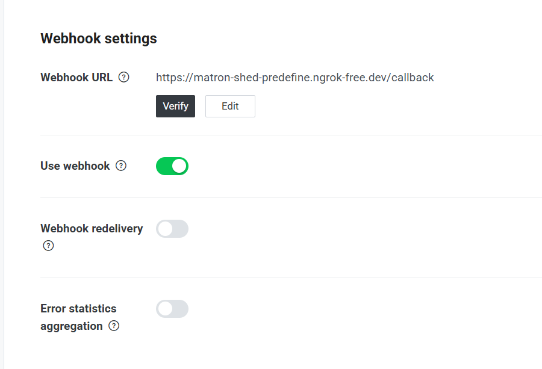
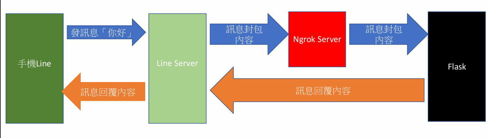
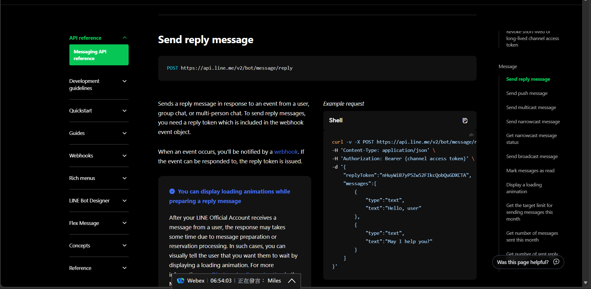
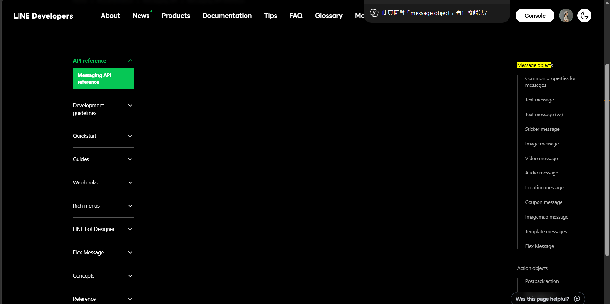
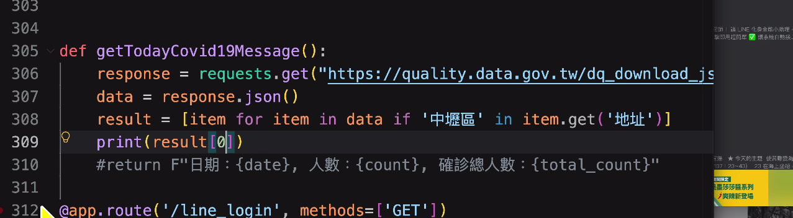

ngrok → 可以產生一個網址讓別人連進你的flask
你的local裡面有flask 和 ngrok
#### 連接ngrok
1. 進到ngrok.exe的資料夾
cd C:\\Users\\TMP-214\\Downloads\\ngrok-v3-stable-windows-amd64
2. 啟動ngrok.exe
`.\ngrok.exe config add-authtoken` +(你的金鑰)
金鑰在[Get Started with ngrok \| Setup Windows](https://dashboard.ngrok.com/get-started/setup/windows)
3. 連進ngrok的port
`ngrok http 5001`

#### 在powershell on你的py檔
建立虛擬環境(已經建了就不用重複)
`python -m venv linebot`         → linebot 是你虛擬環境的名字
啟動虛擬環境 (在powershell裡)
`.\linebot\Scripts\Activate.ps1`
安裝套件 根據 `requirements.txt` 裡列出的套件清單，一次安裝所有需要的 Python 套件。(做一次)
`pip install -r requirements.txt`
啟動python .py檔案
`python app.py`

確認連線是否成功
#### ngrok
Session Status                online                                                                                    Account                       [dumpling8877@gmail.com](mailto:dumpling8877@gmail.com) (Plan: Free)<br>Version                       3.39.8<br>Region                        Japan (jp)<br>Latency                       39ms<br>Web Interface                 [http://127.0.0.1:4040](http://127.0.0.1:4040/)<br>Forwarding                    [https://matron-shed-predefine.ngrok-free.dev](https://matron-shed-predefine.ngrok-free.dev/) -\> [http://localhost:5001](http://localhost:5001/)
Connections                   ttl     opn     rt1     rt5     p50     p90<br>3       0       0.00    0.00    0.04    0.04
 [https://matron-shed-predefine.ngrok-free.dev](https://matron-shed-predefine.ngrok-free.dev/) 代表ngrok連接瀏覽器 
HTTP Requests
#### flask
 \* Running on [http://127.0.0.1:5001](http://127.0.0.1:5001/) 網址代表 我的瀏覽器直接連接我的flask

其中一個掛掉就不能用

#### webhook


webhook URL → ngrok 配發的網址後面加 `/callback`
告訴line bot  讓line收到的每一個事件，傳到你指定的URL


**Messaging API reference**

```python
curl -v -X POST https://api.line.me/v2/bot/message/reply \ #curl模擬post
-H 'Content-Type: application/json' \  
-H 'Authorization: Bearer {channel access token}' \
-d '{
    "replyToken":"nHuyWiB7yP5Zw52FIkcQobQuGDXCTA",
    "messages":[
        {
            "type":"text",
            "text":"Hello, user"
        },
        {
            "type":"text",
            "text":"May I help you?"
        }
    ]
}'
```

07/02


