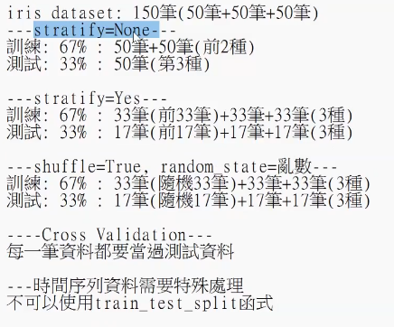

# 機器學習實作步驟
## 第一階段: 訓練評估
1. 載入訓練資料 : 準備好要餵給機器人的資料→教材
2. 處理資料（Pre-processing）:資料可能會有缺失、錯誤、雜訊等，需要預先處理再餵給機器人
1. 特徵抽取（Feature Extraction）:
2. 資料轉換 : 文字轉成二進位
3. 去除雜訊
3. 切割訓練 / 測試資料: 資料不能全部拿來教，要拿一部分出來考試，確保他真的學會。
常見比例: 80/20，70/30
4. 選擇演算法 / 建立模型 / 開始訓練:
什麼是Model?
學生的大腦: 裡面記錄他從資料學到的規律
1. 常見的機器學習模型
1. 線性回歸（Linear Regression）: 根據過去資料，找出一條最適合的直線來預測未來。
透過機器學習找到最好的斜率和截距
y=b+wx
- w（Weight，權重）
- b（Bias，偏差）
2. 決策樹（Decision Tree）:不斷問問題，把資料一步一步分類，最後得到答案。
天氣 = 晴天<br>↓<br>假日 = 是<br>↓<br>出去玩 = 是
結果→出去玩
3. SVM: 畫最佳分類線，如果畫不出來，就升維
4. 神經網路:模仿人腦神經元。
5. 訓練: 把訓練資料丟給模型學習
5. 使用測試資料驗證結果: 考試時間
6. 使用陌生資料驗證模型: 訓練時，拿家裡養的貓，現在拿網站抓的貓，如果判斷正確，代表模型真的學會了，如果變60%，有可能是因為模型背答案了。
7. 儲存模型 / 發布模型 : 將訓練完成的大腦儲存起來
## 第二階段: 上線階段(推導/ 推理)
1. 服務端載入模型: 將已經訓練好的模型上線提供服務，已經可以回答問題。
2. 使用者呼叫模型功能
圖解流程:
資料收集<br>↓<br>資料前處理<br>↓<br>切分資料<br>↓<br>模型訓練<br>↓<br>模型評估<br>↓<br>儲存模型<br>↓
=================
  上線 {color="gray_bg"}
=================<br>↓<br>載入模型<br>↓<br>使用者輸入<br>↓<br>模型推論<br>↓<br>回傳結果

# 認識ScikitLearn
<table header-row="true">
<tr>
<td>功能</td>
<td>工具</td>
<td>解釋</td>
<td>實際例子</td>
</tr>
<tr>
<td>切割資料</td>
<td>`train_test_split()`</td>
<td>把資料分成訓練集和測試集，避免模型只會背答案</td>
<td>1000筆房價資料 → 800筆訓練、200筆測試</td>
</tr>
<tr>
<td>資料標準化</td>
<td>`StandardScaler()`</td>
<td>把不同尺度的資料拉到相近範圍</td>
<td>月薪 50000、年齡 25，數值差太大會影響模型</td>
</tr>
<tr>
<td>線性迴歸</td>
<td>`LinearRegression()`</td>
<td>根據已知資料找出數值之間的關係，用來預測連續數值</td>
<td>根據坪數預測房價</td>
</tr>
<tr>
<td>決策樹</td>
<td>`DecisionTreeClassifier()`</td>
<td>像問答樹一樣逐步判斷</td>
<td>收入 \> 5萬？→ 是 → 可能購買保險</td>
</tr>
<tr>
<td>隨機森林</td>
<td>`RandomForestClassifier()`</td>
<td>多棵決策樹一起投票決定答案</td>
<td>100棵樹中有80棵認為是「貓」，結果就是貓</td>
</tr>
<tr>
<td>SVM</td>
<td>`SVC()`</td>
<td>找出最佳分類界線</td>
<td>將貓和狗的特徵分開</td>
</tr>
<tr>
<td>分群</td>
<td>`KMeans()`</td>
<td>自動把相似資料分組</td>
<td>將會員分成學生族群、上班族群、高消費族群</td>
</tr>
<tr>
<td>模型評估</td>
<td>`accuracy_score()`</td>
<td>計算預測準確率</td>
<td>100題答對95題 → 準確率95%</td>
</tr>
</table>
# **Scikit-Learn 的三大核心元件**
<table header-row="true">
<tr>
<td>元件</td>
<td>作用</td>
<td>常見函數</td>
<td>生活例子</td>
</tr>
<tr>
<td>Transformer</td>
<td>資料加工</td>
<td>fit()、transform()、fit_transform()</td>
<td>洗菜、切菜</td>
</tr>
<tr>
<td>Estimator</td>
<td>學習資料規律</td>
<td>fit()</td>
<td>廚師學習食譜</td>
</tr>
<tr>
<td>Predictor</td>
<td>預測結果</td>
<td>predict()、score()</td>
<td>根據食譜做菜</td>
</tr>
</table>
原始資料<br>↓<br>Transformer（加工資料）<br>↓<br>Estimator（學習規律）<br>↓<br>Predictor（預測答案）
假設我們要做一個「房價預測模型」。
原始資料：
<table header-row="true">
<tr>
<td>坪數</td>
<td>房價(萬)</td>
</tr>
<tr>
<td>20</td>
<td>800</td>
</tr>
<tr>
<td>30</td>
<td>1200</td>
</tr>
<tr>
<td>40</td>
<td>1600</td>
</tr>
<tr>
<td>50</td>
<td>2000</td>
</tr>
</table>
---
<table header-row="true">
<tr>
<td>函數</td>
<td>功能</td>
<td>舉例</td>
<td>執行後結果</td>
</tr>
<tr>
<td>`fit()`</td>
<td>學習資料規律</td>
<td>`model.fit(X_train, y_train)`</td>
<td>模型學到「坪數越大，房價越高」</td>
</tr>
<tr>
<td>`transform()`</td>
<td>套用規律轉換資料</td>
<td>`scaler.transform(X_test)`</td>
<td>把測試資料依照之前學到的標準化規則轉換</td>
</tr>
<tr>
<td>`fit_transform()`</td>
<td>先學習再轉換</td>
<td>`scaler.fit_transform(X_train)`</td>
<td>計算平均值、標準差，並立即完成標準化</td>
</tr>
<tr>
<td>`predict()`</td>
<td>預測結果</td>
<td>`model.predict([[35]])`</td>
<td>預測 35 坪房價約 1400 萬</td>
</tr>
<tr>
<td>`score()`</td>
<td>評估模型</td>
<td>`model.score(X_test, y_test)`</td>
<td>回傳模型準確度或 R² 分數</td>
</tr>
</table>

<table header-row="true">
<tr>
<td>套件</td>
<td>處理對象</td>
<td>功能</td>
<td>代表工具</td>
</tr>
<tr>
<td>Scikit-Learn</td>
<td>表格資料</td>
<td>機器學習</td>
<td>Random Forest</td>
</tr>
<tr>
<td>Scikit-Image</td>
<td>圖片</td>
<td>影像處理</td>
<td>Segmentation</td>
</tr>
<tr>
<td>Scikit-Optimize</td>
<td>模型參數</td>
<td>自動調參</td>
<td>Bayesian Optimization</td>
</tr>
</table>
## Scikit-Learn 優點與缺點
<table header-row="true">
<tr>
<td>類別</td>
<td>項目</td>
<td>說明</td>
<td>實際例子</td>
</tr>
<tr>
<td>✅ 優點</td>
<td>開源免費（BSD License）</td>
<td>使用限制少，可自由用於學習、研究及商業用途</td>
<td>公司開發房價預測系統時可直接使用，不需付授權費</td>
</tr>
<tr>
<td>✅ 優點</td>
<td>容易學習與使用</td>
<td>API 設計統一，大部分模型使用方式相同</td>
<td>`LinearRegression()`、`RandomForestClassifier()` 都使用 `fit()` 和 `predict()`</td>
</tr>
<tr>
<td>✅ 優點</td>
<td>解決實際問題</td>
<td>提供大量機器學習演算法</td>
<td>客戶流失預測、垃圾郵件分類、房價預測</td>
</tr>
<tr>
<td>✅ 優點</td>
<td>大型企業支持</td>
<td>由眾多企業及開發者共同維護</td>
<td>包括 Microsoft、Intel、NVIDIA 等</td>
</tr>
<tr>
<td>✅ 優點</td>
<td>文件完整</td>
<td>官方文件、教學、範例豐富</td>
<td>遇到問題通常都能找到範例程式</td>
</tr>
<tr>
<td>✅ 優點</td>
<td>演算法豐富</td>
<td>提供分類、迴歸、分群、降維等功能</td>
<td>SVM、Random Forest、K-Means、PCA</td>
</tr>
<tr>
<td>❌ 缺點</td>
<td>不適合深度學習</td>
<td>無法建立複雜神經網路模型</td>
<td>CNN、RNN、Transformer 需使用 TensorFlow 或 PyTorch</td>
</tr>
<tr>
<td>❌ 缺點</td>
<td>不支援 Model Serving</td>
<td>不提供模型部署服務</td>
<td>無法直接讓使用者透過網站呼叫模型</td>
</tr>
</table>
## Scikit-Learn vs TensorFlow
<table header-row="true">
<tr>
<td>項目</td>
<td>Scikit-Learn</td>
<td>TensorFlow</td>
</tr>
<tr>
<td>類型</td>
<td>機器學習(Machine Learning)</td>
<td>深度學習(Deep Learning)</td>
</tr>
<tr>
<td>學習難度</td>
<td>⭐⭐ 簡單</td>
<td>⭐⭐⭐⭐ 較難</td>
</tr>
<tr>
<td>程式碼量</td>
<td>少</td>
<td>較多</td>
</tr>
<tr>
<td>適合新手</td>
<td>✅</td>
<td>⚠️</td>
</tr>
<tr>
<td>GPU加速</td>
<td>不強調</td>
<td>✅ 支援</td>
</tr>
<tr>
<td>神經網路</td>
<td>基本支援(MLP)</td>
<td>✅ 強大支援</td>
</tr>
<tr>
<td>圖片辨識</td>
<td>小型專案可用</td>
<td>✅ 非常適合</td>
</tr>
<tr>
<td>語音辨識</td>
<td>較少使用</td>
<td>✅</td>
</tr>
<tr>
<td>ChatGPT類模型</td>
<td>❌</td>
<td>✅</td>
</tr>
<tr>
<td>訓練速度</td>
<td>快</td>
<td>視模型而定</td>
</tr>
<tr>
<td>部署大型AI模型</td>
<td>❌</td>
<td>✅</td>
</tr>
</table>
## Scikit-Learn 支援的演算法整理
### 1. Classification（分類）
> 預測資料屬於哪一個類別
<table header-row="true">
<tr>
<td>項目</td>
<td>說明</td>
</tr>
<tr>
<td>功能</td>
<td>將資料分類到特定類別</td>
</tr>
<tr>
<td>輸出結果</td>
<td>類別(Label)</td>
</tr>
<tr>
<td>常見應用</td>
<td>垃圾郵件判斷、疾病診斷、客戶是否流失</td>
</tr>
<tr>
<td>生活例子</td>
<td>判斷 Email 是「垃圾郵件」還是「正常郵件」</td>
</tr>
<tr>
<td>常見演算法</td>
<td>SVC、KNN(Nearest Neighbor)、Random Forest、Decision Tree</td>
</tr>
</table>
### 範例
<table header-row="true">
<tr>
<td>郵件內容</td>
<td>分類結果</td>
</tr>
<tr>
<td>免費領獎金</td>
<td>垃圾郵件</td>
</tr>
<tr>
<td>公司會議通知</td>
<td>正常郵件</td>
</tr>
</table>
---
### 2. Clustering（分群）
> 將相似的資料自動分成群組
<table header-row="true">
<tr>
<td>項目</td>
<td>說明</td>
</tr>
<tr>
<td>功能</td>
<td>找出資料間的相似性並分群</td>
</tr>
<tr>
<td>輸出結果</td>
<td>群組編號</td>
</tr>
<tr>
<td>常見應用</td>
<td>客戶分群、市場分析、推薦系統</td>
</tr>
<tr>
<td>生活例子</td>
<td>將購物網站會員分成不同消費族群</td>
</tr>
<tr>
<td>常見演算法</td>
<td>K-Means、Spectral Clustering、Mean Shift、GMM</td>
</tr>
</table>
### 範例
<table header-row="true">
<tr>
<td>客戶</td>
<td>年消費金額</td>
<td>分群結果</td>
</tr>
<tr>
<td>A</td>
<td>2,000</td>
<td>群組1</td>
</tr>
<tr>
<td>B</td>
<td>2,500</td>
<td>群組1</td>
</tr>
<tr>
<td>C</td>
<td>50,000</td>
<td>群組2</td>
</tr>
<tr>
<td>D</td>
<td>60,000</td>
<td>群組2</td>
</tr>
</table>
---
### 3. Regression（迴歸）
> 預測一個連續數值
<table header-row="true">
<tr>
<td>項目</td>
<td>說明</td>
</tr>
<tr>
<td>功能</td>
<td>預測數值</td>
</tr>
<tr>
<td>輸出結果</td>
<td>數字</td>
</tr>
<tr>
<td>常見應用</td>
<td>房價預測、股價預測、銷售額預測</td>
</tr>
<tr>
<td>生活例子</td>
<td>根據坪數預測房價</td>
</tr>
<tr>
<td>常見演算法</td>
<td>Linear Regression、SVR、Ridge Regression、Lasso Regression</td>
</tr>
</table>
### 範例
<table header-row="true">
<tr>
<td>坪數</td>
<td>預測房價</td>
</tr>
<tr>
<td>20坪</td>
<td>800萬</td>
</tr>
<tr>
<td>30坪</td>
<td>1200萬</td>
</tr>
<tr>
<td>40坪</td>
<td>1600萬</td>
</tr>
</table>
---
## 4. Multi-Layer Perceptron（MLP）
> Scikit-Learn 內建的神經網路
<table header-row="true">
<tr>
<td>項目</td>
<td>說明</td>
</tr>
<tr>
<td>功能</td>
<td>模擬神經網路進行學習</td>
</tr>
<tr>
<td>類型</td>
<td>深度學習入門版</td>
</tr>
<tr>
<td>常見應用</td>
<td>分類、迴歸</td>
</tr>
<tr>
<td>優點</td>
<td>使用簡單</td>
</tr>
<tr>
<td>缺點</td>
<td>不適合大型深度學習專案</td>
</tr>
</table>
### 相關模型
<table header-row="true">
<tr>
<td>模型</td>
<td>用途</td>
</tr>
<tr>
<td>MLPClassifier</td>
<td>分類</td>
</tr>
<tr>
<td>MLPRegressor</td>
<td>數值預測</td>
</tr>
<tr>
<td>BernoulliRBM</td>
<td>特徵學習</td>
</tr>
</table>
### 範例
```plain text
fromsklearn.neural_networkimportMLPClassifier

model=MLPClassifier()
```
---
## 5. Dimensionality Reduction（降維）
> 減少特徵數量，提高訓練效率
<table header-row="true">
<tr>
<td>項目</td>
<td>說明</td>
</tr>
<tr>
<td>功能</td>
<td>刪除不重要特徵</td>
</tr>
<tr>
<td>目的</td>
<td>降低運算量、避免過擬合</td>
</tr>
<tr>
<td>常見應用</td>
<td>視覺化、大數據分析</td>
</tr>
<tr>
<td>生活例子</td>
<td>履歷有100項資訊，只保留最重要10項</td>
</tr>
</table>
### 常見演算法
<table header-row="true">
<tr>
<td>演算法</td>
<td>功能</td>
</tr>
<tr>
<td>PCA</td>
<td>主成分分析</td>
</tr>
<tr>
<td>Feature Selection</td>
<td>特徵選擇</td>
</tr>
<tr>
<td>NMF</td>
<td>非負矩陣分解</td>
</tr>
</table>
### 範例
原始資料：
特徵數
---
100個欄位
---
降維後：
特徵數
---
10個欄位
---
---
## 6. Model Selection（模型選擇）
> 找出最佳模型與最佳參數
<table header-row="true">
<tr>
<td>項目</td>
<td>說明</td>
</tr>
<tr>
<td>功能</td>
<td>比較模型效果</td>
</tr>
<tr>
<td>目的</td>
<td>找到最佳參數組合</td>
</tr>
<tr>
<td>常見應用</td>
<td>調整 Random Forest、SVM 參數</td>
</tr>
<tr>
<td>生活例子</td>
<td>找出考試成績最好的讀書方法</td>
</tr>
</table>
### 常見工具
<table header-row="true">
<tr>
<td>工具</td>
<td>功能</td>
</tr>
<tr>
<td>GridSearchCV</td>
<td>暴力搜尋最佳參數</td>
</tr>
<tr>
<td>RandomizedSearchCV</td>
<td>隨機搜尋最佳參數</td>
</tr>
<tr>
<td>Cross Validation</td>
<td>交叉驗證</td>
</tr>
<tr>
<td>Metrics</td>
<td>評估模型表現</td>
</tr>
</table>
### 範例
Random Forest：
```plain text
RandomForestClassifier(
n_estimators=100
)
```
GridSearchCV 自動測試：
```plain text
50棵樹
100棵樹
200棵樹
300棵樹
```
最後找出最佳組合。
---
## 7. Preprocessing（資料前處理）
> 將資料整理成模型容易學習的格式
<table header-row="true">
<tr>
<td>項目</td>
<td>說明</td>
</tr>
<tr>
<td>功能</td>
<td>清理、轉換、標準化資料</td>
</tr>
<tr>
<td>目的</td>
<td>提高模型效果</td>
</tr>
<tr>
<td>常見應用</td>
<td>資料清理、特徵抽取</td>
</tr>
<tr>
<td>生活例子</td>
<td>將文字轉成數字</td>
</tr>
</table>
### 常見工具
<table header-row="true">
<tr>
<td>工具</td>
<td>功能</td>
</tr>
<tr>
<td>StandardScaler</td>
<td>標準化</td>
</tr>
<tr>
<td>MinMaxScaler</td>
<td>正規化</td>
</tr>
<tr>
<td>LabelEncoder</td>
<td>文字轉數字</td>
</tr>
<tr>
<td>OneHotEncoder</td>
<td>類別編碼</td>
</tr>
<tr>
<td>Feature Extraction</td>
<td>特徵抽取</td>
</tr>
</table>
### 範例
原始資料：
性別
---
男
---
女
---
男
---
轉換後：
性別
---
0
---
1
---
0
---
## Encoder（類別資料編碼）總整理
<table header-row="true">
<colgroup>
<col width="180">
<col>
<col width="130">
<col>
<col>
</colgroup>
<tr>
<td>項目</td>
<td>LabelEncoder</td>
<td>OneHotEncoder</td>
<td>OrdinalEncoder</td>
<td>Learned Embedding</td>
</tr>
<tr>
<td>**定義**</td>
<td>每個類別給一個數字編號</td>
<td>每個類別拆成獨立欄位</td>
<td>將有順序的類別轉成數字</td>
<td>用神經網路學習類別向量</td>
</tr>
<tr>
<td>**主要用途**</td>
<td>分類標籤(y)</td>
<td>類別特徵(X)</td>
<td>有順序的類別資料</td>
<td>深度學習、NLP</td>
</tr>
<tr>
<td>**輸出形式**</td>
<td>單一數字</td>
<td>多個0/1欄位</td>
<td>單一數字</td>
<td>多維向量</td>
</tr>
<tr>
<td>**是否保留順序**</td>
<td>❌（可能誤判）</td>
<td>❌</td>
<td>✅</td>
<td>自動學習</td>
</tr>
<tr>
<td>**Scikit-Learn支援**</td>
<td>✅</td>
<td>✅</td>
<td>✅</td>
<td>❌</td>
</tr>
<tr>
<td>**TensorFlow/PyTorch支援**</td>
<td>❌</td>
<td>❌</td>
<td>❌</td>
<td>✅</td>
</tr>
</table>
# LabelEncoder
<table header-row="true">
<tr>
<td>項目</td>
<td>內容</td>
</tr>
<tr>
<td>定義</td>
<td>將每個類別直接轉換成數字</td>
</tr>
<tr>
<td>解釋</td>
<td>系統自動建立類別與數字對照表</td>
</tr>
<tr>
<td>原始資料</td>
<td>台灣、日本、美國</td>
</tr>
<tr>
<td>轉換結果</td>
<td>0、1、2</td>
</tr>
</table>
### 範例
<table header-row="true">
<tr>
<td>國家</td>
<td>編碼後</td>
</tr>
<tr>
<td>台灣</td>
<td>0</td>
</tr>
<tr>
<td>日本</td>
<td>1</td>
</tr>
<tr>
<td>美國</td>
<td>2</td>
</tr>
</table>
### 優點
<table header-row="true">
<tr>
<td>優點</td>
<td>說明</td>
</tr>
<tr>
<td>簡單</td>
<td>一行程式即可完成</td>
</tr>
<tr>
<td>快速</td>
<td>運算速度快</td>
</tr>
<tr>
<td>節省空間</td>
<td>不增加欄位數</td>
</tr>
</table>
### 缺點
<table header-row="true">
<tr>
<td>缺點</td>
<td>說明</td>
</tr>
<tr>
<td>產生假順序</td>
<td>美國(2) \> 日本(1) \> 台灣(0)</td>
</tr>
<tr>
<td>容易誤導模型</td>
<td>模型誤認數字大小有意義</td>
</tr>
</table>
### 適用情境
<table header-row="true">
<tr>
<td>資料</td>
<td>適用</td>
</tr>
<tr>
<td>分類標籤(y)</td>
<td>✅</td>
</tr>
<tr>
<td>國家</td>
<td>❌</td>
</tr>
<tr>
<td>品牌</td>
<td>❌</td>
</tr>
<tr>
<td>顏色</td>
<td>❌</td>
</tr>
</table>
---
# OneHotEncoder
<table header-row="true">
<tr>
<td>項目</td>
<td>內容</td>
</tr>
<tr>
<td>定義</td>
<td>將每個類別拆成獨立欄位</td>
</tr>
<tr>
<td>解釋</td>
<td>使用 0 和 1 表示是否屬於該類別</td>
</tr>
<tr>
<td>原始資料</td>
<td>台灣、日本、美國</td>
</tr>
<tr>
<td>轉換結果</td>
<td>三個新欄位</td>
</tr>
</table>
### 範例
<table header-row="true">
<tr>
<td>國家</td>
<td>台灣</td>
<td>日本</td>
<td>美國</td>
</tr>
<tr>
<td>台灣</td>
<td>1</td>
<td>0</td>
<td>0</td>
</tr>
<tr>
<td>日本</td>
<td>0</td>
<td>1</td>
<td>0</td>
</tr>
<tr>
<td>美國</td>
<td>0</td>
<td>0</td>
<td>1</td>
</tr>
</table>
### 優點
<table header-row="true">
<tr>
<td>優點</td>
<td>說明</td>
</tr>
<tr>
<td>不產生順序</td>
<td>類別彼此平等</td>
</tr>
<tr>
<td>預測效果佳</td>
<td>多數機器學習模型適用</td>
</tr>
<tr>
<td>最常使用</td>
<td>業界標準做法</td>
</tr>
</table>
### 缺點
<table header-row="true">
<tr>
<td>缺點</td>
<td>說明</td>
</tr>
<tr>
<td>欄位爆炸</td>
<td>類別越多欄位越多</td>
</tr>
<tr>
<td>記憶體增加</td>
<td>大型資料集耗資源</td>
</tr>
</table>
### 適用情境
<table header-row="true">
<tr>
<td>資料</td>
<td>適用</td>
</tr>
<tr>
<td>性別</td>
<td>✅</td>
</tr>
<tr>
<td>國家</td>
<td>✅</td>
</tr>
<tr>
<td>品牌</td>
<td>✅</td>
</tr>
<tr>
<td>顏色</td>
<td>✅</td>
</tr>
<tr>
<td>學歷</td>
<td>❌</td>
</tr>
</table>
---
# OrdinalEncoder
<table header-row="true">
<tr>
<td>項目</td>
<td>內容</td>
</tr>
<tr>
<td>定義</td>
<td>將有順序的類別轉換成數字</td>
</tr>
<tr>
<td>解釋</td>
<td>保留類別之間的高低順序</td>
</tr>
<tr>
<td>原始資料</td>
<td>高中、大學、碩士、博士</td>
</tr>
<tr>
<td>轉換結果</td>
<td>0、1、2、3</td>
</tr>
</table>
### 範例
<table header-row="true">
<tr>
<td>學歷</td>
<td>編碼後</td>
</tr>
<tr>
<td>高中</td>
<td>0</td>
</tr>
<tr>
<td>大學</td>
<td>1</td>
</tr>
<tr>
<td>碩士</td>
<td>2</td>
</tr>
<tr>
<td>博士</td>
<td>3</td>
</tr>
</table>
### 優點
<table header-row="true">
<tr>
<td>優點</td>
<td>說明</td>
</tr>
<tr>
<td>保留順序</td>
<td>符合實際意義</td>
</tr>
<tr>
<td>不增加欄位</td>
<td>仍維持單一欄位</td>
</tr>
<tr>
<td>記憶體需求低</td>
<td>比 One-Hot 小很多</td>
</tr>
</table>
### 缺點
<table header-row="true">
<tr>
<td>缺點</td>
<td>說明</td>
</tr>
<tr>
<td>不適合無順序資料</td>
<td>國家、品牌、顏色</td>
</tr>
<tr>
<td>容易造成誤判</td>
<td>若類別本身沒有大小關係</td>
</tr>
</table>
### 適用情境
<table header-row="true">
<tr>
<td>資料</td>
<td>適用</td>
</tr>
<tr>
<td>學歷</td>
<td>✅</td>
</tr>
<tr>
<td>員工績效</td>
<td>✅</td>
</tr>
<tr>
<td>會員等級</td>
<td>✅</td>
</tr>
<tr>
<td>國家</td>
<td>❌</td>
</tr>
<tr>
<td>顏色</td>
<td>❌</td>
</tr>
</table>
---
# Learned Embedding
<table header-row="true">
<tr>
<td>項目</td>
<td>內容</td>
</tr>
<tr>
<td>定義</td>
<td>使用神經網路自動學習向量表示</td>
</tr>
<tr>
<td>解釋</td>
<td>將類別轉成高維向量</td>
</tr>
<tr>
<td>使用框架</td>
<td>TensorFlow、PyTorch</td>
</tr>
<tr>
<td>使用領域</td>
<td>NLP、推薦系統、LLM</td>
</tr>
</table>
### 範例
<table header-row="true">
<tr>
<td>類別</td>
<td>Embedding向量</td>
</tr>
<tr>
<td>台灣</td>
<td>\[0.21, 0.66, 0.38\]</td>
</tr>
<tr>
<td>日本</td>
<td>\[0.24, 0.61, 0.40\]</td>
</tr>
<tr>
<td>美國</td>
<td>\[-0.12, 0.90, 0.55\]</td>
</tr>
</table>
### 優點
<table header-row="true">
<tr>
<td>優點</td>
<td>說明</td>
</tr>
<tr>
<td>可表示類別關係</td>
<td>台灣與日本較接近</td>
</tr>
<tr>
<td>適合大量類別</td>
<td>商品、使用者、單字</td>
</tr>
<tr>
<td>記憶體較省</td>
<td>比 One-Hot 更有效率</td>
</tr>
<tr>
<td>深度學習必備</td>
<td>ChatGPT、BERT 都使用</td>
</tr>
</table>
### 缺點
<table header-row="true">
<tr>
<td>缺點</td>
<td>說明</td>
</tr>
<tr>
<td>需大量資料</td>
<td>小資料集效果差</td>
</tr>
<tr>
<td>較難解釋</td>
<td>向量意義不直觀</td>
</tr>
<tr>
<td>需深度學習框架</td>
<td>TensorFlow 或 PyTorch</td>
</tr>
</table>

## 使用Encoder處理Categorical欄位
## 程式目的
<table header-row="true">
<tr>
<td>功能</td>
<td>說明</td>
</tr>
<tr>
<td>讀取 Excel</td>
<td>將 Excel 資料載入 DataFrame</td>
</tr>
<tr>
<td>LabelEncoder</td>
<td>將單一類別欄位轉換成數字</td>
</tr>
<tr>
<td>OrdinalEncoder</td>
<td>將多個類別欄位轉換成數字</td>
</tr>
<tr>
<td>OneHotEncoder</td>
<td>將類別拆成多個 0/1 欄位</td>
</tr>
<tr>
<td>get_dummies</td>
<td>Pandas版本的 One-Hot Encoding</td>
</tr>
<tr>
<td>LabelBinarizer</td>
<td>二元分類編碼工具</td>
</tr>
</table>
---
## 原始資料範例
假設 Excel.xlsx：
<table header-row="true">
<tr>
<td>Name</td>
<td>Age</td>
<td>Gender</td>
<td>JobTitle</td>
</tr>
<tr>
<td>Tom</td>
<td>30</td>
<td>Male</td>
<td>Engineer</td>
</tr>
<tr>
<td>Amy</td>
<td>25</td>
<td>Female</td>
<td>Manager</td>
</tr>
<tr>
<td>John</td>
<td>35</td>
<td>Male</td>
<td>Engineer</td>
</tr>
</table>
<details>
<summary>語法補充解釋</summary>
機器學習專案最常見流程
<table header-row="true">
<tr>
<td>步驟</td>
<td>程式</td>
</tr>
<tr>
<td>1. 找檔案路徑</td>
<td>`data_path = os.path.join(currdir,'Datasets','Excel.xlsx')`</td>
</tr>
<tr>
<td>2. 讀取資料</td>
<td>`df = pd.read_excel(data_path)`</td>
</tr>
<tr>
<td>3. 檢查資料</td>
<td>`df.head()`、`df.info()`</td>
</tr>
<tr>
<td>4. 清理資料</td>
<td>`df.dropna()`</td>
</tr>
<tr>
<td>5. 特徵工程</td>
<td>`LabelEncoder()`、資料轉換</td>
</tr>
<tr>
<td>6. 訓練模型</td>
<td>`model.fit(X, y)`</td>
</tr>
<tr>
<td>7. 預測</td>
<td>`model.predict(X_test)`</td>
</tr>
<tr>
<td>8. 儲存結果</td>
<td>`df.to_csv('result.csv')`</td>
</tr>
</table>
路徑處理:
<table header-row="true">
<tr>
<td>函式</td>
<td>功能</td>
<td>範例</td>
</tr>
<tr>
<td>`os.path.join()`</td>
<td>組合路徑</td>
<td>`os.path.join('Data','test.csv')`</td>
</tr>
<tr>
<td>`os.getcwd()`</td>
<td>取得目前工作目錄</td>
<td>`os.getcwd()`</td>
</tr>
<tr>
<td>`os.path.dirname(__file__)`</td>
<td>取得目前 `.py` 所在資料夾</td>
<td>`os.path.dirname(__file__)`</td>
</tr>
<tr>
<td>`os.path.exists()`</td>
<td>檢查檔案或資料夾是否存在</td>
<td>`os.path.exists('data.csv')`</td>
</tr>
<tr>
<td>`os.path.getsize()`</td>
<td>取得檔案大小(Byte)</td>
<td>`os.path.getsize('data.csv')`</td>
</tr>
</table>
檔案操作
<table header-row="true">
<tr>
<td>類別</td>
<td>函式</td>
<td>功能</td>
<td>範例</td>
</tr>
<tr>
<td>讀取檔案</td>
<td>`open(..., 'r')`</td>
<td>讀取文字檔</td>
<td>`open('test.txt','r')`</td>
</tr>
<tr>
<td>讀取 Excel</td>
<td>`pd.read_excel()`</td>
<td>讀取 Excel 檔案</td>
<td>`pd.read_excel('data.xlsx')`</td>
</tr>
<tr>
<td>讀取 CSV</td>
<td>`pd.read_csv()`</td>
<td>讀取 CSV 檔案</td>
<td>`pd.read_csv('data.csv')`</td>
</tr>
<tr>
<td>讀取 JSON</td>
<td>`pd.read_json()`</td>
<td>讀取 JSON 檔案</td>
<td>`pd.read_json('data.json')`</td>
</tr>
<tr>
<td>寫入檔案</td>
<td>`open(..., 'w')`</td>
<td>建立或覆蓋檔案</td>
<td>`open('test.txt','w')`</td>
</tr>
<tr>
<td>追加內容</td>
<td>`open(..., 'a')`</td>
<td>在檔案尾端新增內容</td>
<td>`open('test.txt','a')`</td>
</tr>
<tr>
<td>儲存 Excel</td>
<td>`df.to_excel()`</td>
<td>將 DataFrame 存成 Excel</td>
<td>`df.to_excel('result.xlsx')`</td>
</tr>
<tr>
<td>儲存 CSV</td>
<td>`df.to_csv()`</td>
<td>將 DataFrame 存成 CSV</td>
<td>`df.to_csv('result.csv')`</td>
</tr>
<tr>
<td>儲存 JSON</td>
<td>`df.to_json()`</td>
<td>將 DataFrame 存成 JSON</td>
<td>`df.to_json('result.json')`</td>
</tr>
<tr>
<td>儲存資料庫</td>
<td>`df.to_sql()`</td>
<td>將資料存入資料庫</td>
<td>`df.to_sql('Staff', conn)`</td>
</tr>
</table>
資料夾操作
<table header-row="true">
<tr>
<td>函式</td>
<td>功能</td>
<td>範例</td>
</tr>
<tr>
<td>`os.listdir()`</td>
<td>查看資料夾內容</td>
<td>`os.listdir('Datasets')`</td>
</tr>
<tr>
<td>`os.mkdir()`</td>
<td>建立單層資料夾</td>
<td>`os.mkdir('Results')`</td>
</tr>
<tr>
<td>`os.makedirs()`</td>
<td>建立多層資料夾</td>
<td>`os.makedirs('Result/2026/June')`</td>
</tr>
<tr>
<td>`os.rmdir()`</td>
<td>刪除空資料夾</td>
<td>`os.rmdir('Results')`</td>
</tr>
</table>
檔案管理
<table header-row="true">
<tr>
<td>函式</td>
<td>功能</td>
<td>範例</td>
</tr>
<tr>
<td>`os.remove()`</td>
<td>刪除檔案</td>
<td>`os.remove('test.txt')`</td>
</tr>
<tr>
<td>`os.rename()`</td>
<td>重新命名</td>
<td>`os.rename('old.txt','new.txt')`</td>
</tr>
<tr>
<td>`shutil.copy()`</td>
<td>複製檔案</td>
<td>`shutil.copy('a.txt','b.txt')`</td>
</tr>
<tr>
<td>`shutil.move()`</td>
<td>移動檔案</td>
<td>`shutil.move('a.txt','backup/a.txt')`</td>
</tr>
</table>
Pandas DataFrame 常用操作
<table header-row="true">
<tr>
<td>函式</td>
<td>功能</td>
<td>範例</td>
</tr>
<tr>
<td>`df.head()`</td>
<td>查看前 5 筆資料</td>
<td>`df.head()`</td>
</tr>
<tr>
<td>`df.tail()`</td>
<td>查看後 5 筆資料</td>
<td>`df.tail()`</td>
</tr>
<tr>
<td>`df.shape`</td>
<td>查看資料維度</td>
<td>`df.shape`</td>
</tr>
<tr>
<td>`df.columns`</td>
<td>查看欄位名稱</td>
<td>`df.columns`</td>
</tr>
<tr>
<td>`df.info()`</td>
<td>查看資料型態與缺失值</td>
<td>`df.info()`</td>
</tr>
<tr>
<td>`df.describe()`</td>
<td>查看統計資訊</td>
<td>`df.describe()`</td>
</tr>
<tr>
<td>`df.dropna()`</td>
<td>刪除缺失值</td>
<td>`df.dropna()`</td>
</tr>
<tr>
<td>`df.fillna()`</td>
<td>填補缺失值</td>
<td>`df.fillna(0)`</td>
</tr>
<tr>
<td>`df.sort_values()`</td>
<td>排序資料</td>
<td>`df.sort_values('年齡')`</td>
</tr>
<tr>
<td>`df.groupby()`</td>
<td>分組統計</td>
<td>`df.groupby('部門').mean()`</td>
</tr>
</table>

</details>
```python
#Learning embeddings for your machine learning model
#https://medium.com/spikelab/learning-embeddings-for-your-machine-learning-model-a6cb4bc6542e
#Categorical Embedding and Transfer Learning
#https://towardsdatascience.com/categorical-embedding-and-transfer-learning-dd3c4af6345d

#載入套件
import pandas as pd
from sklearn.preprocessing import LabelEncoder
import os

#取得excel路徑 file代表現在正在執行的.py檔案位置
currdir=os.path.dirname(__file__)
#將Excel檔案的路徑加進去 用 join
data_path=os.path.join(currdir, 'Datasets', 'Excel.xlsx')
#讀取Excel檔的工作表1
df=pd.read_excel(data_path, sheet_name='工作表1')
print(df)

# 我的excel dataframe
   ID  Name  Gender   JobTitle  Salary  Age
0   1  John    Male    Manager   35000   30
1   2  Mary  Female      Sales   40000   40
2   3  Jack    Male  President   50000   50
   ID  Name  Gender   JobTitle  Salary  Age
0   1  John       1    Manager   35000   30
1   2  Mary       0      Sales   40000   40
2   3  Jack       1  President   50000   50

#LabelEncoder 編碼器
le = LabelEncoder()

# le.fit_transform(df.Gender)
# 先le.fit(df.Gender) 學習資料內容 ['Female','Male']
# 再le.transform(df.Gender) 轉成數字
df.Gender=le.fit_transform(df.Gender)
#df=df.apply(LabelEncoder().fit_transform)      # encode所有欄位

print(df)
#===============
from sklearn.preprocessing import OrdinalEncoder
from sklearn.compose import ColumnTransformer
# from sklearn.compose import make_column_transformer
# 對 Gender 與 JobTitle 使用 OrdinalEncoder

# encoder = ColumnTransformer(...)->建立一個資料轉換器
encoder = ColumnTransformer(
# transformers=[(...)]建立一個轉換規則list
# 裡面再包一個tuple來存放規則
# ('自訂名稱', Transformer物件, ['要處理的欄位'])
   transformers=[
       (
           'ordinal', OrdinalEncoder(), ['Gender', 'JobTitle'],            
       )
   ])

# df.iloc[第幾列, 第幾欄]
# 取出工作表的前兩欄 ID,  Salary
df1=df.iloc[:, 0:2]

# 對工作表1的['Gender', 'JobTitle']兩個欄位做轉換
# result會回傳<class 'numpy.ndarray'> 不是DataFrame
result=encoder.fit_transform(df)  #內含LabelEncoder的ColumnTransformer無法處理多個欄位
# 把result的array轉成DataFrame
df2=pd.DataFrame(result, columns=['Gender', 'JobTitle'], dtype=int)
print(df2)
# 合併表格
df=pd.concat([df1, df2], axis=1)
print(df)
#=======================
from sklearn.preprocessing import OneHotEncoder

#one-hot encoder
encoder = ColumnTransformer(
transformers=[
         ('Gender', OneHotEncoder(), ['Gender'])])
 onehotgender = encoder.fit_transform(df)
 onehotgender=pd.DataFrame(onehotgender, columns=['Gender_Female','Gender_Male'], dtype=int) 

 df = pd.concat([df, onehotgender], axis=1).drop(['Gender'], axis=1)
 print(df)

#Pandas get_dummies
df1=df.iloc[:, 0:2]
print(df1)
df2=pd.get_dummies(df.Gender)
print(df2)
df=pd.concat([df1, df2], axis=1)
print(df)
df=df.rename(columns = {'Female':'Gender_Female', 'Male':'Gender_Male'})
print(df)

#LabelBinarizer
from sklearn.preprocessing import LabelBinarizer

encoder = LabelBinarizer()
print(encoder.fit_transform(df.Gender))
df.Gender=encoder.fit_transform(df.Gender)
print(df)

#OrdinalEncoder
from sklearn.preprocessing import OrdinalEncoder
encoder = OrdinalEncoder()
df=encoder.fit_transform(df)
print(df)
```
<table header-row="true">
<tr>
<td>方法</td>
<td>結果</td>
<td>適用情況</td>
</tr>
<tr>
<td>LabelEncoder</td>
<td>Male→1 Female→0</td>
<td>二元類別</td>
</tr>
<tr>
<td>OrdinalEncoder</td>
<td>類別→整數</td>
<td>多個類別欄位</td>
</tr>
<tr>
<td>OneHotEncoder</td>
<td>變成多個0/1欄位</td>
<td>最常用</td>
</tr>
<tr>
<td>get_dummies</td>
<td>OneHot簡易版</td>
<td>Pandas快速處理</td>
</tr>
<tr>
<td>LabelBinarizer</td>
<td>二元分類</td>
<td>Gender、Yes/No</td>
</tr>
<tr>
<td>Embedding</td>
<td>轉成向量</td>
<td>深度學習、TensorFlow</td>
</tr>
</table>
程式流程
Pokemon.csv<br>↓<br>讀取資料<br>↓<br>LabelEncoder<br>↓<br>Fire → 6<br>Water → 15<br>Grass → 8<br>...<br>↓<br>Embedding Layer<br>↓<br>轉成向量<br>↓<br>利用 Total 能力值訓練<br>↓<br>得到 Pokemon Type 的特徵向量<br>↓<br>3D視覺化
```python
#載入套件
import numpy as np
import pandas as pd
import os
# 取得檔案路徑 組裝路徑 讀取檔案
currdir=os.path.dirname(__file__)
data_path=os.path.join(currdir, 'Datasets', 'Pokemon.csv')
df = pd.read_csv(data_path)

# drop刪除欄位 ( 要刪除的欄位, 要刪除欄還是列, inplace=True直接修改原資料)
# axis = 0 修改資料列， axis = 1 修改資料欄

df.drop(labels="#", axis=1, inplace=True)

# fillna填補空值 axis = 0 往下填，axis = 1 往右填
df.fillna(value="No Type", axis=1, inplace=True)
# rename更改欄位名稱 {'舊名稱':'新名稱'} axis=1 更改欄位  axis=0 更改列
df.rename({'Type 1': 'type'}, inplace=True, axis=1)
print(df)
# nunique = Number of Unique計算不重複值的個數
n_types = df['type'].nunique()
print("We have:",n_types, "differents pokemons types")

from sklearn.preprocessing import LabelEncoder, MinMaxScaler

encoder = LabelEncoder()
# 建立一個 Min-Max 標準化工具，準備把數值資料縮放到 0 到 1 的範圍。
scaler = MinMaxScaler() 

df['encoded_type'] = encoder.fit_transform(df['type'])
df['scaled_total'] = scaler.fit_transform(df[['Total']])

types = df['encoded_type']
total = df['scaled_total']

# Embedding = 把類別資料轉換成有意義的數字向量。
# 先計算類別數的一半（無條件進位），作為 Embedding 維度
# 如果超過 50，就限制在 50。這是一個常見的經驗法則，用來避免 Embedding 維度過大造成模型參數浪費。
embedding_size = min(np.ceil((n_types)/2),50) #Jeremy Howard suggest 

from keras.models import Sequential #建模型
from keras.layers import Dense, Embedding, Flatten #往模型裡面加東西

# 建立一個 空的 神經網路模型（Neural Network Model）。
model = Sequential()
# Embedding Layer
model.add(Embedding(input_dim=n_types,output_dim=int(embedding_size), input_length=1, name="poke_embedding"))

# 將二維的矩陣攤平成一維的
model.add(Flatten())
#Dense = Fully Connected Layer（全連接層）的隱藏層
# 第一層先找到特徵
model.add(Dense(30, activation="relu"))
# 再拼湊特徵
model.add(Dense(15, activation="relu"))
# 最後輸出
model.add(Dense(1, activation="linear"))
#告訴神經網路使用 Adam 演算法來調整權重，並使用 MSE（均方誤差）來衡量預測與真實答案之間的差距。訓練時會不斷降低 MSE，讓模型預測得越來越準。
# compile編譯模型 告訴模型怎麼學？(optimizer) 怎麼判斷自己做得好不好？(loss)
# loss 損失函數 mse均方差 用均方差的方式量化誤差
# optimizer 優化器 adam梯度下降法
model.compile(optimizer="adam", loss="mse")
# 開始訓練模型（Train Model）
# 訓練模型30次 loss值如果越來越小代表我的正確率越來越高
model.fit(x=types.values, y=total.values, epochs=30)

# 取權重
# 取得poke_embedding的這一層
embedding_layer = model.get_layer(name="poke_embedding")
# 從上面取到的那一層emdedding layer物件 再從中取得他的權重也就是18*9的array
# 最後將array轉換成dataframe
embedding_df = pd.DataFrame(embedding_layer.get_weights()[0])
# 更改欄位名稱 方便閱讀
embedding_layer.columns = ['C1','C2','C3','C4','C5','C6','C7','C8','C9']
print(embedding_layer)

import matplotlib.pyplot as plt
from mpl_toolkits.mplot3d import axes3d, Axes3D

# inverse_transform()把encoder轉換得到的數值再轉回原文字，最後放到list中
types_names = list(encoder.inverse_transform([x for x in range(0,n_types)]))

# 畫出一個三位的圖所以給定三個維度 雖然有九個維度 但人類可以看到的只有三維 所以取前三維來看
# 從 Embedding 向量中取出第 1、2、3 個維度，分別作為 X、Y、Z 座標，用來將 Pokémon 類別的 Embedding 視覺化成三維空間中的點。
xs = embedding_layer['C1'] -> 回傳值會是一個serise一維資料 也可用一直欄來理解
ys = embedding_layer['C2']
zs = embedding_layer['C3']

# plt.figure()建立一個空白畫布 尺寸寬8 高4 inch
fig = plt.figure(figsize=(8, 4))

#fig.add_subpolt() 在fig畫布上建立一個3d座標軸 111代表 1, 1, 1, 一列一欄第一個位置 
ax = fig.add_subplot(111, projection='3d')  -> # return Axes3D的物件
#逐一讀取每個 Pokémon 類型的 Embedding。
for index, embedding in embedding_layer.iterrows():
#取得該類型在 Embedding 空間中的三維座標。
    x = embedding['C1']
    y = embedding['C2']
    z = embedding['C3']
# 在 3D 圖中畫出藍色點。
    ax.scatter(x, y, z, color='b')
#在點旁邊標示：名稱
    ax.text(x, y, z, '%s' % (types[index]), size=9, zorder=1, color='k')
#plt.draw()
plt.show()

```

