- [SQL練習](https://app.notion.com/p/36183f385f3a80fea073fff3296be2fd)
- [易混淆觀念](https://app.notion.com/p/36d83f385f3a805cb504d0ccace37106)
## 資料庫系統
- 資料庫(Database)<br>1. 相關資料的集合(Collection of interrelated data)<br>2. 資訊架構(Information architecture)<br>     Bit → Byte → Field → Record → File → Database
- 資料庫管理系統(Database Management System, DBMS)<br>1. 一組程式用來管理資料<br>2. 資料庫管理系統提供一個方便且有效率的使用環境讓使用者來管理資料.<br>     Oracle, SQL server, MYSQL, DB2, Informix,……
<br>
## 資料庫管理系統 (DBMS)
### 資料庫管理系統簡介
- 資料庫管理系統是一種系統軟體用來建立與管理資料庫
1. 提供系統化的方式讓使用者及其他程式來存取及管理資料
2. DBMS是資料庫與用戶或應用程式之間的介面，以確保資料的一致性與管理的方便性
<br>資料庫管理系統DBMS( DataBase Management System )
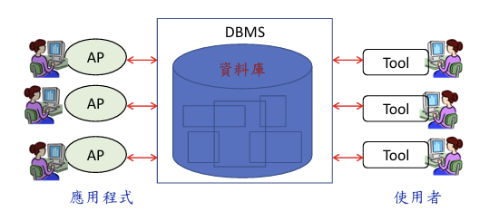
AP (Aplication Program):
- 傳送資料請求給DBMS
查詢會員資料、儲存訂單
- EX: 網站、APP 、公司系統
#應用程式不能直接碰資料庫，要透過DBMS才能呼叫資料
**使用者 → App → DBMS → 資料庫**
Tool:
- 管理資料庫系統
EX: phpMyAdmin、 MySQL Workbench
- 分析工具、查詢工具
#管理員可以直接透過工具操作資料庫(查詢、修改)
**管理員 → Tool → DBMS → 資料庫**
### 資料庫管理系統的功能
- 管理資料 (Management of Data)
1. 定義資料儲存的結構
2. 提供資料維護的機制
3. 確保資料的安全(系統當機，未經授權的存取，誤用，…)
4. 提供多人使用下的同時存取控制機制
- 資料庫管理系統的目標
1. 提供一個方便且有效率的使用環境讓使用者來存取及管理資料庫

### 資料庫管理系統伺服器 (DBMS Server)
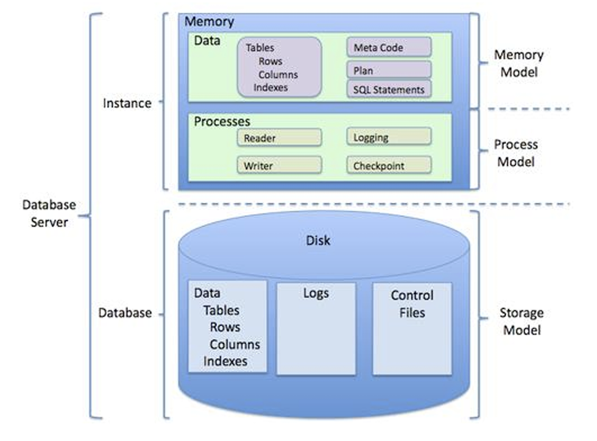
DataBase Server:
- Instance : 
Memory 暫存記憶體+執行中的程式=關機就不見
1. Memory Model
Data: 
1. Tables
2. Rows
3. Columns
4. Indexes ( 索引 )
Meta/ SQL:
Meta Code ( 結構資訊 )
Plan ( 查詢計畫 )
SQL Statements ( SQL語句 )
2. Process Model
1. Reader
2. Writer
3. Logging : 記錄所有操作
4. Checkpoint : 把資料同步到硬碟，可以防止資料遺失，加快復原速度。

- DataBase :
Disk上的資料，永久存在，關機也不會消失
1. Data
1. Tables
2. Rows
3. Columns
4. Indexes
2. logs : 紀錄所有的變更，如果系統當機，可以還原資料 ( Recovery ) 
3. Control Files : 紀錄資料庫結構資訊，例如:檔案的位置、資料庫的狀態。

資料執行流程:
SQL指令傳進DBMS，Memory解析Plan(解析SQL指令)，Reader讀取Disk裡的資料，再將資料放到Memory，最終回傳結果。
SQL → 解析 → 查Memory → 不夠讀Disk → 回傳

資料進到Memory先修改保存在這，同時寫入Log，Writer再寫入Disk，Checkpoint會執行同步紀錄。
<br>SQL → **先寫Log** → 改Memory → Writer寫Disk → Checkpoint同步<br><br>
### 資料庫系統的使用者
應用程式設計師(Application programmer)<br>透過DML與資料庫互動(做資料維護)<br>開發AP的人
<br>經驗豐富的使用者(Sophisticated users)<br>使用SQL來完成工作→ 使用者
<br>專業使用者(Specialized users)<br>撰寫不同於傳統資料處理方式的特殊資料庫應用程式→ 使用者
<br>一般(天真)使用者(Naive users)<br>使用他人寫好的應用程式與資料庫互動
<br>資料庫管理者(Database administrator, DBA)<br>管理資料庫系統的所有活動

## 關聯式資料庫管理系統 (RDBMS)
### 簡介
#### 由1970年Dr. E.F. Codd 提出的關聯式資料模型發展出來的資料庫管理系統
- 關聯式資料模型主要組成:
1. 物件或關聯的集合(Collection of objects or relations)
2. 關聯運算方法(Set of operators to act on the relations)
3. 資料整合條件(Data integrity for accuracy and consistency)
- 關聯式資料庫管理系統
1. 資料庫物件(Database Objects)
2. 資料運算(Data Operations)
3. 資料庫限制條件(Database Constraints)

#### 關聯式資料庫管理系統的功能
1. 儲存使用者的資料
2. 提供安全與穩定的存取系統
3. 提供多人線上同時存取
4. 提供權限來做資料庫的管理
5. 提供資料備份與回復的功能
6. 支援結構化查詢語言(Structured Query Language, SQL)

### 用語
#### Table
橫欄 column
每一個欄位都必須命名而且必須設定資料型態和資料長度，用來存放欄位資料
資料列 Row  
資料列是資料表中的一筆記錄資料
- Bit → Byte → Field → Record → File → Database<br>• **Bit → Byte → Column → Row → Table → Database**<br>
#### 整合
1. 主鍵( Primary Key ):
用於識別每一横列的欄位組合
1. 具有唯一性(Unique): 不能重複
2. 不為空值(Not Null)
2. 外來鍵( Foreign Key ):
用來連接「另一張表的主鍵」的欄位
1. 一定要對應到另一張表存在的值
2. 可以指向同一個PK
3. 可以為Null
3. column:直欄
4. Row: 橫列
5. Field: 直欄和橫列交錯的地方
6. Null
### 溝通流程:
Client（輸入SQL） → 傳送 → Server（解析＋查詢） → 回傳結果
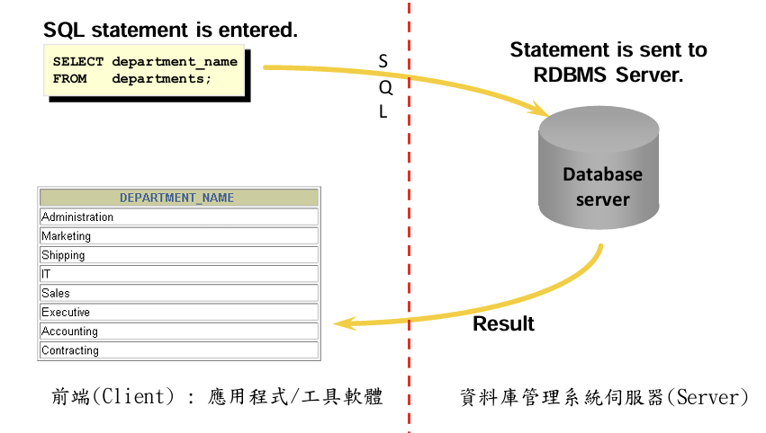
## SQL語言
### 簡介
IBM發明 → Oracle商用 → ANSI統一 → ISO全球 → SQL持續進化
#### IBM 發明（起源）
- 開發系統：**System R**
- 原本名稱：**SEQUEL**
- 1980 年改名為：**SQL**
📌 重點：
👉 SQL 一開始是「研究用語言」，讓人可以用類英文查資料
#### Oracle 商用（進入市場）
- 1979 年：Oracle 推出第一個商用 SQL 系統
📌 重點：
👉 SQL 從「研究」變成「實際企業在用」
👉 開始普及
#### ANSI 訂標準（統一規則）
- 1986 年：ANSI 制定 SQL 標準（SQL-86 / SQL-87）
📌 重點：
👉 不同公司有共同語法
👉 避免各做各的
#### ISO 全球化（國際認證）
- 1987 年：ISO 採用 SQL 標準
📌 重點：
👉 SQL 成為「國際標準語言」
👉 全世界都用同一套概念
#### SQL 持續升級（版本演進）
重要版本：
- SQL-89
- SQL-92（🔥最重要、考試常考）
- SQL-99
- SQL-2023（最新版）
📌 重點：
👉 功能越來越強（例如：更複雜查詢、物件導向等）
### 特性
1. SQL是高級的非程序的語言，它允許用戶在高層資料結構上工作。
2. 不需要使用者瞭解其具體的資料存放方式。
3. 不同底層結構的資料庫之間使用相同SQL語言作為資料的輸入與管理。
4. SQL語言可以寫出非常複雜的語句。
### 分類
#### DDL（資料定義語言Data Definition Language）
用來定義資料庫物件的指令: 用來「建立、修改、刪除」資料庫的架構（骨架）
因為是修改架構，所以不能Rollback
- `CREATE` 👉 建立
- `DROP` 👉 刪除整個物件
- `ALTER` 👉 修改結構
- `RENAME` 👉 改名字
- `TRUNCATE` 👉 清空資料（但保留表）
DML = 改 Excel 裡的內容（可以復原）
DDL = 把整個檔案刪掉（救不回來）
#### DML（資料操作語言Data Manipulation Language）
用來處理資料庫中的資料的指令，一般資料的新增、修改、刪除、查詢等運算。
可以Rollback
對資料做 CRUD（增刪改查）
- `INSERT` 👉 新增
- `UPDATE` 👉 修改
- `DELETE` 👉 刪除
- `SELECT` 👉 查詢（有些人另外分）
#### DCL（資料控制語言: Data Control Language）
用來控制管理資料庫的使用權限及相關安全設定的管控指令
- `GRANT` 👉 給權限
- `REVOKE` 👉 收回權限
#### TCL（交易控制語言Transaction Control Language）
管理資料庫中交易的指令
- `COMMIT` 👉 確認
- `ROLLBACK` 👉 回復
- `SAVEPOINT` 👉 設中繼點
常搭配 DML 使用，用來防止資料錯亂
多步驟操作＋不能出錯的情境 → 一定用 TCL
例如:
- 新增訂單
- 新增訂單明細
- 更新庫存
👉 這三個要一起成功，不然就一起失敗，避免資料錯亂，<br>保證 **資料一致性**。
#### DQL ( 資料查詢語言 Data Query Language )
查詢指令
- `SELECT`
<table header-row="true">
<tr>
<td>類型</td>
<td>用途</td>
<td>關鍵字</td>
</tr>
<tr>
<td>DDL</td>
<td>定義結構</td>
<td>CREATE, ALTER, DROP</td>
</tr>
<tr>
<td>DML</td>
<td>操作資料</td>
<td>INSERT, UPDATE, DELETE, SELECT</td>
</tr>
<tr>
<td>DCL</td>
<td>權限控制</td>
<td>GRANT, REVOKE</td>
</tr>
<tr>
<td>TCL</td>
<td>交易控制</td>
<td>COMMIT, ROLLBACK</td>
</tr>
<tr>
<td>DQL</td>
<td>查詢</td>
<td>SELECT</td>
</tr>
</table>
## MySQL
### 歷史
MySQL 是從開源專案起家，經過 Sun 和 Oracle 收購，變成現在主流的資料庫系統
#### 起源（開放原始碼）
- MySQL 是一種 **關聯式資料庫管理系統（RDBMS）**
- 由瑞典公司 **MySQL AB** 開發
📌 重點：<br>👉 一開始就是「開放原始碼」（免費、可修改）
#### 加入 GPL（2000年）
- 採用 **GNU GPL 授權**
📌 意思：<br>👉 可以免費使用、修改、分享<br>👉 很多人開始用 → 快速普及
#### 被 Sun 收購（2008年）
- **Sun Microsystems（昇陽）** 收購 MySQL AB
📌 重點：<br>👉 MySQL 開始變成大公司產品
#### 被 Oracle 收購（2009年）
- **Oracle（甲骨文）** 收購 Sun<br>👉 MySQL 變成 Oracle 旗下產品
📌 重點：<br>👉 現在 MySQL 是 Oracle 在維護
### 特色
1. 關聯式資料庫（RDBMS）
用「表（Table）」來存資料
2. 開放原始碼（Community Server）
免費、可修改
- 可以自由下載使用
- 有企業版（付費）但一般用免費版就夠
3. 速度快、可靠、易用
- ⚡ 速度快：查詢效率高
- 🔒 穩定可靠：很少當機
- 👍 好上手：語法簡單、資源多
4. 主從式架構（Client / Server）
Client 發送 → Server 處理 → 回傳結果
### Client（客戶端）
- 你 / App / 網站
- 負責送 SQL
### Server（伺服器）
- MySQL
- 負責處理資料

5. 有大量開發者參與
- 問題很好查（Google 幾乎都有答案）
- 工具很多（phpMyAdmin、Workbench）
- 持續更新
### 連接使用MySQL
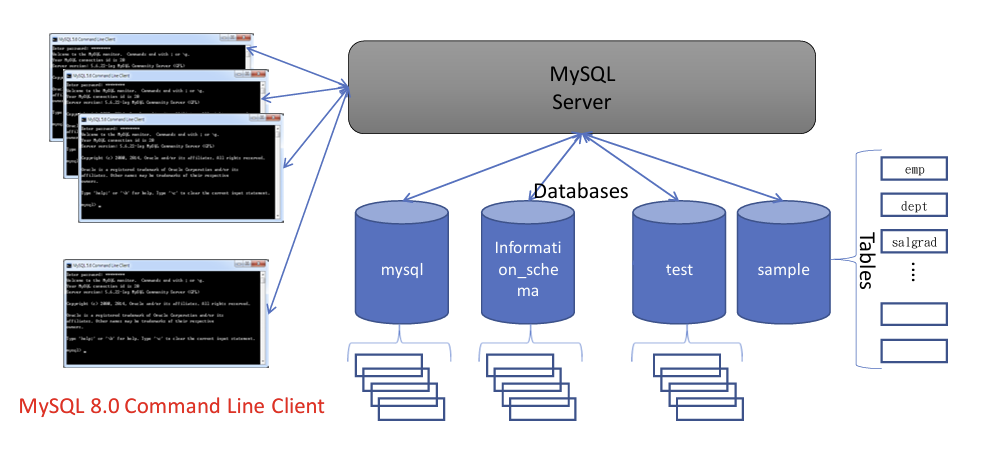
<table header-row="true">
<tr>
<td>元件</td>
<td>說明</td>
<td>圖中位置</td>
<td>重點</td>
</tr>
<tr>
<td>Client（客戶端）</td>
<td>使用者操作工具</td>
<td>左邊黑色視窗</td>
<td>輸入 SQL</td>
</tr>
<tr>
<td>MySQL Server</td>
<td>資料庫伺服器</td>
<td>中間大方塊</td>
<td>處理資料</td>
</tr>
<tr>
<td>Databases</td>
<td>多個資料庫</td>
<td>中間圓柱</td>
<td>裝不同資料</td>
</tr>
<tr>
<td>Tables</td>
<td>資料表</td>
<td>右邊 emp、dept</td>
<td>真正存資料</td>
</tr>
</table>
<table header-row="true">
<tr>
<td>類型</td>
<td>說明</td>
<td>例子</td>
<td>適合</td>
</tr>
<tr>
<td>GUI（圖形介面）</td>
<td>用滑鼠操作、有畫面</td>
<td>MySQL Workbench、phpMyAdmin</td>
<td>初學者</td>
</tr>
<tr>
<td>CLI（命令列）</td>
<td>用指令操作</td>
<td>`mysql -u root -p`</td>
<td>工程師</td>
</tr>
</table>
### 命令
1. SHOW DATABASES
列出目前伺服器現存的所有資料庫(databases)
```sql
show databases;
```
2. USE database
設定預設存取的資料庫(default database)

```sql
use sample;
```
3. CREATE DATABASE
建立一個新的資料庫
CREATE DATABASE \[IF NOT EXISTS\] databaseName; {color="gray_bg"}
```sql
CREATE DATABASE mydb;
```
4. SOURCE
執行一個SQL腳本文件(SCRIPTFILE): Script = 把很多 SQL 存成檔案，一次全部執行
SOURCE FileName; {color="gray_bg"}
```sql
SOURCE c:\mysql_demobld.sql;
```
5. SHOW TABLES
列出預設資料庫中所有資料表
```sql
SHOW TABLES;
```
6. DESC\[RIBE\] table
列出指定資料表的欄位資訊 查資料結構 describe
```sql
DESCRIBE dept;
```
7. SELECT
列出資料表資料
```sql
SELECT *
FROM dept;
```
## 資料型態
#### 資料型態介紹
<table header-row="true">
<colgroup>
<col width="83">
<col width="106">
<col>
<col>
<col>
</colgroup>
<tr>
<td>資料類型</td>
<td>資料型態</td>
<td>說明</td>
<td>格式 / 範圍</td>
<td>使用情境</td>
</tr>
<tr>
<td>文字資料</td>
<td>CHAR(n)</td>
<td>固定長度，不足補空白</td>
<td>n = 1 \~ 255</td>
<td>身分證、固定長度代碼</td>
</tr>
<tr>
<td>文字資料</td>
<td>VARCHAR(n)</td>
<td>可變長度，不補空白</td>
<td>n = 1 \~ 65535</td>
<td>姓名、地址（最常用🔥）</td>
</tr>
<tr>
<td>數值資料</td>
<td>INT</td>
<td>整數</td>
<td>約 -21億 \~ 21億</td>
<td>年齡、數量</td>
</tr>
<tr>
<td>數值資料</td>
<td>DECIMAL(p,s)</td>
<td>精確小數</td>
<td>p=總位數，s=小數位</td>
<td>金額（非常重要🔥）</td>
</tr>
<tr>
<td>數值資料</td>
<td>NUMERIC(p,s)</td>
<td>與 DECIMAL 類似</td>
<td>同上</td>
<td>金額（有些系統用）</td>
</tr>
<tr>
<td>日期資料</td>
<td>DATE</td>
<td>只有日期</td>
<td>YYYY-MM-DD</td>
<td>生日</td>
</tr>
<tr>
<td>日期資料</td>
<td>DATETIME</td>
<td>日期＋時間</td>
<td>YYYY-MM-DD HH:MM:SS</td>
<td>訂單時間、登入時間</td>
</tr>
</table>
#### SQL型態語法
<table header-row="true">
<tr>
<td>資料類型</td>
<td>寫法</td>
<td>範例</td>
<td>重點</td>
</tr>
<tr>
<td>字串（String）</td>
<td>用單引號 `' '` 或雙引號 `" "`</td>
<td>`'hello'`、`"你好"`</td>
<td>文字一定要加引號</td>
</tr>
<tr>
<td>整數（Integer）</td>
<td>直接寫數字</td>
<td>`123`、`1900`</td>
<td>不用引號</td>
</tr>
<tr>
<td>小數（Float / Decimal）</td>
<td>直接寫數字</td>
<td>`12.57`、`0.1234`</td>
<td>不用引號</td>
</tr>
<tr>
<td>日期（Date）</td>
<td>用字串格式</td>
<td>`'1998-02-04'`</td>
<td>建議用 `YYYY-MM-DD`</td>
</tr>
<tr>
<td>日期（其他格式）</td>
<td>也可接受</td>
<td>`'1998/02/04'`、`'19980204'`</td>
<td>但不建議（考試會寫標準格式）</td>
</tr>
<tr>
<td>日期時間（Datetime）</td>
<td>用字串格式</td>
<td>`'1998-02-04 13:30:00'`</td>
<td>日期 + 時間</td>
</tr>
</table>
```sql
字串
'name'   ✅
name     ❌（會當成欄位）

數字
123      ✅
'123'    ⚠️（變字串）

日期(像字串)
'2024-01-01'   ✅
```
### SELECT語法
SELECT \*\|\{\[DISTINCT\] column\|expression \[alias\],...\}<br>FROM table;
#### 查詢資料表中的所有欄位
SELECT \*<br>FROM TableName;
```sql
SELECT * 
FROM dept;
```
#### 查詢指定欄位
SELECT column,...<br>FROM   TableName;
```sql
SELECT empno, ename, sal
FROM emp;
```

#### 顯示資料表結構(Table Structure)
DESC\[RIBE\] tablename
```sql
DESCRIBE dept;
```
#### 欄位表頭(Column Heading)
column 大寫:則以大寫表示
```sql
SELECT NAME FROM student;
```
column 小寫:則以小寫表示
```sql
SELECT name FROM student;
```
`*` → 依資料表原本設定（DESC）
用來：
- 看資料表長怎樣
- 確認欄位名稱
- 確認資料型態
```sql
SELECT * FROM student;

DESC student;
```
查詢範例: 
```sql
SELECT deptno, DNAME
FROM dept;
```
### 算術運算式(Arithmetic Expressions)
#### 運算元（operand）:
被拿來運算的東西
<table header-row="true">
<tr>
<td>類型</td>
<td>例子</td>
</tr>
<tr>
<td>常數</td>
<td>5、3、100</td>
</tr>
<tr>
<td>欄位</td>
<td>salary、age</td>
</tr>
<tr>
<td>運算式</td>
<td>(5 + 3)</td>
</tr>
<tr>
<td>函數</td>
<td>ROUND(...)</td>
</tr>
<tr>
<td>變數</td>
<td>@x</td>
</tr>
</table>

#### 運算子（operator）:
**優先順序(Operator Precedence)**: <br>跟四則運算一樣
**使用括號(Using Parentheses)改變運算順序**
<table header-row="true">
<tr>
<td>運算</td>
<td>符號</td>
<td>範例</td>
<td>結果</td>
</tr>
<tr>
<td>加法</td>
<td>+</td>
<td>5 + 3</td>
<td>8</td>
</tr>
<tr>
<td>減法</td>
<td>-</td>
<td>5 - 3</td>
<td>2</td>
</tr>
<tr>
<td>乘法</td>
<td>\*</td>
<td>5 \* 3</td>
<td>15</td>
</tr>
<tr>
<td>除法</td>
<td>/</td>
<td>6 / 3</td>
<td>2</td>
</tr>
</table>
```sql
SELECT ename, sal, 12*sal+100
FROM   emp;

SELECT ename, sal, 12*(sal+100)
FROM   emp;
```
### 欄位別名(Column Alias)
一般欄位或是運算試欄位可以更改別名，只會更改顯示名稱，不會影響資料庫原本的命名。
語法:<br>Column \| expression \[AS\] alias
1. 特殊字或空白使用" "刮住
2. 可以用 AS 或是一個空格
```sql
# 把 empno 改成 編號，ename 改成 Name, sal 改成 SALARY，sal*12之後 改成 Ann Sal
 SELECT empno "編號", ename Name, sal AS SALARY, sal*12 "Ann Sal"
 FROM emp;
 
 
```
### 空值(Null Value)
- NULL值是在新增資料時沒有設定欄位值，資料庫管理系統便設定該欄位的內容為NULL<br>1. 無法使用<br>2. 無法指派<br>3. 無法運算<br>4. 與０和空白不相同
- 所有型態皆可以為空值
- 運算式中若含有Null Value時，其結果為NULL
```sql
SELECT empno, ename, sal, comm, sal+comm
FROM emp;
```
### 字串連結(Concatenation)
把多個值「接在一起」變成一個字串
函數: CONCAT(expr1,expr2,…)
- expr 可以是任何資料型態
`expr` 可以是：
- 字串
- 數字
- 欄位
- 函數結果
最終都會轉換成字串
```sql
SELECT CONCAT(deptno,dname) Department
FROM dept;

SELECT CONCAT('Hello', ' ', 'World');

SELECT CONCAT(first_name, ' ', last_name)
FROM employee;

SELECT CONCAT('年齡：', 25);
FROM employee;

SELECT CONCAT('ID:', id, ' Name:', name)
FROM student;
```
如果資料裡面有Null值，整筆資料就會顯示NULL
```sql
SELECT CONCAT('Hello', NULL);

結果:
NULL

如果資料庫裡面 last_name的值為null
SELECT CONCAT(first_name, ' ', last_name)
FROM student;

結果:
NULL

```

### 常值(Literal)
你直接寫死在 SQL 裡的值，不會改變。
<table header-row="true">
<tr>
<td>類型</td>
<td>範例</td>
<td>說明</td>
</tr>
<tr>
<td>字串常值</td>
<td>`'Hello'`、`'小明'`</td>
<td>要用引號</td>
</tr>
<tr>
<td>數值常值</td>
<td>`100`、`3.14`</td>
<td>不用引號</td>
</tr>
<tr>
<td>日期常值</td>
<td>`'2024-01-01'`</td>
<td>用字串表示</td>
</tr>
<tr>
<td>NULL</td>
<td>`NULL`</td>
<td>表示沒有值</td>
</tr>
</table>
```sql
SELECT CONCAT(ename,' job is ', job) Jobs
FROM emp;
```
### 重複資料列(duplicate rows)
語法:
SELECT <span color="yellow_bg">***DISTINCT***</span><span color="yellow_bg"> </span>\<br>FROM \<table or view\>

\
```sql
SELECT DISTINCT job
FROM emp;
```
DISTINCT 後若出現多欄位，則表示要多欄位組合後其值不重複。
→組合後，不重複。
SELECT DISTINCT deptno, job-\> FROM emp;
```sql
SELECT DISTINCT deptno, job
FROM emp;
```
### 查詢結果傳回的資料筆數
SELECT \[DISTINCT\] \<br>FROM \<table or view\><br>LIMIT \[offset,\] count;

\
```sql
SELECT [DISTINCT] 欄位
FROM 表
LIMIT [offset,] count;
```
<table header-row="true">
<tr>
<td>參數</td>
<td>說明</td>
<td>重點</td>
</tr>
<tr>
<td>DISTINCT</td>
<td>去除重複資料</td>
<td>可加可不加</td>
</tr>
<tr>
<td>offset</td>
<td>略過前幾筆（從X開始），起始位置為0</td>
<td>= 略過幾筆</td>
</tr>
<tr>
<td>count</td>
<td>最多取幾筆</td>
<td>限制筆數</td>
</tr>
<tr>
<td>limit</td>
<td>從第一筆開始，取幾筆。</td>
<td>限制筆數</td>
</tr>
<tr>
<td>order ny</td>
<td>資料排序</td>
<td></td>
</tr>
</table>
LIMIT : 要回傳幾筆資料
```sql
# 回傳5筆資料
SELECT ename, sal, job
FROM emp-> LIMIT 5
```
offset : 略過幾筆資料
```sql
# 略過3筆資料後，回傳5筆
# 從第4筆資料開始回傳，4 5 6 7 8

SELECT ename, sal, job
FROM emp-> LIMIT 3,5;
```

### 條件查詢
#### SELECT 敘述總整理表
<table header-row="true">
<tr>
<td>子句（Clause）</td>
<td>運算式（Expression）</td>
<td>中文用途</td>
</tr>
<tr>
<td>SELECT</td>
<td>`<select list>`</td>
<td>指定要顯示的欄位</td>
</tr>
<tr>
<td>FROM</td>
<td>`<table source>`</td>
<td>指定資料來源（哪張表）</td>
</tr>
<tr>
<td>WHERE</td>
<td>`<search condition>`</td>
<td>篩選資料（列）</td>
</tr>
<tr>
<td>GROUP BY</td>
<td>`<group by list>`</td>
<td>將資料分組</td>
</tr>
<tr>
<td>HAVING</td>
<td>`<search condition>`</td>
<td>篩選分組後的結果</td>
</tr>
<tr>
<td>ORDER BY</td>
<td>`<order by list>`</td>
<td>排序結果</td>
</tr>
</table>
#### WHERE → 限制查詢
語法:<br>SELECT column,...<br>FROM table<br>WHERE conditions;
- 條件子句(Conditions):
- 邏輯值:真(TRUE)、假(FALSE)、空值(NULL)
- 比較運算式/邏輯運算式/SQL特定運算式
- 運算元可以是欄位、運算式、函數、常數
```sql
SELECT empno, ename, job, deptno
FROM emp;
WHERE deptno=10;
```

### 比較運算子(Comparison Operators)
比較運算子使用在二個資料項的比較大小
可以比較:
- 數值資料: 值
- 字串資料: 內碼(預設值)
- 日期時間資料:世紀、年、月、日、時、分、秒
- 昨天\< 今天\< 明天
<table header-row="true">
<tr>
<td>運算子</td>
<td>意思</td>
<td>範例</td>
</tr>
<tr>
<td>=</td>
<td>等於</td>
<td>age = 20</td>
</tr>
<tr>
<td>\></td>
<td>大於</td>
<td>salary \> 30000</td>
</tr>
<tr>
<td>\<</td>
<td>小於</td>
<td>age \< 18</td>
</tr>
<tr>
<td>\>=</td>
<td>大於等於</td>
<td>age \>= 20</td>
</tr>
<tr>
<td>\<=</td>
<td>小於等於</td>
<td>age \<= 30</td>
</tr>
<tr>
<td>\<\> 或 !=</td>
<td>不等於</td>
<td>age \<\> 20</td>
</tr>
</table>
```sql
 
#數值資料: 列出薪水大於等於3000的員工
 SELECT empno, ename, job, sal
 FROM emp
 WHERE sal >= 3000;
 
#日期資料:  2011-12-03 進公司的員工
 SELECT empno,ename,job,deptno, hiredate
 FROM emp
 WHERE hiredate = '2011-12-03';

#字串資料:列出KING的資料
 SELECT empno, ename, job, deptno, hiredate
 FROM emp
 WHERE ename = 'KING'
 
#相同資料型態的欄位資料
 SELECT ename, sal, comm
 FROM   emp
 WHERE  sal<=comm;
```
### 邏輯運算子(Logical Operators)
若有一個以上的條件運算必須使用邏輯運算子結合成一個運算結果
<table header-row="true">
<tr>
<td>運算子</td>
<td>意思</td>
<td>範例</td>
</tr>
<tr>
<td>AND</td>
<td>且</td>
<td>age \> 20 AND salary \> 30000</td>
</tr>
<tr>
<td>OR</td>
<td>或</td>
<td>age \< 18 OR age \> 60</td>
</tr>
<tr>
<td>NOT</td>
<td>反向</td>
<td>NOT age = 20</td>
</tr>
</table>
```sql
#AND 必須二個運算元都是真(TRUE)才會符合查詢條件
 SELECT empno, ename, job, sal
 FROM   emp
 WHERE  sal>=1100 AND job='CLERK';
 
#列出薪水>2000且職務為manager的員工
 SELECT empno, ename, job, sal, mgr
 FROM emp
 WHERE sal > 2000 AND job = 'MANAGER';
 
#OR只要任一個運算元是真(TRUE)就符合查詢條件
 SELECT empno, ename, job, sal
 FROM   emp
 WHERE  sal>=1100 OR job='CLERK';
 
#列出薪水>2000或職務為manager的員工
 SELECT empno, ename, job, sal, mgr
 FROM emp
 WHERE sal > 2000 OR job = 'MANAGER';
 
#NOT反向運算，只有一個運算元
 SELECT empno, ename, job, sal, mgr
 FROM emp
 WHERE NOT(sal > 2000 OR job = 'MANAGER');
 
 
 
 
```

### SQL特定運算子
<table header-row="true">
<tr>
<td>類別</td>
<td>說明</td>
<td>範例</td>
</tr>
<tr>
<td>BETWEEN</td>
<td>查詢某個連續範圍內的資料</td>
<td>SELECT \* FROM table WHERE age BETWEEN 18 AND 30</td>
</tr>
<tr>
<td>IN</td>
<td>查詢符合多個指定值的資料</td>
<td>SELECT \* FROM table WHERE city IN ('Taipei', 'Taichung')</td>
</tr>
<tr>
<td>LIKE</td>
<td>使用萬用字元進行模糊查詢</td>
<td>SELECT \* FROM table WHERE name LIKE 'A%'</td>
</tr>
<tr>
<td>IS NULL</td>
<td>查詢欄位為空值的資料</td>
<td>SELECT \* FROM table WHERE address IS NULL</td>
</tr>
</table>
#### BETWEEN
- 連續區間的條件判斷
expr BETWEEN x1 AND x2
- 可使用在數值、日期及字元資料
```sql
SELECT empno, ename, job, sal
FROM emp
WHERE sal BETWEEN 2000 AND 3500;
```
#### IN
- 列舉值的查詢
expr IN(value1, value2,...)
1. expr 在value 所成的串列中
2. expr 和value list 的資料型態要相同
- 可使用在數值、日期及字元資料
1. WHERE  sal IN (100, 200, 300)
2. WHERE  code IN ('A','B','C')
3. WHERE   hiredate IN ('2011-05-01','2011-10-03')
```sql
SELECT empno, ename, job, sal
FROM emp
WHERE job IN ('SALESMAN','MANAGER');
```
#### LIKE
- 模糊比對–萬用字元查詢
expr LIKE 'pattern' ESCAPE 'character’
- pattern
1. %(百分比符號):替代任意字元
2. _(底線符號) :替代一個字元
- ESCAPE 'character’
1. 定義跳脫字元:Example : ESCAPE '&’
2. &%(要比對的就是百分比符號'%‘)
3. &*(要比對的就是底線符號'*‘)
```sql
 
 -- 找名字為A開頭的員工
 SELECT empno, ename, job, sal
 FROM emp
 WHERE ename LIKE 'A%';
 
 -- 找名字為N結尾的員工
 SELECT empno, ename, job, sal
 FROM emp
 WHERE ename LIKE '%N';
 
 
 -- 找名字有T中的員工
  SELECT empno, ename, job, sal
 FROM emp
 WHERE ename LIKE '%T%'; 

-- 找姓名中第二個字為A的員工
 SELECT empno, ename, job, sal
 FROM emp
 WHERE ename LIKE '_A%';

--ESCAPE跳脫他原本的意義 %替代字元-> %百分比符號
 SELECT *
 FROM liquorS
 WHERE content LIKE '%3&%%' ESCAPE '&';
 
```
#### IS NULL
- 空值運算子(判斷資料是否為NULL)
expr IS NULL
1. NULL專用的運算子
2. (NULL = NULL) →NULL
3. NULL與空白和0不相同
4. 任何型態欄位皆可以為NULLvalue
```sql
SELECT empno, ename, job, sal, mgr
FROM emp
WHERE mgr IS NULL;
```
### 查詢結果排序
#### order by
資料排序→ 放置於SELECT敍述的最後一行
SELECT column,...<br>FROM table<br>\[WHERE conditions\]<br>ORDER BY \{column\|alias\|expression\|position \[ASC\|DESC\],...\};
排序方式
- ASC: 升冪Ascending 由小到大\[預設\]
- DESC: 降冪Descending 由大到小
- 若有空值時，升冪在最前面，降冪在最下面
- 欄位/別名/運算式/位置
```sql
#升冪排列 由小至大
SELECT empno, ename, sal
FROM emp
WHERE deptno = 10
ORDER BY sal;

#降冪排列 由大至小
SELECT empno, ename, sal
FROM emp
WHERE deptno = 10
ORDER BY sal DESC;

#別名也可以做排序
SELECT empno, ename, sal*12 annsal
FROM emp
WHERE deptno = 10
ORDER BY annsal;

#使用運算式排序
SELECT empno, ename, sal+comm bonus
FROM emp
WHERE deptno = 30
ORDER BY sal+comm;

#依資料項在list中的位置順序
SELECT empno, ename, sal
FROM emp
WHERE deptno = 10
ORDER BY 3;

#多個資料項排序
 SELECT *
 FROM emp
 ORDER BY deptno, job, 6 DESC, 1;

#用LIMIT薪資最高前五名
SELECT ename, sal, job
FROM emp
ORDER BY sal DESC
LIMIT 5;

#薪資最低前五名
SELECT ename, sal, job
FROM emp
ORDER BY sal 
LIMIT 5;
```
#### 列舉式CASE(Simple CASE)
1. 與一串列舉的值做比較
2. 傳回第一個(值相等)的回傳值
3. 若都不相等則傳回ELSE的回傳值，若無給定ELSE則傳回NULL值
```sql
SELECT empno, ename, sal, job,     
CASE job
WHEN 'PRESIDENT' THEN sal*1.5
WHEN 'MANAGER' THEN sal*1.3
WHEN 'ANALYST' THEN sal*1.2
ELSE sal
END NewSal
FROM emp;
```
#### 條件式CASE(Searched CASE)
1. 與一串列舉的條件做比較
2. 傳回第一個(條件運算結果=真)的回傳值
3. 若都不符合則傳回ELSE的回傳值，若無給定ELSE則傳回NULL值
```sql
SELECT empno, ename, sal,        
CASE -- 條件式 如果符合## 就做 ##
WHEN sal BETWEEN 0    AND 1000 THEN 'A'
WHEN sal BETWEEN 1001 AND 2000 THEN 'B'
WHEN sal BETWEEN 2001 AND 3000 THEN 'C'
WHEN sal BETWEEN 3001 AND 4000 THEN 'D'
ELSE 'E'
END Level  -- 設定新欄位的別名
FROM emp;
```

### MySQL資料型態
#### 字串
65535以下→VARCHAR(N)<br>超過→MEDIUMTEXT、LONGTEXT
CHAR<br>固定長度，速度快但浪費空間
VARCHAR<br>最常用，節省空間
BLOB<br>用來存圖片、檔案（二進位）
TEXT<br>用來存文章、描述
ENUM<br>用在固定選項，例如性別、狀態
<table header-row="true">
<tr>
<td>類型</td>
<td>儲存方式</td>
<td>儲存大小</td>
<td>範圍</td>
<td>其他特性</td>
</tr>
<tr>
<td>CHAR(N)</td>
<td>固定長度，不足補空白，顯示會去掉尾端空白</td>
<td>固定為 N 字元</td>
<td>1 到 255</td>
<td>適合長度固定資料</td>
</tr>
<tr>
<td><span color="yellow_bg">**VARCHAR(N)**</span>**<br>最常使用**</td>
<td>可變長度，尾端空白保留</td>
<td>實際長度加 1 或 2 byte</td>
<td>1 到 65535</td>
<td>最常用字串型態</td>
</tr>
<tr>
<td>TINYBLOB</td>
<td>Binary → 0 、 1</td>
<td>L 加 1 byte</td>
<td>L 小於 2 的 8 次方</td>
<td>儲存二進位資料</td>
</tr>
<tr>
<td>BLOB</td>
<td>Binary</td>
<td>L 加 2 bytes</td>
<td>L 小於 2 的 16 次方</td>
<td><span color="yellow_bg">**可存圖片、影像或音樂檔案等**</span></td>
</tr>
<tr>
<td>MEDIUMBLOB</td>
<td>Binary</td>
<td>L 加 3 bytes</td>
<td>L 小於 2 的 24 次方</td>
<td>中型二進位資料</td>
</tr>
<tr>
<td>LONGBLOB</td>
<td>Binary</td>
<td>L 加 4 bytes</td>
<td>L 小於 2 的 32 次方</td>
<td>超大二進位資料</td>
</tr>
<tr>
<td>TINYTEXT</td>
<td>文字</td>
<td>L 加 1 byte</td>
<td>L 小於 2 的 8 次方</td>
<td>不分大小寫</td>
</tr>
<tr>
<td>TEXT</td>
<td>文字</td>
<td>L 加 2 bytes</td>
<td>L 小於 2 的 16 次方</td>
<td>常用長文字</td>
</tr>
<tr>
<td>MEDIUMTEXT</td>
<td>文字</td>
<td>L 加 3 bytes</td>
<td>L 小於 2 的 24 次方</td>
<td>中長文字</td>
</tr>
<tr>
<td>LONGTEXT</td>
<td>文字</td>
<td>L 加 4 bytes</td>
<td>L 小於 2 的 32 次方</td>
<td>超長文字</td>
</tr>
<tr>
<td>ENUM</td>
<td>以整數儲存對應選項</td>
<td>1 或 2 bytes</td>
<td>最多 65535 個選項</td>
<td>適合固定選項，列舉型態</td>
</tr>
</table>
#### 數值
### 整數
Bytes（位元組）<br>代表佔用的空間大小<br>越大 → 可以存越大的數字
Signed<br>表示可以存「正數 + 負數」
如果是 Unsigned（無號）<br>👉 只能存正數<br>👉 最大值會變更大
- Signed 👉 可存負數
- Unsigned 👉 只能存正數
- Unsigned 👉 最大值變 2 倍
MySQL 的 BOOLEAN / BOOL 其實就是 TINYINT(1)，用 0 和 1 來表示 False 和 True。
<table header-row="true">
<tr>
<td>型態</td>
<td>Bytes</td>
<td>Signed 範圍</td>
<td>Unsigned 範圍</td>
</tr>
<tr>
<td>TINYINT</td>
<td>1</td>
<td>-128 \~ 127</td>
<td>0 \~ 255</td>
</tr>
<tr>
<td>SMALLINT</td>
<td>2</td>
<td>-32768 \~ 32767</td>
<td>0 \~ 65535</td>
</tr>
<tr>
<td>MEDIUMINT</td>
<td>3</td>
<td>-8388608 \~ 8388607</td>
<td>0 \~ 16777215</td>
</tr>
<tr>
<td>INT</td>
<td>4</td>
<td>-2147483648 \~ 2147483647</td>
<td>0 \~ 4294967295</td>
</tr>
<tr>
<td>BIGINT</td>
<td>8</td>
<td>-9223372036854775808 \~ 9223372036854775807</td>
<td>0 \~ 18446744073709551615</td>
</tr>
</table>
### 數值資料(Numeric Types)
精準實數
<table header-row="true">
<tr>
<td>類型</td>
<td>型態</td>
<td>特性</td>
<td>說明</td>
<td>範例</td>
</tr>
<tr>
<td>精準實數</td>
<td>DECIMAL(M,D)</td>
<td>高精準</td>
<td>用字串儲存，不會有誤差</td>
<td>DECIMAL(5,2)</td>
</tr>
<tr>
<td>精準實數</td>
<td>NUMERIC(M,D)</td>
<td>高精準</td>
<td>與 DECIMAL 完全相同</td>
<td>NUMERIC(5,2)</td>
</tr>
<tr>
<td>浮點數</td>
<td>FLOAT(p)</td>
<td>近似值</td>
<td>有誤差（速度快）</td>
<td>FLOAT</td>
</tr>
<tr>
<td>浮點數</td>
<td>DOUBLE(M,D)</td>
<td>近似值</td>
<td>精度比 FLOAT 高</td>
<td>DOUBLE</td>
</tr>
</table>
非精準實數
<table header-row="true">
<tr>
<td>類型</td>
<td>型態</td>
<td>Bytes</td>
<td>精確度</td>
<td>範圍</td>
<td>說明</td>
</tr>
<tr>
<td>單精確數</td>
<td>FLOAT(p)</td>
<td>4</td>
<td>p=0\~24</td>
<td>±3.40E+38</td>
<td>精度較低，速度快</td>
</tr>
<tr>
<td>雙精確數</td>
<td>DOUBLE(M,D)</td>
<td>8</td>
<td>p=25\~53</td>
<td>±1.79E+308</td>
<td>精度較高</td>
</tr>
</table>
#### 日期/時間資料(Date and Time Types)
<table header-row="true">
<tr>
<td>型態</td>
<td>格式</td>
<td>範圍</td>
<td>說明</td>
</tr>
<tr>
<td>DATE</td>
<td>YYYY-MM-DD</td>
<td>1000-01-01 \~ 9999-12-31</td>
<td>只存日期</td>
</tr>
<tr>
<td>DATETIME</td>
<td>YYYY-MM-DD HH:MM:SS</td>
<td>1000-01-01 00:00:00 \~ 9999-12-31 23:59:59</td>
<td>日期＋時間</td>
</tr>
<tr>
<td>TIMESTAMP</td>
<td>YYYY-MM-DD HH:MM:SS</td>
<td>1970-01-01 \~ 2038-01-19</td>
<td>日期＋時間（受時區影響）</td>
</tr>
<tr>
<td>TIME</td>
<td>HH:MM:SS</td>
<td>-838:59:59 \~ 838:59:59</td>
<td>只存時間</td>
</tr>
<tr>
<td>YEAR</td>
<td>YYYY</td>
<td>1901 \~ 2155</td>
<td>只存年份</td>
</tr>
</table>

<table header-row="true">
<tr>
<td>輸入格式</td>
<td>範例</td>
<td>轉換結果</td>
</tr>
<tr>
<td>YYYY-MM-DD HH:MM:SS</td>
<td>'1998-12-31 11:30:45'</td>
<td>1998-12-31 11:30:45</td>
</tr>
<tr>
<td>YY-MM-DD HH:MM:SS</td>
<td>'98-12-31 11:30:45'</td>
<td>1998-12-31 11:30:45</td>
</tr>
<tr>
<td>YYYY-MM-DD</td>
<td>'1998-12-31'</td>
<td>1998-12-31 00:00:00</td>
</tr>
<tr>
<td>YY-MM-DD</td>
<td>'98-12-31'</td>
<td>1998-12-31 00:00:00</td>
</tr>
<tr>
<td>YYYYMMDDHHMMSS</td>
<td>'19970523091528'</td>
<td>1997-05-23 09:15:28</td>
</tr>
<tr>
<td>YYMMDDHHMMSS</td>
<td>'970523091528'</td>
<td>1997-05-23 09:15:28</td>
</tr>
<tr>
<td>YYYYMMDD</td>
<td>'19981231'</td>
<td>1998-12-31 00:00:00</td>
</tr>
<tr>
<td>YYMMDD</td>
<td>'981231'</td>
<td>1998-12-31 00:00:00</td>
</tr>
<tr>
<td>數字格式（無引號）</td>
<td>19830905132800</td>
<td>1983-09-05 13:28:00</td>
</tr>
<tr>
<td>數字短格式</td>
<td>830905132800</td>
<td>1983-09-05 13:28:00</td>
</tr>
<tr>
<td>日期數字</td>
<td>19830905</td>
<td>1983-09-05 00:00:00</td>
</tr>
<tr>
<td>短日期數字</td>
<td>830905</td>
<td>1983-09-05 00:00:00</td>
</tr>
</table>
DATETIME(fsp)
👉 fsp = 小數秒位數（0\~6）
👉 預設是 0（沒有小數秒）
<table header-row="true">
<tr>
<td>fsp（小數秒位數）</td>
<td>儲存額外空間（Bytes）</td>
</tr>
<tr>
<td>0</td>
<td>0</td>
</tr>
<tr>
<td>1 \~ 2</td>
<td>1</td>
</tr>
<tr>
<td>3 \~ 4</td>
<td>2</td>
</tr>
<tr>
<td>5 \~ 6</td>
<td>3</td>
</tr>
</table>
👉 TIME、TIMESTAMP 也可以加 fsp
<table header-row="true">
<tr>
<td>比較</td>
<td>DATETIME</td>
<td>TIMESTAMP</td>
</tr>
<tr>
<td>時區影響</td>
<td>❌ 不會變</td>
<td>✅ 會轉換</td>
</tr>
<tr>
<td>儲存方式</td>
<td>原樣儲存</td>
<td>轉成 UTC</td>
</tr>
<tr>
<td>讀取時</td>
<td>原樣輸出</td>
<td>轉回當地時間</td>
</tr>
</table>
DATETIME<br>👉 你存什麼就拿到什麼
TIMESTAMP<br>👉 會幫你「轉時區」

## MySQL函數
### SQL函數(SQL Functions)
<table header-row="true">
<tr>
<td>類別</td>
<td>說明</td>
<td>範例</td>
</tr>
<tr>
<td>執行計算</td>
<td>對資料做數學運算</td>
<td>SELECT price \* quantity FROM table</td>
</tr>
<tr>
<td>修改資料</td>
<td>改變單一欄位的值</td>
<td>SELECT UPPER(name) FROM table</td>
</tr>
<tr>
<td>格式化輸出</td>
<td>將日期或數字轉成特定格式</td>
<td>SELECT DATE_FORMAT(date, '%Y-%m-%d')</td>
</tr>
<tr>
<td>型態轉換</td>
<td>將資料轉換成其他型態</td>
<td>SELECT CAST(price AS CHAR)</td>
</tr>
<tr>
<td>群組彙總</td>
<td>對多筆資料做統計</td>
<td>SELECT AVG(price), SUM(price) FROM table</td>
</tr>
</table>
### 函數(Functions)
強化資料處理與運算的能力<br>可接受使用者輸入參數並回傳結果
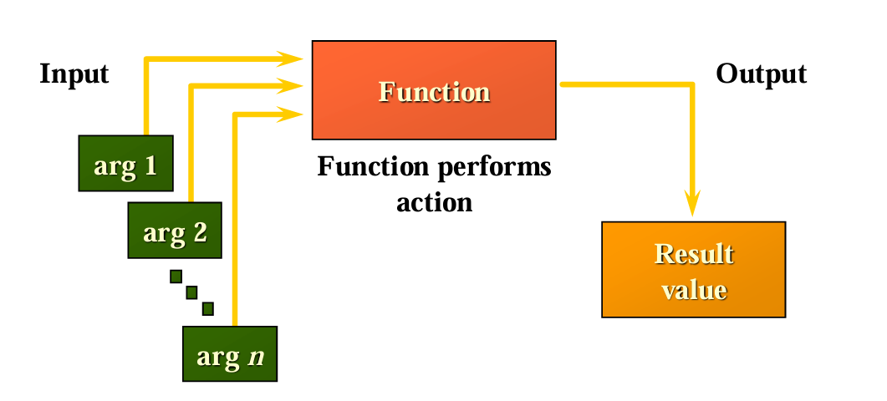
<table header-row="true">
<tr>
<td>部分</td>
<td>名稱</td>
<td>說明</td>
<td>對應概念</td>
<td>範例</td>
</tr>
<tr>
<td>Input</td>
<td>輸入</td>
<td>傳入函式的資料</td>
<td>參數 arguments</td>
<td>3, 5</td>
</tr>
<tr>
<td>Function</td>
<td>函式</td>
<td>對輸入資料進行處理或運算</td>
<td>程式邏輯</td>
<td>a + b</td>
</tr>
<tr>
<td>Output</td>
<td>輸出</td>
<td>函式執行後產生的結果</td>
<td>回傳值 return value</td>
<td>8</td>
</tr>
<tr>
<td>arg1 \~ arg n</td>
<td>多個輸入</td>
<td>可以傳入多個參數</td>
<td>多參數</td>
<td>add(3, 5, 7)</td>
</tr>
</table>
### SQL函數的類別
<table header-row="true">
<tr>
<td>類別</td>
<td>中文名稱</td>
<td>處理對象</td>
<td>回傳結果</td>
<td>範例</td>
</tr>
<tr>
<td>Single-row functions</td>
<td>單一資料列函數</td>
<td>一次處理一筆資料</td>
<td>每筆都有一個結果</td>
<td>UPPER(name)</td>
</tr>
<tr>
<td>Multiple-row functions</td>
<td>多重資料列函數</td>
<td>一次處理多筆資料</td>
<td>只回傳一個結果</td>
<td>AVG(price)</td>
</tr>
</table>
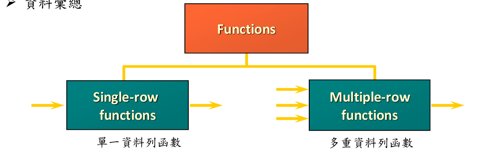
### 單一資料列函數(Single-Row Functions)
每筆記錄(row)執行一次，傳回一個結果
<table header-row="true">
<tr>
<td>類別</td>
<td>說明</td>
<td>範例</td>
</tr>
<tr>
<td>基本用途</td>
<td>用來處理單一資料項的運算</td>
<td>UPPER(name)</td>
</tr>
<tr>
<td>參數數量</td>
<td>可接受一個或多個參數</td>
<td>ROUND(price, 2)</td>
</tr>
<tr>
<td>執行方式</td>
<td>每一筆資料都會執行一次</td>
<td>每列 name 都轉大寫</td>
</tr>
<tr>
<td>回傳結果</td>
<td>每筆資料回傳一個結果</td>
<td>每列都有結果</td>
</tr>
<tr>
<td>語法格式</td>
<td>function_name(參數)</td>
<td>UPPER(name)</td>
</tr>
</table>
參數資料總類
 欄位名稱(Column name )<br> 運算式(Expression)<br> 常值(User-supplied constant)<br> 變數值(Variable value)<br> 函數(Function)
<table header-row="true">
<tr>
<td>類別</td>
<td>說明</td>
<td>範例</td>
</tr>
<tr>
<td>欄位名稱</td>
<td>使用資料表中的欄位</td>
<td>name</td>
</tr>
<tr>
<td>運算式</td>
<td>對資料做運算</td>
<td>price \* 2</td>
</tr>
<tr>
<td>常值</td>
<td>固定數值或字串</td>
<td>100 或 'A'</td>
</tr>
<tr>
<td>變數值</td>
<td>程式中的變數</td>
<td>@price</td>
</tr>
<tr>
<td>函數</td>
<td>函數可以當參數使用</td>
<td>ROUND(AVG(price), 2)</td>
</tr>
</table>
<table header-row="true">
<tr>
<td>類別</td>
<td>說明</td>
<td>範例</td>
</tr>
<tr>
<td>字串函數(String functions)</td>
<td>處理文字資料，輸入字串，回傳字串或數值</td>
<td>UPPER(name)、LENGTH(name)</td>
</tr>
<tr>
<td>數值函數(Numeric functions)</td>
<td>處理數字資料，回傳數值</td>
<td>ROUND(price, 2)、ABS(-10)</td>
</tr>
<tr>
<td>日期/時間函數(Date and Time functions)</td>
<td>處理日期與時間資料</td>
<td>NOW()、DATE_FORMAT(date, '%Y-%m-%d')</td>
</tr>
<tr>
<td>資料型態轉換函數(Conversion functions)</td>
<td>將資料轉成不同型態</td>
<td>CAST(price AS CHAR)</td>
</tr>
<tr>
<td>通用函數(General functions)</td>
<td>流程控制或取得系統資訊</td>
<td>IF(score \> 60, 'Pass', 'Fail')</td>
</tr>
</table>

### 字串函數(String functions)
<table header-row="true">
<tr>
<td>函數</td>
<td>功能</td>
<td>範例</td>
<td>回傳結果</td>
</tr>
<tr>
<td>LENGTH(str)</td>
<td>字串長度（位元組）</td>
<td>LENGTH('測試')</td>
<td>6</td>
</tr>
<tr>
<td>CHAR_LENGTH(str)</td>
<td>字元個數</td>
<td>CHAR_LENGTH('測試')</td>
<td>2</td>
</tr>
<tr>
<td>LCASE(str) / LOWER(str)</td>
<td>轉小寫</td>
<td>LOWER('ABC')</td>
<td>'abc'</td>
</tr>
<tr>
<td>UCASE(str) / UPPER(str)</td>
<td>轉大寫</td>
<td>UPPER('abc')</td>
<td>'ABC'</td>
</tr>
<tr>
<td>ASCII(str)</td>
<td>回傳第一個字元的 ASCII 碼</td>
<td>ASCII('ABC')</td>
<td>65</td>
</tr>
<tr>
<td><span color="yellow_bg">CONCAT(str1,str2,...)</span></td>
<td>字串連接</td>
<td>CONCAT('abc','123')</td>
<td>'abc123'</td>
</tr>
<tr>
<td>CONCAT_WS(sep,str1,...)</td>
<td>用分隔符連接字串</td>
<td>CONCAT_WS('@','abc','123')</td>
<td>'abc@123'</td>
</tr>
<tr>
<td>FIELD(str,str1,...)</td>
<td>回傳位置</td>
<td>FIELD('q','s','q','1')<br>找第一個位置的值<br>EX:找q → 2</td>
<td>2</td>
</tr>
<tr>
<td>INSERT(str,pos,len,newstr)</td>
<td>插入字串</td>
<td>INSERT('[abc.com](http://abc.com)',1,3,'123')<br>(要取代的值，起始位置，要被取代的字元數，要放進去的內容)</td>
<td>'[123.com](http://123.com)'</td>
</tr>
<tr>
<td>LEFT(str,len)</td>
<td>從左取字元</td>
<td>LEFT('1234567',3)</td>
<td>'123'</td>
</tr>
<tr>
<td>RIGHT(str,len)</td>
<td>從右取字元</td>
<td>RIGHT('1234567',2)</td>
<td>'67'</td>
</tr>
<tr>
<td><span color="yellow_bg">LPAD(str,len,padstr)</span></td>
<td>左補字元</td>
<td>LPAD('123',5,'#')</td>
<td>'##123'</td>
</tr>
<tr>
<td>RPAD(str,len,padstr)</td>
<td>右補字元</td>
<td>RPAD('123',5,'#')</td>
<td>'123##'</td>
</tr>
<tr>
<td>REVERSE(str)</td>
<td>字串反轉</td>
<td>REVERSE('1234567')</td>
<td>'7654321'</td>
</tr>
<tr>
<td><span color="yellow_bg">SUBSTRING(str,pos)</span></td>
<td>從指定位置取到結尾</td>
<td>SUBSTRING('123abcd',4)</td>
<td>'abcd'</td>
</tr>
<tr>
<td><span color="yellow_bg">SUBSTRING(str,pos,len)</span></td>
<td>擷取指定長度字串</td>
<td>SUBSTRING('123abcd',4,2)</td>
<td>'ab'</td>
</tr>
<tr>
<td><span color="yellow_bg">REPEAT(str,count)</span></td>
<td>重複字串</td>
<td>REPEAT('abc',2)</td>
<td>'abcabc'</td>
</tr>
<tr>
<td>SPACE(N)</td>
<td>產生 N 個空白</td>
<td>SPACE(3)</td>
<td>' '</td>
</tr>
<tr>
<td>INSTR(str,substr)</td>
<td>找字串位置</td>
<td>INSTR('abcdefg','c')</td>
<td>3</td>
</tr>
<tr>
<td>LOCATE(substr,str)</td>
<td>找字串位置（類似 INSTR）</td>
<td>LOCATE('c','abcdefg')</td>
<td>3</td>
</tr>
<tr>
<td>REPLACE(str,from,to)</td>
<td>字串取代</td>
<td>REPLACE('123abc','123','456')</td>
<td>'456abc'</td>
</tr>
<tr>
<td>LTRIM(str)</td>
<td>去除左邊空白</td>
<td>LTRIM(' abc')</td>
<td>'abc'</td>
</tr>
<tr>
<td>RTRIM(str)</td>
<td>去除右邊空白</td>
<td>RTRIM('abc ')</td>
<td>'abc'</td>
</tr>
<tr>
<td>TRIM(str)</td>
<td>去除左右空白</td>
<td>TRIM(' abc ')</td>
<td>'abc'</td>
</tr>
<tr>
<td>STRCMP(str1,str2)</td>
<td>比較字串大小</td>
<td>STRCMP('abc','abc')</td>
<td>0</td>
</tr>
<tr>
<td></td>
<td></td>
<td>STRCMP('abc','def')</td>
<td>-1</td>
</tr>
<tr>
<td></td>
<td></td>
<td>STRCMP('def','abc')</td>
<td>1</td>
</tr>
</table>
```sql
#CONCAT用法
SELECT ename, sal, CONCAT(job,' in department ',deptno) AS Job_dep
FROM emp
WHERE SUBSTR(ename,1,1)='M';

#左右邊補 # 到長度 10 
SELECT ename, sal, 
       LPAD(sal,10,'#'), 
       RPAD(sal,10,'#')
FROM emp;

#REPEAT 印出長條圖 轉換成星星
SELECT ename, sal, REPEAT('*', ROUND(sal/100,0))
FROM emp
WHERE deptno = 10;

#產生隨機數
SELECT ename, sal, sal + FLOOR(RAND() * 1000)
FROM emp
WHERE deptno = 20;

```
<table header-row="true">
<tr>
<td>函數</td>
<td>說明</td>
<td>範例</td>
<td>結果</td>
</tr>
<tr>
<td>CONCAT</td>
<td>字串連接</td>
<td>CONCAT('Good','String')</td>
<td>GoodString</td>
</tr>
<tr>
<td>SUBSTRING</td>
<td>擷取字串</td>
<td>SUBSTRING('String',1,3)</td>
<td>Str</td>
</tr>
<tr>
<td>LENGTH</td>
<td>計算字串長度</td>
<td>LENGTH('String')</td>
<td>6</td>
</tr>
<tr>
<td>INSTR</td>
<td>找字串位置</td>
<td>INSTR('String','r')</td>
<td>3</td>
</tr>
<tr>
<td>LPAD</td>
<td>左側補字元</td>
<td>LPAD(sal,10,'\*')</td>
<td>\*\*\*\*\*\*5000</td>
</tr>
<tr>
<td>TRIM</td>
<td>去除指定字元</td>
<td>TRIM('S' FROM 'SSMITH')</td>
<td>MITH</td>
</tr>
</table>
### 數值函數(Numeric Functions)

<table header-row="true">
<tr>
<td>函數</td>
<td>功能</td>
<td>範例</td>
<td>回傳結果</td>
</tr>
<tr>
<td><span color="yellow_bg">ROUND(X,D)</span></td>
<td>四捨五入到小數第 D 位</td>
<td>ROUND(123.567,2)</td>
<td>123.57</td>
</tr>
<tr>
<td></td>
<td></td>
<td>ROUND(123.567)</td>
<td>124</td>
</tr>
<tr>
<td>TRUNCATE(X,D)</td>
<td>無條件捨去</td>
<td>TRUNCATE(123.567,2)</td>
<td>123.56</td>
</tr>
<tr>
<td><span color="yellow_bg">MOD(N,M)</span></td>
<td>求餘數</td>
<td>MOD(7,3)</td>
<td>1</td>
</tr>
<tr>
<td>CEIL(X)</td>
<td>無條件進位（最小整數）</td>
<td>CEIL(3.6)</td>
<td>4</td>
</tr>
<tr>
<td>FLOOR(X)</td>
<td>無條件捨去（最大整數）</td>
<td>FLOOR(3.6)</td>
<td>3</td>
</tr>
<tr>
<td>POWER(X,Y)</td>
<td>次方運算</td>
<td>POWER(2,3)</td>
<td>8</td>
</tr>
<tr>
<td>SQRT(X)</td>
<td>平方根</td>
<td>SQRT(9)</td>
<td>3</td>
</tr>
<tr>
<td>ABS(X)</td>
<td>絕對值</td>
<td>ABS(-123)</td>
<td>123</td>
</tr>
<tr>
<td>SIGN(X)</td>
<td>判斷正負</td>
<td>SIGN(2), SIGN(0), SIGN(-2)</td>
<td>1, 0, -1</td>
</tr>
<tr>
<td>RAND()</td>
<td>產生亂數（0\~1）</td>
<td>RAND()</td>
<td>0.09（隨機）</td>
</tr>
<tr>
<td>RAND(N)</td>
<td>固定種子亂數</td>
<td>RAND(1)</td>
<td>固定值</td>
</tr>
<tr>
<td>PI()</td>
<td>圓周率</td>
<td>PI()</td>
<td>3.141593</td>
</tr>
<tr>
<td>RADIANS(X)</td>
<td>角度轉弧度</td>
<td>RADIANS(180)</td>
<td>3.141592653589793</td>
</tr>
<tr>
<td>DEGREES(X)</td>
<td>弧度轉角度</td>
<td>DEGREES(1.5)</td>
<td>85.94366926962348</td>
</tr>
</table>

### 日期時間函數
#### 1.傳回目前系統日期時間的函數
<table header-row="true">
<tr>
<td>函數</td>
<td>功能</td>
<td>範例</td>
<td>回傳結果</td>
</tr>
<tr>
<td>CURDATE() / CURRENT_DATE()</td>
<td>目前日期</td>
<td>CURDATE()</td>
<td>'2023-07-03'</td>
</tr>
<tr>
<td>CURTIME() / CURRENT_TIME()</td>
<td>目前時間</td>
<td>CURTIME()</td>
<td>'21:25:30'</td>
</tr>
<tr>
<td>CURRENT_TIMESTAMP()</td>
<td>目前日期與時間</td>
<td>CURRENT_TIMESTAMP()</td>
<td>'2023-07-03 21:25:30'</td>
</tr>
<tr>
<td>NOW()</td>
<td>目前日期與時間</td>
<td>NOW()</td>
<td>'2023-07-03 21:25:30'</td>
</tr>
<tr>
<td>UTC_DATE()</td>
<td>世界標準時間日期</td>
<td>UTC_DATE()</td>
<td>'2023-07-03'</td>
</tr>
<tr>
<td>UTC_TIME()</td>
<td>世界標準時間時間</td>
<td>UTC_TIME()</td>
<td>'13:25:30'</td>
</tr>
<tr>
<td>UTC_TIMESTAMP()</td>
<td>世界標準時間日期與時間</td>
<td>UTC_TIMESTAMP()</td>
<td>'2023-07-03 13:25:30'</td>
</tr>
</table>
#### 2.傳回日期時間部份資料的函數
<table header-row="true">
<tr>
<td>函數</td>
<td>功能</td>
<td>範例</td>
<td>回傳結果</td>
</tr>
<tr>
<td><span color="yellow_bg">YEAR(date)</span></td>
<td>取得年份</td>
<td>YEAR(CURDATE())</td>
<td>2023</td>
</tr>
<tr>
<td>MONTH(date)</td>
<td>取得月份</td>
<td>MONTH(CURDATE())</td>
<td>7</td>
</tr>
<tr>
<td>DAY(date)</td>
<td>取得日期</td>
<td>DAY(CURDATE())</td>
<td>3</td>
</tr>
<tr>
<td>HOUR(time)</td>
<td>取得小時</td>
<td>HOUR(CURTIME())</td>
<td>21</td>
</tr>
<tr>
<td>MINUTE(time)</td>
<td>取得分鐘</td>
<td>MINUTE(CURTIME())</td>
<td>25</td>
</tr>
<tr>
<td>SECOND(time)</td>
<td>取得秒數</td>
<td>SECOND(CURTIME())</td>
<td>30</td>
</tr>
<tr>
<td>TIME(expr)</td>
<td>取得時間部分</td>
<td>TIME(NOW())</td>
<td>'21:25:30'</td>
</tr>
<tr>
<td>MICROSECOND(expr)</td>
<td>取得微秒</td>
<td>MICROSECOND('23:59:59.100045')</td>
<td>100045</td>
</tr>
<tr>
<td>EXTRACT(type FROM date)</td>
<td>取得指定日期單位</td>
<td>EXTRACT(YEAR FROM CURDATE())</td>
<td>2023</td>
</tr>
<tr>
<td></td>
<td></td>
<td>EXTRACT(MONTH FROM CURDATE())</td>
<td>7</td>
</tr>
<tr>
<td></td>
<td></td>
<td>EXTRACT(DAY FROM CURDATE())</td>
<td>3</td>
</tr>
<tr>
<td></td>
<td></td>
<td>EXTRACT(WEEK FROM CURDATE())</td>
<td>27</td>
</tr>
<tr>
<td>DAYNAME(date)</td>
<td>傳回星期名稱</td>
<td>DAYNAME(CURDATE())</td>
<td>Monday</td>
</tr>
<tr>
<td>MONTHNAME(date)</td>
<td>傳回月份名稱</td>
<td>MONTHNAME(CURDATE())</td>
<td>July</td>
</tr>
<tr>
<td>DAYOFWEEK(date)</td>
<td>一週中的第幾天（1=日…7=六）</td>
<td>DAYOFWEEK(CURDATE())</td>
<td>2</td>
</tr>
<tr>
<td>DAYOFMONTH(date)</td>
<td>一個月中的第幾天</td>
<td>DAYOFMONTH(CURDATE())</td>
<td>3</td>
</tr>
<tr>
<td>DAYOFYEAR(date)</td>
<td>一年中的第幾天</td>
<td>DAYOFYEAR(CURDATE())</td>
<td>184</td>
</tr>
<tr>
<td>WEEK(date)</td>
<td>一年中的週數（0\~52）</td>
<td>WEEK(CURDATE())</td>
<td>27</td>
</tr>
<tr>
<td><span color="yellow_bg">WEEKDAY(date)</span></td>
<td>星期索引（0=一…6=日）</td>
<td>WEEKDAY(CURDATE())</td>
<td>0</td>
</tr>
<tr>
<td>WEEKOFYEAR(date)</td>
<td>一年中的第幾週</td>
<td>WEEKOFYEAR(CURDATE())</td>
<td>27</td>
</tr>
<tr>
<td>YEARWEEK(date)</td>
<td>年＋週數</td>
<td>YEARWEEK(CURDATE())</td>
<td>202327</td>
</tr>
</table>
#### 3.修改/計算日期和時間的函數
<table header-row="true">
<tr>
<td>函數</td>
<td>功能</td>
<td>範例</td>
<td>回傳結果</td>
</tr>
<tr>
<td><span color="yellow_bg">DATEDIFF(expr1,expr2)</span></td>
<td>計算兩日期差（天數）<br></td>
<td>DATEDIFF('2017-06-25','2017-06-15')<br>後面減前面</td>
<td>10</td>
</tr>
<tr>
<td><span color="yellow_bg">ADDDATE(date, INTERVAL expr type)</span></td>
<td>日期加法</td>
<td>ADDDATE('2017-06-25', INTERVAL 2 DAY)</td>
<td>'2017-06-27'</td>
</tr>
<tr>
<td>SUBDATE(date, INTERVAL expr type)</td>
<td>日期減法</td>
<td>SUBDATE('2017-06-25', INTERVAL 2 DAY)</td>
<td>'2017-06-23'</td>
</tr>
<tr>
<td>ADDTIME(expr1,expr2)</td>
<td>時間加法</td>
<td>ADDTIME('09:34:21','2:10:05')</td>
<td>'11:44:26'</td>
</tr>
<tr>
<td>SUBTIME(expr1,expr2)</td>
<td>時間減法</td>
<td>SUBTIME('09:34:21','2:10:05')</td>
<td>'07:24:16'</td>
</tr>
<tr>
<td>TIMEDIFF(expr1,expr2)</td>
<td>計算兩時間差</td>
<td>TIMEDIFF('13:10:11','13:10:10')</td>
<td>'00:00:01'</td>
</tr>
<tr>
<td>TIMESTAMP(expr1,\[expr2\])</td>
<td>轉成時間戳記</td>
<td>TIMESTAMP('2017-07-23')</td>
<td>'2017-07-23 00:00:00'</td>
</tr>
<tr>
<td>TIMESTAMPADD(interval,n,datetime)</td>
<td>時間戳記加法</td>
<td>TIMESTAMPADD(MONTH,2,'2009-05-18')</td>
<td>'2009-07-18'</td>
</tr>
<tr>
<td>TIMESTAMPDIFF(interval,datetime1,datetime2)</td>
<td>時間差（指定單位）</td>
<td>TIMESTAMPDIFF(MONTH,'2018-01-01','2018-06-01')</td>
<td>5</td>
</tr>
</table>
#### 4.轉換日期時間與字串的函數
<table header-row="true">
<tr>
<td>函數</td>
<td>功能</td>
<td>範例</td>
<td>回傳結果</td>
</tr>
<tr>
<td>DATE(expr)</td>
<td>取出日期部分</td>
<td>DATE('2017-06-15 09:34:21')</td>
<td>'2017-06-15'</td>
</tr>
<tr>
<td>STR_TO_DATE(str,format)</td>
<td>字串轉日期</td>
<td>STR_TO_DATE('August 10 2017','%M %d %Y')</td>
<td>'2017-08-10'</td>
</tr>
<tr>
<td>MAKEDATE(year,dayofyear)</td>
<td>年＋第幾天轉日期</td>
<td>MAKEDATE(2017,175)</td>
<td>'2017-06-24'</td>
</tr>
<tr>
<td>MAKETIME(hour,minute,second)</td>
<td>數值轉時間</td>
<td>MAKETIME(11,35,4)</td>
<td>'11:35:04'</td>
</tr>
<tr>
<td><span color="yellow_bg">DATE_FORMAT(date,format)</span></td>
<td>日期轉字串格式</td>
<td>DATE_FORMAT('2017-06-15','%Y')</td>
<td>'2017'</td>
</tr>
<tr>
<td>TIME_FORMAT(time,format)</td>
<td>時間轉字串格式</td>
<td>TIME_FORMAT('19:30:10','%H %i%s')</td>
<td>'19 3010'</td>
</tr>
</table>
#### 5.其他日期和時間的函數
<table header-row="true">
<tr>
<td>函數</td>
<td>功能</td>
<td>範例</td>
<td>回傳結果</td>
</tr>
<tr>
<td>PERIOD_DIFF(P1,P2)</td>
<td>計算月份差（年月-年月）</td>
<td>PERIOD_DIFF(201710,201703)</td>
<td>7</td>
</tr>
<tr>
<td>TO_DAYS(date)</td>
<td>轉換為從起始日的總天數</td>
<td>TO_DAYS('2017-06-20')</td>
<td>736865</td>
</tr>
<tr>
<td>FROM_DAYS(N)</td>
<td>將總天數轉回日期</td>
<td>FROM_DAYS(685467)</td>
<td>'1876-09-29'</td>
</tr>
<tr>
<td>LAST_DAY(date)</td>
<td>該月份最後一天</td>
<td>LAST_DAY('2017-06-20')</td>
<td>'2017-06-30'</td>
</tr>
<tr>
<td>QUARTER(date)</td>
<td>一年中的第幾季</td>
<td>QUARTER('2017-06-20')</td>
<td>2</td>
</tr>
<tr>
<td>TIME_TO_SEC(time)</td>
<td>時間轉總秒數</td>
<td>TIME_TO_SEC('19:30:10')</td>
<td>70210</td>
</tr>
<tr>
<td>SEC_TO_TIME(seconds)</td>
<td>秒數轉時間</td>
<td>SEC_TO_TIME(70210)</td>
<td>'19:30:10'</td>
</tr>
</table>
### 資料型態轉換函數(Conversion Functions)
<table header-row="true">
<tr>
<td>函數</td>
<td>語法</td>
<td>說明</td>
</tr>
<tr>
<td>CAST</td>
<td>CAST(expr AS type)</td>
<td>標準 SQL 寫法（最常用）</td>
</tr>
<tr>
<td><span color="yellow_bg">**CONVERT**</span></td>
<td>CONVERT(expr, type)</td>
<td>MySQL 寫法</td>
</tr>
</table>
<table header-row="true">
<tr>
<td>型態</td>
<td>說明</td>
</tr>
<tr>
<td>BINARY</td>
<td>轉成二進位字串</td>
</tr>
<tr>
<td>CHAR</td>
<td>轉成字串</td>
</tr>
<tr>
<td>DATE</td>
<td>轉成日期</td>
</tr>
<tr>
<td>DATETIME</td>
<td>轉成日期時間</td>
</tr>
<tr>
<td>TIME</td>
<td>轉成時間</td>
</tr>
<tr>
<td>SIGNED</td>
<td>轉成有號整數（可負數）</td>
</tr>
<tr>
<td>UNSIGNED</td>
<td>轉成無號整數（正數）</td>
</tr>
</table>
<table header-row="true">
<tr>
<td>原資料</td>
<td>轉換</td>
<td>用途</td>
</tr>
<tr>
<td>字串 → 整數</td>
<td>SIGNED</td>
<td>計算</td>
</tr>
<tr>
<td>字串 → 日期</td>
<td>DATE</td>
<td>日期比較</td>
</tr>
<tr>
<td>數字 → 字串</td>
<td>CHAR</td>
<td>顯示</td>
</tr>
</table>

### 通用函數(General functions)
查系統狀態
- USER() → 看誰在連線
- DATABASE() → 看目前在哪個資料庫
- VERSION() → 看版本
<table header-row="true">
<tr>
<td>函數</td>
<td>功能</td>
</tr>
<tr>
<td>USER()</td>
<td>顯示目前連線的使用者</td>
</tr>
<tr>
<td>VERSION()</td>
<td>顯示 MySQL 版本</td>
</tr>
<tr>
<td>DATABASE()</td>
<td>顯示目前使用的資料庫</td>
</tr>
<tr>
<td>CONNECTION_ID()</td>
<td>顯示目前連線的 ID</td>
</tr>
<tr>
<td>CHARSET(str)</td>
<td>顯示字串的字元集</td>
</tr>
</table>
### 流程控制函數（Control Flow Functions）
<table header-row="true">
<tr>
<td>函數</td>
<td>語法</td>
<td>功能</td>
</tr>
<tr>
<td><span color="yellow_bg">**IFNULL**</span></td>
<td>IFNULL(expr1, expr2)</td>
<td>如果 expr1 是 NULL → 回傳 expr2</td>
</tr>
<tr>
<td><span color="yellow_bg">**IF**</span></td>
<td>IF(expr1, expr2, expr3)</td>
<td>如果條件成立 → 回傳 expr2，否則 expr3</td>
</tr>
<tr>
<td>NULLIF</td>
<td>NULLIF(expr1, expr2)</td>
<td>如果兩者相等 → 回傳 NULL，否則 expr1</td>
</tr>
</table>
### 多重資料列函數(Multiple-Row Functions)
多筆記錄(rows)執行一次，傳回一個結果 → 如果對多筆資料做平均，只會回傳一筆資料<br>資料彙總

### 群組/ 彙總函數(Group / Aggregate Functions)
<table header-row="true">
<tr>
<td>寫法</td>
<td>功能</td>
<td>是否算 NULL</td>
<td>是否去重複</td>
</tr>
<tr>
<td>COUNT(\*)</td>
<td>計算所有資料列</td>
<td>✅ 包含</td>
<td>❌ 不去重複</td>
</tr>
<tr>
<td>COUNT(column)</td>
<td>計算欄位有值的筆數</td>
<td>❌ 不包含</td>
<td>❌ 不去重複</td>
</tr>
<tr>
<td>COUNT(DISTINCT column)</td>
<td>計算不重複且有值的筆數</td>
<td>❌ 不包含</td>
<td>✅ 去重複</td>
</tr>
</table>
#### COUNT(\*)
<table header-row="true">
<tr>
<td>函數</td>
<td>功能</td>
</tr>
<tr>
<td>COUNT(\*)</td>
<td>計算資料列總數（包含 NULL）</td>
</tr>
</table>
```sql
#顯示部門 10 的「所有資料」
SELECT *
FROM emp
WHERE deptno = 10;

#只回傳「幾筆資料」
SELECT COUNT(*)
FROM emp
WHERE deptno = 10;
```

#### COUNT(column \| expr)
<table header-row="true">
<tr>
<td>函數</td>
<td>功能</td>
</tr>
<tr>
<td>COUNT(column)</td>
<td>計算「不為 NULL」的筆數</td>
</tr>
</table>
```sql

#1️⃣ 查資料
SELECT comm
FROM emp
WHERE deptno = 30;

#2️⃣ 計算筆數
SELECT COUNT(comm)
FROM emp
WHERE deptno = 30;

```

#### COUNT(DISTINCT column \| expr)
<table header-row="true">
<tr>
<td>函數</td>
<td>功能</td>
</tr>
<tr>
<td>COUNT(DISTINCT column)</td>
<td>計算「不重複且不為 NULL」的筆數</td>
</tr>
</table>

```sql
#顯示不重複 job
SELECT DISTINCT job
FROM emp;

#計算 job 有值的筆數（不含 NULL）
SELECT COUNT(job)
FROM emp;

#計算「不重複」且「不為 NULL」的數量
SELECT COUNT(DISTINCT job)
FROM emp;
```

#### MAX(column \| expr)
<table header-row="true">
<tr>
<td>函數</td>
<td>功能</td>
</tr>
<tr>
<td>MAX(column)</td>
<td>找出欄位中的最大值</td>
</tr>
</table>
```sql
SELECT MAX(sal)
FROM emp
WHERE deptno = 30;
```

#### MIN(column \| expr)
<table header-row="true">
<tr>
<td>函數</td>
<td>功能</td>
</tr>
<tr>
<td>MIN(column)</td>
<td>找出欄位中的最小值</td>
</tr>
</table>
```sql
SELECT MIN(sal)
FROM emp
WHERE deptno = 30;
```

#### SUM(column \| expr)
<table header-row="true">
<tr>
<td>函數</td>
<td>功能</td>
</tr>
<tr>
<td>SUM(column)</td>
<td>將欄位數值加總</td>
</tr>
</table>
```sql
SELECT SUM(sal)
FROM emp
WHERE deptno = 30;
```

#### AVG(column \| expr)

#### AVG with IFNULL Function
AVG(column) = SUM(column) / COUNT(column)
：NULL Value皆忽略不計入

平均值(Average) = SUM(column) / COUNT(\*) 或<br>= AVG(IFNULL(column\|expr, 0))
<table header-row="true">
<tr>
<td>函數</td>
<td>功能</td>
</tr>
<tr>
<td>AVG(column)</td>
<td>計算欄位的平均值</td>
</tr>
</table>
SELECT AVG(sal)<br>FROM emp<br>WHERE deptno = 30;
- 使用群組函數(Using Group Functions)
```sql
SELECT SUM(sal), MIN(sal), MAX(sal), AVG(sal), COUNT(*)
FROM emp
WHERE deptno = 30;
```

## 資料分組
資料分組(Grouping Data):  依資料內容來分組，分組後再做資料彙總
### GROUP BY 子句
### 資料分組使用GROUP BY子句
子句將表格(table)中的記錄(rows)依GROUP BY後資料項的相同內容分為一個群組
特性:
<table header-row="true">
<tr>
<td>項目</td>
<td>說明</td>
</tr>
<tr>
<td>分組</td>
<td>依欄位值分組</td>
</tr>
<tr>
<td>彙總</td>
<td>搭配 AVG、SUM、COUNT 等</td>
</tr>
<tr>
<td>預設排序</td>
<td>依 GROUP BY 欄位升冪（ASC）</td>
</tr>
</table>
執行順序FROM → WHERE → GROUP BY → HAVING → SELECT → ORDER BY
邏輯流程
1️⃣ FROM → 取資料
2️⃣ WHERE → 篩選資料
3️⃣ GROUP BY → 分組
4️⃣ HAVING → 篩選群組
5️⃣ SELECT → 顯示結果
6️⃣ ORDER BY → 排序

MySQL的邏輯流程
1️⃣ FROM → 取資料
2️⃣ WHERE → 篩選資料
3️⃣ SELECT → 顯示結果
4️⃣ GROUP BY → 分組
5️⃣ HAVING → 篩選群組
6️⃣ ORDER BY → 排序
<table header-row="true">
<tr>
<td>子句</td>
<td>功能</td>
</tr>
<tr>
<td>SELECT</td>
<td>要顯示的欄位或函數</td>
</tr>
<tr>
<td>FROM</td>
<td>資料來源（資料表）</td>
</tr>
<tr>
<td>WHERE</td>
<td>篩選資料（分組前）</td>
</tr>
<tr>
<td>GROUP BY</td>
<td>分組</td>
</tr>
<tr>
<td>HAVING</td>
<td>篩選分組結果</td>
</tr>
<tr>
<td>ORDER BY</td>
<td>排序</td>
</tr>
</table>
### 資料分組－NULL
NULL值在GROUP BY 子句的資料分組
```sql
SELECT comm, COUNT(*)
FROM emp
GROUP BY comm;
```
結果 →<br>GROUP BY 會把 **NULL 當成一組**
<table header-row="true">
<tr>
<td>comm</td>
<td>COUNT(\*)</td>
</tr>
<tr>
<td>500</td>
<td>2</td>
</tr>
<tr>
<td>300</td>
<td>1</td>
</tr>
<tr>
<td>NULL</td>
<td>2</td>
</tr>
</table>
### 資料分組－多欄位(Grouping of Multiple Column)
分成更小的群組資料
👉 依「deptno + job」組合分組
👉 計算每組的人數
```sql
SELECT deptno, job, COUNT(*)
FROM emp
GROUP BY deptno, job;
```
<table header-row="true">
<tr>
<td>deptno</td>
<td>job</td>
<td>COUNT(\*)</td>
</tr>
<tr>
<td>10</td>
<td>Clerk</td>
<td>2</td>
</tr>
<tr>
<td>10</td>
<td>Manager</td>
<td>1</td>
</tr>
<tr>
<td>20</td>
<td>Clerk</td>
<td>1</td>
</tr>
</table>

### GROUP_CONCAT群組函數
基本語法
```sql
GROUP_CONCAT([DISTINCT] expr
    [ORDER BY column ASC | DESC]
    [SEPARATOR '字串']
)
```
<table header-row="true">
<tr>
<td>參數</td>
<td>功能</td>
</tr>
<tr>
<td>DISTINCT</td>
<td>去除重複值</td>
</tr>
<tr>
<td>ORDER BY</td>
<td>排序串接結果</td>
</tr>
<tr>
<td>column / expr</td>
<td>欄位或運算式</td>
</tr>
<tr>
<td>SEPARATOR</td>
<td>設定分隔符號</td>
</tr>
<tr>
<td>string</td>
<td>分隔字串內容</td>
</tr>
</table>
```sql
SELECT deptno, GROUP_CONCAT(job SEPARATOR ',') AS JOBS
FROM emp
GROUP BY deptno;
```
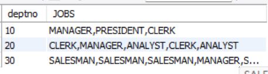

```sql
SELECT deptno,
       GROUP_CONCAT(DISTINCT job ORDER BY job ASC SEPARATOR ',') AS JOBS
FROM emp
GROUP BY deptno;
```
<table header-row="true">
<tr>
<td>功能</td>
<td>說明</td>
</tr>
<tr>
<td>GROUP_CONCAT</td>
<td>把資料串起來</td>
</tr>
<tr>
<td>DISTINCT</td>
<td>去除重複 job</td>
</tr>
<tr>
<td>ORDER BY job ASC</td>
<td>依 job 排序</td>
</tr>
<tr>
<td>SEPARATOR ','</td>
<td>用逗號分隔</td>
</tr>
</table>
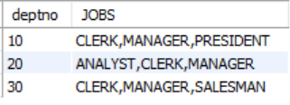

CONCAT()→ 橫的串接
GROUP_CONCAT()→ 直的串接
### 分組資料過濾條件(HAVING子句)
分組運算後結果的篩選
#### 基本語法
基本語法:
```sql
SELECT column, group_function
FROM table
[WHERE condition]
GROUP BY group_by_expression
[HAVING group_condition]
[ORDER BY column];
```
<table header-row="true">
<tr>
<td>項目</td>
<td>WHERE</td>
<td>HAVING</td>
</tr>
<tr>
<td>篩選時機</td>
<td>分組前</td>
<td>分組後</td>
</tr>
<tr>
<td>篩選對象</td>
<td>單筆資料</td>
<td>群組結果</td>
</tr>
<tr>
<td>可用彙總函數</td>
<td>❌ 不行</td>
<td>✅ 可以</td>
</tr>
</table>

FROM → WHERE → GROUP BY → HAVING → SELECT → ORDER BY
```sql
SELECT deptno, AVG(sal)
FROM emp
GROUP BY deptno
HAVING AVG(sal) > 2000;
```
#### 篩選分組資料
# 📊 執行流程
1️⃣ FROM → 取 emp
2️⃣ GROUP BY job → 分組
3️⃣ COUNT(\*) → 計算人數
4️⃣ HAVING → 篩選 \> 3
```sql
-- 👉 依 job 分組
-- 👉 計算每種職位的人數
-- 👉 只顯示「人數 > 3」的職位
SELECT job, COUNT(*) AS CNT
FROM emp
GROUP BY job
HAVING COUNT(*) > 3;
```

### WHERE vs HAVING 比較
WHERE 篩資料
HAVING 篩結果
執行順序!!
FROM → WHERE → GROUP BY → HAVING → SELECT → ORDER BY
<table header-row="true">
<tr>
<td>項目</td>
<td>WHERE</td>
<td>HAVING</td>
</tr>
<tr>
<td>執行時機</td>
<td>分組前</td>
<td>分組後</td>
</tr>
<tr>
<td>篩選對象</td>
<td>單筆資料（row）</td>
<td>分組結果（group）</td>
</tr>
<tr>
<td>是否可用彙總函數</td>
<td>❌ 不可以</td>
<td>✅ 可以</td>
</tr>
<tr>
<td>是否需 GROUP BY</td>
<td>不需要</td>
<td>通常需要</td>
</tr>
</table>
✅ WHERE（分組前）:
```sql
SELECT deptno, AVG(sal)
FROM emp
WHERE sal > 1000
GROUP BY deptno;
```
✅ HAVING（分組後）:
```sql
SELECT deptno, AVG(sal)
FROM emp
GROUP BY deptno
HAVING AVG(sal) > 2000;
```
🔥 綜合用法
```sql
SELECT deptno, COUNT(*)
FROM emp
WHERE sal > 1000
GROUP BY deptno
HAVING COUNT(*) > 3;
```

## Join
### 資料查詢–SELECT 敘述
<table header-row="true">
<tr>
<td>子句 (Element)</td>
<td>表達式 (Expression)</td>
<td>功能 (Role)</td>
</tr>
<tr>
<td>SELECT</td>
<td>\<select list\></td>
<td>指定要顯示的欄位或資料項目</td>
</tr>
<tr>
<td>FROM</td>
<td>\<table source\></td>
<td>指定資料來源（資料表）</td>
</tr>
<tr>
<td>WHERE</td>
<td>\<search condition\></td>
<td>篩選資料列（分組前）</td>
</tr>
<tr>
<td>GROUP BY</td>
<td>\<group by list\></td>
<td>將資料分組</td>
</tr>
<tr>
<td>HAVING</td>
<td>\<search condition\></td>
<td>篩選分組結果</td>
</tr>
<tr>
<td>ORDER BY</td>
<td>\<order by list\></td>
<td>排序查詢結果</td>
</tr>
</table>
### FROM子句與虛擬資料表
- FROM 子句設定SELECT 敘述的資料來源
1. 資料表(Table)跟運算子(operator)
2. 運算的結果產生虛擬資料表(virtual table)
3. 後續子句的運作基於FROM子句所產生的虛擬資料表
- FROM 子句可設定表格別名(table aliases)以供後續SELECT 查詢使用
1. 取代表格名稱並加快程式開發與查詢速度
2. 表格別名只在該敘述中有效
```sql
SELECT e.ename, e.sal, e.deptno, d.dname
FROM dept d 
JOIN emp e ON d.deptno = e.deptno;
```
<table header-row="true">
<tr>
<td>部分</td>
<td>說明</td>
</tr>
<tr>
<td>dept d</td>
<td>dept 表，別名 d，只在這個指令裡面有用</td>
</tr>
<tr>
<td>emp e</td>
<td>emp 表，別名 e</td>
</tr>
<tr>
<td>JOIN</td>
<td>連接兩個表</td>
</tr>
<tr>
<td>ON</td>
<td>指定連接條件</td>
</tr>
</table>
### 連結多個表格的運算
- 連結查詢-用來查詢多個資料表中的資料
1. 將多個資料表中的資料利用連結運算(Join)結合成一個虛擬表格(Virtual Table)
- 向量積運算(Cartesian Product)
1. 合併二個表格中的所有資料(所有可能的排列組合)
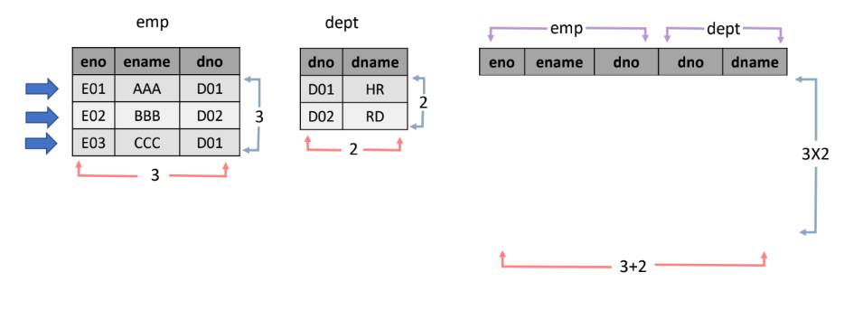
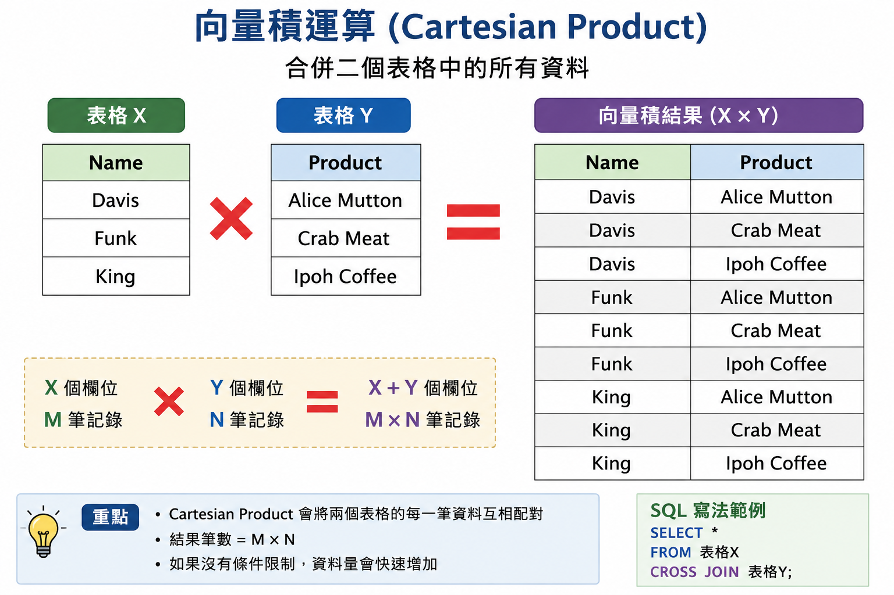
### 連結運算方式(Join Types)
### 交叉連結(Cross Join)
#### 簡介
- 交叉連結為兩個資料表間的向量積運算(Cartesianproduct)
1. 兩個資料表在結合時，不指定任何條件，即將兩個資料表中所有的可能<br>排列組合出來
- 內部連結和外部連結的邏輯基礎
1. 內部連結從Cartesian product開始，使用連結條件來篩選資料
2. 外部連結從Cartesian product開始，使用連結條件來篩選資料，再加回<br>不匹配的資料列
- 因交叉連結會產生Cartesian product 的結果，所以不具資料查詢的價值
1. 產生測試資料
- 無條件連結
1. 第一個資料表所有的rows會與第二個資料表中每一個row合併(Cartesian Product)

#### 基本語法
```sql
SELECT ...
FROM table1
CROSS JOIN table2;
```
結果
<table header-row="true">
<tr>
<td>A</td>
<td>B</td>
</tr>
<tr>
<td>1</td>
<td>X</td>
</tr>
<tr>
<td>1</td>
<td>Y</td>
</tr>
<tr>
<td>1</td>
<td>Z</td>
</tr>
<tr>
<td>2</td>
<td>X</td>
</tr>
<tr>
<td>2</td>
<td>Y</td>
</tr>
<tr>
<td>2</td>
<td>Z</td>
</tr>
</table>
```sql
SELECT *
FROM emp e
CROSS JOIN dept d;
```
```sql
SELECT e1.ename, e2.job
FROM emp e1
CROSS JOIN emp e2;
```
<table header-row="true">
<tr>
<td>e1.ename</td>
<td>e2.job</td>
</tr>
<tr>
<td>A</td>
<td>Clerk</td>
</tr>
<tr>
<td>A</td>
<td>Manager</td>
</tr>
<tr>
<td>A</td>
<td>Analyst</td>
</tr>
<tr>
<td>B</td>
<td>Clerk</td>
</tr>
<tr>
<td>B</td>
<td>Manager</td>
</tr>
<tr>
<td>B</td>
<td>Analyst</td>
</tr>
<tr>
<td>C</td>
<td>Clerk</td>
</tr>
<tr>
<td>C</td>
<td>Manager</td>
</tr>
<tr>
<td>C</td>
<td>Analyst</td>
</tr>
</table>
### 內部連結(Inner Join)
#### 簡介
- 產生只有符合條件連結(join conditions)的資料
1. 第一個資料表所有的rows會與第二個資料表中每一個row做連結條件測試，結果為<br>真(TRUE)才會合併產生一筆新紀錄(row)
2. 如何設定連結條件<br>• SQL-92 語法使用ON子句(preferred)<br>• SQL-89 語法使用WHERE 子句
- 為何使用ON 子句來設定連結條件?
1. 可以跟資料查詢條件分開來以免造成混淆
#### 語法
SELECT ...<br>FROM t1 JOIN t2 ON JoinConditions
t1 和 t2 可以交換不影響結果
```sql
#92
SELECT e.ename, e.deptno, d.dname
FROM dept d JOIN emp e ON d.deptno = e.deptno;

#89
SELECT e.ename, e.deptno, d.dname
FROM dept d, emp e
WHERE d.deptno = e.deptno;

```

- 使用表格全名
舉例:
```sql
SELECT emp.empno, emp.ename, emp.mgr, emp.sal, emp.deptno,
       dept.deptno, dept.dname
FROM emp
JOIN dept ON emp.deptno = dept.deptno;

#別名

```
👉 把 emp（員工）<br>👉 與 dept（部門）
👉 用 deptno 連接
👉 顯示員工資訊＋部門名稱
- 列出員工姓名KING所在的部門資訊
```sql
SELECT e.empno, e.ename, e.mgr, e.sal, e.deptno, d.deptno, d.dname
FROM emp e
JOIN dept d ON e.deptno = d.deptno
WHERE e.ename = 'KING';
```

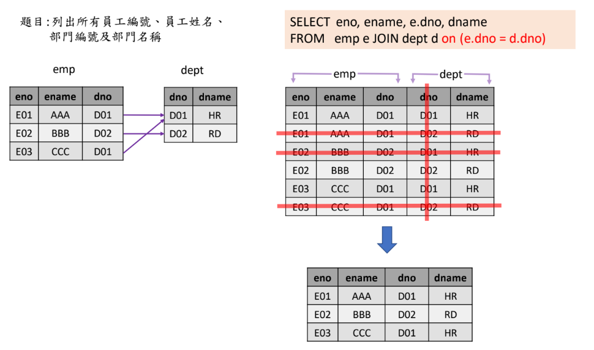

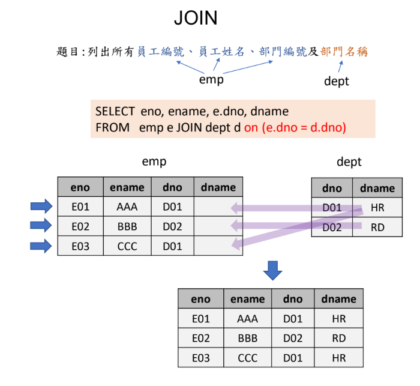

#### 自然連結(Natural Join)
- 連結條件(Join Condition)
1. 使用表格內之同名欄位作為連結條件
```sql
SELECT e.ename, e.job, e.sal, e.deptno, d.dname,d.loc
FROM emp e NATURAL JOIN dept d;

SELECT e.ename, e.job, e.sal, e.deptno, d.dname,d.loc
FROM emp e JOIN dept d ON e.deptno = d.deptno; 

#92
SELECT empno, ename, mgr, sal, deptno, dname
FROM emp
NATURAL JOIN dept
WHERE deptno = 10;

#89
SELECT e.empno, e.ename, e.mgr, e.sal, e.deptno, d.deptno, d.dname
FROM emp e, dept d
WHERE e.deptno = d.deptno AND e.deptno = 10;

#USING
SELECT e.empno, e.ename, e.mgr, e.sal, deptno, d.dname
FROM emp e
JOIN dept d USING(deptno)
WHERE deptno = 10;

```

### 不相等連結(Non-Equijoins)
- 將要連結的表格名稱列在FROM 子句中，並加入JOIN 運算子及ON來設定連結條件
- 連結條件的運算子(Operators)
- \>= 或\<=
- BETWEEN AND
若符合條件的資料超過一筆以上時，因向量積關係，資料可能會不正確。
```sql
SELECT e.empno, e.ename, e.sal, s.grade
FROM emp e JOIN salgrade s ON (e.sal BETWEEN s.losal AND s.hisal);
```
- 列出所有員工薪資的等級
```sql
SELECT e.empno, e.ename, e.sal, s.grade
FROM emp e
JOIN salgrade s ON e.sal BETWEEN s.losal AND s.hisal;
```

### 多表格連結
三個表格兩個join
SELECT ...<br>FROM t1 JOIN t2 ON t1.columnA = t2.columnA<br>JOIN t3 ON t2.columnB = t3.columnB<br>JOIN t4 ON t3.columnC = t4.columnC<br>... {color="gray_bg"}
```sql
#92
SELECT c.name, c.custid, o.ordid, i.itemid
FROM customer c JOIN ord o ON c.custid = o.custid
JOIN item i ON o.ordid = i.ordid;

#89 不建議
SELECT  c.name, c.custid, o.ordid, i.itemid
FROM    
customer c,  ord o, item i
WHERE   
c.custid = o.custid AND o.ordid = i.ordid ;
```
- 多個資料表的連結(計算員工業績)
```sql
SELECT e.empno, e.ename, SUM(o.total) AS total
FROM emp e
JOIN customer c ON e.empno = c.repid -- 這個客戶是哪個員工負責
JOIN ord o ON c.custid = o.custid  -- 每個客戶都會多個訂單
GROUP BY e.empno, e.ename; -- 依照員工來做分組 ->因為要算他的業績
 -- 因為SELECT 有ename 所以group by也要有
```
員工表格找到員工→員工有客戶→客戶有訂單→加總訂單\$
ename → empno = repid → custid = custid
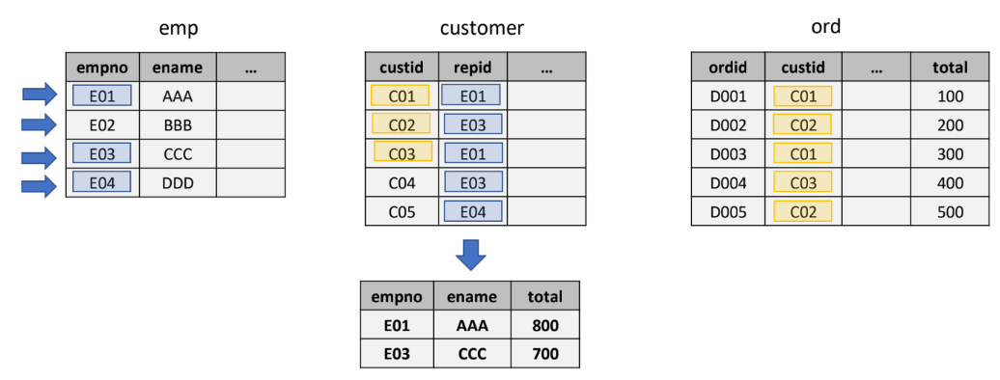

### 外部連結(Outer Join)
### 語法
- 指定一資料表，當連結條件符合時則顯示，若與第二個資料表都不符合時則以null value顯示
- OUTER可以省略不寫
- 外部連結種類
- LEFT OUTER JOIN
- RIGHT OUTER JOIN
- FULL OUTER JOIN
SELECT alias.column, alias.column,...<br>FROM table1 \[AS\] alias1<br>\{\[LEFT\|RIGHT\|FULL \[OUTER\]\] JOIN \}<br>table2 \[AS\] alias2<br>ON alias1.column = alias2.column<br>WHERE ...; {color="gray_bg"}

```sql
-- 沒有部門的員工
SELECT eno, ename, e.dno, dname
FROM emp e  LEFT JOIN dept d ON (e.dno = d.dno); -- 以左邊的表格為依據，如果找不到資料，就將左邊表格加入，並顯示空值
```
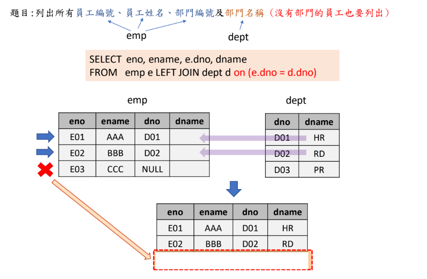
```sql
-- 沒有員工的部門
SELECT eno, ename, e.dno, dname
FROM emp e RIGHT JOIN dept d ON (e.dno = d.dno); --右邊找不到匹配，我也加入右邊表格的資訊
```
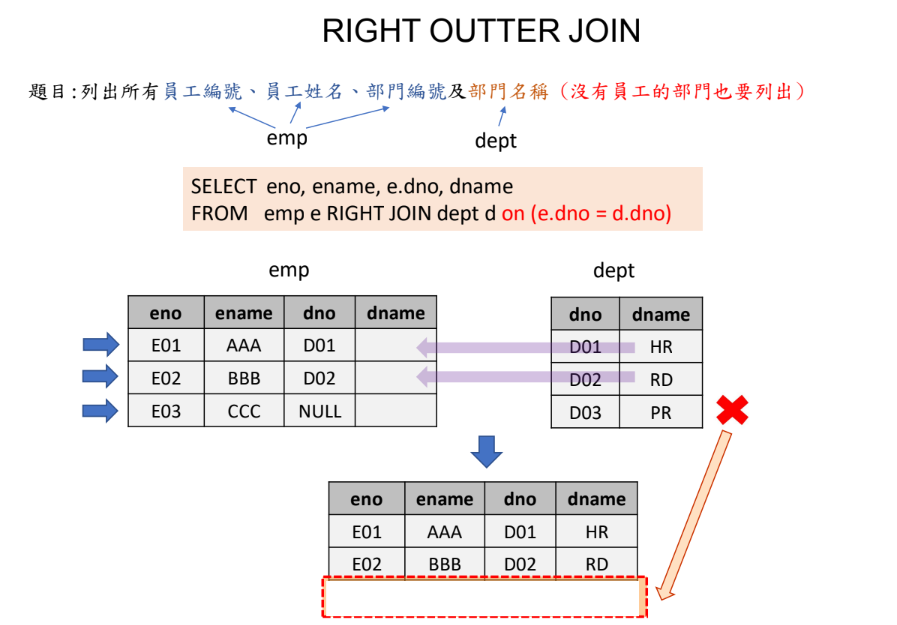
```sql
# 沒有部門的員工及沒有員工的部門
SELECT eno, ename, e.dno, dname
FROM emp e FULL JOIN dept d ON (e.dno = d.dno); -- 全部的資料都顯示，不管條件有沒有匹配成功
```
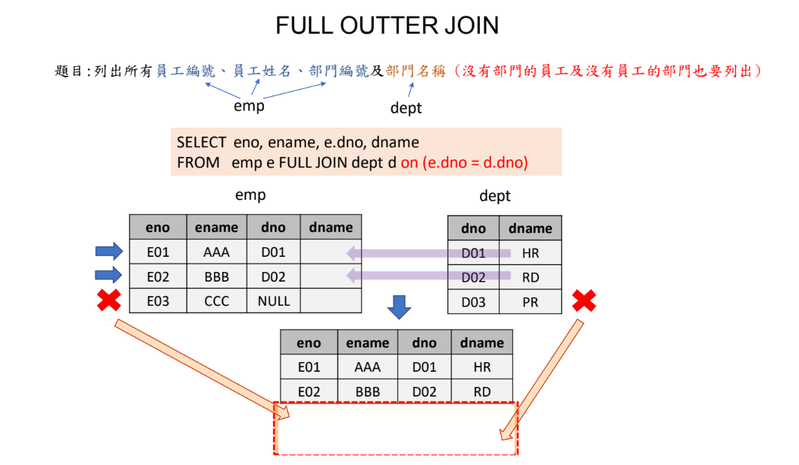

找「沒有任何員工的部門」
```sql
SELECT e.ename, e.deptno, d.dname, d.loc
FROM emp e
RIGHT OUTER JOIN dept d ON e.deptno = d.deptno
WHERE e.empno IS NULL; --  找「員工不存在」的資料

--有員工 → e.empno 一定有值
--沒員工 → e.empno = NULL
```

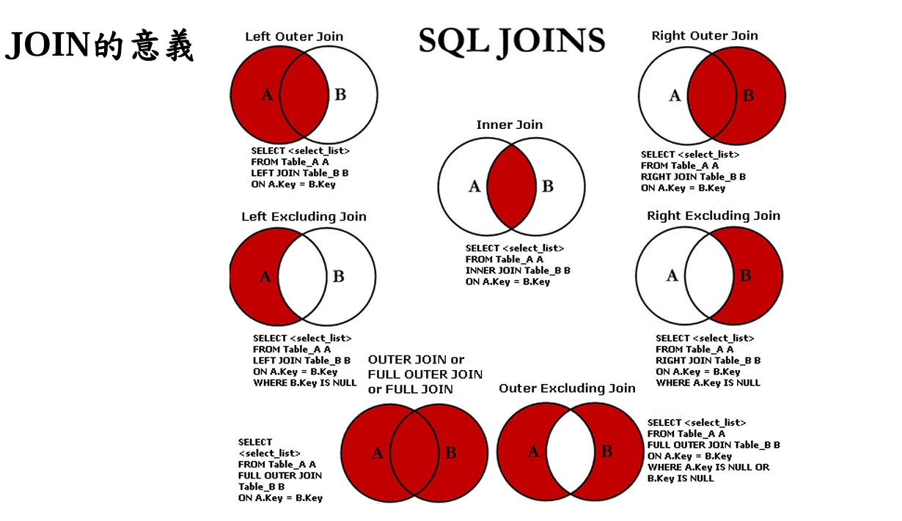
<table header-row="true">
<tr>
<td>類型</td>
<td>語法</td>
<td>取哪些資料</td>
<td>關鍵條件</td>
<td>用途</td>
</tr>
<tr>
<td>**INNER JOIN**</td>
<td>`A JOIN B ON`</td>
<td>✅ A ∩ B（交集）</td>
<td>無</td>
<td>只要有對應的資料</td>
</tr>
<tr>
<td>**LEFT JOIN**</td>
<td>`A LEFT JOIN B`</td>
<td>✅ A 全部 + 有對應的 B</td>
<td>無</td>
<td>保留左表</td>
</tr>
<tr>
<td>**RIGHT JOIN**</td>
<td>`A RIGHT JOIN B`</td>
<td>✅ B 全部 + 有對應的 A</td>
<td>無</td>
<td>保留右表</td>
</tr>
<tr>
<td>**FULL JOIN**</td>
<td>`A FULL JOIN B`</td>
<td>✅ A + B 全部</td>
<td>無</td>
<td>全部資料</td>
</tr>
</table>
<table header-row="true">
<tr>
<td>類型</td>
<td>語法</td>
<td>取哪些資料</td>
<td>關鍵條件</td>
<td>用途</td>
</tr>
<tr>
<td>**Left Excluding**</td>
<td>`LEFT JOIN` + `WHERE B.key IS NULL`</td>
<td>✅ 只有 A（沒對應 B）</td>
<td>`B.key IS NULL`</td>
<td>找「沒有對應的 A」</td>
</tr>
<tr>
<td>**Right Excluding**</td>
<td>`RIGHT JOIN` + `WHERE A.key IS NULL`</td>
<td>✅ 只有 B（沒對應 A）</td>
<td>`A.key IS NULL`</td>
<td>找「沒有對應的 B」</td>
</tr>
<tr>
<td>**Outer Excluding**</td>
<td>`FULL JOIN` + `WHERE A.key IS NULL OR B.key IS NULL`</td>
<td>✅ 不重疊部分</td>
<td>`IS NULL`</td>
<td>找「不相交資料」</td>
</tr>
</table>
因為MYSQL沒有FULL OUTER JOIN → UNION
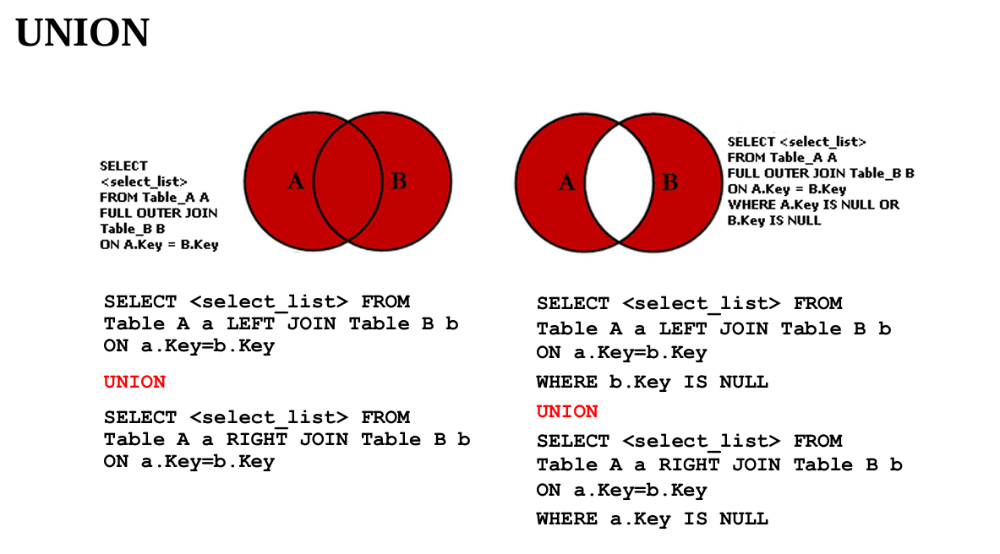
<table header-row="true">
<tr>
<td>類型</td>
<td>寫法</td>
<td>結果</td>
<td>是否去重複</td>
<td>用途</td>
</tr>
<tr>
<td>**UNION**</td>
<td>`SELECT ... UNION SELECT ...`</td>
<td>合併兩個查詢結果</td>
<td>✅ 會去重複</td>
<td>合併資料</td>
</tr>
<tr>
<td>**UNION ALL**</td>
<td>`SELECT ... UNION ALL SELECT ...`</td>
<td>合併兩個查詢結果</td>
<td>❌ 不去重複</td>
<td>保留全部</td>
</tr>
</table>

### 自我連結(Self Joins)
- 同一個表格裡，資料和資料的關係
- 使用同一表格做連結運算
- 使用表格別名來建立二個相同資料表的連結運算
#### 語法
SELECT ...<br>FROM Table1 A1 JOIN Table1 A2 ON A1.Col1 = A2.Col2<br>... {color="gray_bg"}
- 員工和主管，當找不到主管時，就不會被記入，就會少一筆
```sql

e1 -> 員工表格  e2 -> 主管表格
SELECT e1.empno, e1.ename, e1.mgr, e2.ename AS manager_name
FROM emp e1
JOIN emp e2 ON e1.mgr = e2.empno
ORDER BY e1.mgr;

```
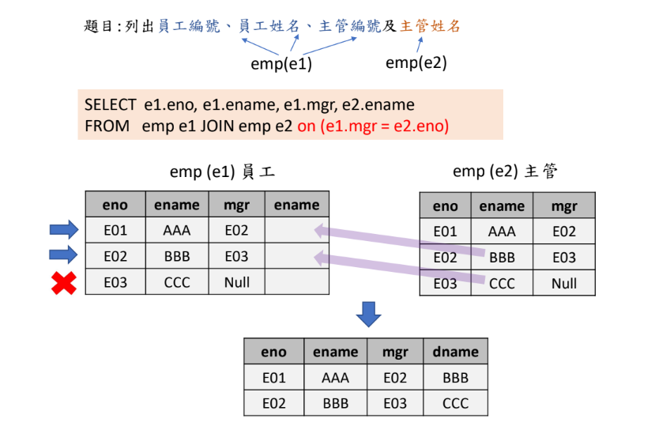

## 子查詢(Sub-Queries)
### 概念
- 利用子查詢來解決另類查詢問題
- 請找出薪資比MARY高的所有員工資料
- 主查詢中含有另一個查詢(SELECT)
- 查詢時先執行子查詢,並將結果傳回主查詢
- 子查詢可以出現的位置
- WHERE子句
- HAVING 子句
- FROM子句
- SELECT子句
- 子查詢是巢狀查詢:查詢中有查詢
- 內部查詢(inner query)的結果會傳給外部查詢(outer query)
- 內部查詢結果當成外部查詢運算式中的運算元
- 子查詢的種類(依子查詢執行方式分類):
- 自主子查詢(Self-contained sub-queries): 與主查詢沒有相關性
- 相關子查詢(Correlated sub-queries): 需依賴外部查詢的值
- 子查詢的型式(依子查詢結果分類):
- 純量(scalar)
- 多值(multi-valued)
- 多欄位(multiple-column)
- 表格值(table-valued)
<table header-row="true">
<tr>
<td>類型</td>
<td>回傳結果</td>
<td>特徵</td>
<td>可用運算子</td>
<td>範例用途</td>
</tr>
<tr>
<td>**單筆記錄子查詢**(Single-row)</td>
<td>1 筆資料（1 個值）</td>
<td>最單純</td>
<td>`= > < >= <=`</td>
<td>比較某一個人的薪水</td>
</tr>
<tr>
<td>**多筆記錄子查詢**(Multiple-row)</td>
<td>多筆資料（1 欄）</td>
<td>一欄多值</td>
<td>`IN ANY ALL`</td>
<td>查多個條件</td>
</tr>
<tr>
<td>**多欄位子查詢**(Multiple-column)</td>
<td>1 筆資料（多欄）</td>
<td>多欄同時比較</td>
<td>`(col1, col2) = (...)`</td>
<td>比對多個欄位</td>
</tr>
<tr>
<td>**表格子查詢**(Table-valued)</td>
<td>多筆＋多欄（像一張表）</td>
<td>當作資料表用</td>
<td>`FROM (subquery)`</td>
<td>當臨時表</td>
</tr>
</table>
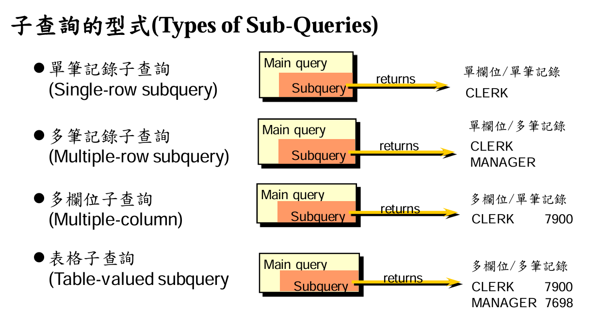

### 語法
### 單筆記錄子查詢(Single Row Subqueries)
回傳值只有單欄位單筆紀錄 sal → 2975
```sql
SELECT empno, ename, sal
FROM emp
WHERE sal > (
SELECT sal
FROM emp
WHERE empno = 7566
);
```

#### 子查詢(Sub-Queries)－WHERE 子句
列出和JAMES同部門的員工
```sql
SELECT empno, ename, deptno
FROM emp
WHERE deptno = (
    SELECT deptno
    FROM emp
    WHERE ename = 'JAMES' -- 找到JAMES的員工編號
);
```
多個子查詢在SELECT 中
```sql
SELECT empno, ename, sal, job
FROM emp
WHERE job = (
    SELECT job
    FROM emp
    WHERE empno = 7499
)
AND sal > (
    SELECT sal
    FROM emp
    WHERE empno = 7934
);
```
列出薪資\>全公司平均薪資的員工
```sql
SELECT empno, ename, sal
FROM emp
WHERE sal > (
    SELECT AVG(sal)
    FROM emp
);
```
HAVING 
👉 找出：
> ✅ **最低薪水「比部門20還高」的部門**
```sql
SELECT deptno, MIN(sal)
FROM emp
GROUP BY deptno
HAVING MIN(sal) > (
    SELECT MIN(sal)
    FROM emp
    WHERE deptno = 20
);
```
子查詢出現在SELECT子句中
```sql
SELECT ename, job, deptno, sal,
       CONCAT(ROUND(sal * 100 / (SELECT SUM(sal) FROM emp), 2), '%') AS "佔全公司薪資比率"
FROM emp
WHERE deptno = 30;
```
子查詢出現在FROM子句中: **衍生資料表(Derived Table) → 臨時產生的表格，只存在記憶體中，不在硬碟，僅能用在本次指令**
```sql
SELECT e.ename, e.job, e.sal,
       CONCAT(ROUND(e.sal * 100 / b.total, 2), '%') AS "佔全公司薪資比率"
FROM emp e
CROSS JOIN (SELECT SUM(sal) AS total FROM emp) b
WHERE e.deptno = 30;
```

### 多筆記錄子查詢(Multiple Row Subqueries)

**WHERE** {color="yellow_bg"}
**多筆資料用() → 找出單筆資料用 = ** {color="yellow_bg"}
**                 →找出多筆資料用 IN**
列出公司所有主管
```sql
SELECT empno, ename
FROM emp
WHERE empno IN (
    SELECT mgr
    FROM emp
);
```
「沒有當主管的員工」—解決方法:排除子查詢空值資料
```sql
SELECT empno, ename
FROM emp
WHERE empno NOT IN (
    SELECT mgr -- EMPNO 沒有在MGR裡面
    FROM emp
    WHERE mgr IS NOT NULL
);
```
#### ANY or ALL
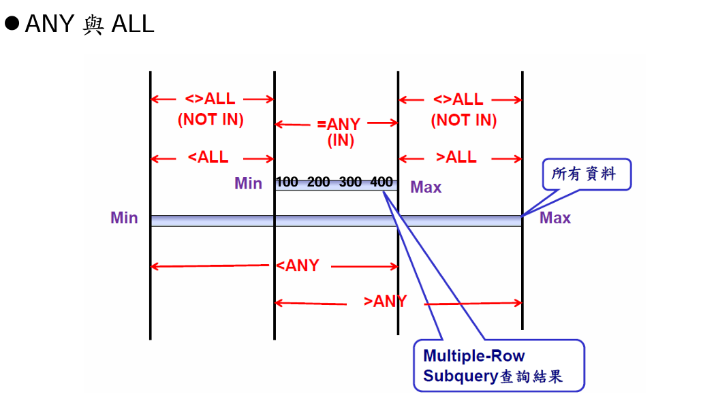
<table header-row="true">
<tr>
<td>寫法</td>
<td>等價意思</td>
<td>解釋</td>
</tr>
<tr>
<td>`= ANY`</td>
<td>`IN`</td>
<td>等於其中一個</td>
</tr>
<tr>
<td>`<> ALL`</td>
<td>`NOT IN`</td>
<td>不等於所有</td>
</tr>
<tr>
<td>`> ANY`</td>
<td>\> 最小值</td>
<td>比「最小值」大即可</td>
</tr>
<tr>
<td>`< ANY`</td>
<td>\< 最大值</td>
<td>比「最大值」小即可</td>
</tr>
<tr>
<td>`> ALL`</td>
<td>\> 最大值</td>
<td>比「最大值」還大</td>
</tr>
<tr>
<td>`< ALL`</td>
<td>\< 最小值</td>
<td>比「最小值」還小</td>
</tr>
</table>
#### 解釋
# 📊 搭配 Min / Max 理解（圖的重點🔥）
假設子查詢結果：
```plain text
100, 200, 300, 400
```
<table header-row="true">
<tr>
<td>條件</td>
<td>實際意思</td>
</tr>
<tr>
<td>`> ANY`</td>
<td>\> 100（最小值）</td>
</tr>
<tr>
<td>`< ANY`</td>
<td>\< 400（最大值）</td>
</tr>
<tr>
<td>`> ALL`</td>
<td>\> 400（最大值）</td>
</tr>
<tr>
<td>`< ALL`</td>
<td>\< 100（最小值）</td>
</tr>
</table>
---
# 📊 範例 SQL
---
## 🔹 ANY（其中一個就好）
```plain text
SELECT ename, sal
FROM emp
WHERE sal>ANY (
SELECT salFROM empWHERE deptno=30
);
```
👉 比部門30「某一個人」高就可以
---
## 🔹 ALL（全部都要）
```plain text
SELECT ename, sal
FROM emp
WHERE sal>ALL (
SELECT salFROM empWHERE deptno=30
);
```
👉 比部門30「所有人」都高

列出薪水比任一個clerk低的員工資料
```sql
SELECT empno, ename, sal
FROM emp
WHERE sal < ANY (
    SELECT sal
    FROM emp
    WHERE job = 'CLERK'
);
```
列出薪水比所有salesman高的員工資料
```sql
SELECT empno, ename, job, sal
FROM emp
WHERE sal > ALL (
    SELECT sal
    FROM emp
    WHERE job = 'salesman'
);
```
列出部門與薪水都與Martin 相同之員工
```sql
SELECT empno, ename, deptno, sal
FROM emp
WHERE (deptno, sal) = (
    SELECT deptno, sal
    FROM emp
    WHERE ename = 'MARTIN'
);
```

## 相關子查詢(Correlated Subqueries)
- 相關子查詢必須依賴外部查詢所使用的資料表的資料來執行子查詢
- 依賴於外部查詢，不能單獨執行
- 比自主子查詢難測試
- 執行次數依主查詢的資料筆數而定
- 一筆資料執行一次子查詢
- 可能傳回一個值或多個值
### 撰寫相關子查詢
內部查詢如何接收外部查詢資料表的資料<br>外部查詢如何接受內部查詢執行的結果(scalar or multi-valued)
```sql
SELECT custid, ordid, orderdate
FROM ord AS outerorders
WHERE orderdate = (
    SELECT MAX(orderdate)
    FROM ord AS innerorders
    WHERE innerorders.custid = outerorders.custid
)
ORDER BY custid;
```
查詢每個客戶最近跟公司下訂單的日期資料
```sql
SELECT ordid, custid, orderdate
FROM ord AS O1
WHERE orderdate = (
    SELECT MAX(orderdate) -- 最大就是最近的
    FROM ord AS O2
    WHERE O2.custid = O1.custid
)
ORDER BY custid, orderdate;
```
#### 解釋
每筆訂單 → 找同客戶最大日期 → 留下最新訂單
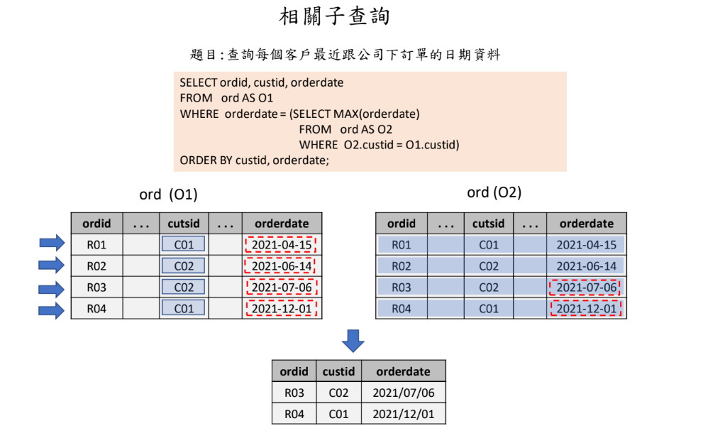

查詢各部門薪資最高的員工資料
```sql
SELECT ename, sal, deptno
FROM emp oe
WHERE sal = (
    SELECT MAX(sal)
    FROM emp ie
    WHERE ie.deptno = oe.deptno
);
```

### 使用EXISTS－存在性測試
- 子查詢可配合使用EXISTS來做資料存在性測試(existence test)
- 只傳回真(True)或假(False)<br>• 不會將查詢結果的資料傳回給主查詢
- 若子查詢有得到任一筆資料則傳回真(True),若子查詢沒有任何一筆資料則傳回假(False)
WHERE \[NOT\] EXISTS (subquery) {color="gray_bg"}
- EXISTS 不需任何欄位或運算式
- 因為不傳回資料,所以一般在子查詢中的SELECT 資料項都使用星號asterisk (\*)
```sql
SELECT  custid, name
FROM    
customer AS c
WHERE 
EXISTS ( SELECT * 
FROM ord AS o
WHERE c.custid = o.custid);
```
```sql
SELECT  custid, name
FROM    
customer AS c
WHERE 
NOT EXISTS ( SELECT * 
FROM ord AS o
WHERE c.custid = o.custid);
```
列出下過訂單的客戶資料
```sql
SELECT custid, name
FROM customer AS c
WHERE EXISTS (
    SELECT *
    FROM ord AS o
    WHERE c.custid = o.custid
);
```
列出從未下過訂單的客戶資料
```sql
SELECT  custid, name
FROM    
customer AS c
WHERE NOT EXISTS ( SELECT *           
FROM ord AS o
WHERE c.custid=o.custid);

-->Empty set (0.00 sec) 表示所有的顧客都下過訂單
```

## 資料處理語言(DML) CRUD
### 資料處理語言(Data Manipulation Language)
- 做新改刪之前要先 <span color="yellow_bg">SET SQL_SAFE_UPDATES= 0;</span>
### INSERT INTO命令
INSERT INTO table \[(column,...)\]<br>VALUES(value,...); {color="gray_bg"}
- 欄位與值的數量需相同，位置對應且型態要相容
- 可以用指定欄位或不指定欄位的方式來新增資料<br>• 不指定欄位時，資料表中所有的欄位均要給值<br>• 使用DESC 指令可以得知欄位值的順序
```sql
#指定欄位
INSERT INTO dept(deptno, dname, loc)
VALUES(50,'MIS','NEW YORK');
#不指定欄位
INSERT INTO dept
VALUES(50,'MIS','NEW YORK');

#不指定欄位還是要按造欄位順序放入資料
#可以透過DESC的指令來查詢欄位順序

DESC dept;

```
### 新增資料－Null 值
- 新增空值到資料表的方法
- 未列舉的欄位,新增資料時將值填入預設值(default value)，若該欄位沒有設定預設值<br>則填入空值(NULL)
```sql
INSERT INTO dept(deptno, dname)
VALUES (60, 'MIS');

result->
Query OK, 1 row affected

#新增loc = 空值 不要'null'
INSERT INTO dept(deptno, dname, loc)
VALUES (70, 'HR', NULL);

```
### 新增資料－日期資料
- 新增日期資料的方法
- 可以使用NOW()或CURRENT_DATE()…等函數
- 用字串輸入，請參照資料型態章節
```sql
INSERT INTO EMP(empno, ename, job, mgr, hiredate, sal, comm, deptno)
VALUES(8001,'JAMES','ANALYST',7839,CURRENT_DATE()
,2500,NULL,20);

INSERT INTO EMP(empno, ename, job, mgr, hiredate, sal, comm, deptno)
VALUES(8002,'JOHN','SALESMAN',7839,'2013-03-25',1400,500,30);
```
### INSERT INTO多筆記錄
#### 新增多筆資料 用( ), 區分新的一筆資料
INSERT INTO table_name (column_list)<br>VALUES (value_list_1),<br>(value_list_2),<br>...<br>(value_list_n); {color="gray_bg"}
```sql
INSERT INTO EMP
VALUES
(8001,'JAMES','ANALYST',7839, CURRENT_DATE(),2500,NULL,20),
(8002,'JOHN','SALESMAN',7839, CURRENT_DATE(),1400,500,30);
```
### INSERT敘述常發生的錯誤
<table header-row="true">
<tr>
<td>錯誤類型</td>
<td>英文錯誤訊息</td>
<td>發生原因</td>
<td>範例</td>
</tr>
<tr>
<td>NOT NULL 未給值</td>
<td>Mandatory value missing for a NOT NULL column</td>
<td>欄位設為 NOT NULL，但沒給值</td>
<td>`INSERT INTO dept(deptno) VALUES (80);`</td>
</tr>
<tr>
<td>資料型態錯誤</td>
<td>Data type mismatch</td>
<td>型態不符合（數字放字串等）</td>
<td>`INSERT INTO emp(sal) VALUES ('ABC');`</td>
</tr>
<tr>
<td>長度超過限制</td>
<td>Value too wide to fit in column</td>
<td>字串長度超過欄位限制</td>
<td>`VARCHAR(10)` 放 20 字</td>
</tr>
<tr>
<td>唯一值重複</td>
<td>Duplicate value violates uniqueness constraint</td>
<td>主鍵或 UNIQUE 欄位重複<br>新增了一個原本就有的値</td>
<td>重複 deptno</td>
</tr>
<tr>
<td>外鍵違反</td>
<td>Foreign key constraint violated</td>
<td>child 表找不到對應 parent<br>在emp裡面新增一個員工<br>(empno, ename, deptno)<br>(9999, ‘shelly’, 50)<br>但是dept 裡面沒有deptno = 50的部門<br>所以要先做 在dept裡面新增deptno= 50 </td>
<td>emp.deptno 不存在</td>
</tr>
</table>
### 從其他資料表複製資料  column_copy
- 使用子查詢將其他資料表中的資料新增到指定的資料表
- 使用時機: 將已不會再處理的紀錄移至他檔儲存，以加速資料的處理，例如已結案的<br>訂單、已不再交易的銀行帳戶以及已處理完的公文
INSERT INTO table\[(column,...)\]<br>SELECT column,...<br>FROM table<br>WHERE ... {color="gray_bg"}
- 若目標表格的欄位名稱、欄位數量與來源表格皆完全相同，可以不必寫column list
→ 複製一個一模一樣的表格
```sql
INSERT INTO emp_copy
SELECT * 
FROM emp;
```
- 若目標表格的欄位名稱、順序與來源表格並不盡相同(資料型態一定要一樣)，必須寫column list
→只保留自己想要的欄位 ，並且加入條件
```sql
INSERT INTO emp_copy1(empid, ename, deptno, hiredate, salary)
SELECT empno, ename, deptno, hiredate, sal
FROM emp
WHERE job NOT LIKE '%SA%';
```
舉例:
```sql
INSERT INTO bonus(ename, job, sal, comm)
SELECT ename, job, sal, comm
FROM emp
WHERE deptno=10;

SELECT * FROM bonus;
```

### UPDATE
### 修改資料表中的資料 UPDATE命令
UPDATE table<br>SET column=value \[,column=value\]... —\>多筆資料多個欄位<br>WHERE conditions; {color="gray_bg"}
- 欄位與值的型態應相同
- 一次可以修改多個欄位，用逗號隔開
- 若遺漏了WHERE子句則會更改資料表中所有的rows
- MySQL 為避免不小心更改到過多的資料，使用SQL_SAFE_UPDATES系統參數來保護資料(每次連線將其值設為1)，若要更改或刪除資料，請先執行下列設定:<br><span color="gray_bg">SETSQL_SAFE_UPDATES= 0;</span>
```sql
UPDATE emp
SET    
deptno = 20
WHERE  empno = 7782;
```
#### 修改一個欄位資料
```sql
UPDATE emp
SET sal = 1000
WHERE empno = 7900;
```
#### 同時更新兩個欄位資料
```sql
UPDATE emp
SET job    = 'SALESMAN',
deptno = 30
WHERE empno = 7369;
```
#### 使用子查詢來更新資料
- 使用子查詢
- 與子查詢合併使用時，二者間資料表不可以是同一個 {color="yellow_bg"}
- 當取值使用
```sql
-- 我要把部門編號改成 HR的部門編號 ，但我不知道HR的部門編號，先找HR的部門編號，再改。
UPDATE emp
SET deptno = (SELECT deptno
FROM dept 
WHERE dname='HR')
WHERE empno = 7900;
```
- 當條件使用
```sql
-- 把所有SALES這個部門的人加薪500
UPDATE emp
SET sal = sal + 500
WHERE deptno = (SELECT deptno
FROM dept 
WHERE dname='SALES');
```

### DELETEFROM命令
DELETE FROM table<br>\[WHERE conditions\]; {color="gray_bg"}
- 刪除資料表中的資料
- 若遺漏了WHERE子句時，則刪除資料表中所有的資料
```sql
DELETE FROM dept
WHERE deptno = 70;
```
- 指定刪除的對象
```sql
DELETE FROM dept
WHERE dname = 'Finance';
```
- 省略WHERE子句刪除表格中全部的資料
```sql
DELETE FROM dept;
```
- 使用子查詢結果作為刪除資料的對像(條件)
```sql
DELETE FROM emp
WHERE deptno = (SELECT deptno
FROM dept
WHERE dname LIKE '%Public%');
```

### 新增修改刪除常見錯誤
<table header-row="true">
<tr>
<td>類型</td>
<td>錯誤名稱</td>
<td>說明</td>
<td>範例</td>
</tr>
<tr>
<td>約束違反</td>
<td>主鍵 / 唯一鍵重複</td>
<td>不可重複的欄位出現相同值</td>
<td>重複 `deptno`</td>
</tr>
<tr>
<td>約束違反</td>
<td>外鍵錯誤</td>
<td>子表資料沒有對應父表</td>
<td>emp.deptno 不存在</td>
</tr>
<tr>
<td>約束違反</td>
<td>NOT NULL</td>
<td>必填欄位給 NULL</td>
<td>`ename = NULL`</td>
</tr>
<tr>
<td>資料錯誤</td>
<td>長度錯誤</td>
<td>字串太長或太短</td>
<td>VARCHAR(10) 放 20 字</td>
</tr>
<tr>
<td>資料錯誤</td>
<td>型態錯誤</td>
<td>數字欄位放字串</td>
<td>`sal = 'ABC'`</td>
</tr>
</table>
```sql
UPDATE emp
SET deptno = 55
WHERE deptno = 10;

result->
ERROR 1452 (23000): Cannot add or update a child row: a foreign key constraint fails (`zb105`.`emp`, CONSTRAINT 
`EMP_DEPTNO_FK` FOREIGN KEY (`DEPTNO`) REFERENCES `dept` (`DEPTNO`))

```
#### 新增資料－違反NOT NULL
```sql
INSERT INTO emp(empno, ename, job, deptno )->   
VALUES(9001,'SANDY','CLERK',NULL);

-
ERROR 1048 (23000): Column 'DEPTNO' cannot be null

-

UPDATE EMP
SET DEPTNO = NULL
WHERE EMPNO = 8001;

```

#### 新增資料－違反外來鍵
新增資料時的錯誤<br> 違反外來鍵(Foreign Key)的錯誤
```sql
INSERT INTO FKT
Values (4,’ROW8’)

在PKT TABLE中並沒有4 這筆資料,所以無法新增
```
修改資料時的錯誤<br> 違反整合資料檢查條件(Integrity Constraint Error)
```sql
UPDATE FKT
SET FK = 3
WHERE C2 = ’ROW1’

UPDATE FKT
SET FK = 4
WHERE C2 = ’ROW5’

在PKT TABLE中並沒有4 這筆資料,所以無法更新

```

#### 刪除資料－違反外來鍵
- 刪除資料的錯誤<br>違反整合資料檢查條件(Integrity Constraint Error)
我的PK table :
PK<br>—————-<br>1<br>2<br>3    → 刪掉這個<br><br>但是我連到的FK
FK<br>—————-
1                A<br>1               A<br>2               B<br>2               C<br>3               D     → FK會出錯 找不到PK<br>3               E     → FK會出錯 找不到PK<br>3               F     → FK會出錯 找不到PK<br>
```sql
在FKT TABLE中有3筆資料參考著PKT TABLE中PK=3 這筆資料,
故刪除PKT TABLE中PK=3 時會產生錯誤訊息,如下:

DELETE FROM pkt
WHERE pk = 3;

-
ERROR 1217 (23000): Cannot delete or update a parent row: a 
foreign key constraint fails
```

### DML交易控制(DML Transaction Control)
交易中只能有一個USER控制，USER2要等前一個UAER交易結束，所以寫交易要考慮其他USER
### 資料庫交易 (Database Transactions)
#### 簡介
● 交易 (Database Transactions)
改變資料庫中現有資料
● 依不同類型的指令所產生的交易：
DML 交易 → 資料操作: 更改資料內容 (沒有動欄位)<br>DDL 交易 → 資料定義: 更改資料結構，EX: 建立新資料表，新增修改欄位，刪除表格等等<br>DCL 交易 → 資料控制: 管理權限，誰可以用我的資料
● MySQL 預設的交易處理方式：
DDL & DCL 交易：Auto commit（自動確認） → 直接生效，不能Rollbake
## 更改結構或是權限的時候，直接確定，不能回頭
<br>DML 交易：Auto Commit（自動確認）→ User Commit（使用者確認或放棄）
##你可以決定要不要真的改動或是取消變更，可以反悔

#### 交易控制 (Transactions Control)目的
主要目的:
維持資料庫中資料的
- 一致性（Consistency）
- 正確性（Correctness）
#### 何謂交易(Database Transactions)
- 是多個 DML statements 所構成的邏輯工作單位
- 交易(Transaction) 提供了一個資料處理的邏輯單元(Logic Unit)
- 在該邏輯單元中:
- 如果全部執行成功,則會確定交易期間所修改的所有資料正式成為資料庫的內容(Commit)
- 如果有發生錯誤,則必須取消或回復該交易期間內所有的資料修改(Rollback)
- <span color="yellow_bg">交易的結果: 成功或失敗 →交易 = 要嘛全部成功，要嘛全部取消（不能一半）</span>
#### 交易 ACID 特性
所有資料庫交易都必須符合 **ACID**，確保資料完整性
**ACID = 全做或不做、資料正確、互不干擾、結果永久**
#### **A（Atomic）單元性**
- 又稱：不可分割性
- 交易必須「全部成功或全部失敗」
- 只要有一部分失敗 👉 整個交易回復（Rollback）
#### **C（Consistency）一致性**
- 交易前後，資料庫都要維持正確狀態
- 必須符合所有**資料完整性限制（Constraint）**
#### **I（Isolation）隔離性**
- 多個交易同時執行時<br>👉 彼此不會互相干擾
- 每個交易感覺像「自己單獨執行」
#### **D（Durability）持久性**
- 一旦交易成功（Commit）<br>👉 資料永久保存
- 即使系統當機也不會消失
#### AUTOCOMMIT 自動確認
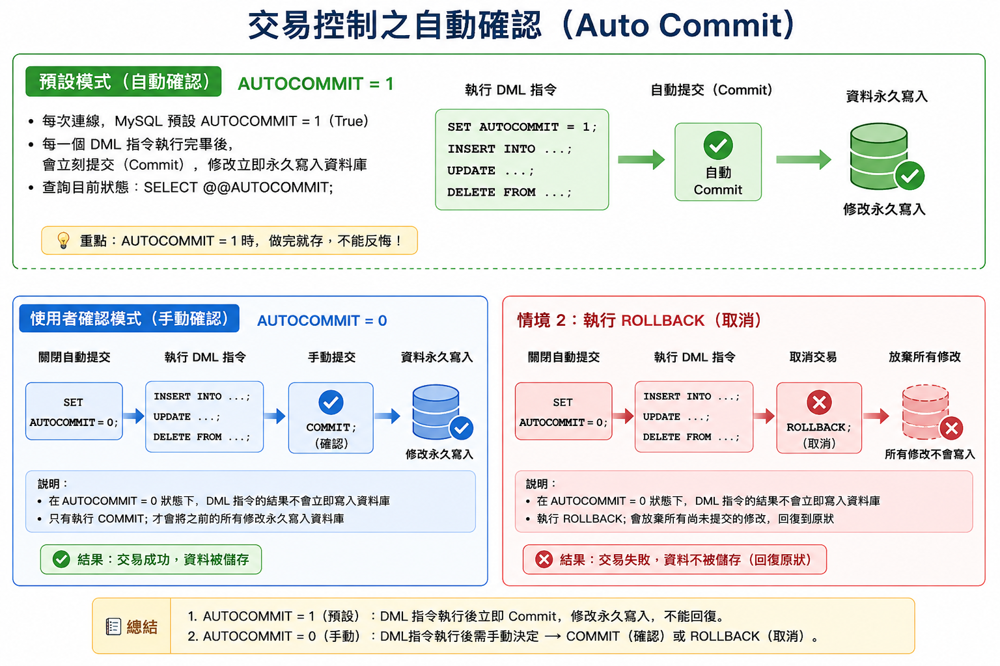

- MySQL只有InnoDB Type才支援交易處理
- MySQL 預設的DML交易控制是自動確認 (AUTOCOMMIT=1)
- 每次連線時,MySQL會將此變數設定成1(True)
- 每一個DML指令執行完畢後把它作出的修改立刻提交給資料庫並使之永久化
- 查詢交易控制現況: SELECT @@AUTOCOMMIT
- 可以將交易控制改變成使用者確認 (AUTOCOMMIT=0)
- 設定指令為: SET AUTOCOMMIT = 0
- 在此狀態下,DML指令執行結果不會提交給資料庫
- 只有當執行COMMIT指令時,之前的修改才會永久寫入資料庫
- 若執行ROLLBACK指令,則會放棄所有DML對資料之修改
```sql
#AUTOCOMMIT = 1
-- 開啟自動提交（通常預設就是1）
SET AUTOCOMMIT = 1;

-- 查詢目前狀態
SELECT @@AUTOCOMMIT;

-- DML 操作（會自動提交）
INSERT INTO table_name VALUES (...);

UPDATE table_name
SET column = value
WHERE condition;

DELETE FROM table_name
WHERE condition;

#AUTOCOMMIT = 0
-- 關閉自動提交
SET AUTOCOMMIT = 0;

-- 開始交易（可寫可不寫，但建議寫）
START TRANSACTION;

-- DML 操作（暫時不會寫入）
INSERT INTO table_name VALUES (...);

UPDATE table_name
SET column = value
WHERE condition;

DELETE FROM table_name
WHERE condition;

#ROLLBACK

SET AUTOCOMMIT = 0;

START TRANSACTION;

UPDATE emp SET sal = 5000 WHERE empno = 7369;

ROLLBACK;  -- 或 COMMIT;

SET AUTOCOMMIT = 1;
```
### COMMIT 確認交易
- 將資料儲存到資料庫中
- 釋放交易過程中的 Locking
- 刪除設定的儲存點(savepoint)
- 其他連線(sessions)的使用者將可以看到變更後的資料
- 無法再復原(Rollback)資料
- 此交易立即結束
```sql
START TRANSACTION;
INSERT INTO ...;
UPDATE ...;
DELETE FROM ...;
COMMIT;
```
### ROLLBACK 放棄交易
- 取消交易中資料的變更
- 釋放交易過程中的 Locking
- 刪除設定的儲存點(savepoint)
- 其他連線(sessions)的使用者立即可對資料做操作(DML)
- 此交易立即結束
```sql
START TRANSACTION;
INSERT INTO ...;
UPDATE ...;
DELETE FROM ...;
ROLLBACK;
```
### SAVEPOINT 設定交易儲存點
- 利用交易儲存點來設定交易Rollback的範圍
- 可透過交易儲存點將交易區分成數個段落
- 使用「SAVEPOINT name」在目前的交易中設定交易儲存點
- 若取同名,則先前的交易儲存點會被取消
- 使用「ROLLBACK TO name」回到指定的交易儲存點並將交易儲存點之後所產生的暫存資料遺棄
- 若省略name不寫,會Rollback整個交易
- 交易儲存點是邏輯上的觀念,無法顯示所設定的交易儲存點
- 使用「RELEASE SAVEPOINT name」移除交易儲存點
- ROLLBACK TO SAVEPOINT 可以將交易退回到指定儲存點位置,但不會結束交易
#### 交易儲存點 (SAVEPOINT)
- 在交易中,可以有很多個statement,用邏輯的交易階段控制有助於交易的進行,儲存點即是實作的方法。
- 儲存點的名稱有分大小寫
```sql
START TRANSACTION; /* 交易控制開始 */
dml_statement;
...
SAVEPOINT TX1; /* 邏輯交易階段T1 */
dml_statement;
...
SAVEPOINT TX2; /* 邏輯交易階段T2 */
dml_statement;
...
SAVEPOINT TX3; /* 邏輯交易階段T3 */
dml_statement;
...
ROLLBACK TO TX3;
ROLLBACK TO TX2;
ROLLBACK TO TX1;
ROLLBACK; /* 交易控制結束 */
```
<table header-row="true">
<tr>
<td>指令</td>
<td>是否結束交易</td>
<td>說明</td>
</tr>
<tr>
<td>SAVEPOINT</td>
<td>❌ 否</td>
<td>設一個回復點</td>
</tr>
<tr>
<td>ROLLBACK TO</td>
<td>❌ 否</td>
<td>回到某個儲存點</td>
</tr>
<tr>
<td>COMMIT</td>
<td>✅ 是</td>
<td>確認並結束交易</td>
</tr>
<tr>
<td>ROLLBACK</td>
<td>✅ 是</td>
<td>取消並結束交易</td>
</tr>
</table>
#### 交易控制 Controlling Transactions

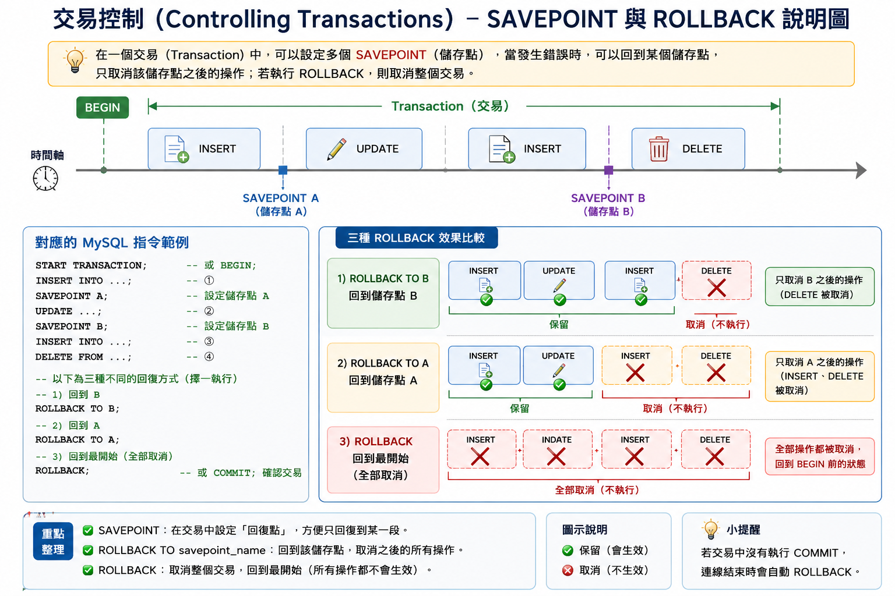
```sql
START TRANSACTION;

INSERT INTO ...;

SAVEPOINT A;

UPDATE ...;

SAVEPOINT B;

DELETE FROM ...;

-- 回到 B
ROLLBACK TO B;

-- 回到 A
ROLLBACK TO A;

-- 或全部取消
ROLLBACK;
```
## 資料定義語言（DDL / Data Definition Language）
### 儲存引擎 (Storage Engine)
- 儲存引擎(Storage Engine)是MySQL用來儲存資料的技術
- 不同的儲存引擎會有不同的資料儲存方式與運作特色
- MySQL提供多種儲存引擎,主要有三種
#### MyISAM:
MySQL早期預設的儲存引擎,支援的功能不像一般的資料庫那麼多(例如沒支援transaction);不過因為比較簡單,所以運作的效率相對也<br>比較好。
- 會建立以表格名稱為檔案名稱的三個檔案,附檔名分別為frm、MYD和MYI
- 以名為employee的表格為例
- employee.frm:儲存表格的結構與設定
- employee.MYD:儲存表格記錄資料
- employee.MYI:儲存表格索引資料
- MyISAM具有可攜性(portable)的特色,很容易複製一個資料庫到另外一台電腦<br>的MySQL伺服器中
- 使用MyISAM時,MySQL並不會限制一個資料庫中可以包含的表格數量;但一個表格會在檔案系統中建立三個檔案,若超過作業系統對檔案數量或容量的限制,就不能再建立任何新的表格
- 使用MyISAM儲存引擎可以避免違反檔案大小的限制
#### InnoDB:
MySQL目前預設的儲存引擎,所提供的功能已和大型的商用資料庫一樣,像是交易(transaction)、記錄鎖定(row-level locking) 與外來鍵<br>(foreign keys)
- InnoDB有兩種儲存類型: 共用表空間和獨立表空間,預設為獨立表空間
- 可以用下列指令查看: show variables like 'innodb_file_per_table';
- 獨立表空間
- 創建資料庫時會建立一個以此資料庫名稱為名稱的資料夾
- 每個表格建立以表格名稱為檔案名稱的ibd檔,並將此檔案儲存於所屬資料庫之資料夾中
- 共用表空間
- 將所有表格的資料皆置於下面三個檔案「ibdata1」、「ib_logfile0」和「ib_logfile1」中
- 因為所有表格會使用同一個儲存空間,所以不同資料庫的表格資料也會儲存在一起
- InnoDB限制在這個共用的儲存空間中不能超過兩百萬個表格
- 使用此種儲存類型可以避免違反檔案數量的限制
#### MEMORY:
把資料儲存在紀憶體中,運作的效率是最快的;但只要MySQL伺服器關閉後,儲存的資料就會全部消失
- 和InnoDB一樣,在檔案系統中儲存的檔案只有frm檔
- MEMORY將所有表格的資料皆置於記憶體中
- 不適合儲存大量資料的表格,會耗用太多記憶體
### 字元集 (Character Set) 與字元序 (Collation)
- 在資料的存儲上,MySQL提供了不同的字元集支援。而在資料的對比操作上,則提供了不同的字元序支援
#### 字元集 (Character Set)
- 字元集:定義了字元以及字元的編碼
- 為了要處理不同語言的文字,MySQL使用一套編碼來處理一種語言的文字,此一編碼謂之「Character Set」
- 例如MySQL有big5、latin1、ascii、utf8、utf16、...等,預設的字元集是utf8
- 不同的字元集會影響字串的儲存空間
- 使用「SHOW CHARSET」可顯示MySQL所有支援的字元集
- MySQL的字元集可設定在整個資料庫,或單一表格上,甚或某一特定的字串欄位;同理Collation
#### 字元序 (Collation)
- 字元序:定義了字元的比較規則
- 在一個字元集中,所有字元的大小排序規則謂之
- 若以英文字母而言,大小順序是依照編碼的大小來決定,MySQL稱為「binary collation」
- 若大寫和小寫字母被當成是一樣的大小,然後再依照編碼來決定,MySQL稱為「case-insensitive collation」
- 以繁體中文而言,是沒有區分大小寫的
- 每個 Character set 都有數種 Collation 可搭配
- 使用「SHOW COLLATION」可顯示所有支援的 Collation
- 每一種字元集都有預設的Collation
- MySQL目前預設的字元集是「utf8mb4」,預設的Collation是「utf8mb4_0900_ai_ci」
- ci:case insensitive
- cs:case sensitive
- 是否區分大小寫的collation設定會影響排序的結果
<table header-row="true">
<tr>
<td>Collation</td>
<td>大小寫</td>
<td>重音</td>
<td>說明</td>
</tr>
<tr>
<td>ai_ci</td>
<td>不分</td>
<td>不分</td>
<td>最寬鬆</td>
</tr>
<tr>
<td>as_ci</td>
<td>不分</td>
<td>分</td>
<td>分重音但不分大小寫</td>
</tr>
<tr>
<td>as_cs</td>
<td>分</td>
<td>分</td>
<td>最嚴格</td>
</tr>
<tr>
<td>ai_cs</td>
<td>分</td>
<td>不分</td>
<td>分大小寫但不分重音</td>
</tr>
</table>
<table header-row="true">
<tr>
<td>後綴</td>
<td>意思</td>
</tr>
<tr>
<td>_ci</td>
<td>不分大小寫（case insensitive）</td>
</tr>
<tr>
<td>_cs</td>
<td>區分大小寫（case sensitive）</td>
</tr>
<tr>
<td>_bin</td>
<td>用二進位比較（最嚴格）</td>
</tr>
</table>
<table header-row="true">
<tr>
<td>縮寫</td>
<td>全名</td>
<td>意思</td>
<td>比較方式</td>
</tr>
<tr>
<td>ai</td>
<td>accent insensitive</td>
<td>不分重音</td>
<td>`e = é = è`</td>
</tr>
<tr>
<td>as</td>
<td>accent sensitive</td>
<td>分重音</td>
<td>`e ≠ é ≠ è`</td>
</tr>
</table>
- MySQL支援多種字元集與字元序
- 一個字元集對應至少一種字元序(一般是1對多)
- 兩個不同的字元集不能有相同的字元序
- 每個字元集都有預設的字元序
- MySQL在新增資料庫及新增表格時,都可以指定字元集及字元序
### 資料庫物件 (Database Objects)
- 資料庫物件是定義在資料庫中用來儲存資料或存取資料的物件
- 常見的資料庫物件:
- 資料表(table)、資料限制條件(Constraints)
- 視觀表(View) 、索引(Index)
- 使用者帳號(User Account)
- 內儲程式(Stored Program) ...等
- 資料庫物件的維護命令
- 新建物件 : CREATE
- 修改物件 : ALTER
- 刪除物件 : DROP
#### 資料表 (Database Tables)
- 最主要的資料庫物件(Database Object)
- 資料庫中儲存資料的物件
- 主要由欄位(Column)及資料列(Row)所組成
- 欄位(Column)
- 每一個欄位都必須命名而且必須設定資料型態和資料長度, 用來存放欄位資料
- 資料列(Row)
- 資料列是資料表中的一筆記錄資料
### 新建資料表 (CREATE TABLE)
### 定義資料表 (Defining Tables)
<table header-row="true">
<colgroup>
<col width="112">
<col width="78">
<col>
<col>
<col>
</colgroup>
<tr>
<td></td>
<td>類別</td>
<td>項目</td>
<td>說明</td>
<td>範例</td>
</tr>
<tr>
<td></td>
<td>🔹 必要</td>
<td>資料表名稱 (Table name)</td>
<td>表的名稱</td>
<td>`emp`</td>
</tr>
<tr>
<td></td>
<td>🔹 必要</td>
<td>欄位名稱 (Column names)</td>
<td>每個欄位名稱</td>
<td>`empno, ename`</td>
</tr>
<tr>
<td></td>
<td>🔹 必要</td>
<td>資料型態 (Data types)</td>
<td>欄位的資料類型</td>
<td>`INT, VARCHAR`</td>
</tr>
<tr>
<td></td>
<td>🔹 必要</td>
<td>資料長度 (Column size)</td>
<td>欄位長度限制</td>
<td>`VARCHAR(50)`</td>
</tr>
<tr>
<td>欄位預設值(Default)</td>
<td>🔸 選擇</td>
<td>預設值 (Default)</td>
<td>未給值時使用</td>
<td>`DEFAULT 0`</td>
</tr>
<tr>
<td>資料檢查條件(Constraints)</td>
<td>🔸 選擇</td>
<td>NOT NULL</td>
<td>不可為空</td>
<td>`ename NOT NULL`</td>
</tr>
<tr>
<td></td>
<td>🔸 選擇</td>
<td>PRIMARY KEY</td>
<td>主鍵（唯一 + 不為空）</td>
<td>`empno PRIMARY KEY`</td>
</tr>
<tr>
<td></td>
<td>🔸 選擇</td>
<td>UNIQUE</td>
<td>不可重複</td>
<td>`email UNIQUE`</td>
</tr>
<tr>
<td></td>
<td>🔸 選擇</td>
<td>FOREIGN KEY</td>
<td>外鍵關聯其他表</td>
<td>`deptno REFERENCES dept(deptno)`</td>
</tr>
<tr>
<td></td>
<td>🔸 選擇</td>
<td>CHECK</td>
<td>資料條件限制</td>
<td>`CHECK (sal > 0)`</td>
</tr>
</table>
### 新建資料表
1. 要有建立資料表的權限
2. 必需指定資料表與欄位名稱,最大長度64 bytes
3. 以字母開頭,符號可用_或\$
4. 不可使用系統保留字
5. 在同一個資料庫中,不可有相同名稱的資料表
CREATE TABLE TableName<br>( ColumnName type,...); {color="gray_bg"}
<table header-row="true">
<tr>
<td>名稱</td>
<td>中文說明</td>
<td>用途</td>
<td>範例</td>
</tr>
<tr>
<td>TableName</td>
<td>表格名稱</td>
<td>定義資料表名稱</td>
<td>`emp`</td>
</tr>
<tr>
<td>ColumnName</td>
<td>欄位名稱</td>
<td>定義欄位名稱</td>
<td>`empno`, `ename`</td>
</tr>
<tr>
<td>Type</td>
<td>欄位資料型態（含長度）</td>
<td>定義欄位資料格式</td>
<td>`INT`, `VARCHAR(50)`</td>
</tr>
</table>
```sql
CREATE TABLE DEPT
( DEPTNO SMALLINT(4),
DNAME VARCHAR(14),
LOC VARCHAR(13)
);
```
### 欄位資料型態(Column Data Types)
#### 數值資料（Numeric Types）
<table header-row="true">
<tr>
<td>型態</td>
<td>說明</td>
</tr>
<tr>
<td>TINYINT</td>
<td>很小的整數</td>
</tr>
<tr>
<td>SMALLINT</td>
<td>小整數</td>
</tr>
<tr>
<td>MEDIUMINT</td>
<td>中整數</td>
</tr>
<tr color="yellow_bg">
<td>INT / INTEGER</td>
<td>一般整數</td>
</tr>
<tr>
<td>BIGINT</td>
<td>大整數</td>
</tr>
<tr>
<td>FLOAT(p)</td>
<td>單精度浮點數（指定精度）</td>
</tr>
<tr>
<td>FLOAT</td>
<td>單精度浮點數</td>
</tr>
<tr>
<td>DOUBLE / REAL</td>
<td>雙精度浮點數</td>
</tr>
<tr color="yellow_bg">
<td>DECIMAL(M, D)</td>
<td>精確數值（總位數 M，小數位 D）</td>
</tr>
<tr>
<td>NUMERIC(M, D)</td>
<td>與 DECIMAL 類似</td>
</tr>
</table>
#### 文字資料（String / Text Types）
<table header-row="true">
<tr>
<td>型態</td>
<td>說明</td>
</tr>
<tr>
<td>CHAR(M)</td>
<td>固定長度字串</td>
</tr>
<tr color="yellow_bg">
<td>VARCHAR(M)</td>
<td>可變長度字串</td>
</tr>
<tr>
<td>TINYBLOB / TINYTEXT</td>
<td>小型二進位 / 文字</td>
</tr>
<tr>
<td>BLOB / TEXT</td>
<td>中型二進位 / 文字</td>
</tr>
<tr>
<td>MEDIUMBLOB / MEDIUMTEXT</td>
<td>大型二進位 / 文字</td>
</tr>
<tr>
<td>LONGBLOB / LONGTEXT</td>
<td>超大型二進位 / 文字</td>
</tr>
</table>
#### 日期時間資料（Date & Time Types）
<table header-row="true">
<tr>
<td>型態</td>
<td>說明</td>
</tr>
<tr color="yellow_bg">
<td>DATE</td>
<td>日期（YYYY-MM-DD）</td>
</tr>
<tr color="yellow_bg">
<td>DATETIME</td>
<td>日期 + 時間</td>
</tr>
<tr>
<td>TIMESTAMP</td>
<td>時間戳（自動更新）</td>
</tr>
<tr>
<td>TIME</td>
<td>時間</td>
</tr>
<tr>
<td>YEAR</td>
<td>年份</td>
</tr>
</table>
### IF NOT EXISTS 選項
CREATE TABLE \[IF NOT EXISTS\] TableName<br>( ColumnName type,...); {color="gray_bg"}
- 若資料表已存在,則不建立資料表
- 若資料表不存在,則建立資料表
```sql
CREATE TABLE IF NOT EXISTS DEPT
( DEPTNO SMALLINT(4),
DNAME VARCHAR(14),
LOC VARCHAR(13)
);
```
### 設定資料表儲存引擎
CREATE TABLE TableName<br>( ColumnName type,...)<br>\{ENGINE = \{BDB\|HEAP\|ISAM\|InnoDB\| {color="gray_bg"}
MERGE\|MRG_MYISAM\|MYISAM\}; {color="gray_bg"}
```sql
CREATE TABLE IF NOT EXISTS dept
( deptno smallint(4),
dname varchar(14),
loc varchar(13)
) ENGINE = InnoDB;

#註:沒有指定 ENGINE 時,其預定的類型由參數 default-storage-engine 控制
```

### 使用現有資料表來建立新的資料表
- 使用子查詢建立新的資料表
CREATE TABLE TableName<br>AS<br>SELECT ColumnName,...<br>FROM TableName<br>WHERE ... {color="gray_bg"}
- 新創建之表格欄位名稱與子查詢中欄位同名
- 亦可在子查詢中使用欄位別名,此別名會成為新建資料表之欄位名稱
- 子查詢的資料會新增到新建的資料表中,若不需要資料則可在子查詢中設定 WHERE 1= 0
- 只有不為空值的檢查條件會被保留在新的資料表中,其餘的Constraint均不存在
```sql
CREATE TABLE EMP10
AS
SELECT EMPNO, ENAME, JOB, SAL
FROM EMP
WHERE DEPTNO = 10;
Query OK, 3 rows affected (0.26 sec)
Records: 3 Duplicates: 0 Warnings: 0
```
### 使用LIKE子句建立資料表
CREATE TABLE TableName LIKE Source_TableName; {color="gray_bg"}
- 使用既存的資料表結構建立新資料表
- 此種方法不會有資料的新增,只有結構定義部份
- 無法指定欄位名稱,和來源資料表欄位同名
- 要新增資料請再使用Insert into with Sub-Query方法
```sql
CREATE TABLE emp1 LIKE emp;
```
### 衍生欄位 (Generated Column)
col_name data_type \[GENERATED ALWAYS\] AS (expression)<br>\[VIRTUAL \| STORED\] \[UNIQUE \[KEY\]\] \[COMMENT comment\]<br>\[\[NOT\] NULL\] \[\[PRIMARY\] KEY\] {color="gray_bg"}
- MySQL 5.7.6開始支持衍生欄位這個特性
- 所谓衍生欄位,就是資料表中這一欄位是由其他欄位計算而得
- 例如: 直角三角形的斜邊長度可由另外兩個邊的邊長計算出來
- 例如: 訂單項目中可由商品單價及購買數量計算出此項目小計金額
- 衍生欄位儲存方式有兩種 :
- VIRTUAL: 衍生欄位的值不會儲存,每次查詢時即時計算,此為預設方式
- STORED: 衍生欄位的值永久儲存,每次新增或修改時會計算出其值並儲存
```sql
CREATE TABLE triangle (
sidea DOUBLE,
sideb DOUBLE,
sidec DOUBLE AS (SQRT(sidea * sidea + sideb * sideb));

#不用新增sidec 就會生出sidec
INSERT INTO triangle (sidea, sideb) VALUES(1,1),(3,4),(6,8);
```
#### 衍生欄位使用規則
- 支援 MySQL 內建的各種函數,包括MIN,MAX,SUBSTRING 等函數
- 不支援 CONNECTION_ID(),NOW() 這一類函數,因為這些函數的返回值會隨時變化
- 不支援預存程序和預存函數
- 不支援子查詢
- 可以針對普通列的資料進行計算,也可以使用其他衍生欄位的資料進行計算
- SQL_MODE 的設置可能會影響計算的結果,使用時需要注意
- CREATE TABLE ... LIKE ... 生成的新表會複製衍生欄位的定義
- 可以使用衍生欄位作為外鍵
- 可以使用衍生欄位創建索引。
### enum 資料型態
- MySQL 中的 ENUM 資料型態是一個字串物件,它僅允許儲存有限的字串值,而這些允許儲存的有限值是在創建表格時宣告
- ENUM 值在內部儲存為整數 (1、2、3 等),這比儲存字串更節省空間
- MySQL 根據 ENUM 值的索引號(而不是實際的字串)對其進行排序
- ENUM 欄位最多可包含 65,535 個不同的元素。如果列舉值數量不超過255 個,則佔用1 個位元組;如果超過 255 個,則佔用2 個位元組
- ENUM 欄位可以接受各種資料類型的值,包括整數、浮點數、小數和字串
- 如果想要修改列舉值/成員,必須使用 ALTER TABLE 指令重建整個表格來完成
- MySQL 中的 ENUM 適合具有有限且不變的值集的欄位
- ENUM 是一個字串物件,其值是從建立欄位時所定義的允許值清單中挑選的
column_name ENUM('value1', 'value2', ..., 'valueN'); {color="gray_bg"}
```sql
CREATE TABLE tickets (
id INT PRIMARY KEY AUTO_INCREMENT,
title VARCHAR(255) NOT NULL,
priority ENUM('Low', 'Medium', 'High') NOT NULL);
```
- 新增資料時,其值必須從建立欄位時所定義的允許值清單中挑選,也可以用索引值指定
- 若此欄位設定 NOT NULL,且新增資料時沒有指定其值, 則使用第一個列舉值為其預設值
```sql
INSERT INTO tickets(title, priority)
VALUES('Scan virus for computer A', 'High');

INSERT INTO tickets(title, priority)
VALUES('Upgrade Windows OS for all computers', 1);

INSERT INTO tickets(title)
VALUES('Refresh the computer of Ms. Lily');
```
- 查詢資料時,可比對其字串值或索引值。排序則依據索引值
```sql
SELECT * FROM tickets
WHERE priority = 'High'; -- priority = 1

#排序
SELECT * FROM tickets
ORDER BY priority DESC;
```
### 資料檢查條件 (Database Constraints)
- 用來檢查資料表的資料(data validation)
#### 欄位預設值 (Default)
- 設定欄位預設值
- expr 需是常值(Literial),不可以是函數或運算式
- MySQL資料庫中,所有欄位皆有預設值,如果不設定其預設值為空值(NULL)
ColumnName type \[NOT NULL\]\|\[NULL\] DEFAULT expr {color="gray_bg"}
```sql
CREATE TABLE EMP
( ...,
BRITHDATE DATE,
SEX CHAR(1) DEFAULT 'M',
...
);
```
#### 不允許空值 (NOT NULL)
- 不為空值檢查(一定要輸入資料)
- NOT NULL: 該column所有的rows均要輸入資料
ColumnName type \[NOT NULL\]\|\[NULL\] {color="gray_bg"}
```sql
CREATE TABLE EMP
( EMPNO SMALLINT NOT NULL,
ENAME VARCHAR(10) NOT NULL,
JOB VARCHAR(9),
MGR SMALLINT,
HIREDATE DATE,
SAL INT,
COMM INT,
DEPTNO SMALLINT
);
```
#### 主鍵 (Primary key)
- 主鍵(PK):
- 一個資料表中只能有一個主鍵
- 適用一個欄位構成的主鍵
ColumnName type PRIMARY KEY {color="gray_bg"}
```sql
CREATE TABLE DEPT122
(
DEPTNO SMALLINT(4) PRIMARY KEY, #在欄位階層設定
DNAME VARCHAR(14),
LOC VARCHAR(13)
);
```
- 複合主鍵(由多個欄位構成)
- CONSTRAINT const_name: 為主鍵命名
CREATE TABLE table<br>( ...,<br>ColumnName type NOT NULL,<br>...,<br>\[CONSTRAINT const_name\] PRIMARY KEY(column,...)<br>); {color="gray_bg"}
```sql
CREATE TABLE ITEM12
( ORDID INT NOT NULL,
ITEMID SMALLINT NOT NULL,
.. ..
CONSTRAINT PK_ITEM12_ORDID_ITEMID PRIMARY KEY(ORDID,ITEMID)
); #在資料表階層 因為有多個欄位都是pk 寫在最後面

多個pk 要合起來一起看，所以要看多個pk的組合為唯一

PK_ITEM12_ORDID_ITEMID
種類_表格_欄位1_欄位2
```
#### AUTO_INCREMENT 選項
- 欄位資料自動編號
- 欄位的資料型態必需是數值型態
- 預設起始值是1
- 需與Primary key或Unique key配合使用
- 一個表格只能設一個
- LAST_INSERT_ID() : 取得最近一次自動產生的編號
```sql
#起始值1
CREATE TABLE ORD2
( ORDID INT AUTO_INCREMENT PRIMARY KEY,
ORD_DATE DATE,
...
);
```
- 欄位自動編號(設定起始號碼)
- start 設定起始號碼
CREATE TABLE TableName<br>(ColumnName type AUTO_INCREMENT,<br>...,<br>) AUTO_INCREMENT = start ; {color="gray_bg"}
```sql
CREATE TABLE ORD2
( ORDID INT AUTO_INCREMENT PRIMARY KEY,
ORD_DATE DATE,
...,
) AUTO_INCREMENT = 101 ;
```
#### AUTO_INCREMENT 選項
- 新增資料列(INSERT)時,對於AI之欄位若不給值、給定NULL或給定0,則系統自動編號
- 新增資料列(INSERT)時,對於AI之欄位若設定重複之值,設出現系統錯誤
- 新增資料列(INSERT)時,對於AI之欄位若設定值大於所有已存在之值(例:20),則下次新增時,則從此值加1(例: 21)開始
- 若在交易中新增資料列(INSERT)時,當取消交易(ROLLBACK),AI值不會回復
- 修改資料(UPDATE)時,對於AI之欄位若設定重複之值,設出現系統錯誤
- 修改資料(UPDATE)時,對於AI之欄位若設定值大於所有已存在之值(例:20),則下次新增時,則從此值加1(例: 21)開始
- 刪除資料時(DELETE)時,刪除資料列之AI欄位值,不會回收再使用
- 對於每個連線, LAST_INSERT_ID() 之值,不受其他連線之影響
#### 唯一鍵 (Unique key)
<table header-row="true">
<tr>
<td>特性</td>
<td>說明</td>
</tr>
<tr>
<td>唯一性</td>
<td>不可重複</td>
</tr>
<tr>
<td>可為 NULL</td>
<td>⭕ 可以（MySQL 可有多個 NULL）</td>
</tr>
<tr>
<td>數量</td>
<td>一個表可以有多個 UNIQUE</td>
</tr>
<tr>
<td>本質</td>
<td>會建立唯一索引</td>
</tr>
</table>
- 單一欄位唯一鍵
CREATE TABLE TableName<br>( ...,<br>ColumnName type UNIQUE,<br>...,<br>); {color="gray_bg"}
```sql
CREATE TABLE STUDENT
( SID INT PRIMARY KEY,
SEMAIL VARCHAR(30) UNIQUE,
SNAME VARCHAR(10)
);
```
- 複合唯一鍵(由多個欄位構成)
- const_name 為唯一鍵命名
CREATE TABLE TableName<br>( ...,<br>ColumnName type,<br>...,<br>\[CONSTRAINT const_name\] UNIQUE(column,...)<br>); {color="gray_bg"}
```sql
CREATE TABLE ITEM
( ORDID INT NOT NULL,
ITEMID SMALLINT NOT NULL,
PRODID SMALLINT,
CONSTRAINT UK_ITEM_ORDID_PRODID UNIQUE(ORDID,PRODID)
);
```
#### 外來鍵 (Foreign key)
#### 外來鍵
- 外來鍵與參考的資料表須是InnoDB 儲存引擎類型
- 外來鍵的欄位數需和 parent table的主鍵或唯一鍵欄位數量相同
```sql
CREATE TABLE T1
(
PK INT NOT NULL PRIMARY KEY,
FK INT ,
CONSTRAINT FK_T1_FK FOREIGN KEY(FK) REFERENCES T1(PK)
) ENGINE =INNODB;
CREATE TABLE T2
(
FK INT,
CONSTRAINT FK_T2_FK FOREIGN KEY(FK) REFERENCES T1(PK)
) ENGINE =INNODB;
```
```sql
CREATE TABLE DEPARTMENT
( DEPTNO SMALLINT NOT NULL PRIMARY KEY,
DNAME VARCHAR(14),
LOC VARCHAR(13)
) ENGINE = INNODB;
CREATE TABLE EMPLOYEE
( EMPNO SMALLINT NOT NULL PRIMARY KEY,
ENAME VARCHAR(14),
JOB VARCHAR(13),
MGR SMALLINT,
HIREDATE DATE,
SAL INT,
COMM INT,
DEPTNO SMALLINT,
EMAL VARCHAR(200) UNIQUE,
CONSTRAINT FK_EMP_MGR FOREIGN KEY(MGR) REFERENCES EMPLOYEE(EMPNO),
CONSTRAINT FK_EMP_DEPTNO FOREIGN KEY(DEPTNO) REFERENCES DEPARTMENT(DEPTNO)
) ENGINE = INNODB;
```
#### 外來鍵資料的刪除與修改
- ON DELETE 資料刪除時
- ON UPDATE 資料更新時
- RESTRICT 限制
- CASCADE 相依性
- SET NULL 設成空值
CREATE TABLE table<br>( ...,<br>fK_definition<br>\[ON DELETE \{RESTRICT\|CASCADE\|SET NULL\}\]\|<br>\[ON UPDATE \{RESTRICT\|CASCADE\|SET NULL\}\]<br>); {color="gray_bg"}
<table header-row="true">
<tr>
<td>選項</td>
<td>行為</td>
</tr>
<tr>
<td>RESTRICT</td>
<td>❌ 不准改</td>
</tr>
<tr>
<td>CASCADE</td>
<td>🔄 子表一起改</td>
</tr>
<tr>
<td>SET NULL</td>
<td>➡ 子表設為 NULL</td>
</tr>
<tr>
<td>NO ACTION</td>
<td>類似 RESTRICT</td>
</tr>
</table>
#### ON UPDATE RESTRICT
```sql
CREATE TABLE emp (
eno char(3) PRIMARY KEY,
ename varchar(30),
dno INT,
FOREIGN KEY(dno) REFERENCES dept(dno)
ON UPDATE RESTRICT
);
```

#### ON UPDATE CASCADE
```sql
CREATE TABLE emp (
eno char(3) PRIMARY KEY,
ename varchar(30),
dno INT,
FOREIGN KEY(dno) REFERENCES dept(dno)
ON UPDATE CASCADE
);

UPDATE dept SET dno = 300
WHERE dno = 200;
```
#### ON UPDATE SET NULL
```sql
CREATE TABLE emp (
eno char(3) PRIMARY KEY,
ename varchar(30),
dno INT,
FOREIGN KEY(dno) REFERENCES dept(dno)
ON UPDATE SET NULL
);

UPDATE dept SET dno = 300
WHERE dno = 200;
```
#### ON DELETE RESTRICT
```sql
CREATE TABLE emp (
eno char(3)PRIMARY KEY,
ename varchar(30),
dno INT,
FOREIGN KEY(dno) REFERENCES dept(dno)
ON DELETE RESTRICT
);

DELETE FROM dept
WHERE dno = 200;
```
#### ON DELETE CASCADE
```sql
CREATE TABLE emp (
eno char(3) PRIMARY KEY,
ename varchar(30),
dno INT,
FOREIGN KEY(dno) REFERENCES dept(dno)
ON DELETE CASCADE
);

DELETE FROM dept
WHERE dno = 200;
```
#### ON DELETE SET NULL
```sql
CREATE TABLE emp (
eno char(3) PRIMARY KEY,
ename varchar(30),
dno INT,
FOREIGN KEY(dno) REFERENCES dept(dno)
ON DELETE SET NULL
);

DELETE FROM dept
WHERE dno = 200;
```
#### 資料檢測 (Check) - (MySQL 8.0.16以後版本支援)
#### 單一欄位限制
無法新增出現錯誤訊息
```sql
INSERT INTO parts(part_no, description,cost,price)
VALUES('A-001','Cooler',0,-100);

Error Code: 3819. Check constraint 'parts_chk_2' is
violated.
```
#### 多欄位限制
SHOW CREATE TABLE parts;
```sql
check(布林值)

CREATE TABLE parts
( part_no VARCHAR(18) PRIMARY KEY,
description VARCHAR(40),
cost DECIMAL(10,2 ) NOT NULL CHECK (cost >= 0),
price DECIMAL(10,2) NOT NULL CHECK (price >= 0),
CONSTRAINT parts_chk_price_gt_cost CHECK(price >= cost)
);
```
無法新增出現錯誤訊息
```sql
INSERT INTO parts(part_no, description,cost,price)
VALUES('A-001','Cooler',200,100);

Error Code: 3819. Check constraint 'parts_chk_price_gt_cost' is
violated.
```

- 可在建立資料表時指定或於資料表建立後加入
- 欄位階層(Column Level)
- 資料表階層(Table Level)
### 修改結構
#### 資料表的維護 (Managing Tables)
- 資料表可以修改其結構
- 新增、修改、刪除欄位
- 新增、刪除資料檢查條件
- 修改資料表名稱或欄位名與註解
- Rename
- Comment
- 可以刪除資料表的結構或資料
- 刪除資料
- DELETE , TRUNCATE
- 刪除資料及結構
- DROP TABLE
#### 新增一個新欄位 (Adding a Column)
- 加入新欄位
- Column_Definition 欄位的定義
- FIRST 新增在第一個欄位
- AFTER column 新增在指定欄位後
- 預設為新增在最後一個欄位之後
ALTER TABLE TableName<br>ADD \[COLUMN\] Column_Definition \[FIRST\|AFTER column\];<br>OR<br>ALTER TABLE TableName<br>ADD \[COLUMN\] (Column_Definition,...); {color="gray_bg"}
```sql
ALTER TABLE EMP10
ADD COLUMN MGR SMALLINT;

ALTER TABLE EMP10
ADD COLUMN HIREDATE DATE AFTER JOB;

--新增為第一個欄位
ALTER TABLE emp10
ADD PHONE varchar(12) DEFAULT '02-66316710' FIRST;
```

#### 新增多個新欄位 (Adding Columns)
```sql
ALTER TABLE EMP10
ADD COLUMN(COMM INT, DEPTNO SMALLINT, EMAIL VARCHAR(200));
```
#### 修改欄位定義 (Modifying a column)
- 修改欄位定義
- 修改欄位預設值
- 修改欄位資料型態
- 修改欄位順序
ALTER TABLE TableName<br>ALTER \[COLUMN\] column \{SET DEFAULT literal\|DROP DEFAULT\}; {color="gray_bg"}
ALTER TABLE TableName<br>MODIFY \[COLUMN\] column_definition \[FIRST\|AFTER column\]; {color="gray_bg"}
- 修改欄位預設值 (取消預設值設定)
```sql
ALTER TABLE EMP10
ALTER PHONE DROP DEFAULT;
```
- 修改欄位資料型態/順序
```sql
ALTER TABLE EMP10
MODIFY COLUMN MGR INT AFTER JOB;
```
- 修改欄位資料型態/ NOT NULL
```sql
ALTER TABLE EMP10
MODIFY COLUMN ENAME VARCHAR(20) NOT NULL;
```

#### 更改欄位名稱 (Rename the Name of Column)
- 更改欄位名稱/定義
- old_column 舊欄位名稱
- New_column_definition 新欄位定義
ALTER TABLE TableName<br>CHANGE \[COLUMN\] old_column New_column_definition; {color="gray_bg"}
- 更改欄位名稱
```sql
ALTER TABLE EMP10
CHANGE COLUMN SAL SALARY SMALLINT;
```

#### 刪除欄位 (Dropping a column)
- 欄位有無資料皆可刪除,資料表最少留一個欄位
ALTER TABLE TableName<br>DROP \[COLUMN\] ColumnName; {color="gray_bg"}
```sql
ALTER TABLE dept1
DROP COLUMN loc;
```

#### 新增資料檢查條件 (Adding a Constraint)
- 加入資料檢查條件
- const_name 限制條件名稱
- constraint_type 限制條件種類
- NOT NULL constraint 請用MODIFY句子
ALTER TABLE TableName<br>ADD \[CONSTRAINT const_name\] constraint_type; {color="gray_bg"}
- 加入資料檢查條件
```sql
/* 新增主鍵 */
ALTER TABLE EMP10
ADD CONSTRAINT PK_EMP10_EMPNO PRIMARY KEY(EMPNO);
/* 新增外來鍵 */
ALTER TABLE EMP10
ADD CONSTRAINT FK_EMP10_MGR FOREIGN KEY(MGR)

REFERENCES EMP10(EMPNO);

/* 新增唯一鍵 */
ALTER TABLE EMP10
ADD CONSTRAINT UK_EMP10_EMAIL UNIQUE(EMAIL);
```

#### 刪除資料檢查條件 (Drop a Constraint)
ALTER TABLE table<br>DROP \[PRIMARY KEY\|FOREIGN KEY ConstraintName \| {color="gray_bg"}
INDEX ConstraintName\]; {color="gray_bg"}
```sql
/* 刪除外來鍵 */
ALTER TABLE EMP10
DROP FOREIGN KEY FK_EMP10_MGR;
/* 刪除主鍵 */
ALTER TABLE EMP10
DROP PRIMARY KEY;

/* 刪除唯一鍵 */
ALTER TABLE EMP10
DROP INDEX UK_EMP10_EMAIL;
```
- 刪除UNIQUE key
```sql
#1. 新增 UNIQUE 約束
ALTER TABLE EMP10
ADD CONSTRAINT EMP10_ENAME_UK UNIQUE(ENAME);

#結果：

#ENAME 欄位 不能重複
#系統建立一個唯一索引 EMP10_ENAME_UK

#2. 嘗試更新為重複值

UPDATE EMP10
SET ENAME='CLARK'
WHERE EMPNO=7934;

#錯誤:
#ERROR 1062: Duplicate entry 'CLARK'
#表中已經有 ENAME = 'CLARK'
#UNIQUE 限制不允許重複

#3. 刪除 UNIQUE 約束
ALTER TABLE EMP10
DROP INDEX EMP10_ENAME_UK;

#結果：

#移除唯一限制
#ENAME 可以重複

#4. 再次更新

UPDATE EMP10
SET ENAME='CLARK'
WHERE EMPNO=7934;

#結果：

#成功更新
#因為已沒有 UNIQUE 限制
```

#### 資料表改名 (Managing the Name of Table)
- 資料表重新命名
ALTER TABLE TableName<br>RENAME \[TO\] new_table; {color="gray_bg"}
- 將 EMP10 改名為 EMP10A
```sql
ALTER TABLE EMP10
RENAME TO EMP10A;
```
#### 更改資料表儲存引擎類型
- 更改儲存引擎類型
ALTER TABLE TableName<br>ENGINE = type; {color="gray_bg"}
```sql
ALTER TABLE EMP10A
ENGINE = INNODB;
```
#### 截斷資料表中的資料 (Truncating a Table)
- 刪除資料表中的所有資料 — 表格本身還在
- 釋出所使用的磁碟空間 — 刪掉之後就不能回復
- 保留資料表的結構
TRUNCATE TABLE TableName; {color="gray_bg"}
```sql
TRUNCATE TABLE EMP10A;
```
#### 刪除資料表 (Dropping a Table)
- 刪除資料表的所有資料及結構 —全刪，連表格一起刪
DROP TABLE TableName; {color="gray_bg"}
```sql
DROP TABLE EMP10A;
```
### 視觀表(View)
視觀表(View)是藉由SELECT查詢結果動態組合生成的虛擬資料表(Virtual Table)
- 視觀表(View)物件中只有查詢定義(SELECT),而該查詢所使用的資料表稱為基底資料表(Base Tables)
- 視觀表所呈現的結果和資料表(Table)類似
- 由 rows and columns 所組成
- Views本身並不儲存任何的資料,基底資料表(Base Tables) 才是真正儲存資料的<br>地方
```sql
CREATE VIEW empvu10
AS
SELECT empno, ename, sal, job
FROM emp  -- 基底資料表(Base Tables)
WHERE deptno = 10;
```
- 使用上有如的資料表(table)
- 所有的查詢語法(SELECT)都可以在View上操作
- DML: 新增、刪除、更新資料,則會受限制
資料表(table)是一種實體結構 (Physical Structure)<br>視觀表(View)是一種虛擬結構 (Virtual Structure) {color="yellow_bg"}
### 特性
<table header-row="true">
<tr>
<td>功能</td>
<td>說明</td>
</tr>
<tr>
<td>🔹 隱藏資訊（安全性）</td>
<td>隱藏實體資料表結構，只讓使用者看到指定欄位</td>
</tr>
<tr>
<td>🔹 權限控制</td>
<td>可限制使用者只能查詢特定資料</td>
</tr>
<tr>
<td>🔹 唯讀特性</td>
<td>可設為唯讀，避免使用者修改資料</td>
</tr>
<tr>
<td>🔹 簡化查詢</td>
<td>將複雜的 SELECT 包裝起來，使用更簡單</td>
</tr>
<tr>
<td>🔹 資料獨立性</td>
<td>表結構改變時，只需修改 View，不用改程式</td>
</tr>
<tr>
<td>🔹 資料多樣化</td>
<td>同一資料表可建立多個不同 View</td>
</tr>
</table>
### 視觀表類別 (View types)
- 簡單視觀表(Simple Views)
- 只有一個基底資料表(Base Table)-沒有 JOIN
- 沒有使用函數或做資料分組
- 可更新的檢視表(Updateable View)
- 複雜視觀表(Complex Views)
- 一個以上的基底資料表(Base Table)- JOIN
- 有使用函數或做資料分組
- 不可更新的視觀表 (不能用view 做新增修改查詢)
### 建立視觀表 (Creating a View)
- CREATE VIEW 命令
- 如果加上「OR REPLACE」子句的意思就是<span color="yellow_bg">若同名的 View 已經存在就覆蓋取代它</span>
- 如果 View 已存在,可以把 CREATE OR REPLACE VIEW 當做是 ALTER VIEW
- 如果 View 不存在,CREATE OR REPLACE VIEW 如同 CREATE VIEW
- 基底資料表(Base Tables) : 已存在資料表
- 不可以使用 subquery 在FROM 子句中
- 不要有ORDER BY子句, 若存在ORDER BY 也將被忽略
CREATE \[OR REPLACE\] VIEW view_name \[(column\[,...n \])\]<br>AS<br>\<select_statement \><br>\[WITH CHECK OPTION\]; {color="gray_bg"}
#### 使用基底資料表(Base Tables)的欄位名稱
```sql
CREATE VIEW empvu10
AS
SELECT *
FROM emp
WHERE deptno = 10;
```

#### 設定欄位名稱
```sql
CREATE VIEW salvu20 (EMPLOYEE_NO, EMPLOYEE, ANNUAL_SAL)
AS
SELECT empno, ename, sal*12
FROM emp
WHERE deptno = 20;
```
#### 使用別名當欄位名稱
```sql
CREATE VIEW salvu30
AS
SELECT empno EMPLOYEE_NUMBER, ename NAME, sal SALARY
FROM emp
WHERE deptno = 30;
```
#### 複雜視觀表
```sql
CREATE VIEW dept_sum_vu(name, minsal, maxsal, avgsal)
AS
SELECT d.dname, MIN(e.sal), MAX(e.sal),AVG(e.sal)
FROM emp e JOIN dept d ON(e.deptno = d.deptno)
GROUP BY d.dname;
```
### 視觀表(View)的使用
- View 就像是一個Table,大部份使用Table可以完成的工作,也可以透過View來完成
- 視觀表(View)除了可以查詢外也可以透過它來做資料維護
- 使用View來新增、修改或刪除資料
- 可更新的視觀表(Updateable View)
- 簡單視觀表才可以
- 不可以包含計算或函數的欄位
- 只有一個基底資料表(Base Tables)
#### 視觀表(View) -查詢
- 查詢功能與資料表完全一樣
```sql
#複雜視觀表
SELECT COUNT(*), SUM(SALARY) SUM_SAL_30, AVG(SALARY) AVG_SAL_30
FROM SALVU30;

#簡單視觀表
SELECT NAME, AVGSAL
FROM DEPT_SUM_VU
WHERE AVGSAL>2000;
```
#### 可更新的視觀表 (Updateable View)
- 查詢VIEW是否可執行DML命令 ?
```sql
SELECT table_name, is_updatable
FROM information_schema.views;
```
#### 視觀表(View) –資料更新
```sql
CREATE VIEW salvu30
AS
SELECT empno EMPLOYEE_NUMBER, ename NAME, sal SALARY
FROM emp
WHERE deptno = 30;

UPDATE salvu30
SET SALARY = 2000
WHERE EMPLOYEE_NUMBER=7499;
```
```sql
CREATE VIEW salvu20 (EMPLOYEE_NO, EMPLOYEE, ANNUAL_SAL)
AS
SELECT empno, ename, sal*12
FROM emp
WHERE deptno = 20;

UPDATE SALVU20
SET EMPLOYEE='MARY' --非計算欄位可更新
WHERE EMPLOYEE_NO=7902;

UPDATE SALVU20
SET ANNUAL_SAL=48000 --計算欄位不可更新
WHERE EMPLOYEE_NO=7902;
```
#### 視觀表(View) – 新增資料
```sql
CREATE VIEW empvu10
AS
SELECT *
FROM emp
WHERE deptno = 10;

INSERT INTO EMPVU10(EMPNO, ENAME, SAL, DEPTNO)
VALUES(9700,'KEN',3800,10);

CREATE VIEW salvu20 (EMPLOYEE_NO, EMPLOYEE, ANNUAL_SAL)
AS
SELECT empno, ename, sal * 12
FROM emp
WHERE deptno = 20;

INSERT INTO SALVU20
VALUES(9800,'JACKSON',24000);
ERROR 1471 (HY000): The target table SALVU20 of the INSERT
is not insertable-into
有計算欄位
不可新增資料
```
#### 視觀表(View) – 刪除資料
```sql
DELETE FROM EMPVU10
WHERE EMPNO=9700;

DELETE FROM SALVU30
WHERE NAME='JAMES';

DELETE FROM SALVU20
WHERE EMPLOYEE_NO='7902'; -- 7902是別人的mgr

如果你的參考資料在別人的表格欄位中，就不能刪，
違反基底資料表的資料檢查條件
ERROR 1451 (23000): Cannot delete or update a parent row: a foreign key constra
nt fails (`exp`.`emp`, CONSTRAINT `EMP_MGR_FK` FOREIGN KEY (`MGR`) REFERENCES `
mp` (`EMPNO`))
```
#### 複雜視觀表 (Complex Views)
不能做 DML!!! {color="yellow_bg"}
```sql
#有join. group by, 彙總函數
INSERT INTO dept_sum_vu
-> VALUES('EDUCATION',1200,3000,2800);
ERROR 1471 (HY000): The target table dept_sum_vu of the INSERT is not insertable-into

UPDATE dept_sum_vu
-> SET MAXSAL=4800
-> WHERE NAME='SALES';
ERROR 1288 (HY000): The target table dept_sum_vu of the UPDATE is not updatable

DELETE FROM dept_sum_vu
-> WHERE NAME='RESEARCH';
ERROR 1288 (HY000): The target table dept_sum_vu of the DELETE is not updatable
```
#### 修改視觀表 (Altering the Definition of a View)
- 修改已建立的視觀表內容→覆蓋原來的視觀表
- 直接修改內容,不需要刪除後再重建
- 保留原有的權限管控內容
- 取代整個原有的內容
ALTER VIEW view_name \[( column \[ ,...n \])\]<br>AS<br>\<select_statement\><br>\[ WITH CHECK OPTION \]; {color="gray_bg"}
#### WITH CHECK OPTION 選項
- 修改視觀表內容,增加 WITH CHECK OPTION 選項
- 要檢查那一筆資料有沒有符合WHERE條件
```sql
ALTER VIEW salvu30
AS
SELECT empno EMPLOYEE_NUMBER, ename NAME, sal SALARY, deptno
FROM emp
WHERE deptno = 30
WITH CHECK OPTION;

```
```sql
#1. DELETE 成功
DELETE FROM salvu30 WHERE EMPLOYEE_NUMBER=7521;

結果：

✅ 成功刪除 1 筆
表示這個 View 是可更新的（updatable view）

#2. UPDATE（薪資）成功但沒改變
UPDATE salvu30
SET SALARY = 2000
WHERE EMPLOYEE_NUMBER=7499;

結果：

Rows matched: 1（有找到資料）
Changed: 0（沒有變更）

👉 可能原因：

原本薪資就是 2000
👉 所以沒有實際變動

#3. UPDATE（deptno）失敗
UPDATE salvu30
SET deptno = 10 --違反WHERE deptno = 30
WHERE EMPLOYEE_NUMBER=7499;

資料更新時不可違反WHERE子句的條件
-->
WHERE deptno = 30
WITH CHECK OPTION;

錯誤：
CHECK OPTION failed
#salvu30 這個 View 很可能是這樣建的：
CREATE VIEW salvu30 AS
SELECT ...
FROM emp
WHERE deptno = 30
WITH CHECK OPTION;
透過 View 修改資料時，必須符合 View 的條件
```
#### 刪除視觀表 (Removing a View)
- 從資料庫中刪除視觀表
DROP VIEW view_name; {color="gray_bg"}
```sql
DROP VIEW dept_sum_vu;
```
### 索引 (Index)
- 一種與表格有關的資料庫物件,可加快查詢資料的速度
- 由DBMS自動使用與維護
- 索引是在資料表外另外建立的結構—索引像是貼標籤，標籤撕掉表格還在，表格刪掉標籤也被刪了<br>• 即刪除索引時並不會影響表格,但刪除表格時會刪除相關的索引 {color="yellow_bg"}
- 索引建立的方式
- DBMS會自動為PRIMARY KEY、FOREIGN KEY 和UNIQUE Key 欄位建立索引
- 由使用者自行建立 (常查詢的資料，可以自己建立索引，EX:name)
- 表格有愈多索引不代表有愈快的查詢速度
- 每一個DML背後,愈多的索引表示DBMS必須做愈多的修改
- 索引也會占空間，所以有必要再建
#### 資料擷取方式
- Table scan:掃描表格的所有的資料頁
- 若不建立index,則DBMS會執行 full table scan
- InnoDB 將資料列儲存於固定大小(16 KB)的區塊,稱為資料頁(page)
- 使用index:利用索引找到資料列實際的存放位址
- DBMS的索引為一種樹狀結構,最常用的是B-Tree結構
#### 索引的種類
#### 叢集索引 (Clustered Index)
資料實際存放的方式，所以有PK就有索引
- 一個表格通常會有一個,而且只能有一個
- 叢集索引是將實際資料列存在索引的最底層節點
- 當資料表建置叢集索引時,資料會依照叢集索引鍵值順序來存放
- 當資料表設立Primary Key時,MySQL 會自動以此建立叢集索引，按造PK來排放

#### 非叢集索引 (Nonclustered Index)
- 一個資料表可以有多個非叢集索引
- 非叢集索引在最底層節點并不會存放是資料,而是存放row locator,這個row locator會指到實際資料存放的位置
- 非叢集索引分成唯一索引(Unique Index)及非唯一索引(Non-unique Index)
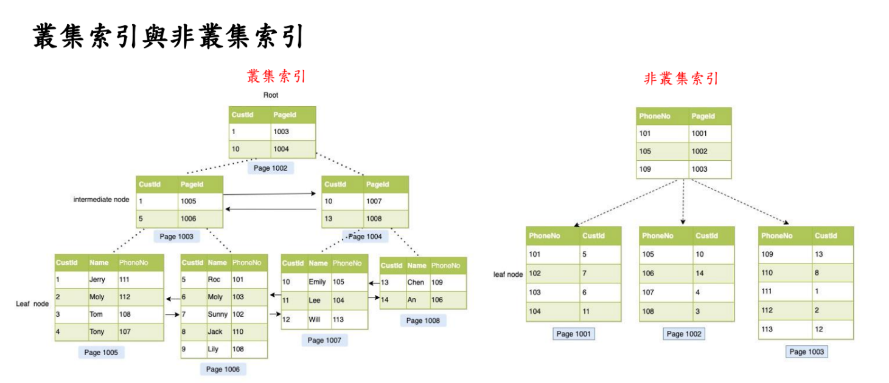
<table header-row="true">
<tr>
<td>項目</td>
<td>聚集索引（Clustered Index）</td>
<td>非聚集索引（Non-Clustered Index）</td>
</tr>
<tr>
<td>📍 資料存放</td>
<td>資料本身就照索引排序</td>
<td>索引和資料分開</td>
</tr>
<tr>
<td>📍 葉節點（Leaf）</td>
<td>存「完整資料」</td>
<td>存「索引值 + 指向資料的指標」</td>
</tr>
<tr>
<td>📍 查詢方式</td>
<td>直接找到資料</td>
<td>先找索引 → 再找資料</td>
</tr>
<tr>
<td>📍 速度</td>
<td>🚀 較快（少一步）</td>
<td>稍慢（多一次查找）</td>
</tr>
<tr>
<td>📍 是否可多個</td>
<td>❌ 一個表只能一個</td>
<td>✅ 可以有很多個</td>
</tr>
<tr>
<td>📍 常用欄位</td>
<td>主鍵（Primary Key）</td>
<td>查詢條件欄位（如姓名、電話）</td>
</tr>
</table>

#### 索引的特性
- MySQL會自動為Primary key欄位建立主索引鍵
- MySQL會自動為Unique欄位建立唯一索引
- 一般建議Unique索引透過設定Primary key或Unique欄位的方式來建立
- 若欄位資料已有重覆,就無法建立Unique索引
- 於MySQL中建立FK時,會自動建立索引,以方便搜尋
- PK,UK 被捨棄時,索引一併刪除
- FK 被捨棄時,並不會連同索引一併刪除
- 刪除資料表時,所有的索引一併刪除
#### 建立索引的考量
<table header-row="true">
<tr>
<td>類別</td>
<td>情況</td>
<td>說明</td>
</tr>
<tr>
<td>✅ 適合建立索引</td>
<td>WHERE 常用欄位</td>
<td>常用來篩選資料</td>
</tr>
<tr>
<td>✅ 適合建立索引</td>
<td>GROUP BY 欄位</td>
<td>常用來分組</td>
</tr>
<tr>
<td>✅ 適合建立索引</td>
<td>ORDER BY 欄位</td>
<td>常用排序</td>
</tr>
<tr>
<td>✅ 適合建立索引</td>
<td>DISTINCT 欄位</td>
<td>常用去重</td>
</tr>
<tr>
<td>✅ 適合建立索引</td>
<td>表格關聯欄位（PK / FK）</td>
<td>用於 JOIN</td>
</tr>
<tr>
<td>✅ 適合建立索引</td>
<td>常用 MAX() / MIN() 欄位</td>
<td>查最大最小值</td>
</tr>
<tr>
<td>✅ 適合建立索引</td>
<td>值分布廣的欄位</td>
<td>選擇性高（效果好）</td>
</tr>
<tr>
<td>✅ 適合建立索引</td>
<td>查詢比例 \< 10%</td>
<td>查少量資料</td>
</tr>
</table>
<table header-row="true">
<tr>
<td>類別</td>
<td>情況</td>
<td>說明</td>
</tr>
<tr>
<td>❌ 不適合建立索引</td>
<td>很少出現在 WHERE</td>
<td>幾乎用不到</td>
</tr>
<tr>
<td>❌ 不適合建立索引</td>
<td>資料量小（\<1000筆）</td>
<td>全表掃描更快</td>
</tr>
<tr>
<td>❌ 不適合建立索引</td>
<td>LIKE `%xxx%`</td>
<td>無法有效用索引</td>
</tr>
<tr>
<td>❌ 不適合建立索引</td>
<td>空值很多</td>
<td>效率差</td>
</tr>
<tr>
<td>❌ 不適合建立索引</td>
<td>值很少（如性別）</td>
<td>選擇性低</td>
</tr>
<tr>
<td>❌ 不適合建立索引</td>
<td>查詢比例 \> 10%</td>
<td>查太多筆</td>
</tr>
<tr>
<td>❌ 不適合建立索引</td>
<td>資料異動頻繁</td>
<td>維護成本高</td>
</tr>
</table>
#### 建立索引
#### 在建立資料表時可同時建立索引
- 系統會為 PRIMARY KEY ,UNIQUE KEY , FOREIGN KEY 自動建立索引。
- 可以資料表階層自行建立索引。
- 一個資料表只能有一個叢集索引,非叢集索引的預設為非唯一。
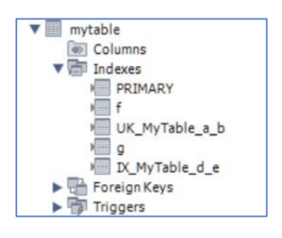
```sql
CREATE TABLE MyTable(
a int AUTO_INCREMENT PRIMARY KEY,
b smallint NOT NULL,
c smallint NOT NULL,
d smallint NOT NULL,
e smallint NOT NULL,
f smallint NOT NULL UNIQUE,
g smallint NOT NULL,
CONSTRAINT UK_MyTable_a_b UNIQUE (b, c),
FOREIGN KEY(g) REFERENCES MyTable1(g),
INDEX IX_MyTable_d_e (d, e)
);
```
#### 資料表建立後,可以新增索引
- 指定一個或多個欄位為建立索引的欄位
- 字串型態欄位的部份資料建立索引
- 索引資料,可由小到大,或由大到小排列
CREATE \[UNIQUE\] INDEX index<br>ON TableName(column\[length\] \[ASC\|DESC\],.); {color="gray_bg"}
ALTER TABLE TableName<br>ADD INDEX(column\[length\] \[ASC\|DESC\],.); {color="gray_bg"}

#### 查看索引
SHOW INDEX FROM TableName; {color="gray_bg"}
```sql
SHOW INDEX FROM emp;
```
Non_unique<br>0是唯一，1不是唯一
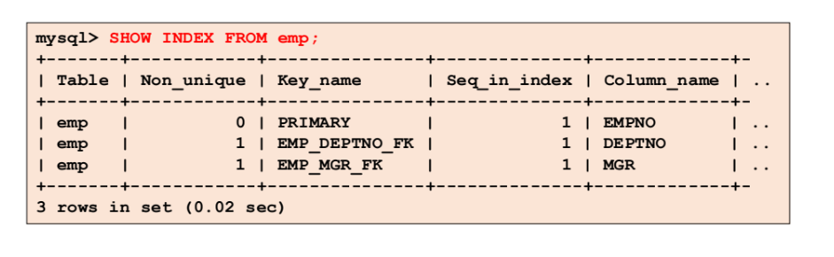
#### 建立索引
```sql
CREATE INDEX ind_emp_ename ON emp(ename);

```
#### 建立索引 - 複合索引鍵
- 最左匹配原則
```sql

CREATE INDEX ind_emp_dept_job ON emp(deptno, job);

#兩個欄位一起建索引，只有一個索引
CREATE INDEX name
ON employees(lastName, firstName);

SELECT firstName, lastName, email
FROM employees
WHERE lastName = 'Patterson'; -- 1. 只用第一欄（OK）

SELECT firstName, lastName, email
FROM employees
WHERE firstName = 'Steve' AND lastName = 'Patterson';-- 2. 用兩個欄位（OK）

SELECT firstName, lastName, email
FROM employees
WHERE lastName = 'Patterson' AND (firstName = 'Steve' OR firstName = 'Mary');-- 3. lastName + OR firstName（OK）

SELECT firstName, lastName, email
FROM employees
WHERE firstName = 'Steve'; -- 4. 只用第二欄（不行）

SELECT firstName, lastName, email
FROM employees
WHERE firstName = 'Steve' OR lastName = 'Patterson';-- 5. OR 混用（不行）
```
#### 刪除索引
ALTER TABLE table DROP INDEX IndexName; {color="gray_bg"}
DROP INDEX IndexName ON table; {color="gray_bg"}
```sql
ALTER TABLE emp DROP INDEX ind_emp_ename;

#無法移除索引,因為此索引為外來鍵所需，真的要刪除 可以先刪FK再刪索引
DROP INDEX ind_emp_dept_job ON emp;

ERROR 1553 (HY000): Cannot drop index
'ind_emp_dept_job': needed in a foreign key
constraint
```
#### 叢集索引 (Clustered Index)
- 當新增一個資料表時,首先 Innodb 會自動立一個叢集索引,它就是這份資料實際上儲存的結構。這個儲存結構就是使用『 B+ 樹 』
- 每個資料表都一定有一個叢集索引B+ 樹,它就是實際儲放資料的結構,同時也包含資料
- 只有最底層的非索引節點,才有實際資料,其它上面的索引節點,只有索引值
- 只有使用 PK 來搜尋才會使用此樹,其它搜尋都是全部掃描
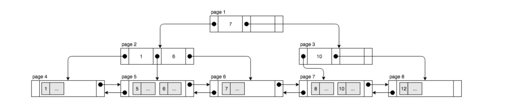
#### 叢集索引建立規則
- 當系統自動立一個叢集索引時會選擇表格中哪個欄位來當節點的 key 呢 ? 規則如下:
-  使用 Primary Key ( PK )
- 如果沒有 PK 則選擇一個非空的 Unique 索引
- 如果還是沒有,Innodb 會自動產生一個隱藏的欄位來建立
-
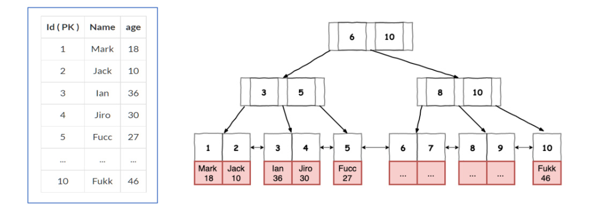
#### 資料搜尋
- 以PK搜尋資料時,系統會使用叢集索引很快找到資料,搜尋資料效能非常好
SELECT \* FROM people WHERE id = 1
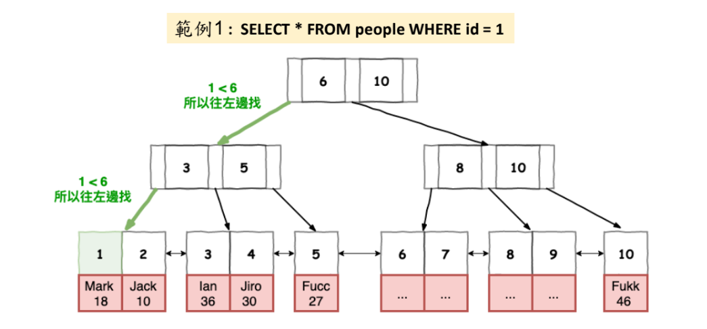
- 無法以PK搜尋資料時,系統只能進行表格掃描,搜尋資料效能很差
SELECT \* FROM people WHERE name = 'Mark’
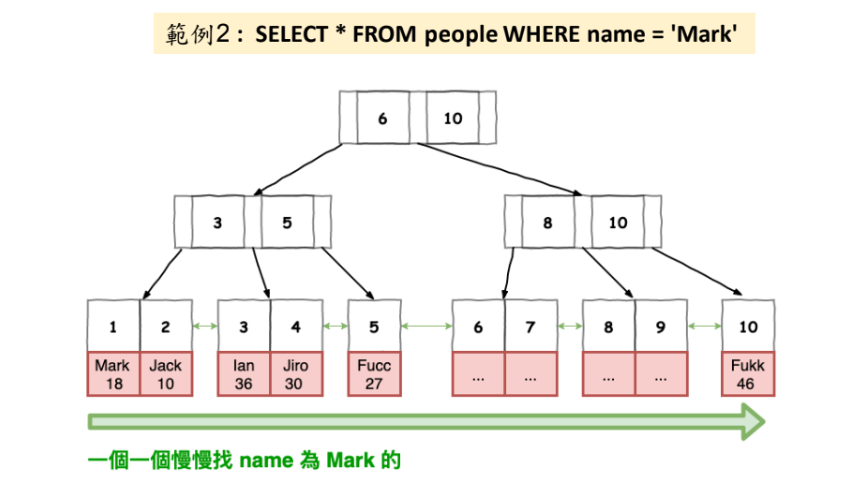
#### 非叢集索引 (Non-clustered Index)
- 使用者自行建立的是非叢集索引,又稱次級索引(Secondary Index)
- 非叢集索引並未儲存資料列,底層節點儲存的是指標 (row locator )
#### 建立非叢集索引
- 使用者自行建立的是非叢集索引,又稱次級索引(Secondary Index)
- 非叢集索引並未儲存資料列,底層節點儲存的是指標 (row locator )

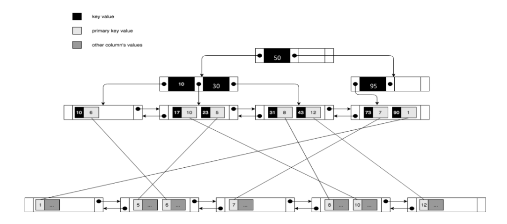
#### 資料搜尋
- 非叢集索引底層節點儲存的是叢集索引的鍵值
ALTER TABLE people ADD INDEX age_index(age)
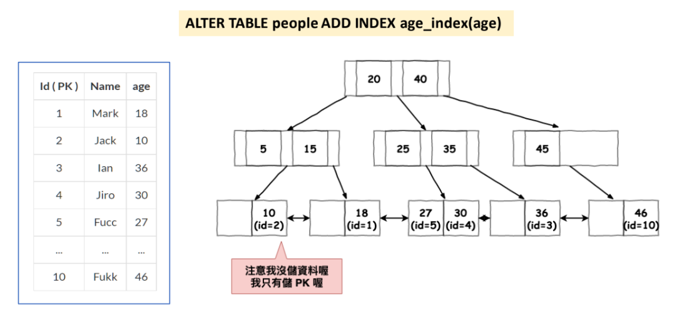
- 先搜尋非叢集索引找到鍵值,再至叢集索引取得完整資料,搜尋效能還是很好的
SELECT \* FROM people WHERE age = 18
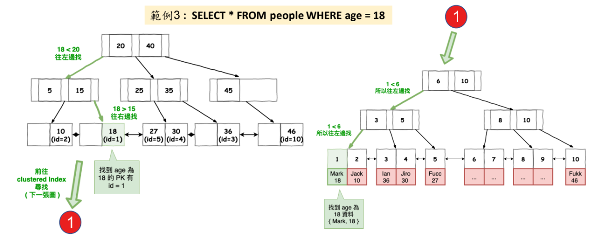
- 先搜尋非叢集索引找到多筆鍵值,再至叢集索引取得完整資料
SELECT \* FROM people WHERE age \<= 30
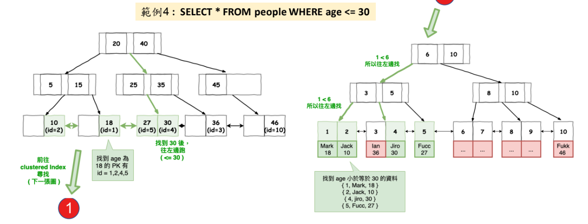
## 資料控制語言（DCL / Data Control Language）
### 資料庫安全
### 使用者權限管控(Controlling User Access)
- 在多人使用的環境中，必須要建立資料庫存取與使用的安全機制
- 認證(Authentication) & 授權(Authorization)
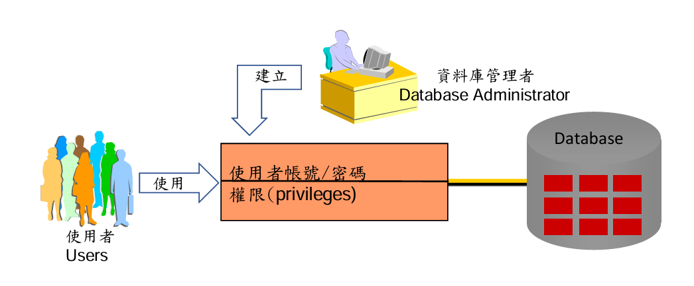
### 資料庫安全(Database Security)
- 資料庫安全主要有二大議題:
- 系統安全(System security)
- 資料庫系統層次的連線許可與使用權限
- 如: 使用者帳號/密碼，磁碟空間的使用及使用者在系統內的可以操作的事項
- 資料安全(Data security)
- 使用者對資料庫物件的存取與使用，及對資料庫物件可以的操作方式
### 權限(Privileges)
- 權限(Privileges)是執行特定SQL命令的權利<br>系統權限(System privileges)<br> 設定系統安全(System security)<br> 存取資料庫伺服器的權利<br>物件權限(Object privileges)<br> 設定資料安全(Data security)<br> 維護資料庫物件的權利
### MySQL 資料庫安全管理
MySQL利用帳號及權限來管理資料庫的安全<br> 帳號:控管使用者連線<br> 權限:管理使用者對資料庫中的資料存取<br>MySQL權限系統的主要功能：<br> 由使用者帳號及使用者的連接主機進行認證<br> 再給予通過認證的使用者資料庫的存取權限<br>• 如新增、修改、刪除、選取等的權限(delete,  update, select, insert,<br>drop, alter, create)
### 帳號管理
### 使用者帳號(User Account)
使用者須利用一個使用者帳號來連線<br>使用者帳號由兩部分組成<br> UserName@HostName<br>• UserName : 使用者名稱<br>• HostName : 可登入MySQL 的機器名稱(%: 任何主機, localhost: 本機)<br> MySQL資料庫權限設定會將帳號的權限設定給主機或遠端主機<br>• root@%: 可在任一台主機登入的帳號root<br>• jih@localhost : 只能在本機登入的帳號 jih
### 建立使用者帳號(Create an User Account)
- 建立使用者帳號指令
CREATE USER UserAccount\[IDENTIFIED BY ‘Password’\];<br>UserAccount : UserName@HostName {color="gray_bg"}
```sql
 CREATE USER mary@localhost;
 
 #查詢現有使用者
 SELECT HOST, USER FROM USER;
 
 #在localhost使用mary登入伺服器，無任何權限，但TEST資料庫除外
  SELECT HOST, USER FROM USER;
```
- 建立使用者帳號/密碼
```sql
 CREATE USER mary1@localhost IDENTIFIED BY 'mary1';
 
 
 #在localhost使用mary1登入伺服器，無任何權限,但TEST資料庫除外
 SELECT HOST, USER, authentication_string PASSWORD FROM USER;
```

### 使用Workbench管理帳號
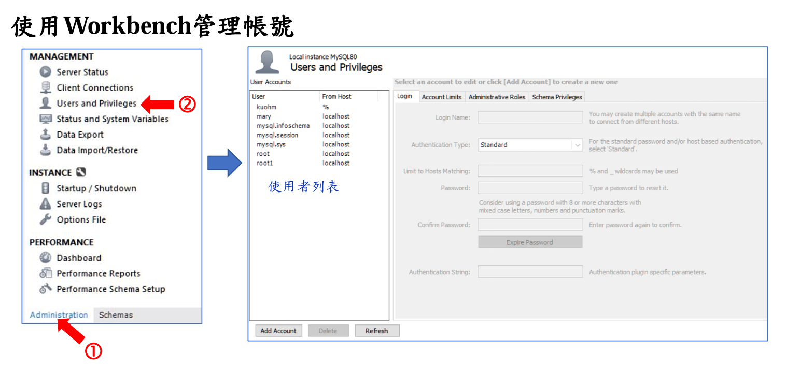
- 查詢及修改現有使用者帳號
<embed src=""></embed>
- 新增使用者帳號
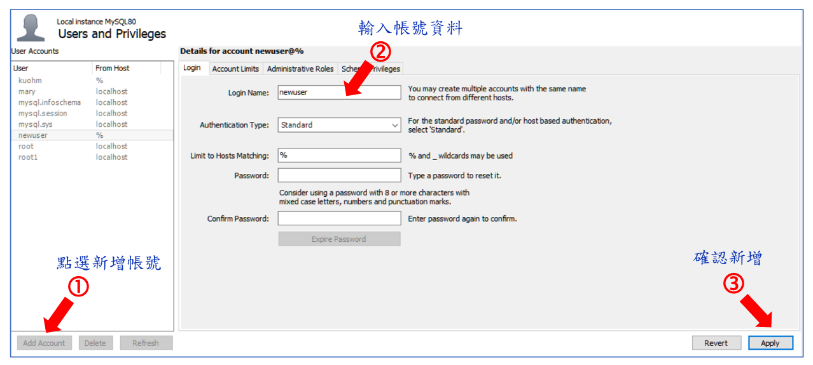
### MySQL的權限驗證處理
#### 帳號及權限記錄在mysql資料庫中的資料表
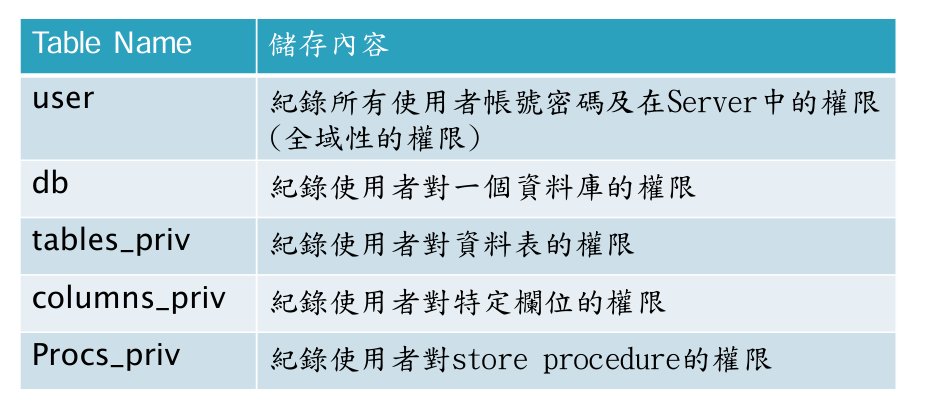

#### MySQL 權限的驗證處理順序
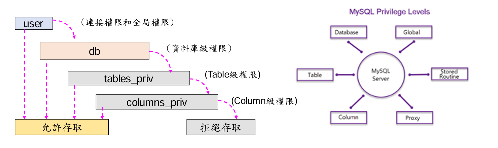
### 權限管理
### 權限授權(Grant命令)
授權命令
GRANT \[ALL\| privs \[columns\]\]\[,...\]<br>ON \{table \| \* \| *.* \| database.\*\}<br>TO user,...<br>\[WITH GRANT OPTION\]; {color="gray_bg"}
<table header-row="true">
<tr>
<td>關鍵字</td>
<td>說明</td>
</tr>
<tr>
<td>ALL</td>
<td>所有權限</td>
</tr>
<tr>
<td>privs</td>
<td>個別權限</td>
</tr>
<tr>
<td>columns</td>
<td>指定欄位</td>
</tr>
<tr>
<td>ON</td>
<td>授權等級</td>
</tr>
<tr>
<td>WITH GRANT OPTION</td>
<td>再授權的權力</td>
</tr>
<tr>
<td>test%</td>
<td>任何使用者均可存取以 `test` 開頭的資料庫</td>
</tr>
</table>
### MySQL權限－管理權限(Administrativeprivileges)
授權給系統管理者的權限
<table header-row="true">
<tr>
<td>權限</td>
<td>權限說明</td>
</tr>
<tr>
<td>ALL</td>
<td>所有權限</td>
</tr>
<tr>
<td>CREATE USER</td>
<td>可新增、修改、刪除使用者帳號</td>
</tr>
<tr>
<td>FILE</td>
<td>允許讀寫伺服器檔案系統的權限</td>
</tr>
<tr>
<td>PROCESS</td>
<td>查看正在執行中的 Session 資訊</td>
</tr>
<tr>
<td>RELOAD</td>
<td>重新加載權限表或刷新日誌及緩衝區</td>
</tr>
<tr>
<td>REPLICATION CLIENT</td>
<td>可查詢主／從伺服器主機名</td>
</tr>
<tr>
<td>REPLICATION SLAVE</td>
<td>運行一個鏡像從伺服器</td>
</tr>
<tr>
<td>SHOW DATABASES</td>
<td>可執行 `SHOW DATABASES` 指令</td>
</tr>
<tr>
<td>SHUTDOWN</td>
<td>關閉資料庫伺服器</td>
</tr>
<tr>
<td>SUPER</td>
<td>可使用 `CHANGE MASTER TO`、`KILL`、`PURGE BINARY LOGS` 等指令</td>
</tr>
<tr>
<td>USAGE</td>
<td>無任何權限</td>
</tr>
</table>
### MySQL權限－資料庫權限(Database privileges)
授權給資料庫使用者的權限
<table header-row="true">
<tr>
<td>適用對象</td>
<td>權限</td>
</tr>
<tr>
<td>Databases</td>
<td>CREATE、DROP、EVENT、LOCK TABLES、REFERENCES、GRANT OPTION</td>
</tr>
<tr>
<td>Tables</td>
<td>SELECT、UPDATE、INSERT、DELETE、CREATE、ALTER、DROP、INDEX、TRIGGER、CREATE TEMPORARY TABLES、REFERENCES、GRANT OPTION</td>
</tr>
<tr>
<td>Columns</td>
<td>SELECT、UPDATE、INSERT</td>
</tr>
<tr>
<td>Views</td>
<td>CREATE VIEW、SHOW VIEW、DROP</td>
</tr>
<tr>
<td>Indexes</td>
<td>CREATE</td>
</tr>
<tr>
<td>Stored Routines</td>
<td>CREATE ROUTINE、ALTER ROUTINE、EXECUTE、GRANT OPTION</td>
</tr>
</table>
### 授權等級(Grant Level)
- 授權等級(由ON子句設置)
- 全域授權與特定物件授權
<table header-row="true">
<tr>
<td>授權等級</td>
<td>說明</td>
<td>權限資料表</td>
<td>語法</td>
</tr>
<tr>
<td>全域授權 (Server)</td>
<td>所有資料庫</td>
<td>`mysql.user`</td>
<td>`GRANT ALL ON *.*` `REVOKE ALL ON *.*`</td>
</tr>
<tr>
<td>特定物件授權 (Database)</td>
<td>特定資料庫</td>
<td>`mysql.db`</td>
<td>`GRANT ALL ON database.*` `GRANT ALL ON *` ← 表示目前的資料庫 `REVOKE ALL ON database.*`</td>
</tr>
<tr>
<td>特定物件授權 (Table)</td>
<td>特定資料表</td>
<td>`mysql.tables_priv`</td>
<td>`GRANT ALL ON database.table` `REVOKE ALL ON database.table`</td>
</tr>
<tr>
<td>特定物件授權 (Column)</td>
<td>資料表中特定欄位</td>
<td>`mysql.columns_priv`</td>
<td>`GRANT SELECT(column) ON database.table` `REVOKE SELECT(column) ON database.table`</td>
</tr>
</table>
### MySQL權限管理－授權
- GRANT指令可以設定使用者權限
- 當使用者不存在時會出現錯誤，若存在則會變更權限
- 授權test 僅可從localhost 連到此電腦的 MySQL，並操作db資料庫之所有資料表
```sql
GRANT ALL ON db.* TO 'test'@'localhost'
```
- 授權whitedog 僅可從192.168.1.100 連到此電腦的 MySQL，並操作任何資料庫及資料表
```sql
GRANT ALL ON *.* TO whitedog@192.168.1.100 
```
- 授權lazycat 可從任何IP連到此電腦的MySQL，並對 yd702 資料庫底下的所有資料表有<br>select, insert, update, delete, create, drop 之權限
```sql
GRANT SELECT, INSERT, UPDATE, DELETE, CREATE, DROP
ON yd702.* 
TO lazycat@'%' 
```
### MySQL權限管理－顯示授權
- 可查特定使用者目前擁有之權限
SHOW GRANTS FOR UserAccount {color="gray_bg"}
```sql
 SHOW GRANTS FOR mary@localhost;
```
### 移除權限(Revoking a Privilege)
- 使用「REVOKE ON」指令移除使用者權限
- Revoke on 指令只能移除帳號權限，但無法將帳號刪除
REVOKE \[ALL\] privs\[columns\],...<br>ON \{table \| \* \| *.* \| database.\*\}<br>FROM user,...; {color="gray_bg"}
```sql
#撤消使用者 odxxx 的所有權限
REVOKE ALL, GRANT OPTION FROM odxxx;

#撤消使用者 odxxx 授予其他人權限的能力
REVOKE GRANT OPTION ON sample.emp FROM odxxx;
```
### 使用Workbench管理權限
- 設定或移除系統管理的權限
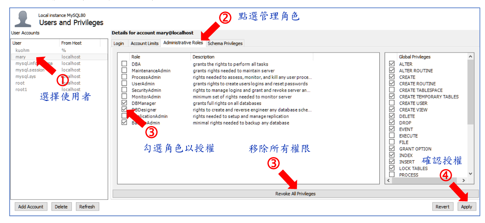

- 設定資料庫使用的權限
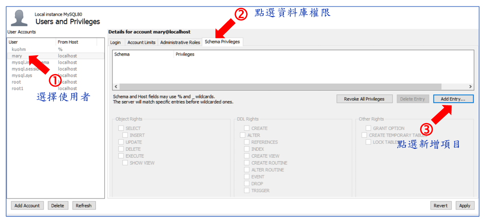

- 設定資料庫使用的權限
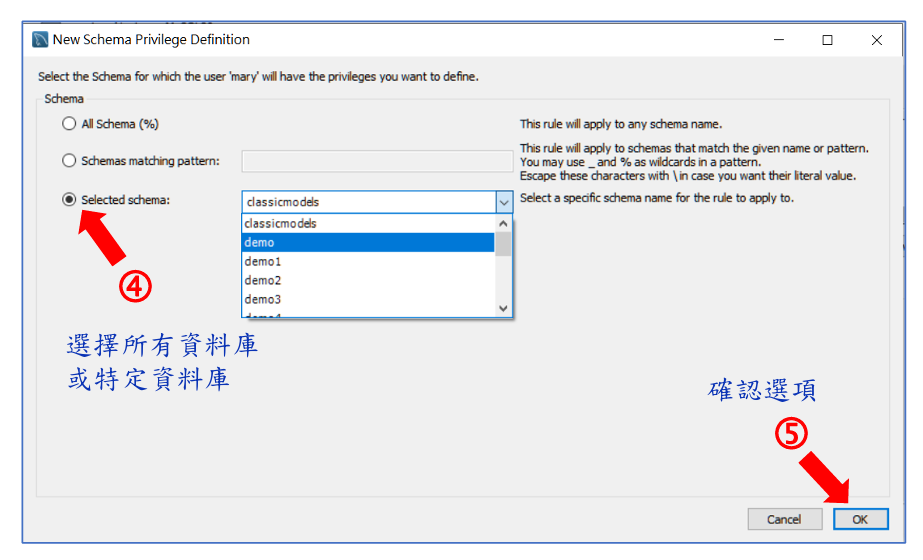
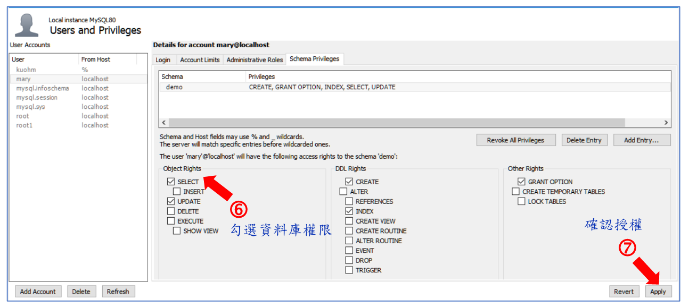
### 修改帳號密碼(Changing Password)
#### 修改使用者帳號密碼
ALTER USER UserAccount IDENTIFIED BY password;<br>ALTER USER mary1@localhost IDENTIFIED BY 'mary123'; {color="gray_bg"}
### 移除使用者帳號(Dropping a User)
- 刪除一個使用者帳號
DROP USER UserAccount; {color="gray_bg"}
```sql
#如果還在連線中不會立即刪除，下次連線後才不能連線
DROP USER mary1@localhost;
 
#立刻剔除在連線中的帳號 
USE mysql
DELETE FROM user WHERE user='mary';
FLUSH PRIVILEGES;
```
### 使用Workbench移除帳號
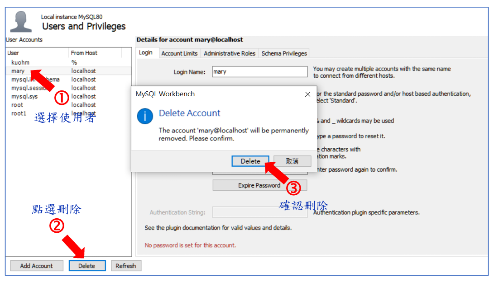
## 總複習
[附件：MySQL_Cheatsheet.pdf](https://app.notion.com/p/35983f385f3a80f3a893edf5c6c4eb48?pvs=204)

##  資料庫設計概念
### 資料庫設計程序
### ER模型
### 模型轉換
