# OpenCV 基礎套件
## 讀取檔案
```python
import cv2
from matplotlib import pyplot as plt

img0 = cv2.imread('./image/SpongeBob.jpg', cv2.IMREAD_GRAYSCALE)  # same
# img0 = cv2.imread('./image/SpongeBob.jpg', 0)    # 0 灰階

img1 = cv2.imread('./image/SpongeBob.jpg', cv2.IMREAD_COLOR)    # 1 BGR,  1 可省略(原圖)
# img1 = cv2.imread('./image/SpongeBob.jpg', 1)                 # 1 BGR,  1 可省略(原圖)

cv2.imshow('SpongeBob Gray uint8', img0)  # cv2.imshow(視窗名稱, 圖片變數) 視窗名稱不能重複
# cv2.waitKey(0)
cv2.imshow('SpongBob Color uint8', img1)             # unit8
# cv2.imshow('SpongBob Color *256', img1*256)          # unit16
cv2.imshow('SpongBob Color 1/256 float', img1/256)   # floating 0.0 ~ 1.0

cv2.waitKey(0)                                       # 0 wait for anykey任意按鍵, try 3000 ms
cv2.destroyAllWindows()  #釋放記憶體 
cv2.waitKey(1)  # 打給ios系統看的
```
讀取與顯示
```python
#讀取
灰階
img0 = cv2.imread('./image/SpongeBob.jpg', cv2.IMREAD_GRAYSCALE)
img0 = cv2.imread('./image/SpongeBob.jpg', 0)

彩色
img1 = cv2.imread('./image/SpongeBob.jpg', cv2.IMREAD_COLOR)
img1 = cv2.imread('./image/SpongeBob.jpg', 1)

保留Alpha
img1 = cv2.imread('./image/SpongeBob.jpg', cv2.IMREAD_UNCHANGED)
img1 = cv2.imread('./image/SpongeBob.jpg', -1)

#顯示
# cv2.imshow(視窗名稱, 圖片變數)

cv2.imshow('SpongBob Color uint8', img1)
print(img1.dtype)

img1 的資料型態是 uint8 所以可以存0 ~255

除法
cv2.imshow('SpongBob Color 1/256 float', img1/256)

除以256之後 可以存0 ~ 0.996
OpenCV 對 float 圖片的規則：0=黑 1=白

乘法
cv2.imshow('SpongBob Color *256', img1*256)
因為uint8(NumPy資料型態) 所以大於255的數值會產生溢位 溢位會從0開始循環，所以結果數值會亂掉

NumPy:
超過範圍 → 繞回去 (Overflow)
OpenCV:
超過範圍 → 卡在最大值 (Saturation)

但如果是用unit16
img16 = img1.astype('uint16')
img16 = img16 * 256
0 ~ 65535
```
```python
cv2.waitKey(0)
永遠等待
直到按下鍵盤

cv2.waitKey(3000)
等待 3000 ms
= 3 秒

cv2.destroyAllWindows()
把所有 OpenCV 視窗關閉。
cv2.waitKey(1)  #再多打一次給作業系統 表示真的要將視窗關閉
```

## 資料型態-NumPy
<table header-row="true">
<tr>
<td>dtype</td>
<td>數值範圍</td>
</tr>
<tr>
<td>uint8</td>
<td>0\~255</td>
</tr>
<tr>
<td>uint16</td>
<td>0\~65535</td>
</tr>
<tr>
<td>float32/64</td>
<td>0.0\~1.0</td>
</tr>
</table>
<table header-row="true">
<tr>
<td>名稱</td>
<td>描述</td>
<td>簡寫</td>
</tr>
<tr>
<td>`np.bool_`</td>
<td>用一個位元組儲存的布林值（True 或 False）</td>
<td>`'b'`</td>
</tr>
<tr>
<td>`np.int8`</td>
<td>1 位元組整數，範圍：-128 \~ 127</td>
<td>`'i1'`</td>
</tr>
<tr>
<td>`np.int16`</td>
<td>2 位元組整數，範圍：-32768 \~ 32767</td>
<td>`'i2'`</td>
</tr>
<tr>
<td>`np.int32`</td>
<td>4 位元組整數，範圍：-2³¹ \~ 2³¹-1</td>
<td>`'i4'`</td>
</tr>
<tr>
<td>`np.int64`</td>
<td>8 位元組整數，範圍：-2⁶³ \~ 2⁶³-1</td>
<td>`'i8'`</td>
</tr>
<tr>
<td>`np.uint8`</td>
<td>1 位元組無符號整數，範圍：0 \~ 255</td>
<td>`'u1'`</td>
</tr>
<tr>
<td>`np.uint16`</td>
<td>2 位元組無符號整數，範圍：0 \~ 65535</td>
<td>`'u2'`</td>
</tr>
<tr>
<td>`np.uint32`</td>
<td>4 位元組無符號整數，範圍：0 \~ 2³²-1</td>
<td>`'u4'`</td>
</tr>
<tr>
<td>`np.uint64`</td>
<td>8 位元組無符號整數，範圍：0 \~ 2⁶⁴-1</td>
<td>`'u8'`</td>
</tr>
<tr>
<td>`np.float16`</td>
<td>半精度浮點數：16 位元（1 位符號、5 位指數、10 位尾數）</td>
<td>`'f2'`</td>
</tr>
<tr>
<td>`np.float32`</td>
<td>單精度浮點數：32 位元（1 位符號、8 位指數、23 位尾數）</td>
<td>`'f4'`</td>
</tr>
<tr>
<td>`np.float64`</td>
<td>雙精度浮點數：64 位元（1 位符號、11 位指數、52 位尾數）</td>
<td>`'f8'`</td>
</tr>
<tr>
<td>`np.complex64`</td>
<td>複數，由兩個 `float32` 組成（實部 + 虛部）</td>
<td>`'c8'`</td>
</tr>
<tr>
<td>`np.complex128`</td>
<td>複數，由兩個 `float64` 組成（實部 + 虛部）</td>
<td>`'c16'`</td>
</tr>
<tr>
<td>`np.object_`</td>
<td>Python 物件型別</td>
<td>`'O'`</td>
</tr>
<tr>
<td>`np.string_`</td>
<td>位元組字串（bytes）</td>
<td>`'S'`</td>
</tr>
<tr>
<td>`np.unicode_`</td>
<td>Unicode 字串</td>
<td>`'U'`</td>
</tr>
</table>
```python
import cv2
from matplotlib import pyplot as plt

img0 = cv2.imread('./image/SpongeBob.jpg', cv2.IMREAD_GRAYSCALE)  # same
# img0 = cv2.imread('./image/SpongeBob.jpg', 0)    # 0 灰階

img1 = cv2.imread('./image/SpongeBob.jpg', cv2.IMREAD_COLOR)    # 1 BGR,  1 可省略(原圖)

# 0 灰階
print(f'{"="*15} {"gray"} {"="*15}\nshape\t: {img0.shape}\n'
      f'ndim\t: {img0.ndim}\n'
      f'size\t: {img0.size}\n'
      f'dtype\t: {img0.dtype}\n'
      f'type\t: {type(img0)}\n')

# 1 RGB
print(f'{"="*15} {"color"} {"="*14}\nshape\t: {img1.shape}\n'
      f'ndim\t: {img1.ndim}\n'
      f'size\t: {img1.size}\n'
      f'dtype\t: {img1.dtype}\n'
      f'type\t: {type(img1)}')
      
      
print(img1[0,0])
可以直接查看左上角的像素

```

圖片讀取近來都是NumPy的資料型態
=============== gray ===============<br>shape	: (560, 840)<br>ndim	: 2 (二維陣列)<br>size	        : 470400 (560\*840)<br>dtype	: uint8<br>type	: \<class 'numpy.ndarray'\>  numpy.array是一個矩陣
=============== color ==============<br>shape	: (560, 840, 3)  三個通道 BGR<br>ndim	: 3 (三維陣列)<br>size        	: 1411200 (560\*840\*3)<br>dtype	: uint8<br>type	: \<class 'numpy.ndarray'\> numpy.array是一個矩陣
\[ 37 145  56\]   → 左上角的像素

\[<br>\[123, 50, 200, ...\],<br>\[ 30,255, 100, ...\],<br>...<br>\]
每一個數值的範圍是0\~255  

## BGR → RGB & 畫圖
```python
import numpy as np
import cv2
from matplotlib import pyplot as plt

讀取彩色圖檔
img_bgr = cv2.imread('./image/baby.jpg', 1)      # 使用 OpenCV 讀取圖檔

[B,G,R] -> [R,G,B]
img_rgb = cv2.cvtColor(img_bgr, cv2.COLOR_BGR2RGB)    # 將 BGR 圖片轉為 RGB 圖片
# img_rgb = img_bgr[:,:,::-1]                         # 或是這樣亦可

-----------畫圖------------
1. 建立畫布 寬16英吋 長9英吋
plt.figure(figsize=(16, 9))                # 使用 Matplotlib 顯示圖片

2.創建一個放圖的表格 subplot(121): 1列 2欄 第一張
plt.subplot(1,2,1), plt.imshow(img_rgb), plt.title('plt rgb')

plt.subplot(122), plt.imshow(img_bgr), plt.title('cv2 bgr in matplotlib')
plt.imshow

cv2.imshow('bgr', img_bgr)                     # cv2 show bgr
cv2.waitKey(0)                                 # 0 wait for anykey任意按鍵, try 3000
cv2.destroyAllWindows()
cv2.waitKey(1)
```

OpenCV 彩色通道的順序為 BGR
matplotlib 的順序為 RGB
所以在畫圖之前 一定要先將圖片 BGR 轉成RGB
subplot(121)
+---------+---------+<br> \|   圖1        \|   圖2       \|<br>+---------+---------+
plt.imshow(img_rgb) 要顯示的圖片名稱
plt.title('plt rgb')  視窗名稱
                   plt rgb<br>┌───────────────┐
│                                             │
│     圖片                               │
│                                             │
└───────────────┘

## 存檔壓縮
```python
import cv2

#讀取灰階檔案
img0 = cv2.imread('./image/baby.jpg', 0)    # 0 灰階
cv2.imwrite('./image/baby01.jpg', img0)

# cv2.imwrite(檔案路徑, 圖片變數, [cv2.IMWRITE_JPEG_QUALITY, 品質值])
# 設定 JPEG 圖片品質為 90（可用值為 0 ~ 100）
cv2.imwrite('./image/baby02.jpg', img0, [cv2.IMWRITE_JPEG_QUALITY, 90])

# 設定 PNG 壓縮層級為 5（可用值為 0 ~ 9）
cv2.imwrite('./image/baby03.png', img0, [cv2.IMWRITE_PNG_COMPRESSION, 5])
```

JPEG 品質範圍  → 有損壓縮
<table header-row="true">
<tr>
<td>品質</td>
<td>說明</td>
</tr>
<tr>
<td>100</td>
<td>幾乎不壓縮</td>
</tr>
<tr>
<td>95</td>
<td>常用</td>
</tr>
<tr>
<td>90</td>
<td>品質佳、檔案較小</td>
</tr>
<tr>
<td>80</td>
<td>網頁常用</td>
</tr>
<tr>
<td>50</td>
<td>明顯失真</td>
</tr>
<tr>
<td>0</td>
<td>品質最差</td>
</tr>
</table>
PNG 壓縮範圍  → 無損壓縮
<table header-row="true">
<tr>
<td>壓縮率</td>
<td>特性</td>
</tr>
<tr>
<td>0</td>
<td>不壓縮</td>
</tr>
<tr>
<td>1</td>
<td>很快</td>
</tr>
<tr>
<td>3</td>
<td>常用</td>
</tr>
<tr>
<td>5</td>
<td>平衡</td>
</tr>
<tr>
<td>9</td>
<td>最小檔案</td>
</tr>
</table>

## 檢查圖片有沒有讀取成功 
```python
import cv2
import sys

img = cv2.imread('./image/lenaColor.png')    #調用cv2.imread()讀取影像

if img is None:
sys.exit('無法讀取影像...') # 印出文字後 立刻停止程式
else :
    print(f'img shape : {img.shape}')
    cv2.imshow('Image Show', img)           #調用cv2.imshow() 顯示讀取進來的影像
cv2.waitKey(0)
cv2.destroyAllWindows() 
cv2.waitKey(1)
```
## 單一像素
```python
#指定pix位置 y, x
a=100
px = img[a, a]             # RGB 100, 100 的值 取得 (100,100) 位置的像素
print(px)                  #顯示BGR顏色數值

result: (120, 145, 200)

blue = img[a, a, 0]        # 0:Blue, 1:Green, 2:Red 指定 x, y座標上 0 通道到數值 第三欄是0所以指定的是藍色
print(blue)

result: (120)

img[a, a] = [0, 0, 0]      # 指定圖片像素值[B, G, R] 給 0 值 改三個通道改成黑色
print(img[a, a])

result: [0 0 0]
```

```python
# 基於numpy的資料格式指定物件
img = cv2.imread('./image/lenaColor.png')    #調用cv2.imread()讀取影像

print(f'(10, 10, 2)像素的紅色數值\t: {img[10, 10, 2]}\n')        # 0:Blue, 1:Green, 2:Red

#修改像素值 itemset
img[10, 10, 2] = 120          # set (10, 10, 2) = 120

print(f'after img[10,10,2]\t\t: {img[10, 10, 2]} \n')  # 120

print(f'img.shape\t\t\t: {img.shape}\n'   # 行、列、通道;圖像長寬與通道數(channels),可以判斷灰階或彩圖
      f'img.size\t\t\t: {img.size:,}\n'   # 像素數量*通道數
      f'img.dtype\t\t\t: {img.dtype}')    # 像素資料型態 uint8(0~255)
```
(10, 10, 2)像素的紅色數值	: 226
after img\[10,10,2\]		: 120
img.shape			: (512, 512, 3)<br>img.size			        : 786,432<br>img.dtype			: uint8

補充 — 跳脫字元
<table header-row="true">
<tr>
<td>字元</td>
<td>意義</td>
</tr>
<tr>
<td>`\n`</td>
<td>換行 (New Line)</td>
</tr>
<tr>
<td>`\t`</td>
<td>Tab</td>
</tr>
<tr>
<td>`\\`</td>
<td>顯示反斜線 `\`</td>
</tr>
<tr>
<td>`\'`</td>
<td>顯示單引號 `'`</td>
</tr>
<tr>
<td>`\"`</td>
<td>顯示雙引號 `"`</td>
</tr>
</table>

## 裁切圖片
```python
#分割圖像區域
logo = img[100:400, 150:415]    # y1 :  y2, x1 : x2
print(f'logo size : {logo.shape}')

cv2.imshow('Image Show', logo)
cv2.waitKey(0)
cv2.destroyAllWindows()
cv2.waitKey(1)
```

```python
import numpy as np
import cv2

img = cv2.imread('./image/assassin.jpg')
cropped = img[100:400, 200:500] 

cv2.imshow('Original', img)
cv2.imshow('cropped', cropped)
print(f'cropped size : {cropped.shape}')

cv2.waitKey(0)
cv2.destroyAllWindows()
cv2.waitKey(1)
```
先將三個通道拆開，在案ˋ想要的順序黏回去
拆通道
b, g, r = cv2.split(檔案變數)
b = img\[:,:,0\];  g = img\[:,:,1\];  r = img\[:,:,2\]
黏通道
cv2.merge(\[r,g,b\])

```python
img = cv2.imread('./image/assassin.jpg')

b, g, r = cv2.split(img)     # 分割通道
# b = img[:,:,0];  g = img[:,:,1];  r = img[:,:,2]  #也可以陣列指定通道分割

print(f'{b.shape}\n\n'
      f'r =\n{r}')
result: 
(489, 800)
r =
[[ 94  94  93 ... 153 154 154]
 [ 96  95  93 ... 152 153 153]
 [ 98  97  94 ... 152 152 153]
 ...
 [ 85  76  71 ...  97  76  60]
 [ 85  76  77 ... 107  83  56]
 [ 67  72  90 ...  80  71  55]]

cv2.imshow('b', b)  #灰階
cv2.imshow('g', g)  #灰階
cv2.imshow('r', r)  #灰階

cv2.imshow('rgb', cv2.merge([r,g,b]))   #把三個通道黏回去
cv2.imshow('bgr', cv2.merge([b,g,r]))

cv2.waitKey(0)
cv2.destroyAllWindows()
cv2.waitKey(1)
```
要顯示單一通道的顏色
要先取出單一通道  然後再讓其他兩個通道變成0黏回去
```python
import numpy as np

b, g, r = cv2.split(img)

zero = np.zeros_like(b)

blue_img = cv2.merge((b, zero, zero))

cv2.imshow("Blue Color", blue_img)
```

# 基礎繪圖

## 直線
cv2.line**( 影像, 開始座標, 結束座標, 顏色, 線條寬度 )**

```python
import cv2 
import numpy as np

#建立一個512*512的彩色圖片，預設像素值=0 舊式建立一個黑色的畫布
gc = np.zeros((512, 512, 3), dtype='uint8')

#畫線 (影像, 起始座標, 結束座標, 顏色, 線條寬度)
cv2.line(gc, (10, 50), (400, 300), (255, 0, 0), 15)
cv2.line(gc, (100, 50), (400, 500), (0, 0, 255), 3)
cv2.imshow('draw', gc) 

cv2.waitKey(0)
cv2.destroyAllWindows()
cv2.waitKey(1)
```

```python
import cv2 
import numpy as np

gc = np.zeros((512, 512, 3), dtype='uint8')

cv2.arrowedLine(gc, (10, 50), (400, 300), (255, 0, 0), 5, tipLength = 0.05)
cv2.arrowedLine(gc, (100, 50), (400, 500), (0, 0, 255), 3, tipLength = 0.2)
cv2.imshow('draw', gc) 

cv2.waitKey(0)
cv2.destroyAllWindows()
cv2.waitKey(1)
```

## 箭頭線
**cv2.arrowedLine ( 影像, 開始座標, 結束座標, 顏色, 線條寬度\[.....\] )**

```python
import cv2 
import numpy as np

#產生一個512*512的黑色畫布
gc = np.zeros((512, 512, 3), dtype='uint8')

# cv2.arrowedLine(影像, 起始座標, 結束座標, 顏色, 線寬(thickness), 箭頭長度比例tipLength =  )
cv2.arrowedLine(gc, (10, 50), (400, 300), (255, 0, 0), 5, tipLength = 0.05) # tipLength為線長的5%
cv2.arrowedLine(gc, (100, 50), (400, 500), (0, 0, 255), 3, tipLength = 0.2) # tipLength為線長的20%
cv2.imshow('draw', gc) 

cv2.waitKey(0)
cv2.destroyAllWindows()
cv2.waitKey(1)
```
## 矩形
**cv2.rectangle(影像, 頂點座標, 對向頂點座標, 顏色, 線條寬度)**
```python
gc = np.zeros((512, 512, 3), dtype='uint8')

# cv2.rectangle(影像, 左上角座標, 右下角座標, 顏色的, 線寬)  #線寬為負值:表示實心框 圖形填滿
cv2.rectangle(gc, (30, 50), (200, 280), (0, 0, 255), 5)
cv2.rectangle(gc, (100, 200), (296, 376), (234, 151, 102), -5)   # -1 : 實心框
cv2.imshow('draw', gc) 

cv2.waitKey(0)
cv2.destroyAllWindows()
cv2.waitKey(1)
```
## 圓形
**cv2.circle ( 影像, 圓心座標, 半徑, 顏色, 線條寬度 )**
```python
gc = np.zeros((512, 512, 3), dtype='uint8')

# cv2.circle(影像, 圓心座標, 半徑, 顏色, 線寬)
cv2.circle(gc, (200, 100), 80, (255, 255, 0), 2)
cv2.circle(gc, (280, 180), 60, (147, 147, 147), -3)
cv2.imshow('draw', gc) 

cv2.waitKey(0)
cv2.destroyAllWindows()
cv2.waitKey(1)
```
## 橢圓
**cv2.ellipse ( 影像, 中心座標, (長軸, 短軸), 旋轉角度, 起始角度, 結束角度, 顏色, 線條寬度 )**
```python
gc = np.zeros((512, 512, 3), dtype='uint8')

# ellipse(影像, 中心座標, (長軸, 短軸), 旋轉角度, 起始角度, 結束角度, 顏色, 線寬)
# 起始角度0度的位置在12點鐘方向，以逆時針方向旋轉
cv2.ellipse(gc, (200, 100), (80, 40), 45, 0, 360, (80, 127, 255), 5)
cv2.ellipse(gc, (250, 300), (90, 50), 0, 0, 270, (44, 141, 108), -1)
cv2.imshow('draw', gc) 

cv2.waitKey(0)
cv2.destroyAllWindows()
cv2.waitKey(1)
```
## 多邊形折線
**cv2.polylines ( 影像, 頂點座標, 封閉型, 顏色, 線條寬度 )**
```python
gc = np.zeros((512, 512, 3), dtype='uint8')

#設定頂點座標 4個點
pts = np.array(((100,50), (100,200), (170,300), (300,50)))

# cv2.polylines(影像, [頂點座標], 是否封閉, 顏色, 線寬)
# 0 : 不封閉   1 : 封閉
cv2.polylines(gc, [pts], 0, (105, 105, 255), 2)  #True:頭尾相連; False:頭尾不相連 #0改1，就變封閉圖形
cv2.imshow('draw', gc) 

cv2.waitKey(0)
cv2.destroyAllWindows()
cv2.waitKey(1)
```

## 文字
**cv2.putText(影像, 文字, 座標, 字型, 大小, 顏色, 線條寬度, 線條種類)**
```python
import numpy as np
import cv2

#建立 540 * 1180 的白色畫布
gc = np.full((540, 1180, 3), 255, dtype='uint8')  # 用(B, G, R) = (255, 255, 255): 白色填滿畫布
# gc = cv2.imread('./image/baby.jpg')    # 0 灰階

font = [cv2.FONT_HERSHEY_SIMPLEX,
        cv2.FONT_HERSHEY_PLAIN,
        cv2.FONT_HERSHEY_DUPLEX,
        cv2.FONT_HERSHEY_COMPLEX,
        cv2.FONT_HERSHEY_TRIPLEX,
        cv2.FONT_HERSHEY_COMPLEX_SMALL,
        cv2.FONT_HERSHEY_SCRIPT_SIMPLEX,
        cv2.FONT_HERSHEY_SCRIPT_COMPLEX ]

for idx, f in enumerate(font):  #for idx, f in enumerate(font):
    cv2.putText(gc, 'OpenCV_AA', (20, 60*(idx+1)), f, 1.5, (0,0,255), 3, cv2.LINE_AA)
    cv2.putText(gc, 'OpenCV_8', (440, 60*(idx+1)), f, 1.5, (255,0,0), 3, cv2.LINE_8)
    cv2.putText(gc, 'OpenCV_4', (820, 60*(idx+1)), f, 1.5, (0,255,0), 3, cv2.LINE_4, True)  # True

cv2.imshow('draw', gc)
cv2.waitKey(0)
cv2.destroyAllWindows()
cv2.waitKey(1)
```

<table header-row="true">
<tr>
<td>函式</td>
<td>功能</td>
</tr>
<tr>
<td>`cv2.line()`</td>
<td>直線</td>
</tr>
<tr>
<td>`cv2.arrowedLine()`</td>
<td>箭頭線</td>
</tr>
<tr>
<td>`cv2.rectangle()`</td>
<td>矩形</td>
</tr>
<tr>
<td>`cv2.circle()`</td>
<td>圓形</td>
</tr>
<tr>
<td>`cv2.ellipse()`</td>
<td>橢圓</td>
</tr>
<tr>
<td>`cv2.putText()`</td>
<td>文字</td>
</tr>
</table>

## 調整亮度
cv2.add(img, value)<br>cv2.subtract(img, value)
```python
import numpy as np
import cv2
from matplotlib import pyplot as plt

#產生兩個3*3的隨機矩陣，數值範圍0~255
img1 = np.random.randint(0, 256, size=[3,3], dtype=np.uint8)
img2 = np.random.randint(0, 256, size=[3,3], dtype=np.uint8)

print(f'img1 :\n{img1}\n\n'
      f'img2 :\n {img2}\n\n'
      f'np : img1+img2 :\n {img1+img2}\n\n'
      f'cv2.add :\n{cv2.add(img1, img2)}')

NumPy      → Overflow（溢位） 大於255的數會從0開始循環
cv2.add()  → Saturation（飽和） 大於255直接以255顯示 表示最亮
      
      
result:
img1 :
[[197 162 186]
 [ 54 117 203]
 [ 72 202 222]]

img2 :
 [[ 25  12 145]
 [ 39 186  36]
 [ 69 220 110]]

np : img1+img2 :
 [[222 174  75]
 [ 93  47 239]
 [141 166  76]]

cv2.add :
[[222 174 255]
 [ 93 255 239]
 [141 255 255]]
```
cv2.add()  v.s. numpy1+numpy2
```python
import cv2

img1=cv2.imread('./image/cat.jpg')
img2=img1.copy()

cv2.imshow('np :　img1 + img2', img1+img2)
cv2.imshow('cv2.add(img1, img2)', cv2.add(img1,img2))

plt.figure(figsize=(16, 5))

plt.subplot(131), plt.title('original')
plt.imshow(cv2.cvtColor(img1, cv2.COLOR_BGR2RGB))

plt.subplot(132), plt.title('np : img1+img2')
plt.imshow(cv2.cvtColor(img1+img2, cv2.COLOR_BGR2RGB))   # same as img*2

plt.subplot(133), plt.title('cv2.add(img1, img2)')
plt.imshow(cv2.cvtColor(cv2.add(img1, img2), cv2.COLOR_BGR2RGB))  # same as add(img1, img2)
plt.show()

cv2.waitKey(0) 
cv2.destroyAllWindows()
cv2.waitKey(1)
```

## 權重相加 : 解決 特效或是過曝
cv2.addWeighted() 
result = img1 \* α + img2 \* β + γ
```python
import numpy as np
import cv2

img1 = np.random.randint(0, 256, size=[3,3], dtype=np.uint8)
img2 = np.random.randint(0, 256, size=[3,3], dtype=np.uint8)

result = cv2.addWeighted(img1, 0.2, img2, 0.8, 0)  # img1*0.2 + img2*0.8 + 0
print(f'img1 :\n{img1}\n\n'
      f'img2 :\n {img2}\n\n'
      f'np : img1*0.2 + img2*0.8 + 0 :\n{img1*0.2+img2*.8+0}\n\n'
      f'cv2.addWeight :\n{result}')
      
      
img1 :
[[ 97 228  76]
 [218 109  60]
 [180 161 157]]

img2 :
 [[248 156   2]
 [232 117 167]
 [142  55  10]]

np : img1*0.2 + img2*0.8 + 0 :
[[217.8 170.4  16.8]
 [229.2 115.4 145.6]
 [149.6  76.2  39.4]]

cv2.addWeight :
[[218 170  17]
 [229 115 146]
 [150  76  39]]
```

## 圖片融合（Image Blending）
```python
import cv2

img1=cv2.imread('./image/cat.jpg', 1)
img2=cv2.imread('./image/lenaColor.png', 1)

img1 = cv2.resize(img1, (450, 450)) #重新拉好畫布的大小
img2 = cv2.resize(img2, (450, 450))

圖片融合 讓兩張圖片以不同的顯示程度表示 透明度的概念
result = cv2.addWeighted(img1, 0.8, img2, 0.2, 0)  # img1*0.2 + img2*0.8 + 0 # 透明度的概念

cv2.imshow('weighted image', result)

cv2.waitKey(0) 
cv2.destroyAllWindows()
cv2.waitKey(1)
```
Q1: 為甚麼要重新拉好畫布?
A: 因為cv2.addWeighted() 要求
兩張圖片<br>高度相同<br>寬度相同<br>通道數相同

AND 、 OR 、 XOR、NOT
```python
import numpy as np
import cv2
# import matplotlib.pyplot as plt

rectangle = np.zeros((300, 300), dtype = 'uint8')          # zero 黑色畫布
cv2.rectangle(rectangle, (25, 25), (275, 275), 255, -1)   # Draw filled rectangle
cv2.imshow('Rectangle', rectangle)
cv2.waitKey(0)

circle = np.zeros((300, 300), dtype = 'uint8')
cv2.circle(circle, (150, 150), 150, 255, -1)              # Draw filled circle
cv2.imshow('Circle', circle)
cv2.waitKey(0)

# AND 找圖形重疊處
bitwiseAnd = cv2.bitwise_and(rectangle, circle)           # and expression
cv2.imshow('AND', bitwiseAnd)
cv2.waitKey(0)

# OR 只要有就顯示
bitwiseOr = cv2.bitwise_or(rectangle, circle)             # or expression
cv2.imshow('OR', bitwiseOr)
cv2.waitKey(0)

# XOR 顯示不重疊處
bitwiseXor = cv2.bitwise_xor(rectangle, circle)          # xor expression
cv2.imshow('XOR', bitwiseXor)
cv2.waitKey(0)

# 顯示相反
bitwiseNot = cv2.bitwise_not(circle)                     # not expression
cv2.imshow('NOT', bitwiseNot)

cv2.waitKey(0) 
cv2.destroyAllWindows()
cv2.waitKey(1)
```

# 滑鼠交互
**onmouse(event, x, y, flags, param)**
<table header-row="true">
<tr>
<td>參數</td>
<td>型別</td>
<td>說明</td>
</tr>
<tr>
<td>`event`</td>
<td>int</td>
<td>滑鼠事件代號</td>
</tr>
<tr>
<td>`x`</td>
<td>int</td>
<td>滑鼠 X 座標</td>
</tr>
<tr>
<td>`y`</td>
<td>int</td>
<td>滑鼠 Y 座標</td>
</tr>
<tr>
<td>`flags`</td>
<td>int</td>
<td>滑鼠按鍵與組合鍵狀態</td>
</tr>
<tr>
<td>`param`</td>
<td>any</td>
<td>自訂傳入參數</td>
</tr>
</table>
<table header-row="true">
<tr>
<td>名稱</td>
<td>記憶方式</td>
</tr>
<tr>
<td>`event`</td>
<td>發生什麼事</td>
</tr>
<tr>
<td>`flags`</td>
<td>現在按著什麼鍵</td>
</tr>
<tr>
<td>`x, y`</td>
<td>滑鼠在哪裡</td>
</tr>
<tr>
<td>`param`</td>
<td>我自己帶進來的資料</td>
</tr>
</table>
### Event（滑鼠事件）
<table header-row="true">
<tr>
<td>Event</td>
<td>值</td>
<td>動作</td>
</tr>
<tr>
<td>`cv2.EVENT_MOUSEMOVE`</td>
<td>0</td>
<td>滑鼠移動</td>
</tr>
<tr>
<td>`cv2.EVENT_LBUTTONDOWN`</td>
<td>1</td>
<td>左鍵按下</td>
</tr>
<tr>
<td>`cv2.EVENT_RBUTTONDOWN`</td>
<td>2</td>
<td>右鍵按下</td>
</tr>
<tr>
<td>`cv2.EVENT_MBUTTONDOWN`</td>
<td>3</td>
<td>中鍵按下</td>
</tr>
<tr>
<td>`cv2.EVENT_LBUTTONUP`</td>
<td>4</td>
<td>左鍵放開</td>
</tr>
<tr>
<td>`cv2.EVENT_RBUTTONUP`</td>
<td>5</td>
<td>右鍵放開</td>
</tr>
<tr>
<td>`cv2.EVENT_MBUTTONUP`</td>
<td>6</td>
<td>中鍵放開</td>
</tr>
<tr>
<td>`cv2.EVENT_LBUTTONDBLCLK`</td>
<td>7</td>
<td>左鍵雙擊</td>
</tr>
<tr>
<td>`cv2.EVENT_RBUTTONDBLCLK`</td>
<td>8</td>
<td>右鍵雙擊</td>
</tr>
<tr>
<td>`cv2.EVENT_MBUTTONDBLCLK`</td>
<td>9</td>
<td>中鍵雙擊</td>
</tr>
</table>
### Flag（滑鼠狀態旗標）
<table header-row="true">
<tr>
<td>Flag</td>
<td>值</td>
<td>動作</td>
</tr>
<tr>
<td>`cv2.EVENT_FLAG_LBUTTON`</td>
<td>1</td>
<td>左鍵拖曳</td>
</tr>
<tr>
<td>`cv2.EVENT_FLAG_RBUTTON`</td>
<td>2</td>
<td>右鍵拖曳</td>
</tr>
<tr>
<td>`cv2.EVENT_FLAG_MBUTTON`</td>
<td>4</td>
<td>中鍵拖曳</td>
</tr>
<tr>
<td>`cv2.EVENT_FLAG_CTRLKEY`</td>
<td>8</td>
<td>Ctrl 鍵按住</td>
</tr>
<tr>
<td>`cv2.EVENT_FLAG_SHIFTKEY`</td>
<td>16</td>
<td>Shift 鍵按住</td>
</tr>
<tr>
<td>`cv2.EVENT_FLAG_ALTKEY`</td>
<td>32</td>
<td>Alt 鍵按住</td>
</tr>
</table>
```python
import cv2

def onmouse(event, x, y, flags, param):   #標準滑鼠互動函式
    if event == 0:                          #當滑鼠移動時
        print(f'BGR : {img[y, x]}, x:{x}, y:{y},', end='     ')  #顯示滑鼠所在畫素的數值，注意畫素表示方法和座標位置的不同
#========= main =====================
img= cv2.imread('./image/mybaby.jpg')       #定義圖片位置

cv2.namedWindow('img')                     #構建視窗
cv2.setMouseCallback('img', onmouse)       #回撥繫結視窗

while True:                                #無限迴圈
    cv2.imshow('img', img)                # 圖框與圖形綁定
    if cv2.waitKey() == 27:               #按下‘ESC'鍵，退出
        break                      

cv2.destroyAllWindows()                    #關閉視窗
cv2.waitKey(1)
```
```python
def onmouse(event, x, y, flags, param):
    if event == cv2.EVENT_LBUTTONDOWN:  # 寫0比較不容易閱讀
        print(
            f'BGR:{img[y,x]}, '
            f'x:{x}, y:{y}'
        )
```

## 長方形拖曳
```python
import cv2
import numpy as np

drawing = False
ix, iy = 5, 5 # 左上角的起始值

def draw_rect(event, x, y, flags, param):
    global ix, iy, drawing, mode

    if flags == 1:  #cv2.EVENT_FLAG_LBUTTON = 1
        cv2.rectangle(img, (ix,iy), (x,y), (0,255,0), 1)

img = np.zeros((512, 512, 3), np.uint8)
cv2.namedWindow('image')
cv2.setMouseCallback('image', draw_rect)

while True:
    cv2.imshow('image', img)
    if cv2.waitKey(1) == 27:
        break
        
cv2.destroyAllWindows()
cv2.waitKey(1)
```

## 滾動條
```python
import cv2
import numpy as np

def nothing(x):
    pass

img = np.zeros((512, 512, 3), np.uint8)  # empty image
cv2.namedWindow('Track Bar')

# creat track bars
cv2.createTrackbar('R', 'Track Bar', 0, 255, nothing)   # in 'Track Bar' windows
cv2.createTrackbar('G', 'Track Bar', 0, 255, nothing)
cv2.createTrackbar('B', 'Track Bar', 0, 255, nothing)
cv2.createTrackbar('1:ON\n0:OFF', 'Track Bar', 0, 1, nothing)  # need nothing to call function

while True :
    R = cv2.getTrackbarPos('R', 'Track Bar')
    G = cv2.getTrackbarPos('G', 'Track Bar')
    B = cv2.getTrackbarPos('B', 'Track Bar')
    F = cv2.getTrackbarPos('1:ON\n0:OFF', 'Track Bar')

    if F == 1:
        img[:]=[B, G, R]
    else:
        img[:]=[0,0,0]
        
    cv2.imshow('Track Bar', img)
    if cv2.waitKey(1) == 27:
        break

cv2.destroyAllWindows()
cv2.waitKey(1)
```

## HSV
<table header-row="true">
<tr>
<td>通道</td>
<td>意義</td>
</tr>
<tr>
<td>H</td>
<td>Hue 色相</td>
</tr>
<tr>
<td>S</td>
<td>Saturation 飽和度</td>
</tr>
<tr>
<td>V</td>
<td>Value 明度</td>
</tr>
</table>
```python
import numpy as np
import cv2

def nothing(x):
    # print('ddd')
    pass

pic = cv2.imread('./image/lenaColor.png')
pic = cv2.cvtColor(pic, cv2.COLOR_BGR2HSV)  # 將 BGR圖像轉化為 HSV 圖像

# cv2.namedWindow('old', cv2.WINDOW_NORMAL) 
cv2.imshow('old', pic)     # 顯示原圖像做對比

# cv2.namedWindow('new', cv2.WINDOW_AUTOSIZE) 
cv2.imshow('new', pic)    # 新圖像窗口

#初始化滾動條
cv2.createTrackbar('H', 'new', 10, 15, nothing)
cv2.createTrackbar('S', 'new', 10, 15, nothing)
cv2.createTrackbar('V', 'new', 10, 15, nothing)

while True:
    if cv2.waitKey(1) == 27:          # ESC按下退出
        print('finish !!!')
        break
# 讀取滚動條現在的滾動條的 HSV 信息 設定倍數
    h_value = float(cv2.getTrackbarPos('H', 'new')/10)  # 1 ~ 1.5
    s_value = float(cv2.getTrackbarPos('S', 'new')/10)  # 1 ~ 1.5
    v_value = float(cv2.getTrackbarPos('V', 'new')/10)  # 1 ~ 1.5
# 拆分、讀入新數據後，重新合成調整後的圖片
    H, S, V = cv2.split(pic)
    #計算後 資料型態會變成float 所以要轉回unit8
    new_pic = cv2.merge([np.uint8(H*h_value) , np.uint8(S*s_value) , np.uint8(V*v_value)])
    cv2.imshow('new', new_pic)

cv2.destroyAllWindows()
cv2.waitKey(1)
```
建立滑桿
`cv2.createTrackbar(名稱, 視窗, 初始值, 最大值, callback)`

# 色彩空間
```python
import cv2

image = cv2.imread('./image/assassin.jpg')
cv2.imshow('Original', image)

cv2.waitKey(0)
cv2.destroyAllWindows()
cv2.waitKey(1)
image[:2]  # 3D BGR
```
<table header-row="true">
<tr>
<td>寫法</td>
<td>意思</td>
</tr>
<tr>
<td>`image[:2]`</td>
<td>前 2 列</td>
</tr>
<tr>
<td>`image[:,:2]`</td>
<td>前 2 欄</td>
</tr>
<tr>
<td>`image[:,:,0]`</td>
<td>藍色通道</td>
</tr>
<tr>
<td>`image[:,:,1]`</td>
<td>綠色通道</td>
</tr>
<tr>
<td>`image[:,:,2]`</td>
<td>紅色通道</td>
</tr>
<tr>
<td>`image[:2,:2]`</td>
<td>左上角 2×2 區域</td>
</tr>
<tr>
<td>`image[:2,:2,0]`</td>
<td>左上角 2×2 的藍色通道</td>
</tr>
</table>
BGR to RGB
```python
import cv2
import numpy as np
# img=np.random.randint(0,256,size=[2,4,3],dtype=np.uint8)
img = cv2.imread('./image/assassin.jpg')

rgb=cv2.cvtColor(img, cv2.COLOR_BGR2RGB)
bgr=cv2.cvtColor(rgb, cv2.COLOR_RGB2BGR)

cv2.imshow('Original', img)
cv2.imshow('rgb', rgb)
cv2.imshow('bgr', bgr)

print(f'img=\n{img[:2]}\n\n'
      f'rgb=\n{rgb[:2]}\n\n'
      f'bgr=\n{bgr[:2]}')

cv2.waitKey(0)
cv2.destroyAllWindows()
cv2.waitKey(1)
```

**to check BGR to Gray**
```python
img0 = cv2.imread('./image/SpongeBob.jpg', cv2.IMREAD_GRAYSCALE)  # same
# img0 = cv2.imread('./image/SpongeBob.jpg', 0)    # 0 灰階

img1 = cv2.imread('./image/SpongeBob.jpg', cv2.IMREAD_COLOR)    # 1 BGR,  1 可省略(原圖)

t1=np.array([0.299, 0.587, 0.114])
t2=np.array([299, 587, 114 ])
t3=np.array([30, 59, 11])
print(f'img0[0,0]\t\t\t: {img0[0,0]}\n'
      f'img1[0,0]\t\t\t: {img1[0,0]}\n'
      f'img1[0,0]*t1.sum()\t\t: {(img1[0,0]*t1).sum()}\n'
      f'img1[0,0]*t2+500)/1000).sum()\t: {((img1[0,0]*t2+500)/1000).sum()}\n'
      f'img1[0,0]*t3+50)/100).sum()\t: {((img1[0,0]*t3+50)/100).sum():.3f}')
```
**BGR to Gray : cv, max, min, mean, b, g, r**
```python
# 206 types of cvtColor
image = cv2.imread('./image/assassin.jpg')
gray = cv2.cvtColor(image, cv2.COLOR_BGR2GRAY)
cv2.imshow('CV Gray', gray)

print(f'image :\n{image[:2]}\n\n'
      f'gray :\n{gray[:2]}')   # row 0 ~ 1, 全部 column 

cv2.imshow('max. Gray', np.max(image, axis=2))         # max gray  axis=2 軸向
cv2.imshow('min. Gray', np.min(image, axis=2))         # min gray
cv2.imshow('mean Gray', np.mean(image, axis=2).astype('uint8'))   # mean 1/3 gray
cv2.imshow('b Gray', image[:,:,0])
cv2.imshow('g Gray', image[:,:,1])
cv2.imshow('r Gray', image[:,:,2])

cv2.waitKey(0)
cv2.destroyAllWindows()
cv2.waitKey(1)
```
**Gray to BGR**
```python
import cv2
import numpy as np
# img = cv2.imread('./image/lady_gray.png')      # error 
img = cv2.imread('./image/lenaGray.bmp', 0)     # 2d 顯示灰階

rst=cv2.cvtColor(img, cv2.COLOR_GRAY2BGR)       # BGR color 3d # 一片轉三片 但還是灰階
cv2.imshow('rst', rst)
print(f'{img.shape}\n{rst.shape}')

cv2.waitKey(0)
cv2.destroyAllWindows()
cv2.waitKey(1)
```

純藍、純綠、純紅 在 HSV 色彩空間中的數值
```python
import cv2
import numpy as np

#=========test blue in HSV=============
imgBlue=np.zeros([1,1,3],dtype=np.uint8)       # 建一個 pixel array
imgBlue[0,0,0]=255
BlueHSV=cv2.cvtColor(imgBlue,cv2.COLOR_BGR2HSV)
print(f'Blue\t\t= {imgBlue}\n'
      f'BlueHSV\t\t= {BlueHSV}\n')

#=========test green in HSV=============
imgGreen=np.zeros([1,1,3],dtype=np.uint8)
imgGreen[0,0,1]=255
GreenHSV=cv2.cvtColor(imgGreen,cv2.COLOR_BGR2HSV)
print(f'Green\t\t= {imgGreen}\n'
      f'GreenHSV\t= {GreenHSV}\n')

#=========test red in HSV=============
imgRed=np.zeros([1,1,3],dtype=np.uint8)
imgRed[0,0,2]=255
RedHSV=cv2.cvtColor(imgRed,cv2.COLOR_BGR2HSV)
print(f'Red\t\t= {imgRed}\n'
      f'RedHSV\t\t= {RedHSV}')
```
Blue		= \[\[\[255   0   0\]\]\]<br>BlueHSV		= \[\[\[120 255 255\]\]\]
Green		= \[\[\[  0 255   0\]\]\]<br>GreenHSV	= \[\[\[ 60 255 255\]\]\]
Red		= \[\[\[  0   0 255\]\]\]<br>RedHSV		= \[\[\[  0 255 255\]\]\]

<table header-row="true">
<tr>
<td>顏色</td>
<td>BGR</td>
<td>HSV</td>
</tr>
<tr>
<td>紅色</td>
<td>`[0,0,255]`</td>
<td>`[0,255,255]`</td>
</tr>
<tr>
<td>綠色</td>
<td>`[0,255,0]`</td>
<td>`[60,255,255]`</td>
</tr>
<tr>
<td>藍色</td>
<td>`[255,0,0]`</td>
<td>`[120,255,255]`</td>
</tr>
</table>
因為HSV 的範圍0\~360度
但unit8 的範圍0\~255
所以將數值除以2再塞進unit8 就變成上表的樣子

## 常見的色彩空間
```python
import cv2

# img = cv2.imread('./image/lenaColor.png', 1)
img = cv2.imread('./image/fruits.png', 1)
cv2.imshow('original', img)

hsv = cv2.cvtColor(img, cv2.COLOR_BGR2HSV)
cv2.imshow('HSV', hsv)

hsv[:,:,1] = hsv[:,:,1] / 2                         # adjust saturation
hsv[:,:,2] = hsv[:,:,2] / 2                        # adjust brightness
hsv = cv2.cvtColor(hsv, cv2.COLOR_HSV2BGR)
cv2.imshow('BGR (after HSV adjestment)', hsv)

# Hue, Lightness/Luminance, Saturation
hls = cv2.cvtColor(img, cv2.COLOR_BGR2HLS)
cv2.imshow('HLS', hls)

# Lightness, A(Green..Red), B(Blue..Yellow)
lab = cv2.cvtColor(img, cv2.COLOR_BGR2LAB)
cv2.imshow('L*a*b*', lab)

XYZ = cv2.cvtColor(img, cv2.COLOR_BGR2XYZ)
cv2.imshow('XYZ', XYZ)

cv2.waitKey(0)
cv2.destroyAllWindows()
cv2.waitKey(1)
```
<table header-row="true">
<tr>
<td>色彩空間</td>
<td>英文全名</td>
<td>各字母意義</td>
<td>主要用途</td>
</tr>
<tr>
<td>**BGR**</td>
<td>Blue Green Red</td>
<td>**B** = Blue（藍）**G** = Green（綠）**R** = Red（紅）</td>
<td>OpenCV 預設色彩空間</td>
</tr>
<tr>
<td>**HSV**</td>
<td>Hue Saturation Value</td>
<td>**H** = Hue（色相）**S** = Saturation（飽和度）**V** = Value（亮度/明度）</td>
<td>顏色辨識、顏色追蹤</td>
</tr>
<tr>
<td>**HLS**</td>
<td>Hue Lightness Saturation</td>
<td>**H** = Hue（色相）**L** = Lightness（亮度）**S** = Saturation（飽和度）</td>
<td>光照分析、亮度調整</td>
</tr>
<tr>
<td>**LAB**</td>
<td>Lightness A B</td>
<td>**L** = Lightness（亮度）**A** = 綠 ↔ 紅軸（Green ↔ Red）**B** = 藍 ↔ 黃軸（Blue ↔ Yellow）</td>
<td>色彩校正、影像增強</td>
</tr>
<tr>
<td>**XYZ**</td>
<td>CIE XYZ</td>
<td>**X** = 紅色響應量**Y** = 亮度(Luminance)**Z** = 藍色響應量</td>
<td>色彩標準、色彩管理</td>
</tr>
</table>
## cv2.inRange()
判斷數值是否落在指定範圍內
`mask = cv2.inRange( img, lo, hi )`
```python
import cv2
import numpy as np
img=np.random.randint(0, 256, size=[5, 5], dtype=np.uint8)
lo=100;   hi=200

mask = cv2.inRange(img, lo, hi)   # inRange is True 有一點像 thresh
print(f'img=\n{img}\n\n'
      f'mask=\n{mask}')
```
threshold = 大於某個值
inRange = 介於某個範圍

inrange → Mask
`cv2.inRange(img, 100, 200)`
100 \<= img \<= 200 

threshold() → 只有一個門檻。
`_, th = cv2.threshold( img, 100, 255, cv2.THRESH_BINARY )`
\>100 →255
\<=100 →0

## Mask
ROI（Region of Interest，感興趣區域）擷取
```python
import cv2
import numpy as np

img = np.full((5,5), 9, dtype=np.uint8)
# img=np.ones([5, 5], dtype=np.uint8)*9  # img.fill(9)

mask =np.zeros([5,5], dtype=np.uint8)
mask[0:3, 0]=255; mask[2:5, 2:4]=255

roi=cv2.bitwise_and(img, img, mask = mask)
print(f'img=\n{img}\n\n'
      f'mask=\n{mask}\n\n'
      f'roi=\n{roi}')
```
套用遮罩
`roi = cv2.bitwise_and( img, img, mask=mask )`
`if mask == 255:<br>    保留原值<br>else:<br>    變成 0`
255 的地方要顯示  0的地方不顯示

## 利用 HSV 顏色範圍把指定顏色擷取出來（Color Segmentation）
原圖(BGR)<br>↓<br>轉HSV<br>↓<br>設定顏色範圍<br>↓<br>inRange產生Mask<br>↓<br>bitwise_and保留顏色<br>↓<br>取得指定顏色區域
```python
import cv2
import numpy as np
opencv=cv2.imread('./image/opencv.jpg')
hsv = cv2.cvtColor(opencv, cv2.COLOR_BGR2HSV)

cv2.imshow('opencv', opencv)
cv2.imshow('hsv', hsv)
cv2.waitKey()
#=============blue range=============
minBlue = np.array([100,43,46])       # 從 HSV 色彩空間 110 ~ 124
maxBlue = np.array([124,255,255])
mask_b = cv2.inRange(hsv, minBlue, maxBlue)

# blue = cv2.bitwise_and(opencv, opencv, mask= mask_b)
blue = cv2.bitwise_and(opencv, opencv, mask= mask_b)
cv2.imshow(f'blue {minBlue[0]}~{maxBlue[0]}', blue)
cv2.waitKey()

#=============green range=============
minGreen = np.array([35,43,46])          # 從 HSV 色彩空間 35 ~ 77
maxGreen = np.array([77,255,255])
mask_g = cv2.inRange(hsv, minGreen, maxGreen)

green = cv2.bitwise_and(opencv, opencv, mask= mask_g)
cv2.imshow(f'green {minGreen[0]}~{maxGreen[0]}', green)
cv2.waitKey()
#=============red range=============
minRed = np.array([0,43,46])             # 從 HSV 色彩空間 0 ~ 10
maxRed = np.array([10,255,255])
mask_r = cv2.inRange(hsv, minRed, maxRed)

red= cv2.bitwise_and(opencv, opencv, mask= mask_r) 
cv2.imshow(f'red {minRed[0]}~{maxRed[0]}', red)
cv2.waitKey()

minRedR = np.array([156,43,46])             # 從 HSV 色彩空間 156 ~ 180
maxRedR = np.array([180,255,255])
mask_rR = cv2.inRange(hsv, minRedR, maxRedR)

redR= cv2.bitwise_and(opencv, opencv, mask= mask_rR)
cv2.imshow(f'redr {minRedR[0]}~{maxRedR[0]}', redR)
cv2.waitKey()

#=============all in one============
mask = mask_b + mask_g + mask_r + mask_rR
all_inOne = cv2.bitwise_and(opencv, opencv, mask= mask) 
cv2.imshow('all_in_One', all_inOne)

cv2.waitKey(0)
cv2.destroyAllWindows()
cv2.waitKey(1)
```
Hue 色相 顏色對應數值表
<table header-row="true">
<tr>
<td>顏色</td>
<td>H值</td>
</tr>
<tr>
<td>紅色</td>
<td>0 或 179</td>
</tr>
<tr>
<td>橙色</td>
<td>15</td>
</tr>
<tr>
<td>黃色</td>
<td>30</td>
</tr>
<tr>
<td>綠色</td>
<td>60</td>
</tr>
<tr>
<td>青色</td>
<td>90</td>
</tr>
<tr>
<td>藍色</td>
<td>120</td>
</tr>
<tr>
<td>紫色</td>
<td>150</td>
</tr>
</table>
顏色 H範圍
<table header-row="true">
<tr>
<td>顏色</td>
<td>H 範圍</td>
</tr>
<tr>
<td>紅色</td>
<td>0\~10、156\~180</td>
</tr>
<tr>
<td>橙色</td>
<td>11\~25</td>
</tr>
<tr>
<td>黃色</td>
<td>26\~34</td>
</tr>
<tr>
<td>綠色</td>
<td>35\~77</td>
</tr>
<tr>
<td>青色</td>
<td>78\~99</td>
</tr>
<tr>
<td>藍色</td>
<td>100\~124</td>
</tr>
<tr>
<td>紫色</td>
<td>125\~155</td>
</tr>
</table>
Mask（遮罩）+ ROI（感興趣區域）擷取
讀取圖片<br>↓<br>建立黑色 Mask<br>↓<br>在 Mask 上畫白色區域<br>↓<br>bitwise_and()<br>↓<br>只保留白色區域對應的圖片
masking
建立遮罩(Mask)<br>↓<br>白色 = 保留<br>黑色 = 刪除<br>↓<br>bitwise_and()<br>↓<br>取得 ROI
```python
import numpy as np
import cv2

image = cv2.imread('./image/mybaby.jpg')
cv2.imshow('Original', image)
print(image.shape)
cv2.waitKey(0)

# draw white rectangle on the center of the image
mask = np.zeros(image.shape[:2], dtype = 'uint8')
(cX, cY) = (image.shape[1]//2, image.shape[0]//2) #找圖片的中心
cv2.rectangle(mask, (cX-100,cY-100), (cX+100,cY+100), 255, -1)
cv2.imshow('Mask : rectangle', mask)
cv2.waitKey(0)

# masking image
masked = cv2.bitwise_and(image, image, mask=mask)
cv2.imshow('Mask rect. to Image', masked)
cv2.waitKey(0)

# draw white circle on the center of the image
mask = np.zeros(image.shape[:2], dtype = 'uint8')
cv2.circle(mask, (cX, cY), 100, 255, -1)
cv2.imshow('Mask : circle', mask)
cv2.waitKey(0)

# masking image
masked = cv2.bitwise_and(image, image, mask=mask)
cv2.imshow('Mask circle to Image', masked)

cv2.waitKey(0)
cv2.destroyAllWindows()
cv2.waitKey(1)
```
## 利用 HSV 範圍偵測皮膚區域（Skin Detection）

```python
import numpy as np
import cv2
img=cv2.imread('./image/lesson2.jpg')
hsv = cv2.cvtColor(img, cv2.COLOR_BGR2HSV)

#建立膚色的顏色範圍
minSkin = np.array([0,30,60])          # HSV 色彩空間 min
maxSkin = np.array([25,150,255])          # HSV 色彩空間 max

mask_skin = cv2.inRange(hsv, minSkin, maxSkin)
roi = cv2.bitwise_and(img, img, mask= mask_skin)

cv2.imshow('mask', mask_skin) #皮膚會變成白色
cv2.imshow('img', img)
cv2.imshow('ROI', roi)
cv2.waitKey(0)
cv2.destroyAllWindows()
cv2.waitKey(1)
```

# 圖片幾何轉換

### 矩陣運算
```python
# Element wise Multiplication 
x = np.array([[1., 2.], [4., 5.]])
y = np.array([[6., 23.], [-1, 7]])
print(f'x =\n{x}\n\n'
      f'y =\n{y}\n\n'
      f'x + y =\n{x+y}\n\n'
      f'x * 2 =\n{x*2}\n\n'
      f'x * y =\n{x*y}') 
```
x =<br>\[\[1. 2.\]<br>\[4. 5.\]\]
y =<br>\[\[ 6. 23.\]<br>\[-1.  7.\]\]
NumPy 會對應位置相加：
\[\[1+6    2+23\]<br>\[4+(-1) 5+7\]\]
OpenCV 是逐元素乘法
Element-wise Multiplication<br>逐元素相乘
x \* y 
\[\[1×6    2×23\]<br>\[4×(-1) 5×7\]\]
矩陣乘法
x @ y
\[\[1×6+2×(-1)   1×23+2×7\]<br>\[4×6+5×(-1)   4×23+5×7\]\]

### 常見運算
```python
x = np.array([[1., 2.], [4., 5.]])
y = np.array([[6., 23.], [-1, 7]])
x, y, x.dot(y), x@y, np.dot(x,y), x.dot(y)
```
x<br>y<br>x.dot(y)<br>x @ y   → 矩陣乘法<br>np.dot(x,y) → 矩陣乘法<br>x.dot(y) → 矩陣乘法
### 轉置矩陣 Transpose
x.T
```python
x = np.array([[1., 2., 3.], [4., 5., 6.]])
y = np.array([[6., 23.], [-1, 7], [8, 9]])
x, x.T, y, y.T
```

### Inverse Matrix（反矩陣）
```python
y = np.array([[6., 23.], [-1, 7]])
np.linalg.inv(y)

np.dot(np.linalg.inv(y), y)
```

### interpolation  插值法
```python
import cv2
import numpy as np
from matplotlib import pyplot as plt

img = np.uint8(np.random.randint(0, 256, size=(5,5,3)))
height, width, _= img.shape

new_dimension = (250, 250)
plt.figure(figsize=(12, 8))

plt.subplot(231)
plt.title('Original Image'), plt.imshow(img)

plt.subplot(232)
resized = cv2.resize(img, new_dimension, interpolation = cv2.INTER_NEAREST)
plt.title('INTER_NEAREST'), plt.imshow(resized)

plt.subplot(233)
resized = cv2.resize(img, new_dimension, interpolation = cv2.INTER_LINEAR)
plt.title('INTER_LINEAR'), plt.imshow(resized)

plt.subplot(234)
resized = cv2.resize(img, new_dimension, interpolation = cv2.INTER_AREA)
plt.title('INTER_AREA'), plt.imshow(resized)

plt.subplot(235)
resized = cv2.resize(img, new_dimension, interpolation = cv2.INTER_CUBIC)
plt.title('INTER_CUBIC'), plt.imshow(resized)

plt.subplot(236)
resized = cv2.resize(img, new_dimension, interpolation = cv2.INTER_LANCZOS4)
plt.title('INTER_LANCZOS4'), plt.imshow(resized)

plt.show()
```
<table header-row="true">
<tr>
<td>方法</td>
<td>用途</td>
</tr>
<tr>
<td>INTER_NEAREST</td>
<td>最快、保留類別標籤</td>
</tr>
<tr>
<td>INTER_LINEAR</td>
<td>OpenCV 預設</td>
</tr>
<tr>
<td>INTER_AREA</td>
<td>縮小圖片最佳</td>
</tr>
<tr>
<td>INTER_CUBIC</td>
<td>高品質放大</td>
</tr>
<tr>
<td>INTER_LANCZOS4</td>
<td>最高品質放大</td>
</tr>
</table>
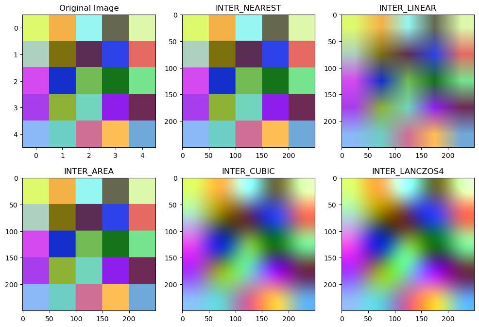
放大圖片：<br>LANCZOS4 \> CUBIC \> LINEAR \> NEAREST
縮小圖片：<br>AREA 最好
最快<br>NEAREST
最常用<br>LINEAR
縮小最好<br>AREA
放大最好<br>CUBIC
品質最高<br>LANCZOS4
<table header-row="true">
<tr>
<td>排名</td>
<td>插值法</td>
<td>速度</td>
<td>品質</td>
</tr>
<tr>
<td>1</td>
<td>`INTER_NEAREST`</td>
<td>⭐⭐⭐⭐⭐ 最快</td>
<td>⭐</td>
</tr>
<tr>
<td>2</td>
<td>`INTER_LINEAR`</td>
<td>⭐⭐⭐⭐</td>
<td>⭐⭐⭐</td>
</tr>
<tr>
<td>3</td>
<td>`INTER_AREA`</td>
<td>⭐⭐⭐</td>
<td>⭐⭐⭐⭐（縮小時）</td>
</tr>
<tr>
<td>4</td>
<td>`INTER_CUBIC`</td>
<td>⭐⭐</td>
<td>⭐⭐⭐⭐</td>
</tr>
<tr>
<td>5</td>
<td>`INTER_LANCZOS4`</td>
<td>⭐ 最慢</td>
<td>⭐⭐⭐⭐⭐</td>
</tr>
</table>
## scaling 縮放
### cv2.resize() 調整影像縮放

用指定尺寸的方式縮放
```python
import cv2

img = cv2.imread('./image/cat.jpg')
resized_img = cv2.resize(img, (600, 300))
cv2.imshow("Resized Image", resized_img)
cv2.waitKey(0)
cv2.destroyAllWindows()
```

按比例縮放
```python
import cv2

img = cv2.imread('./image/cat.jpg')
resized_img = cv2.resize(img, None, fx=0.5, fy=1.5)
cv2.imshow("Resized Image", resized_img)
cv2.waitKey(0)
cv2.destroyAllWindows()
```

## Flip 翻轉
cv2.flip( src, flipCode )
src ：原始影像。<br>flipCode ：翻轉方向
- flipCode = 0 ，則以 X (水平) 軸為對稱軸翻轉
- flipCode \> 0 ，則以 Y (垂直) 軸為對稱軸翻轉
- flipCode \< 0 ，則在 X (水平) 軸、 Y (垂直) 軸方向同時翻轉
```python
import cv2
img = cv2.imread('./image/cat.jpg')

flip_x = cv2.flip(img, 0) #水平翻轉
flip_y = cv2.flip(img, 2) #垂直翻轉
flip_xy = cv2.flip(img, -1) #水平+垂直翻轉

cv2.imshow('original', img)
cv2.imshow('flip x', flip_x)
cv2.imshow('flip y', flip_y)
cv2.imshow('flip xy', flip_xy)

cv2.waitKey(0) 
cv2.destroyAllWindows()
cv2.waitKey(1)
```

```python
import numpy as np
import cv2

image = cv2.imread('./image/mybaby.jpg')
cv2.imshow('Original', image)
cv2.waitKey(0)

flipped = cv2.flip(image, 1)
cv2.imshow('Flipped Horizontally left side right : 1', flipped)
cv2.waitKey(0)

flipped = cv2.flip(image, 0)
cv2.imshow('Flipped vertical upside down : 0', flipped)
cv2.waitKey(0)

flipped = cv2.flip(image, -1)
cv2.imshow('Flipped (left side right) and (upside down) : -1', flipped)

cv2.waitKey(0)
cv2.destroyAllWindows()
cv2.waitKey(1)
```

## Translation  影像平移
```python
import cv2
import numpy as np
origin = cv2.imread('./image/cat.jpg')

trans_x = 80  # 右移80像素
trans_y = 60  # 下移60像素
h, w = origin.shape[:2]
print(f'origin size : h: {h} / w: {w}\n')

#建立平移矩陣
M = np.float32([[1, 0, trans_x], 
                [0, 1, trans_y]])
print('M =\n', M)

# cv2.warpAffine()函數的第三個參數是輸出圖片的大小，應該是（width, height）的形式，記住width=列數，height=行數
trans_img = cv2.warpAffine(origin, M, (w+100, h+100))
cv2.imshow('origin', origin)
cv2.imshow('trans_img', trans_img)

cv2.waitKey(0) 
cv2.destroyAllWindows()
cv2.waitKey(1)
```

#### Affine Matrix  仿射變換矩陣
平移公式
tx = 80 , ty = 60
x' = x + tx<br>y' = y + ty
cv2.warpAffine()
`trans_img = cv2.warpAffine(<br>origin,<br>M,<br>(w+100, h+100)<br>)`
```python
# import numpy as np
import cv2

img = cv2.imread('./image/mybaby.jpg')

h, w, _ = img.shape
# M = np.float32([[1,0,100], 
#                 [0,1,50]])
M = np.array([[1., 0., 100.], 
              [0., 1., 50.]])
print('M =\n', M)

dst = cv2.warpAffine(img, M, (w+150, h+100))

cv2.imshow('translation image',dst)
cv2.waitKey(0)
cv2.destroyAllWindows()
cv2.waitKey(1)
```

## Rotation  圖片旋轉
### 方法一: cv2.getRotationMatrix2D(center, angle, scale)
計算出一個二維旋轉的仿射矩陣
• center ：旋轉中心座標<br>• angle ：旋轉角度，正值意味著逆時針旋轉，座標原點為左上角<br>• scale ：縮放比例
```python
import cv2
import numpy as np
origin = cv2.imread('./image/cat.jpg')

h, w = origin.shape[:2]

# cv2.getRotationMatrix2D(旋轉的中心點, 旋轉角度, 影像縮放)
M1 = cv2.getRotationMatrix2D((w/2, h/2), 45, 0.5) #表示旋轉的中心點,表示旋轉的角度,圖像縮放因子
M2 = cv2.getRotationMatrix2D((w/2, 0), 45, 0.9)
M3 = cv2.getRotationMatrix2D((0, h/2), -45, 0.6)
print(f'M1 =\n{M1}\n\n'
      f'M2 =\n{M2}\n\n'
      f'M3 =\n{M3}')

rotate_img1 = cv2.warpAffine(origin, M1, (w, h))
rotate_img2 = cv2.warpAffine(origin, M2, (w, h))
rotate_img3 = cv2.warpAffine(origin, M3, (w, h))

cv2.imshow('origin', origin)
cv2.imshow('rotate_img1', rotate_img1)
cv2.imshow('rotate_img2', rotate_img2)
cv2.imshow('rotate_img3', rotate_img3)

cv2.waitKey(0) 
cv2.destroyAllWindows()
cv2.waitKey(1)
```

### 方法二: cv2.rotate(img, cv2.旋轉規則)
```python
import numpy as np
import cv2

img = cv2.imread('./image/mybaby.jpg')

rows, cols, _ = img.shape

# cols-1 and rows-1 are the coordinate limits
# getRotationMatrix2D 規劃搬家規則
M = cv2.getRotationMatrix2D((cols/2.0, rows/2.0), 90, 1)  # certer 是中心
# warpAffine 依照規則搬家
dst = cv2.warpAffine(img, M, (cols, rows))

cv2.imshow('Rotate image dst', dst)

img90 = cv2.rotate(img, cv2.ROTATE_90_CLOCKWISE)
img180 = cv2.rotate(img, cv2.ROTATE_180)
img270 = cv2.rotate(img, cv2.ROTATE_90_COUNTERCLOCKWISE)

cv2.imshow('Rotate 90', img90)
cv2.imshow('Rotate 180', img180)
cv2.imshow('Rotate 270', img270)

cv2.waitKey(0)
cv2.destroyAllWindows()
cv2.waitKey(1)
```
旋轉規則
<table header-row="true">
<tr>
<td>參數</td>
<td>效果</td>
</tr>
<tr>
<td>`cv2.ROTATE_90_CLOCKWISE`</td>
<td>順時針90°</td>
</tr>
<tr>
<td>`cv2.ROTATE_180`</td>
<td>180°</td>
</tr>
<tr>
<td>`cv2.ROTATE_90_COUNTERCLOCKWISE`</td>
<td>逆時針90°</td>
</tr>
</table>
<table header-row="true">
<tr>
<td>方法</td>
<td>用途</td>
</tr>
<tr>
<td>`cv2.rotate()`</td>
<td>90°、180°、270°</td>
</tr>
<tr>
<td>`getRotationMatrix2D()`</td>
<td>任意角度</td>
</tr>
<tr>
<td>`warpAffine()`</td>
<td>執行仿射變換</td>
</tr>
<tr>
<td>正角度</td>
<td>逆時針</td>
</tr>
<tr>
<td>負角度</td>
<td>順時針</td>
</tr>
</table>
### **Affine Transformation  仿射變換**
在不破壞直線關係的前提下，對圖片進行變形。
平移 (Translation)<br>旋轉 (Rotation)<br>縮放 (Scaling)<br>剪切 (Shearing)
利用 2\*3的矩陣來表達 再將矩陣傳給warpAffine 執行變形
M = \[<br>\[a, b, tx\],<br>\[c, d, ty\]<br>\]
a,b,c,d<br>↓<br>控制旋轉、縮放、剪切
tx<br>↓<br>x方向平移
ty<br>↓<br>y方向平移
## Affine Transformation（仿射變換）
指定三個點<br>↓<br>移到新的三個位置<br>↓<br>OpenCV自動算出變換矩陣<br>↓<br>整張圖跟著變形
### M = cv2.getAffineTransform(pts1, pts2)
pts1 → pts2
```python
import cv2
import numpy as np

img = cv2.imread('./image/cat.jpg')
h, w, ch = img.shape

##一定要有三個點才能變形
pts1 = np.float32([[0,0], [0,h], [w,0]]) # 左上角, 左下角, 右上角
pts2 = np.float32([[100,30], [0,h], [w+100,30]]) # 目標位置

# 從pts1 -> pts2
M = cv2.getAffineTransform(pts1, pts2)
print(f'M =\n{M}')
affine_img = cv2.warpAffine(img, M, (w+100,h+100))

cv2.imshow('origin', img)
cv2.imshow('affine_img', affine_img)

cv2.waitKey(0) 
cv2.destroyAllWindows()
cv2.waitKey(1)
```
<table header-row="true">
<tr>
<td>函式</td>
<td>功能</td>
</tr>
<tr>
<td>`cv2.getRotationMatrix2D()`</td>
<td>建立旋轉矩陣</td>
</tr>
<tr>
<td>`cv2.getAffineTransform()`</td>
<td>根據3個點建立仿射矩陣，有三個點就可以拉成我想要的圖形</td>
</tr>
<tr>
<td>`cv2.warpAffine()`</td>
<td>執行仿射變換</td>
</tr>
</table>
## Perspective Transformation（透視變換）
可以把梯形拉回矩形，但一定要有四個點
cv2.getPerspectiveTransform(pts1, pts2)
```python
import cv2
import numpy as np

img = cv2.imread('./image/cat.jpg')
h, w, ch = img.shape

pts1 = np.float32([[0, 0], [w, 0], [0, h], [w, h]]) # 左上，右上ㄝ, 左下, 右下
# pts2 = np.float32([[0+10, 0+10], [50, w-10] ,[h/2, 0], [h-50, w-10]])
pts2 = np.float32([[0+100, 0+10], [w-100, 50] ,[50, h-200], [w-20, h-10]])

M = cv2.getPerspectiveTransform(pts1, pts2)
print(f'M =\n{M}')
affine_img = cv2.warpPerspective(img, M, (w+100, h+100))    # 3 * 3 Matrix
# affine_img = cv2.warpAffine(img, M, (w+100, h+100))       # error

cv2.imshow('origin', img)
cv2.imshow('affine_img', affine_img)

cv2.waitKey(0) 
cv2.destroyAllWindows()
cv2.waitKey(1)
```
cv2.warpAffine() 只接受 2\*3 的matrix
cv2.warpAffine() 才能用 3\*3 的matrix
記憶吐司:
Affine → 3個點 → warpAffine()
Perspective → 4個點 → warpPerspective()

# 濾波器
<table header-row="true">
<tr>
<td>濾波器</td>
<td>OpenCV函式</td>
<td>運作方式</td>
<td>主要用途</td>
<td>優點</td>
<td>缺點</td>
</tr>
<tr>
<td>平均濾波 (Mean Filter)</td>
<td>`cv2.blur()`</td>
<td>周圍像素取平均</td>
<td>去除輕微雜訊、平滑圖片</td>
<td>計算快</td>
<td>容易模糊邊緣</td>
</tr>
<tr>
<td>高斯濾波 (Gaussian Filter)</td>
<td>`cv2.GaussianBlur()`</td>
<td>中心權重高、周圍權重低</td>
<td>去雜訊、邊緣偵測前處理</td>
<td>平滑自然</td>
<td>細節會流失</td>
</tr>
<tr>
<td>中值濾波 (Median Filter)</td>
<td>`cv2.medianBlur()`</td>
<td>取鄰域像素中位數</td>
<td>去除椒鹽雜訊</td>
<td>保留邊緣效果佳</td>
<td>計算較慢</td>
</tr>
<tr>
<td>雙邊濾波 (Bilateral Filter)</td>
<td>`cv2.bilateralFilter()`</td>
<td>同時考慮距離與顏色差異</td>
<td>美肌、人像修圖、保邊去噪</td>
<td>保留邊緣</td>
<td>非常耗時</td>
</tr>
<tr>
<td>自訂濾波器 (Custom Filter)</td>
<td>`cv2.filter2D()`</td>
<td>使用自定義 Kernel 卷積</td>
<td>銳化、浮雕、邊緣強化</td>
<td>彈性最高</td>
<td>需自行設計 Kernel</td>
</tr>
</table>
<table header-row="true">
<colgroup>
<col>
<col width="454">
</colgroup>
<tr>
<td>函數</td>
<td>完整語法</td>
</tr>
<tr>
<td>Mean Blur</td>
<td>`cv2.blur(src, ksize, anchor=(-1,-1), borderType=cv2.BORDER_DEFAULT)`</td>
</tr>
<tr>
<td>Box Filter</td>
<td>`cv2.boxFilter(src, ddepth, ksize, anchor=(-1,-1), normalize=True, borderType=cv2.BORDER_DEFAULT)`</td>
</tr>
<tr>
<td>Gaussian Blur</td>
<td>`cv2.GaussianBlur(src, ksize, sigmaX, sigmaY=0, borderType=cv2.BORDER_DEFAULT)`</td>
</tr>
<tr>
<td>Median Blur</td>
<td>`cv2.medianBlur(src, ksize)`</td>
</tr>
<tr>
<td>Bilateral Filter</td>
<td>`cv2.bilateralFilter(src, d, sigmaColor, sigmaSpace)`</td>
</tr>
<tr>
<td>filter2D</td>
<td>`cv2.filter2D(src, ddepth, kernel, anchor=(-1,-1), delta=0, borderType=cv2.BORDER_DEFAULT)`</td>
</tr>
</table>
<table header-row="true">
<tr>
<td>濾波器</td>
<td>去雜訊能力</td>
<td>保留邊界</td>
<td>運算速度</td>
</tr>
<tr>
<td>Mean Blur</td>
<td>⭐⭐⭐</td>
<td>⭐</td>
<td>⭐⭐⭐⭐⭐</td>
</tr>
<tr>
<td>Box Filter</td>
<td>⭐⭐⭐</td>
<td>⭐</td>
<td>⭐⭐⭐⭐⭐</td>
</tr>
<tr>
<td>Gaussian Blur</td>
<td>⭐⭐⭐⭐</td>
<td>⭐⭐</td>
<td>⭐⭐⭐⭐</td>
</tr>
<tr>
<td>Median Blur</td>
<td>⭐⭐⭐⭐⭐（椒鹽雜訊）</td>
<td>⭐⭐⭐⭐</td>
<td>⭐⭐⭐</td>
</tr>
<tr>
<td>Bilateral Filter</td>
<td>⭐⭐⭐</td>
<td>⭐⭐⭐⭐⭐</td>
<td>⭐</td>
</tr>
<tr>
<td>filter2D</td>
<td>視 Kernel 而定</td>
<td>視 Kernel 而定</td>
<td>視 Kernel 而定</td>
</tr>
</table>
用filter2D 手刻 常用的kernel
<table header-row="true">
<tr>
<td>功能</td>
<td>Kernel</td>
</tr>
<tr>
<td>平均濾波</td>
<td>`np.ones((5,5))/25`</td>
</tr>
<tr>
<td>銳化</td>
<td>`[[0,-1,0],[-1,5,-1],[0,-1,0]]`</td>
</tr>
<tr>
<td>強銳化</td>
<td>`[[-1,-1,-1],[-1,9,-1],[-1,-1,-1]]`</td>
</tr>
<tr>
<td>邊緣偵測</td>
<td>`[[-1,-1,-1],[-1,8,-1],[-1,-1,-1]]`</td>
</tr>
<tr>
<td>浮雕效果</td>
<td>`[[-2,-1,0],[-1,1,1],[0,1,2]]`</td>
</tr>
</table>
## 平均濾波（Mean Filter）
- `cv2.blur()`
- `cv2.boxFilter()`

```python
import cv2

img = cv2.imread('./image/lenaNoise.png')
# borderType=cv2.BORDER_REPLICATE : 複製邊界值，邊緣用最近的值補上
result_blur = cv2.blur(img, (3, 3), borderType=cv2.BORDER_REPLICATE)    # border type
result_box = cv2.boxFilter(img, -1, (5, 5), normalize=1)    # change 3, 3 to 5, 5 which is same as blur

cv2.imshow('original', img)
cv2.imshow('result_blur',result_blur)
cv2.imshow('result_box', result_box)  
cv2.waitKey(0)
cv2.destroyAllWindows()
cv2.waitKey(1)
```
`cv2.blur(`
`src, `  輸入影像
`ksize, `  kernel size: (3, 3)輕微模糊,  (5, 5) 中度模糊 , (9, 9)明顯模糊
`dst=None, `
`anchor=(-1,-1),`  卷積中心點 (-1,-1) :自動取kernel中心
`borderType=cv2.BORDER_DEFAULT ` 邊界補值方式
`)`

cv2.BORDER_REPLICATE: 以複製鄰近值來補
cv2.BORDER_CONSTANT: 補0
cv2.BORDER_REFLECT: 鏡射

`cv2.boxFilter(`
`src,`
`ddepth, ` 輸出資料型態  -1 : 輸出格式 = 輸入格式 / cv2.CV_32F: 輸出 float32
`ksize,`
`dst=None,`
`anchor=(-1,-1),`
`normalize=True,`   計算kernel平均  normalize=False 不計算平均 直接輸出加總
`borderType=cv2.BORDER_DEFAULT<br>)`
### 邊界填補（Border Padding）
<table header-row="true">
<tr>
<td>Border Type</td>
<td>說明</td>
<td>範例</td>
</tr>
<tr>
<td>`cv2.BORDER_CONSTANT`</td>
<td>固定顏色填補</td>
<td>`cv2.copyMakeBorder(img,50,50,50,50,cv2.BORDER_CONSTANT,value=(255,255,255))`</td>
</tr>
<tr>
<td>`cv2.BORDER_REPLICATE`</td>
<td>複製邊界像素</td>
<td>`cv2.copyMakeBorder(img,50,50,50,50,cv2.BORDER_REPLICATE)`</td>
</tr>
<tr>
<td>`cv2.BORDER_REFLECT`</td>
<td>鏡射（包含邊界）</td>
<td>`cv2.copyMakeBorder(img,50,50,50,50,cv2.BORDER_REFLECT)`</td>
</tr>
<tr>
<td>`cv2.BORDER_REFLECT_101`</td>
<td>鏡射（不包含邊界）</td>
<td>`cv2.copyMakeBorder(img,50,50,50,50,cv2.BORDER_REFLECT_101)`</td>
</tr>
<tr>
<td>`cv2.BORDER_WRAP`</td>
<td>循環補值</td>
<td>`cv2.copyMakeBorder(img,50,50,50,50,cv2.BORDER_WRAP)`</td>
</tr>
</table>
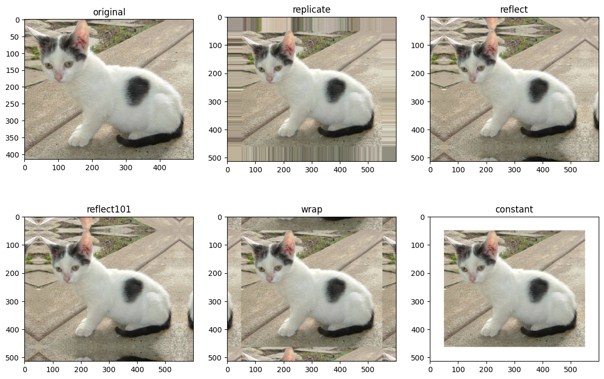

手刻 cv2.blur(o, (5, 5))
```python
import cv2
import numpy as np

o = cv2.imread('./image/lenaNoise.png')

# kernel = np.ones((5, 5), np.float32)/25   # how about /10
kernel = np.full((5,5), 1/25, dtype='float32') #濾波器 -> 平均濾波器
print(kernel)

r = cv2.filter2D(o, -1, kernel)  # -1 是影像深度 -1 表示與原圖相同, anchor:以中心為準, delta:offset
# r = cv2.blur(o,(5,5))  
cv2.imshow('original',o)
cv2.imshow('fliter2D',r) 
cv2.waitKey()
cv2.destroyAllWindows()
cv2.waitKey(1)
```
```python
r = cv2.filter2D(
    src=o, #影像
    ddepth=-1, #影像深度的原始圖片的影像深度
    kernel=kernel, #預先建立好的kernel
    anchor=(-1,-1), #(-1, -1)是正中間
    delta=0, #卷積後加上的值
    borderType=cv2.BORDER_DEFAULT #怎麼補值
)
```

ddepth 影像深度
<table header-row="true">
<tr>
<td>ddepth</td>
<td>型態</td>
<td>範圍</td>
</tr>
<tr>
<td>`-1`</td>
<td>與原圖相同</td>
<td>原圖決定</td>
</tr>
<tr>
<td>`cv2.CV_8U`</td>
<td>uint8</td>
<td>0 \~ 255</td>
</tr>
<tr>
<td>`cv2.CV_8S`</td>
<td>int8</td>
<td>-128 \~ 127</td>
</tr>
<tr>
<td>`cv2.CV_16U`</td>
<td>uint16</td>
<td>0 \~ 65535</td>
</tr>
<tr>
<td>`cv2.CV_16S`</td>
<td>int16</td>
<td>-32768 \~ 32767</td>
</tr>
<tr>
<td>`cv2.CV_32F`</td>
<td>float32</td>
<td>很大範圍</td>
</tr>
<tr>
<td>`cv2.CV_64F`</td>
<td>float64</td>
<td>更高精度</td>
</tr>
</table>
anchor 計算點
<table header-row="true">
<colgroup>
<col>
<col>
<col width="97.26043701171875">
</colgroup>
<tr>
<td>Anchor</td>
<td>位置</td>
<td>示意圖</td>
</tr>
<tr>
<td>`(0,0)`</td>
<td>左上</td>
<td>● □ □<br>□ □ □<br>□ □ □</td>
</tr>
<tr>
<td>`(1,0)`</td>
<td>上中</td>
<td>□ ● □<br>□ □ □<br>□ □ □</td>
</tr>
<tr>
<td>`(2,0)`</td>
<td>右上</td>
<td>□ □ ●<br>□ □ □<br>□ □ □</td>
</tr>
<tr>
<td>`(0,1)`</td>
<td>左中</td>
<td>□ □ □<br>● □ □<br>□ □ □</td>
</tr>
<tr>
<td>`(1,1)`</td>
<td>正中央</td>
<td>□ □ □<br>□ ● □<br>□ □ □</td>
</tr>
<tr>
<td>`(2,1)`</td>
<td>右中</td>
<td>□ □ □<br>□ □ ●<br>□ □ □</td>
</tr>
<tr>
<td>`(0,2)`</td>
<td>左下</td>
<td>□ □ □<br>□ □ □<br>● □ □</td>
</tr>
<tr>
<td>`(1,2)`</td>
<td>下中</td>
<td>□ □ □<br>□ □ □<br>□ ● □</td>
</tr>
<tr>
<td>`(2,2)`</td>
<td>右下</td>
<td>□ □ □<br>□ □ □<br>□ □ ●</td>
</tr>
<tr>
<td>`(-1,-1)`</td>
<td>自動中心</td>
<td>等同 `(1,1)`</td>
</tr>
</table>
<table header-row="true">
<tr>
<td>寫法</td>
<td>意義</td>
</tr>
<tr>
<td>`anchor=(-1,-1)`</td>
<td>自動取中心（推薦）</td>
</tr>
<tr>
<td>`anchor=(1,1)`</td>
<td>3×3 中心</td>
</tr>
<tr>
<td>`anchor=(2,2)`</td>
<td>5×5 中心</td>
</tr>
<tr>
<td>`anchor=(0,0)`</td>
<td>左上角</td>
</tr>
<tr>
<td>`anchor=(4,4)`</td>
<td>5×5 右下角</td>
</tr>
</table>
delta 可以調整亮度  數值越大越亮

### **sharpen 銳化**
手刻sharpen kernel
```python
import numpy as np
import cv2

# img = cv2.imread('./image/mybaby.jpg')
img = cv2.imread('./image/LenaColor.png')

# generating the kernels
# kernel 就是你想要的效果的權重
kernel_sharp1 = np.array([[0,-1,0],
                          [-1,5,-1],
                          [0,-1,0]])  #kernel 總和是1 亮度不變 但是會銳化

kernel_sharp2 = np.array([[-1,-1,-1],
                          [-1,9,-1],
                          [-1,-1,-1]])

kernel_sharp3 = np.array([[1,1,1],
                          [1,-7,1],
                          [1,1,1]])

kernel_sharp4 = np.array([[-1,-1,-1,-1,-1],
                          [-1,2,2,2,-1],
                          [-1,2,8,2,-1],
                          [-1,2,2,2,-1],
                          [-1,-1,-1,-1,-1]]) / 8.0

# applying different kernels to the input image
out1 = cv2.filter2D(img, cv2.CV_64F, kernel_sharp1)
out2 = cv2.filter2D(img, cv2.CV_64F, kernel_sharp2)
out3 = cv2.filter2D(img, cv2.CV_64F, kernel_sharp3)
out4 = cv2.filter2D(img, cv2.CV_64F, kernel_sharp4)

cv2.imshow('Original', img)
cv2.imshow('1. Sharpening', cv2.convertScaleAbs(out1))
cv2.imshow('2. More Sharpening', cv2.convertScaleAbs(out2))
cv2.imshow('3. Excessive Sharpening', cv2.convertScaleAbs(out3))
cv2.imshow('4. Edge Enhancement', cv2.convertScaleAbs(out4))

cv2.waitKey(0)
cv2.destroyAllWindows()
cv2.waitKey(1)
```
```python
cv2.convertScaleAbs(
    src,
    alpha=1,
    beta=0
)

1. 乘 alpha
2. 加 beta
3. 取絕對值 abs()
4. 限制到 0~255
5. 轉成 uint8
```

## **高斯濾波器  Gaussian Filter **

```python
import matplotlib.pyplot as plt
import numpy as np
import cv2

ksize=9 #kernel 固定 9*9    
sigma=[0.75, 1.5, 2.25, 3]   # sigma = -1
X = Y = np.arange(-(ksize//2), ksize//2+1)
X, Y = np.meshgrid(X, Y);#    ax.set_box_aspect((1, 1, 1))

fig= plt.figure(figsize=(9,7))

for idx, s in enumerate(sigma) :
    k1d = cv2.getGaussianKernel(ksize, s)
    k2d = k1d * k1d.T

    ax = fig.add_subplot(2, 2, idx+1, projection='3d')
    ax.set_xlabel('x');  ax.set_ylabel('y');  ax.set_zlabel('z');  ax.set_title(fr'$\sigma$={s}')
    ax.set_zlim(0, .2)
    p=ax.plot_surface(X, Y, k2d, cmap=plt.get_cmap('rainbow'), linewidth=0, antialiased=False)
    # plt.colorbar(p)
plt.suptitle(r'$\sigma$   variance')# ; plt.tight_layout()
plt.show()             
```
比較不同的sigma所產生的效果  sigma 越大  模糊越強 細節流失越多
```python
import cv2
o = cv2.imread('image/lenaNoise.png')
sigma0 = cv2.GaussianBlur(o, (5,5), 0, 0)   #標準差取 0 時 OpenCV 會根據高斯矩陣的尺寸自己計算
sigma22 = cv2.GaussianBlur(o, (5,5), 2, 2) #標準差取 2

cv2.imshow('original', o)
cv2.imshow('sigma0', sigma0)
cv2.imshow('sigma22', sigma22)

cv2.waitKey(0)
cv2.destroyAllWindows()
cv2.waitKey(1)
```
高斯濾波的核心概念是：
計算目前像素時<br>會參考周圍的像素
而 σ 決定：
要參考多遠的像素
```python
import numpy as np
import cv2

image = cv2.imread('./image/mybaby.jpg')
cv2.imshow('Original', image)

# stack output images together, kernal size 越大, sigma 愈大, 圖像愈模糊 
blurred = np.hstack([cv2.GaussianBlur(image, (3, 3), 0), 
                     cv2.GaussianBlur(image, (5, 5), 0),
                     cv2.GaussianBlur(image, (7, 7), 0)])

cv2.imshow('Gaussian 3*3, 5*5, 7*7', cv2.resize(blurred, None, fx=0.75, fy=0.75))
cv2.waitKey(0)
cv2.destroyAllWindows()
cv2.waitKey(1)
```

## **Median Filter 中位數**
比較 平均和中位數濾波器的差異
```python
import cv2
o=cv2.imread('image/lenaNoise.png')

blur = cv2.blur(o, (3,3))
med_blur = cv2.medianBlur(o, 3)

cv2.imshow('original', o)
cv2.imshow('blur', blur)
cv2.imshow('median_blur', med_blur)

cv2.waitKey()
cv2.destroyAllWindows()
cv2.waitKey(1)
```
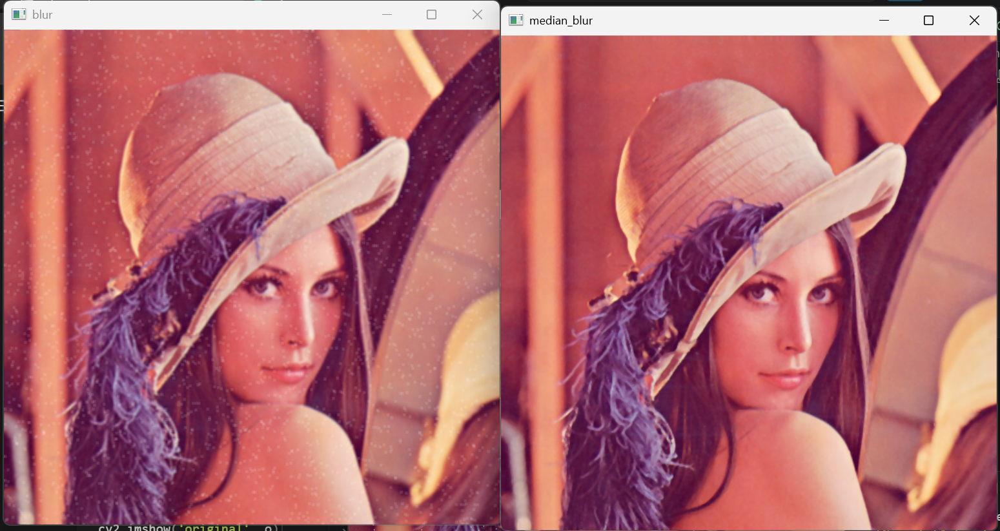

```python
import numpy as np
import cv2
image =cv2.imread('image/lenaNoise.png')
# image = cv2.imread('./image/mybaby.jpg')

cv2.imshow('Original', image)

# stack output images together
blurred = np.hstack([cv2.medianBlur(image, 3),
                     cv2.medianBlur(image, 5),
                     cv2.medianBlur(image, 7)])

cv2.imshow('MedianBlue 3, 5, 7', cv2.resize(blurred, None, fx=0.75, fy=0.75))
cv2.waitKey(0)
cv2.destroyAllWindows()
cv2.waitKey(1)
```

## **Bilateral Filter 雙邊濾波器**
結合兩種權重
空間權重: 距離越近權重越大
強度權重: 與中心像素差異越大 權重越小
```python
import cv2
o = cv2.imread('./image/lenaNoise.png')
r1 = cv2.bilateralFilter(o, 5, 100, 100)
r2 = cv2.bilateralFilter(o, 5, 200, 200)

cv2.imshow('original', o)
cv2.imshow('bif : 5_100*100', r1)
cv2.imshow('bif : 5_200*200', r2)

cv2.waitKey()
cv2.destroyAllWindows()
cv2.waitKey(1)
```
對雜訊的處理不如中位數濾波器
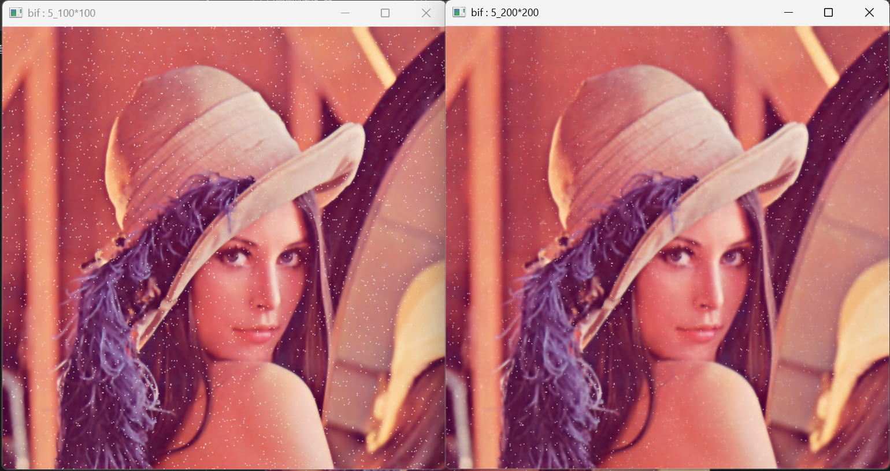

高斯濾波器 v.s. 雙邊濾波器
```python
import cv2
o = cv2.imread('./image/bilTest.bmp')

g=r=cv2.GaussianBlur(o, (55, 55), 0, 0)
b=cv2.bilateralFilter(o, 55, 100, 100)

cv2.imshow('original',o)
cv2.imshow('Gaussian',g)
cv2.imshow('bilateral',b)

cv2.waitKey(0)
cv2.destroyAllWindows()
cv2.waitKey(1)
```
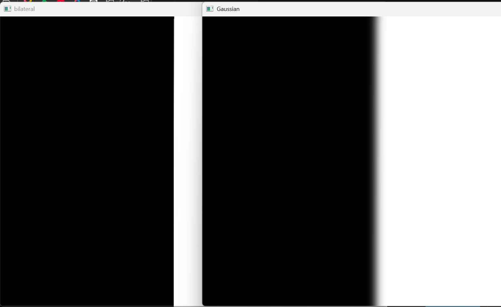
**bilateralFilter 對雜訊處裡效果不好, 對邊界處理較佳**

高斯濾波器考慮的是距離，距離越近，權重越大，
0 0 0 255 255 255  → 0 0 80 170 255 255  所以邊界被模糊

雙邊濾波器考慮的是距離跟顏色差異，距離越近、顏色差異越大，權重越重
0 0 0 255 255 255 → 0 0 0 255 255 255  因為顏色差異大，所以不會被平均掉
保留邊界

```python
import numpy as np
import cv2

image = cv2.imread('./image/mybaby.jpg')
cv2.imshow('Original', image)

image=cv2.resize(image,(500, 280))

# stack output images together
blurred = np.hstack([cv2.bilateralFilter(image, 5, 20, 20),
                     cv2.bilateralFilter(image, 7, 40, 40),
                     cv2.bilateralFilter(image, 9, 60, 60)])

cv2.imshow('Bilateral', blurred)
cv2.waitKey(0)
cv2.destroyAllWindows()
cv2.waitKey(1)
```

# 影像二值化
## cv2.threshold()
<br>它會根據設定的門檻值 `thresh` 將像素分成兩類，並依照 `type` 決定如何輸出。最常用的是 `THRESH_BINARY`，當像素值大於門檻時設為 `maxval`（通常是 255），否則設為 0。這是影像分割、OCR、輪廓偵測前常見的前處理步驟。<br><br>
```python
ret, dst = cv2.threshold(
    src, # 影像
    thresh, # 門檻值
    maxval, # 超過門檻要給的值
    type # 決定如何二值化
)
```
<table header-row="true">
<tr>
<td>Type</td>
<td>\> thresh</td>
<td>≤ thresh</td>
<td>功能</td>
</tr>
<tr>
<td>THRESH_BINARY</td>
<td>maxval(指定值)</td>
<td>0</td>
<td>標準二值化</td>
</tr>
<tr>
<td>THRESH_BINARY_INV</td>
<td>0</td>
<td>maxval</td>
<td>反向二值化</td>
</tr>
<tr>
<td>THRESH_TRUNC</td>
<td>thresh</td>
<td>原值</td>
<td>超過門檻截斷</td>
</tr>
<tr>
<td>THRESH_TOZERO</td>
<td>原值</td>
<td>0</td>
<td>保留亮區</td>
</tr>
<tr>
<td>THRESH_TOZERO_INV</td>
<td>0</td>
<td>原值</td>
<td>保留暗區</td>
</tr>
</table>
```python
gray = cv2.cvtColor(
    img,
    cv2.COLOR_BGR2GRAY
)

ret, binary = cv2.threshold(
    gray,
    127,
    255,
    cv2.THRESH_BINARY
)
```
範例
```python
import cv2
import numpy as np
from matplotlib import pyplot as plt

img=np.random.randint(100, 150, size=[5, 5], dtype=np.uint8)
print(f'img : \n{img}\n')

thd, t1 = cv2.threshold(img, 125, 245, cv2.THRESH_BINARY)   # try 125
print(f'thd : {thd}\n\n'
      f't1 :\n{t1}')
```
```python
img :
[[136 140 100 113 134]
[120 129 123 128 106]
[109 112 110 105 118]
[133 137 132 146 110]
[109 145 122 114 121]]

thd : 125.0

t1 :
[[245 245   0   0 245]
[  0 245   0 245   0]
[  0   0   0   0   0]
[245 245 245 245   0]
[  0 245   0   0   0]]
```

處理灰階圖
```python
import cv2
import numpy as np

# img = cv2.resize(cv2.imread('./image/thresh.jpg', 0), (300,200))
img = cv2.resize(cv2.imread('./image/lenaColor.png', 0),(400, 300))
    
ret, thresh1 = cv2.threshold(img, 127, 255, cv2.THRESH_BINARY)  # 1=255, 0=0
ret, thresh2 = cv2.threshold(img, 127, 255, cv2.THRESH_BINARY_INV)
ret, thresh3 = cv2.threshold(img, 127, 255, cv2.THRESH_TRUNC)   # 1=127 Thresh, 0=value
ret, thresh4 = cv2.threshold(img, 127, 255, cv2.THRESH_TOZERO)  # 1=value,  0=0
ret, thresh5 = cv2.threshold(img, 127, 255, cv2.THRESH_TOZERO_INV)

titles = ['Original Image', 'BINARY', 'BINARY_INV', 'TRUNC', 'TOZERO', 'TOZERO_INV']
images = [img, thresh1, thresh2, thresh3, thresh4, thresh5]

plt.figure(figsize=(16, 8))

for idx, (t, i) in enumerate(zip(titles, images)):
    plt.subplot(2, 3, idx + 1)
    plt.setp(plt.title(t), color='k')
    plt.xticks([]), plt.yticks([])
    plt.imshow(i, cmap='gray', vmin=0, vmax=255)
```
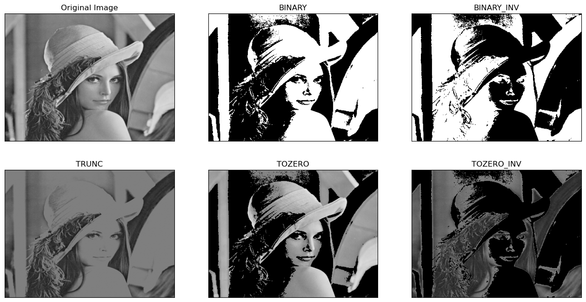

處理彩色圖
```python
import cv2
import numpy as np

img = cv2.cvtColor(cv2.resize(cv2.imread('./image/lenaColor.png', 1),(400, 300)), cv2.COLOR_BGR2RGB)
    
ret, thresh1 = cv2.threshold(img, 127, 255, cv2.THRESH_BINARY)  # 1=255, 0=0
ret, thresh2 = cv2.threshold(img, 127, 255, cv2.THRESH_BINARY_INV)
ret, thresh3 = cv2.threshold(img, 127, 255, cv2.THRESH_TRUNC)   # 1=127 Thresh, 0=value
ret, thresh4 = cv2.threshold(img, 127, 255, cv2.THRESH_TOZERO)  # 1=value,  0=0
ret, thresh5 = cv2.threshold(img, 127, 255, cv2.THRESH_TOZERO_INV)

titles = ['Original Image', 'BINARY', 'BINARY_INV', 'TRUNC', 'TOZERO', 'TOZERO_INV']
images = [img, thresh1, thresh2, thresh3, thresh4, thresh5]

plt.figure(figsize=(16, 8))

for idx, (t, i) in enumerate(zip(titles, images)):
    plt.subplot(2, 3, idx + 1)
    plt.setp(plt.title(t), color='k')
    plt.xticks([]), plt.yticks([])
    plt.imshow(i)
```
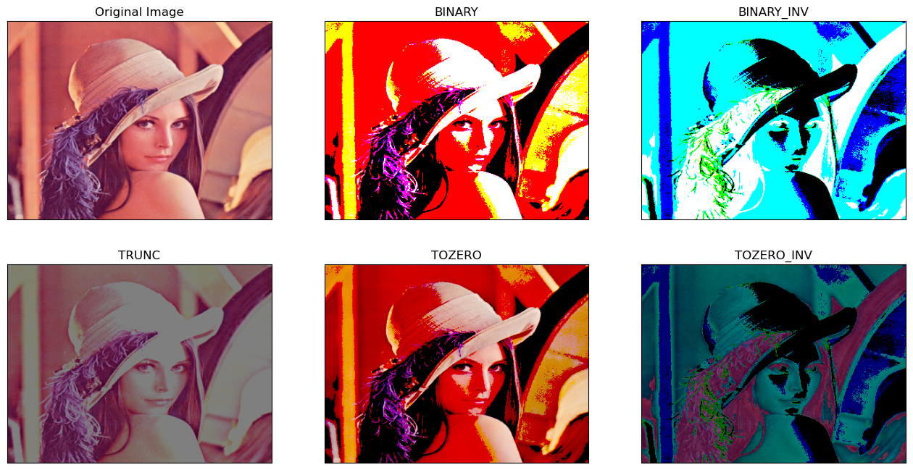

## **threshold adaptive \`\`局部\`\` 自我調節設定**
Threshold → 大家共用一個門檻
**threshold adaptive  → **每個區域自己決定門檻大小
```python
cv2.adaptiveThreshold(
    src,  # 影像 通常是灰階圖
    maxValue, #255
    adaptiveMethod,  # 如何計算閾值
    thresholdType, # 二值化方式 通常cv2.THRESH_BINARY 或 cv2.THRESH_BINARY_INV
    blockSize, # 區域大小(奇數)
    C #門檻修正值
)
```

adaptiveMethod 計算方式
1. ADAPTIVE_THRESH_MEAN_C
Threshold = 區域平均值 - c

2. ADAPTIVE_THRESH_GAUSSIAN_C
Threshold = 高斯加權平均值 - c

blockSize : 計算局部門檻值時，我要參考多大的範圍
範圍越小，細節越多，但不容易模糊雜訊
一定要是奇數，不然會找不到中心
範例:
```python
import cv2
import numpy as np

img=np.random.randint(0, 256, size=[6, 8], dtype=np.uint8)

print(f'img :\n{img}\n')

t1, thd = cv2.threshold(img, 127, 255, cv2.THRESH_BINARY)   # try 127 → 125
print(f'threshHold : {t1}\n\n'
      f'thd :\n{thd}\n')

# blockSize=3, C=0 (mean - C)
Ad_thd_mean = cv2.adaptiveThreshold(img, 255, cv2.ADAPTIVE_THRESH_MEAN_C, cv2.THRESH_BINARY, 3, 0) 
print(f'Ad_thd_mean :\n{Ad_thd_mean}\n')

Ad_thd_gauss = cv2.adaptiveThreshold(img, 255, cv2.ADAPTIVE_THRESH_GAUSSIAN_C, cv2.THRESH_BINARY, 3, 0)
print(f'Ad_thd_gauss :\n{Ad_thd_mean}')
```
```python
img :
[[ 36 206 157 205 208 154 148 174]
 [ 30  11  39  19  86 132  82  99]
 [115  46 144 156 122  90  66 252]
 [ 90   8  15 116 223  13  73 204]
 [138 142 226 159  90 217 210 166]
 [  6  57  25 101 211 194  10  57]]

threshHold : 127.0

thd :
[[  0 255 255 255 255 255 255 255]
 [  0   0   0   0   0 255   0   0]
 [  0   0 255 255   0   0   0 255]
 [  0   0   0   0 255   0   0 255]
 [255 255 255 255   0 255 255 255]
 [  0   0   0   0 255 255   0   0]]

Ad_thd_mean :
[[  0 255 255 255 255 255 255 255]
 [  0   0   0   0   0 255   0   0]
 [255   0 255 255 255   0   0 255]
 [  0   0   0   0 255   0   0 255]
 [255 255 255 255   0 255 255 255]
 [  0   0   0   0 255 255   0   0]]
...
 [255   0 255 255 255   0   0 255]
 [  0   0   0   0 255   0   0 255]
 [255 255 255 255   0 255 255 255]
 [  0   0   0   0 255 255   0   0]]
```

```python
import numpy as np
import cv2

image = cv2.imread('./image/mybaby.jpg', 0)
cv2.imshow('Original', image)

ret, thresh = cv2.threshold(image, 127, 255, cv2.THRESH_BINARY)  # 1 : 255, 0 : 0
cv2.imshow(f'Thresh hold {ret}, 255', thresh)

thresh = cv2.adaptiveThreshold(image, 255, cv2.ADAPTIVE_THRESH_MEAN_C, cv2.THRESH_BINARY, 5, 4)
cv2.imshow('adaptive / Mean Thresh', thresh)

thresh = cv2.adaptiveThreshold(image, 255, cv2.ADAPTIVE_THRESH_GAUSSIAN_C, cv2.THRESH_BINARY, 5, 4)
cv2.imshow('adaptive / Gaussian Thresh', thresh)

cv2.waitKey(0)
cv2.destroyAllWindows()
cv2.waitKey(1)
```
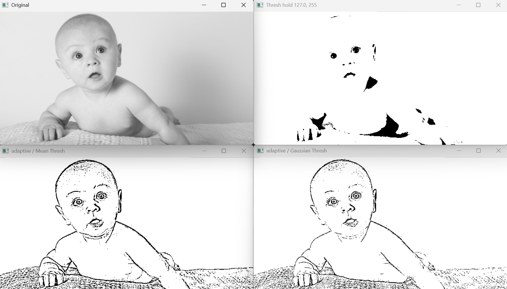

## Threshold otsu （二值化自動找最佳門檻）
會根據圖片的灰階分布自動計算 Threshold。
ret, thresh = cv2.threshold(<br>gray,<br>0,<br>255,<br>cv2.THRESH_BINARY + cv2.THRESH_OTSU<br>)
黑色區域       白色區域
██████      ██████<br>██████      ██████<br>██████      ██████
0              120         255
otsu 會自己去找最適合把兩群資料分開的閾值
otsu的目標
讓類別內變異最小
讓類別間變異最大

範例 隨機矩陣
```python
import cv2
import numpy as np

img=np.random.randint(0, 256, size=[6, 8], dtype=np.uint8)
print(f'img : \n{img}\n')

th2, img2 = cv2.threshold(img, 0, 255, cv2.THRESH_OTSU)  # type

#th2, img2 = cv2.threshold(img, 0, 255, cv2.THRESH_BINARY + cv2.THRESH_OTSU)
print(f'THRESH_OTSU th2 : {th2}\n\n'
      f'img2 :\n{img2}')
```
```python
img : 
[[ 81 165   0 114 183  53  81  34]
 [165 207  19 169 109  14  22  46]
 [ 58 129 232 158  70 194  49 229]
 [105  19  62  84  55 153 107  92]
 [ 23  24 129 119  98 116  76  88]
 [107 120   6 167 166  88 125 192]]

THRESH_OTSU th2 : 98.0

img2 :
[[  0 255   0 255 255   0   0   0]
 [255 255   0 255 255   0   0   0]
 [  0 255 255 255   0 255   0 255]
 [255   0   0   0   0 255 255   0]
 [  0   0 255 255   0 255   0   0]
 [255 255   0 255 255   0 255 255]]
```
範例圖
讀灰階圖<br>↓<br>固定127二值化<br>↓<br>Otsu自動找Threshold<br>↓<br>顯示兩種結果<br>↓<br>畫灰階直方圖<br>↓<br>在直方圖上標示<br>Otsu找到的位置<br>↓<br>把原圖放到小視窗
```python
# using cv2 module
import numpy as np
from matplotlib import pyplot as plt
import cv2

image = cv2.imread('./image/mybaby.jpg', 0)
# image = cv2.imread('./image/lenaColor.png', 0)

cv2.imshow('original', image)

ret, thresh = cv2.threshold(image, 127, 255, cv2.THRESH_BINARY)  # 1 : 255, 0 : 0
cv2.imshow('Thresh hold : 127', thresh)

# Otsu threshold
th2, img2 = cv2.threshold(image, 0, 255,  cv2.THRESH_OTSU)

print(f"Otsu's threshold : {th2}")
cv2.imshow(f'Otsu : {th2}', img2)

fig=plt.figure(figsize=(10, 4))
ax0 = fig.add_axes([0.1, 0.1, 0.8, 0.8])  # 建立小視窗 # main axes

ax0.hist(image.flatten(), 256)   # 畫直方圖
ax0.axvline(x=th2, color='r', lw=1)
# print(plt.ylim()[1])
ax0.text(th2+5, plt.ylim()[1]*.9, f'Otsu : {th2}', fontsize=10, color='r')

ax1 = fig.add_axes([0.12, 0.6, 0.25, 0.25])  # inside axes
ax1.imshow(cv2.cvtColor(image, cv2.COLOR_BGR2RGB))
ax1.axis('off')
cv2.waitKey(0)
cv2.destroyAllWindows()
cv2.waitKey(1)
```
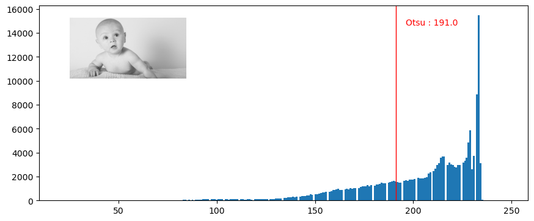
Otsu's threshold : 191.0

# Edge detection 邊緣偵測
openCV 提供三種邊緣檢測方式來處理 \`Sobel、Canny 及 Laplacian\`，這些技術皆是使用 \`灰階\` 的影像，基於每個像素灰度的不同，利用不同物體在其邊界處會\`有明顯的邊緣特徵來分辨\`。這三種方法皆使用了\`一維甚至於二維的微分\`，嚴格來說，若依其使用技術原理的不同可分為兩種：<br><br>1.  Sobel 和 Canny 使用的則是 Gradient methods（梯度原理），它是透過計算像素光度的\`一階導數差異\`（detect changes in the first derivative of intensity）來進行邊緣檢測。
10 10 10 10 200 200  → 做一階微分 → 0 0 0 190 0 
Sobel X：
\[\[-1,0,1\],<br>\[-2,0,2\],<br>\[-1,0,1\]\]

10 10 200<br>10 10 200<br>10 10 200
(-1×10)+(0×10)+(1×200)<br>+<br>(-2×10)+(0×10)+(2×200)<br>+<br>(-1×10)+(0×10)+(1×200)
= 760
得到一個很大的值，表示亮度變化很劇烈

### Sobel 的梯度
Gx:  水平方向
```python
[[-1,0,1],
 [-2,0,2],
 [-1,0,1]]
```
<br>Gy: 垂直方向
```python
[[-1,-2,-1],
 [ 0, 0, 0],
 [ 1, 2, 1]]
```
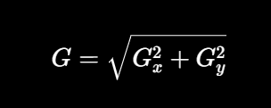

2. Laplacian 原稱為 Laplacian method，透過計算零交越點上光度的\`二階導數\`（detect zero crossings of the second derivative on intensity changes）

<table header-row="true">
<tr>
<td>函數</td>
<td>功能</td>
</tr>
<tr>
<td>`np.abs()`</td>
<td>只取絕對值</td>
</tr>
<tr>
<td>`cv2.convertScaleAbs()`</td>
<td>取絕對值 + 轉 uint8 + 限制 0\~255</td>
</tr>
</table>
```python
import cv2
import numpy as np
img=np.random.randint(-256, 256, size=[4, 5], dtype=np.int16)   # –32768 ~ 32767,  0 ~ 65535
rst=cv2.convertScaleAbs(img)                                    # 絕對值
print(f'img =\n{img}\n\n'
      f'rst =\n{rst}\n\n'
      f'np.abs()\n{np.abs(img)}')    # numpy 也可以
```

## **Sobel 濾波器**
會先找sobelX，再找sobleY，最後再用cv2.addWeighted()合併

```python
cv2.Sobel(
    src, # 影像
    ddepth, # 影像深度
    dx,  # x方向導數階數
    dy,  # y方向導數階數
    ksize=3, # kernel size
    scale=1, # 縮放倍率
    delta=0, # 額外加值
    borderType=cv2.BORDER_DEFAULT #邊界處理方式
)
```
<table header-row="true">
<tr>
<td>dx</td>
<td>dy</td>
<td>意義</td>
</tr>
<tr>
<td>1</td>
<td>0</td>
<td>Gx (X方向梯度)</td>
</tr>
<tr>
<td>0</td>
<td>1</td>
<td>Gy (Y方向梯度)</td>
</tr>
<tr>
<td>1</td>
<td>1</td>
<td>同時計算X與Y二階混合導數（較少用）</td>
</tr>
</table>

#### ddept = -1  unit8 的單邊解釋
```python
img = np.zeros((7, 7), dtype=np.uint8)
img[1:6, 1:6] = 10  # padding problem = 10
print(f'img :\n{img}\n')

sobelx = cv2.Sobel(img, -1, 1, 0, ksize=-1)  # ddepth = -1, dx=1, dy=0
sobely = cv2.Sobel(img, -1, 0, 1, ksize=-1)  # ddepth = -1, dx=0, dy=1
sobelxy = cv2.addWeighted(sobelx, 0.5, sobely, 0.5, 0)  # dst = src1*alpha + src2*beta + gamma;

print(f'sobelx uint8 :\n{sobelx}\n\n'
      f'sobely uint8 :\n{sobely}\n\n'
      f'sobelxy :\n{sobelxy}\n')
```
```python
img :
[[ 0  0  0  0  0  0  0]
 [ 0 10 10 10 10 10  0]
 [ 0 10 10 10 10 10  0]
 [ 0 10 10 10 10 10  0]
 [ 0 10 10 10 10 10  0]
 [ 0 10 10 10 10 10  0]
 [ 0  0  0  0  0  0  0]]

sobelx uint8 :
[[  0  60   0   0   0   0   0]
 [  0 130   0   0   0   0   0]
 [  0 160   0   0   0   0   0]
 [  0 160   0   0   0   0   0]
 [  0 160   0   0   0   0   0]
 [  0 130   0   0   0   0   0]
 [  0  60   0   0   0   0   0]]

sobely uint8 :
[[  0   0   0   0   0   0   0]
 [ 60 130 160 160 160 130  60]
 [  0   0   0   0   0   0   0]
 [  0   0   0   0   0   0   0]
 [  0   0   0   0   0   0   0]
 [  0   0   0   0   0   0   0]
...
 [  0  80   0   0   0   0   0]
 [  0  65   0   0   0   0   0]
 [  0  30   0   0   0   0   0]]
```

ksize = -1  →  Scharr Kernel
X方向：
```python
 -3   0   3
-10   0  10
 -3   0   3
```
Y方向：
```python
 -3 -10 -3
  0   0  0
  3  10  3
```
Scharr 是專門優化 3×3 Sobel 的梯度估計，因此在 3×3 Kernel 下通常比 Sobel 更精準。但 Scharr 只能使用固定的 3×3 Kernel，而 Sobel 可以使用 3×3、5×5、7×7 等不同大小的 Kernel。當影像雜訊較多時，較大的 Sobel Kernel 能提供更好的平滑效果，因此兩者各有適用場景。

#### **ddepth = cv2.CV_64F 雙邊解譯**
```python
img = np.zeros((7, 7), dtype=np.uint8)
img[1:6, 1:6] = 10
print(f'img :\n{img}\n')

sobelx = cv2.Sobel(img, cv2.CV_64F, 1, 0)   # ddepth = cv2.CV64F
sobely = cv2.Sobel(img, cv2.CV_64F, 0, 1)   # ddepth = cv2.CV64F

sobelx = cv2.convertScaleAbs(sobelx)        # 絕對值, 轉換為cv2.CV_8U  
sobely = cv2.convertScaleAbs(sobely)        # 絕對值, 轉換為cv2.CV_8U  
sobelxy = cv2.addWeighted(sobelx, 0.5, sobely, 0.5, 0)  

print(f'sobelx CV_64F :\n{sobelx}\n\n'
      f'sobely CV_64F :\n{sobely}\n\n'
      f'sobelxy :\n{sobelxy}\n')
```
```python
img :
[[ 0  0  0  0  0  0  0]
 [ 0 10 10 10 10 10  0]
 [ 0 10 10 10 10 10  0]
 [ 0 10 10 10 10 10  0]
 [ 0 10 10 10 10 10  0]
 [ 0 10 10 10 10 10  0]
 [ 0  0  0  0  0  0  0]]

sobelx CV_64F :
[[ 0 20  0  0  0 20  0]
 [ 0 30  0  0  0 30  0]
 [ 0 40  0  0  0 40  0]
 [ 0 40  0  0  0 40  0]
 [ 0 40  0  0  0 40  0]
 [ 0 30  0  0  0 30  0]
 [ 0 20  0  0  0 20  0]]

sobely CV_64F :
[[ 0  0  0  0  0  0  0]
 [20 30 40 40 40 30 20]
 [ 0  0  0  0  0  0  0]
 [ 0  0  0  0  0  0  0]
 [ 0  0  0  0  0  0  0]
 [20 30 40 40 40 30 20]
...
 [ 0 20  0  0  0 20  0]
 [10 30 20 20 20 30 10]
 [ 0 10  0  0  0 10  0]]
```

unit8 v.s. CV_64F 
因為 unit8 的範圍只有0\~255 ，不存負值，所以soble出來的值，如果有負數就會變成0，邊緣就會少掉一邊
CV_64F 可以存負值，所以負值邊緣會被保留下來
最重要的事的，做完要做convertScaleAbs()，取絕對值轉回unit8，才有辦法以影像形式顯示。
<br>Sobel 使用 `CV_64F` 是為了保留梯度計算中的負值與避免溢位，但 Sobel 的輸出代表梯度而不是影像亮度，因此無法直接作為一般影像顯示。最後通常會使用 `cv2.convertScaleAbs()` 將梯度取絕對值並轉換成 `uint8 (0~255)`，讓邊緣強度能夠以影像形式顯示或儲存。<br><br>
<table header-row="true">
<tr>
<td>型態</td>
<td>範圍</td>
</tr>
<tr>
<td>uint8</td>
<td>0 \~ 255</td>
</tr>
<tr>
<td>int16</td>
<td>-32768 \~ 32767</td>
</tr>
<tr>
<td>float32</td>
<td>±3.4 × 10³⁸</td>
</tr>
<tr>
<td>float64</td>
<td>±1.8 × 10³⁰⁸</td>
</tr>
</table>
圖例:
```python
import cv2
# o = cv2.imread('./image/sobel.bmp')
# o = cv2.imread('./image/contour.png')
o = cv2.imread('./image/road1.jpg')

sobelx = cv2.Sobel(o, cv2.CV_16S, 1, 0)     # ddepth = cv2.CV_16S, dx=1, dy=0, 
# sobelx = cv2.Sobel(o, cv2.CV_64F, 1, 0)   # ddepth = cv2.CV64V
sobelx = cv2.convertScaleAbs(sobelx)        # 絕對值, 轉換為cv2.CV_8U  

sobely = cv2.Sobel(o, cv2.CV_64F, 0, 1)     # ddepth = cv2.CV_64V, dx=0, dy=1, 
sobely = cv2.convertScaleAbs(sobely)        # 絕對值, 轉換為 cv2.CV_8U 

sobelxy_or = cv2.bitwise_or(sobelx, sobely)
# sobelxy_and = cv2.bitwise_and(sobelx, sobely)

cv2.imshow('original', o)
cv2.imshow('x CV_16S', sobelx)
cv2.imshow('y CV_16S', sobely)
cv2.imshow('xy_or', sobelxy_or)
# cv2.imshow('xy_and', sobelxy_and)

cv2.waitKey()
cv2.destroyAllWindows()
cv2.waitKey(1)
```

## **Scharr 濾波器**
charr 濾波器是對 Sobel 運算元差異性的增強，兩者之間的在檢測圖像邊緣的原理和使用方式上相同。而 Scharr 濾波器的主要思路是通過將模版中的`權重係數放大來增大圖元值間的差異`。
```python
cv2.Scharr(
    src, # 影像
    ddepth, # 輸出型態
    dx, # x的導數階數
    dy,  # y的導數階數
    scale=1, # 縮放倍率
    delta=0, # 偏移植
    borderType=cv2.BORDER_DEFAULT #邊界填補方式
)
```

```python
import cv2
import numpy as np
# o = cv2.imread('./image/sobel.bmp')
o = cv2.imread('./image/lenaColor.png')  # 微分更敏感

scharrx = cv2.Scharr(o, cv2.CV_64F, 1, 0)    # try dx=1, dy=1
scharry = cv2.Scharr(o, cv2.CV_64F, 0, 1)

# scharrx = cv2.Scharr(o, cv2.CV_16S, 1, 0)    # try dx=1, dy=1
# scharry = cv2.Scharr(o, cv2.CV_16S, 0, 1)

# scharrx = cv2.Scharr(o, -1, 1, 0)    # try dx=1, dy=1
# scharry = cv2.Scharr(o, -1, 0, 1)

scharrx = cv2.convertScaleAbs(scharrx)   # 轉回uint8 
scharry = cv2.convertScaleAbs(scharry)   # 轉回uint8 
scharrxy = cv2.addWeighted(scharrx, 0.5, scharry, 0.5, 0)  

cv2.imshow('original',o)

cv2.imshow('scharr x', scharrx)
cv2.imshow('scharr y', scharry)
cv2.imshow('xy',scharrxy)

cv2.waitKey()
cv2.destroyAllWindows()
cv2.waitKey(1)
```

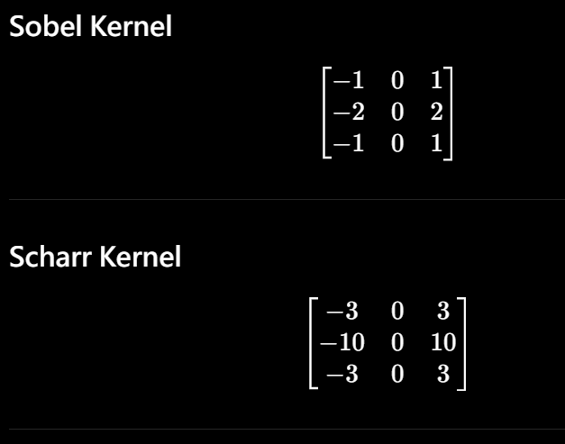
Sobel:<br>中間權重 = 2
Scharr:<br>中間權重 = 10
 Scharr 梯度權重更高，定位越精準

```python
cv2.Scharr(img, cv2.CV_64F, 1, 0)

cv2.Sobel(img, cv2.CV_64F, 1, 0, ksize=-1)

ksize=-1 會直接用Scharr來計算
所以上述兩種是等價的寫法
```

### ** Sobel vs. Scharr**
```python
import cv2
o = cv2.imread('./image/lenaColor.png')

# =========== Sobel ======================
sobelx = cv2.Sobel(o, cv2.CV_64F, 1, 0, ksize=3)
sobely = cv2.Sobel(o, cv2.CV_64F, 0, 1, ksize=3)

sobelx = cv2.convertScaleAbs(sobelx) 
sobely = cv2.convertScaleAbs(sobely)  
sobelxy = cv2.addWeighted(sobelx, 0.5, sobely, 0.5, 0) 

# ========== Scharr ======================
scharrx = cv2.Scharr(o, cv2.CV_64F,1,0)
scharry = cv2.Scharr(o, cv2.CV_64F,0,1)

scharrx = cv2.convertScaleAbs(scharrx)
scharry = cv2.convertScaleAbs(scharry)  
scharrxy = cv2.addWeighted(scharrx, 0.5,scharry, 0.5, 0) 

cv2.imshow('original', o)
cv2.imshow('sobel_xy', sobelxy)
cv2.imshow('scharr_xy', scharrxy)

cv2.waitKey()
cv2.destroyAllWindows()
cv2.waitKey(1)
```

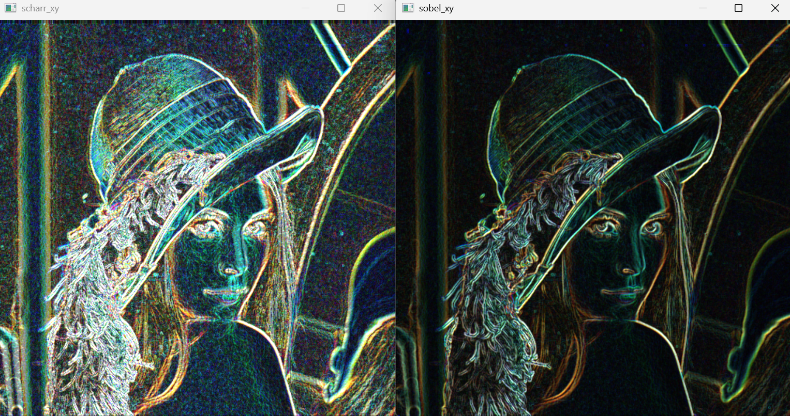
Scharr 可以視為 Sobel 在 3×3 Kernel 下的改良版本。它使用經過最佳化的權重，因此對影像梯度的估計更準確，邊界定位通常比 Sobel(3×3) 更好。不過 Scharr 只能使用固定的 3×3 Kernel，而 Sobel 可以使用 5×5、7×7 等較大的 Kernel，在高雜訊環境下反而可能有更好的穩定性。

## **Laplacian**
用二階導數找邊緣
Laplacian對於雜訊（Noise）非常敏感，因此在實用上都會將影像`先模糊化`後再處理 (LoG Laplacian of Gaussian)。
使用 Laplacian 找出邊緣。注意使用此函數除了傳入`灰階`影像之外，亦須指定輸出的影像浮點格式 `CV_64F`
一階導數的找法
0 0 0 255 255 255  →  0 0 255 0 0  最大的位置表示邊緣

二階導數 對一階導數微分 → 雜訊會被放大
0 0 255 0 0→ 0 255 -255 0 0 
Zero Crossing 零交越點: 就是正負值的交界處 255 → -255的位置

```python
cv2.Laplacian(
    src, # 影像
    ddepth, # 影像輸出型態  通常CV_64F 因為有負值
    ksize=1, # kernel大小  預設 = 1
    scale=1, # 縮放倍率
    delta=0, # 偏移量
    borderType=cv2.BORDER_DEFAULT #邊界填補
)
```
<table header-row="true">
<tr>
<td>特性</td>
<td>Sobel</td>
<td>Laplacian</td>
</tr>
<tr>
<td>導數</td>
<td>一階</td>
<td>二階</td>
</tr>
<tr>
<td>邊緣定位</td>
<td>好</td>
<td>更敏感</td>
</tr>
<tr>
<td>抗雜訊</td>
<td>較佳</td>
<td>較差</td>
</tr>
<tr>
<td>方向性</td>
<td>有(X/Y)</td>
<td>全方向</td>
</tr>
<tr>
<td>計算量</td>
<td>小</td>
<td>小</td>
</tr>
</table>
範例
```python
import numpy as np
img=np.array([
[30 ,30 ,30 ,30 ,30 ,30 ,30 ,20 ,10 ,10 ,10 ,10],
[30 ,30 ,30 ,30 ,30 ,30 ,20 ,20 ,10 ,10 ,10 ,10],
[30 ,30 ,30 ,30 ,30 ,20 ,20 ,20 ,10 ,10 ,10 ,10],
[30 ,30 ,30 ,30 ,20 ,20 ,20 ,20 ,10 ,10 ,10 ,10],
[30 ,30 ,30 ,20 ,20 ,20 ,20 ,20 ,10 ,10 ,10 ,10],
[30 ,30 ,20 ,20 ,20 ,20 ,20 ,20 ,10 ,10 ,10 ,10]])/1.
Laplacian = cv2.Laplacian(img, cv2.CV_64F)
# Laplacian = cv2.Laplacian(img, cv2.CV_16S)  # error
Laplacian = cv2.convertScaleAbs(Laplacian)
Laplacian

array([[ 0,  0,  0,  0,  0,  0, 30,  0, 10,  0,  0,  0],
       [ 0,  0,  0,  0,  0, 20, 20, 10, 10,  0,  0,  0],
       [ 0,  0,  0,  0, 20, 20,  0, 10, 10,  0,  0,  0],
       [ 0,  0,  0, 20, 20,  0,  0, 10, 10,  0,  0,  0],
       [ 0,  0, 20, 20,  0,  0,  0, 10, 10,  0,  0,  0],
       [ 0, 10, 30,  0,  0,  0,  0, 10, 10,  0,  0,  0]], dtype=uint8)
```

圖例
```python
import cv2
# o = cv2.imread('./image/sobel.bmp')
o = cv2.imread('./image/lenaColor.png',1)
o=cv2.blur(o, (3,3))
# cv2.imshow('blur', o)

Laplacian = cv2.Laplacian(o, cv2.CV_64F, ksize=3)   # ksize=1 default
Laplacian = cv2.convertScaleAbs(Laplacian)

cv2.imshow('original', o)
cv2.imshow('Laplacian', Laplacian)

cv2.waitKey()
cv2.destroyAllWindows()
cv2.waitKey(1)
```

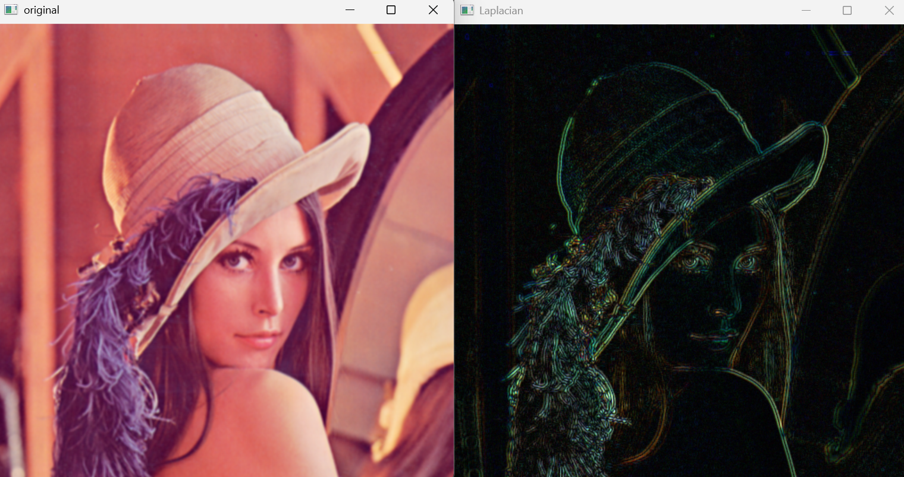

<table header-row="true">
<tr>
<td>特性</td>
<td>Sobel</td>
<td>Laplacian</td>
</tr>
<tr>
<td>邊界清晰度</td>
<td>★★★★★</td>
<td>★★★</td>
</tr>
<tr>
<td>邊界方向</td>
<td>有</td>
<td>無</td>
</tr>
<tr>
<td>雜訊敏感度</td>
<td>中</td>
<td>高</td>
</tr>
<tr>
<td>邊界定位</td>
<td>好</td>
<td>很細</td>
</tr>
<tr>
<td>常用程度</td>
<td>很高</td>
<td>較少單獨使用</td>
</tr>
</table>

## Canny 多步驟邊緣偵測演算法
Canny 邊緣檢測，其實 Canny 不能被單獨稱為一種方法，因為它是一連串的過程加上其它方法，`先模糊化`去除不必要的像素、再使用`類似 Sobel` 方式取得XY軸邊緣。它先將影像模糊化再進行非極大值抑制（non-maxima suppression），因此 Canny 比起 Sobel 較能處理雜訊問題，但是需要花費較多的硬體資源來處理。在下方的實作中我們可以看到它們輸出的差異。
語法
```python
edge = cv2.Canny(
    image,
    threshold1, # 低門檻
    threshold2, # 高門檻
    apertureSize=3,  # Sobel Kernel大小
L2gradient=True # 算剃度的方式 T-> 用開根號， F->用絕對值
)
```
必做步驟
1. Gaussian Blur  → 去除雜訊
```python
blur = cv2.GaussianBlur(
    img,
    (5,5),
    0
)
```

1. Sobel 梯度
2. Non-Maximum Suppression (NMS) → 將變界的線條變細 需要知道邊緣的方向
3. Double Threshold
兩個閾值 ex: 100 200
\>200 就是強邊界，保留
100 \< 閾值 \<200  就是若邊界，先標記
\<100 刪除
4. Edge Tracking
檢查弱邊界有沒有連接到強邊界，有則保留，否則刪除，達到去除孤立雜訊的效果。
Canny =
Gaussian Blur<br>↓<br>Sobel(Gx,Gy)<br>↓<br>Magnitude + Direction<br>↓<br>NMS(邊界細化)<br>↓<br>Double Threshold<br>↓<br>Hysteresis Tracking<br>↓<br>Edge Image
<table header-row="true">
<tr>
<td>特性</td>
<td>Sobel</td>
<td>Canny</td>
</tr>
<tr>
<td>去雜訊</td>
<td>❌</td>
<td>✔</td>
</tr>
<tr>
<td>邊界細化</td>
<td>❌</td>
<td>✔</td>
</tr>
<tr>
<td>雙門檻</td>
<td>❌</td>
<td>✔</td>
</tr>
<tr>
<td>邊界連通</td>
<td>❌</td>
<td>✔</td>
</tr>
<tr>
<td>邊界品質</td>
<td>普通</td>
<td>很好</td>
</tr>
</table>
Canny 是一種多階段邊緣偵測演算法。它先利用 Gaussian Blur 去除雜訊，再使用 Sobel 計算梯度大小與方向，接著透過 Non-Maximum Suppression 將邊緣細化，最後利用 Double Threshold 與 Edge Tracking 保留真正的邊緣並移除雜訊，因此通常比 Sobel 或 Laplacian 具有更好的邊緣偵測效果。

範例:
```python
import numpy as np
import cv2
img = np.zeros((8, 8), dtype=np.uint8)
img[1:7, 1:7] = 10  # padding problem = 10
print(f'img :\n{img}\n')

sobelx = cv2.Sobel(img, cv2.CV_32F, 1, 0, ksize=-1)  # ddepth = -1, dx=1, dy=0
sobely = cv2.Sobel(img, cv2.CV_32F, 0, 1, ksize=-1)  # ddepth = -1, dx=0, dy=1
# 找邊緣的強度、方向
mag, angle = cv2.cartToPolar(sobelx, sobely, angleInDegrees=True)
sobelxy = cv2.addWeighted(sobelx, 0.5, sobely, 0.5, 0)  

print(f'sobelx :\n{sobelx}\n\n'
      f'sobely :\n{sobely}\n\n'
      f'mag :\n{mag.round(0)}\n\n'
      f'angle 0, 45, 90, 135.... :\n{angle.round(0)}\n\n'
      f'sobelxy :\n{sobelxy}\n')
      
img :
[[ 0  0  0  0  0  0  0  0]
 [ 0 10 10 10 10 10 10  0]
 [ 0 10 10 10 10 10 10  0]
 [ 0 10 10 10 10 10 10  0]
 [ 0 10 10 10 10 10 10  0]
 [ 0 10 10 10 10 10 10  0]
 [ 0 10 10 10 10 10 10  0]
 [ 0  0  0  0  0  0  0  0]]

sobelx :
[[   0.   60.    0.    0.    0.    0.  -60.    0.]
 [   0.  130.    0.    0.    0.    0. -130.    0.]
 [   0.  160.    0.    0.    0.    0. -160.    0.]
 [   0.  160.    0.    0.    0.    0. -160.    0.]
 [   0.  160.    0.    0.    0.    0. -160.    0.]
 [   0.  160.    0.    0.    0.    0. -160.    0.]
 [   0.  130.    0.    0.    0.    0. -130.    0.]
 [   0.   60.    0.    0.    0.    0.  -60.    0.]]

sobely :
[[   0.    0.    0.    0.    0.    0.    0.    0.]
 [  60.  130.  160.  160.  160.  160.  130.   60.]
 [   0.    0.    0.    0.    0.    0.    0.    0.]
 [   0.    0.    0.    0.    0.    0.    0.    0.]
...
 [   0.   80.    0.    0.    0.    0.  -80.    0.]
 [ -30.    0.  -80.  -80.  -80.  -80. -130.  -30.]
 [   0.   30.    0.    0.    0.    0.  -30.    0.]]
 
 mag :
[[  0.  60.   0.   0.   0.   0.  60.   0.]
 [ 60. 184. 160. 160. 160. 160. 184.  60.]
 [  0. 160.   0.   0.   0.   0. 160.   0.]
 [  0. 160.   0.   0.   0.   0. 160.   0.]
 [  0. 160.   0.   0.   0.   0. 160.   0.]
 [  0. 160.   0.   0.   0.   0. 160.   0.]
 [ 60. 184. 160. 160. 160. 160. 184.  60.]
 [  0.  60.   0.   0.   0.   0.  60.   0.]]
 
 sobelxy :
[[   0.   30.    0.    0.    0.    0.  -30.    0.]
 [  30.  130.   80.   80.   80.   80.    0.   30.]
 [   0.   80.    0.    0.    0.    0.  -80.    0.]
 [   0.   80.    0.    0.    0.    0.  -80.    0.]
 [   0.   80.    0.    0.    0.    0.  -80.    0.]
 [   0.   80.    0.    0.    0.    0.  -80.    0.]
 [ -30.    0.  -80.  -80.  -80.  -80. -130.  -30.]
 [   0.   30.    0.    0.    0.    0.  -30.    0.]]
```
<table header-row="true">
<tr>
<td>梯度角度</td>
<td>分類方向</td>
</tr>
<tr>
<td>0° \~ 22.5°</td>
<td>0°</td>
</tr>
<tr>
<td>22.5° \~ 67.5°</td>
<td>45°</td>
</tr>
<tr>
<td>67.5° \~ 112.5°</td>
<td>90°</td>
</tr>
<tr>
<td>112.5° \~ 157.5°</td>
<td>135°</td>
</tr>
</table>
Sobel<br>↓<br>得到 Gx、Gy
cartToPolar<br>↓<br>得到 mag、angle
angle.round(0)<br>↓<br>方便觀察梯度方向
Canny NMS<br>↓<br>通常會把角度量化成<br>0°、45°、90°、135°

```python
img=np.array([
[30 ,30 ,30 ,30 ,30 ,30 ,30 ,20 ,10 ,10 ,10 ,10],
[30 ,30 ,30 ,30 ,30 ,30 ,20 ,20 ,10 ,10 ,10 ,10],
[30 ,30 ,30 ,30 ,30 ,20 ,20 ,20 ,10 ,10 ,10 ,10],
[30 ,30 ,30 ,30 ,20 ,20 ,20 ,20 ,10 ,10 ,10 ,10],
[30 ,30 ,30 ,20 ,20 ,20 ,20 ,20 ,10 ,10 ,10 ,10],
[30 ,30 ,20 ,20 ,20 ,20 ,20 ,20 ,10 ,10 ,10 ,10]], dtype='uint8')
canny = cv2.Canny(img, 15, 30)
# Laplacian = cv2.Laplacian(img, cv2.CV_16S)  # error
# Laplacian = cv2.convertScaleAbs(Laplacian)
canny

array([[  0,   0,   0,   0,   0,   0,   0, 255,   0,   0,   0,   0],
       [  0,   0,   0,   0,   0, 255, 255,   0,   0,   0,   0,   0],
       [  0,   0,   0,   0, 255, 255,   0, 255,   0,   0,   0,   0],
       [  0,   0,   0, 255, 255,   0,   0, 255,   0,   0,   0,   0],
       [  0,   0, 255, 255,   0,   0,   0, 255,   0,   0,   0,   0],
       [  0,   0, 255,   0,   0,   0,   0, 255,   0,   0,   0,   0]],
      dtype=uint8)
```

`cv2.cartToPolar()` 用來將 Sobel 計算出的 X、Y 梯度 (`Gx`, `Gy`) 轉換成極座標形式。其中 `mag` 表示梯度大小，計算公式為 `sqrt(Gx² + Gy²)`；`angle` 表示梯度方向，計算公式為 `atan2(Gy, Gx)`。在 Canny 邊緣偵測中，`mag` 用來判斷邊緣強度，而 `angle` 則用於 Non-Maximum Suppression 判斷邊緣方向。<br>
## **Canny vs. Sobel**

```python
import cv2
o = cv2.imread('./image/lenaColor.png', 0)
# o = cv2.imread('./image/contour.png', 1)
# o = cv2.imread('./image/coins.jpg',0)
    
r1=cv2.Canny(o, 50, 150)   # different threshold
r2=cv2.Canny(o, 32, 96)    # different threshold

sobelx = cv2.Sobel(o, cv2.CV_64F, 1, 0, ksize=3)
sobely = cv2.Sobel(o, cv2.CV_64F, 0, 1, ksize=3)

sobelx = cv2.convertScaleAbs(sobelx)   # 轉回 Uint8 
sobely = cv2.convertScaleAbs(sobely)  
sobelxy = cv2.addWeighted(sobelx, 0.5, sobely, 0.5, 0) 

cv2.imshow('original', o)
cv2.imshow('Canny r50_150', r1)
cv2.imshow('Canny r32_96', r2)
cv2.imshow('sobel_xy', sobelxy)

cv2.waitKey()
cv2.destroyAllWindows()
cv2.waitKey(1)
```
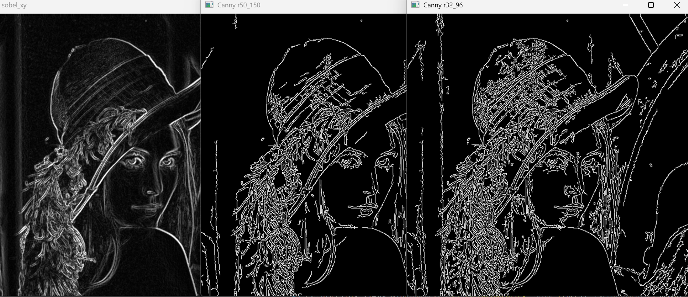

Canny : road edge detect
```python
import numpy as np
import cv2

image = cv2.imread('./image/road1.jpg', 1)
image = cv2.resize(image, (750, 450), interpolation=cv2.INTER_AREA)
# image = cv2.GaussianBlur(image, (5, 5), 0)  # 弱化雜訊
cv2.imshow('Blurred', image)

# Canny edge detection
canny = cv2.Canny(image, 30, 150, apertureSize=3, L2gradient=0) # threshold1=39, threshhold2=150, sobel size=3
cv2.imshow('Canny', canny)

cv2.waitKey(0)
cv2.destroyAllWindows()
cv2.waitKey(1)
```

Video with canny
```python
### import numpy as np
import cv2

cap = cv2.VideoCapture(0)

## Define the codec and create VideoWriter object
fourcc = cv2.VideoWriter_fourcc(*'XVID')
# out = cv2.VideoWriter('./video/output.avi',fourcc, 20.0, (640,480))  # 20 FPS, size=640, 480

while(cap.isOpened()):
    ret, frame = cap.read()
    frame = cv2.Canny(frame, 100, 200)
    if ret==True:
        frame = cv2.flip(frame,1)

# write the flipped frame
#         out.write(frame)
        cv2.imshow('frame', frame)
        
        if cv2.waitKey(1) == 27:
            break
    else:
        break

## Release everything if job is finished
cap.release()
# out.release()
cv2.destroyAllWindows()
cv2.waitKey(1)
```

# **Sobel vs. Laplacian vs. Canny**
```python
import numpy as np
import cv2

# image = cv2.imread('./image/coins.jpg', 1)
image = cv2.imread('./image/road1.jpg', 0)       # road edge detection

cv2.imshow('Original', image)

# ===== Sobel edge detection ============
sobelX = cv2.Sobel(image, cv2.CV_64F, 1, 0)
sobelY = cv2.Sobel(image, cv2.CV_64F, 0, 1)

sobelX = cv2.convertScaleAbs(sobelX)
sobelY = cv2.convertScaleAbs(sobelY)
sobelXY = cv2.addWeighted(sobelX, 0.5, sobelY, 0.5, 0)
th2, sobelXY = cv2.threshold(sobelXY, 0, 255,  cv2.THRESH_OTSU)

# ===== Laplacian edge detection ========
lap = cv2.Laplacian(image, cv2.CV_64F)
lap = cv2.convertScaleAbs(lap)
th2, lap = cv2.threshold(lap, 0, 255,  cv2.THRESH_OTSU)

# ===== Canny edge detection ============
canny=cv2.Canny(image, 32, 128)    # different threshold

cv2.imshow('Sobel X', sobelX)
cv2.imshow('Sobel Y', sobelY)
cv2.imshow('Sobel XY after threshold', sobelXY)
cv2.imshow('Laplacian after threshold', lap)
cv2.imshow('canny', canny)

cv2.waitKey(0)
cv2.destroyAllWindows()
cv2.waitKey(1)
```
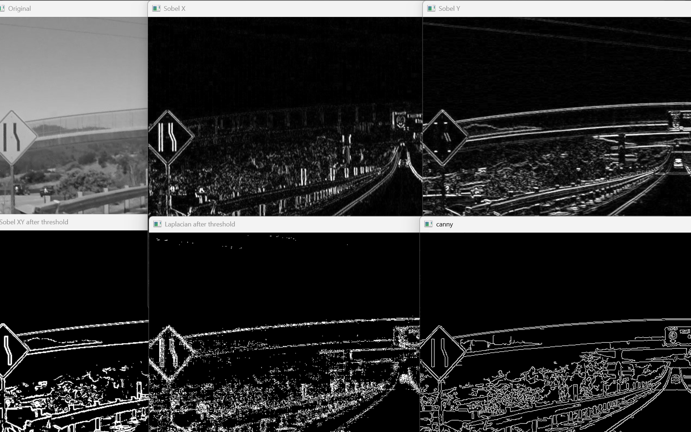

## **DoG (Difference of Gaussian)**
Gaussian Blur  : 看低頻
DoG: 兩個不同模糊程度相減，留下高頻資訊，因此會強調邊緣與細節
```python
import numpy as np
import cv2

# img = cv2.imread('./image/lenaColor.png',0)
img = cv2.imread('./image/opencv.jpg',1)
d=5
img_D03 = cv2.GaussianBlur(img, (d, d), 0.3)
img_D05 = cv2.GaussianBlur(img, (d, d), 0.5)   
img_D07 = cv2.GaussianBlur(img, (d, d), 0.7)   
img_D09 = cv2.GaussianBlur(img, (d, d), 0.9)   
img_D11 = cv2.GaussianBlur(img, (d, d), 1.1)   
img_D13 = cv2.GaussianBlur(img, (d, d), 1.3)   

img_D05_03 = img_D05 - img_D03   
img_D09_07 = img_D09 - img_D07   
img_D11_13 = img_D11 - img_D13   

cv2.imshow('img', img)
cv2.imshow('DoG05_03', img_D05_03)
cv2.imshow('DoG09_07', img_D09_07)
cv2.imshow('DoG11_13', img_D11_13)
cv2.waitKey(0)
cv2.destroyAllWindows()
cv2.waitKey(1)
```

```python
import numpy as np
import cv2
  
# img = cv2.imread('./image/lenaColor.png')
img = cv2.imread('./image/opencv.jpg',1)

img_G0 = cv2.GaussianBlur(img, (3, 3),1)      # 𝜎𝑥 = 𝜎𝑦 = 0.8
img_G1 = cv2.GaussianBlur(img, (5, 5),1)      # 𝜎𝑥 = 𝜎𝑦 = 1.1

img_DoG = img_G0 - img_G1   # try img_G0 + img_G1

cv2.imshow('img', img)
cv2.imshow('DoG', img_DoG)
cv2.waitKey(0) 
cv2.destroyAllWindows()
cv2.waitKey(1)
```
**img → imgG0 → img_G1 with same filter**
```python
import numpy as np
import cv2
  
# img = cv2.imread('./image/lenaColor.png')
img = cv2.imread('./image/opencv.jpg',1)

img_G0 = cv2.GaussianBlur(img, (3, 3),1)      # img  => img_G0
img_G1 = cv2.GaussianBlur(img_G0, (3, 3),1)   

img_DoG = img_G0 - img_G1   # try img_G0 + img_G1

cv2.imshow('img', img)
cv2.imshow('DoG', img_DoG)
cv2.waitKey(0)
cv2.destroyAllWindows()
cv2.waitKey(1)
```

# 輪廓偵測 (contours)
流程:
灰階<br>↓<br>Threshold<br>↓<br>findContours
因為 findContours 需要明確的前景與背景，因此通常會先將灰階影像進行二值化處理。
## cv2.findContours
```python
contours, hierarchy = cv2.findContours(
    image,
    mode, #輪廓檢索模式
    method  #輪廓點儲存方式
)
```
Mode
<table header-row="true">
<tr>
<td>Mode</td>
<td>語法</td>
<td>功能</td>
<td>是否保留階層</td>
</tr>
<tr>
<td>外部輪廓</td>
<td>`cv2.RETR_EXTERNAL`</td>
<td>只找最外層輪廓</td>
<td>❌</td>
</tr>
<tr>
<td>全部輪廓</td>
<td>`cv2.RETR_LIST`</td>
<td>找所有輪廓</td>
<td>❌</td>
</tr>
<tr>
<td>兩層結構</td>
<td>`cv2.RETR_CCOMP`</td>
<td>分成外輪廓與內輪廓兩層</td>
<td>⭕</td>
</tr>
<tr>
<td>樹狀結構</td>
<td>`cv2.RETR_TREE`</td>
<td>找所有輪廓並建立完整父子關係</td>
<td>⭕</td>
</tr>
<tr>
<td>FloodFill</td>
<td>`cv2.RETR_FLOODFILL`</td>
<td>配合 FloodFill 使用，較少用</td>
<td>⭕</td>
</tr>
</table>
Method
<table header-row="true">
<tr>
<td>Method</td>
<td>語法</td>
<td>說明</td>
<td>記憶體</td>
</tr>
<tr>
<td>保留全部點</td>
<td>`cv2.CHAIN_APPROX_NONE`</td>
<td>所有輪廓點全部保存</td>
<td>大</td>
</tr>
<tr>
<td>簡化輪廓</td>
<td>`cv2.CHAIN_APPROX_SIMPLE`</td>
<td>只保留轉折點</td>
<td>小</td>
</tr>
<tr>
<td>Teh-Chin L1</td>
<td>`cv2.CHAIN_APPROX_TC89_L1`</td>
<td>輪廓近似演算法</td>
<td>更小</td>
</tr>
<tr>
<td>Teh-Chin KCOS</td>
<td>`cv2.CHAIN_APPROX_TC89_KCOS`</td>
<td>改良版輪廓近似</td>
<td>更小</td>
</tr>
</table>
## cv2.drawContours()
```python
cv2.drawContours(
    image, #通常會 image.copy
    contours, # findContours找到的輪廓
    contourIdx, # 指定要畫哪個輪廓
    color, #顏色
    thickness #線條粗細
)
```

contourIdx
<table header-row="true">
<tr>
<td>值</td>
<td>意義</td>
</tr>
<tr>
<td>-1</td>
<td>畫全部輪廓</td>
</tr>
<tr>
<td>0</td>
<td>畫第0個輪廓</td>
</tr>
<tr>
<td>1</td>
<td>畫第1個輪廓</td>
</tr>
<tr>
<td>n</td>
<td>畫第n個輪廓</td>
</tr>
</table>
## cv2.contourArea(c)
計算輪廓面積
範例:
```python
import numpy as np
import cv2
im = cv2.imread('./image/contour.png')
imgray = cv2.cvtColor(im, cv2.COLOR_BGR2GRAY)
ret, thresh = cv2.threshold(imgray, 127, 255, cv2.THRESH_BINARY_INV)
# ret, thresh = cv2.threshold(imgray, 0, 255,  cv2.THRESH_OTSU)  # type
print(ret)
# cnts, hierarchy = cv2.findContours(thresh, cv2.RETR_EXTERNAL, cv2.CHAIN_APPROX_SIMPLE)
# cnts, hierarchy = cv2.findContours(thresh, cv2.RETR_LIST, cv2.CHAIN_APPROX_NONE)
cnts, hierarchy = cv2.findContours(thresh, cv2.RETR_TREE, cv2.CHAIN_APPROX_NONE)
print(f'Next, Previous, First_Child, Parent\n {hierarchy}\n')        # [next, previous, First_Child, Parent]

img_1 = cv2.drawContours(im.copy(), cnts, -1, (0, 255, 0), 2)  # image, contour, contouridx, (color), thickness
img0 = cv2.drawContours(im.copy(), cnts, 0, (0, 255, 0), 2)  # image, contour, contouridx, (color), thickness
img1 = cv2.drawContours(im.copy(), cnts, 1, (0, 255, 0), 2)  # image, contour, contouridx, (color), thickness
img2 = cv2.drawContours(im.copy(), cnts, 2, (0, 255, 0), 2)  # image, contour, contouridx, (color), thickness
img3 = cv2.drawContours(im.copy(), cnts, 3, (0, 255, 0), 2)  # image, contour, contouridx, (color), thickness

print (f'contours 型別\t\t: {type(cnts)}\n'
       f'第 0 個contours\t\t: {type(cnts[0])}\n'
       f'contours 數量\t\t: {len(cnts)}\n')

for i in range(len(cnts)):
    print (f'contours[{i}]儲存點的個數\t: {len(cnts[i])}')

cv2.imshow('imgray', imgray)
cv2.imshow('thresh', thresh)
cv2.imshow('img_1', img_1)
cv2.imshow('img0', img0)
cv2.imshow('img1', img1)
cv2.imshow('img2', img2)
cv2.imshow('img3', img3)   # 第三個不見了

cv2.waitKey(0)
cv2.destroyAllWindows()
cv2.waitKey(1)
```

配合二值化檢測
```python
import numpy as np
import cv2
imgray = cv2.imread('./image/contour.png', 0)

ret, thresh = cv2.threshold(imgray, 225, 255, cv2.THRESH_BINARY_INV)  # try cv2.THRESH_BINARY

cnts, hierarchy = cv2.findContours(thresh, cv2.RETR_EXTERNAL, cv2.CHAIN_APPROX_SIMPLE)
print(f'Next, Previous, First_Child, Parent\n {hierarchy}\n')        # [next, previous, First_Child, Parent]

cntsImg=[]
for i in range(len(cnts)):
    # temp=np.zeros(imgray.shape, np.uint8)
    temp=np.zeros_like(imgray, np.uint8) #建立同尺寸的黑布
    cntsImg.append(temp)
    cntsImg[i]=cv2.drawContours(cntsImg[i], cnts, i, (255,255,255), 3)
    cv2.imshow('contours['+ str(i)+']', cntsImg[i])

cv2.imshow('imgray', imgray)
cv2.imshow('thresh', thresh)

cv2.waitKey()
cv2.destroyAllWindows()
cv2.waitKey(1)
```

**cv2.RETR_TREE : 建立一個等級樹結構的輪廓**
```python
import numpy as np
import cv2
im = cv2.imread('./image/contour.png')
imgray = cv2.cvtColor(im, cv2.COLOR_BGR2GRAY)
ret, thresh = cv2.threshold(imgray, 127, 255, cv2.THRESH_BINARY_INV)

cnts, hierarchy = cv2.findContours(thresh, cv2.RETR_TREE, cv2.CHAIN_APPROX_SIMPLE)
# cnts, hierarchy = cv2.findContours(thresh, cv2.RETR_LIST, cv2.CHAIN_APPROX_NONE)
print(f'Next, Previous, First_Child, Parent\n {hierarchy}\n')        # [next, previous, First_Child, Parent]

for i in range(-1, len(cnts)) :
    img = cv2.drawContours(im.copy(), cnts, i, (0, 255, 0), 2) # image, contour, contouridx, (color), thickness
    cv2.imshow(f'img{i}', img)
    if i >=0 : print (f'contours[{i}]儲存點的個數\t: {len(cnts[i])}')
    
print (f'\ncontours 型別\t\t: {type(cnts)}\n'
       f'第 0 個contours\t\t: {type(cnts[0])}\n'
       f'contours 數量\t\t: {len(cnts)}\n')

cv2.imshow('imgray', imgray)
cv2.imshow('thresh', thresh)

cv2.waitKey(0)
cv2.destroyAllWindows()
cv2.waitKey(1)
```

## **boundingRect**
```python
import cv2

src = cv2.imread("./image/contour.png")
cv2.imshow("src", src)
src_gray = cv2.cvtColor(src,cv2.COLOR_BGR2GRAY)     # 影像轉成灰階

ret, dst_binary = cv2.threshold(src_gray, 127, 255, cv2.THRESH_BINARY_INV)  # 二值化處理影像
# 找尋影像內的輪廓
contours, hierarchy = cv2.findContours(dst_binary, cv2.RETR_LIST, cv2.CHAIN_APPROX_SIMPLE)  
lt = 16
for i in range(len(contours)):
    x, y, w, h = cv2.boundingRect(contours[i])        # 建構矩形  會回傳四個值
    print(f'contour[{i}]左上角\t\tx = {x}\n'
          f'contour[{i}]左上角\t\ty = {y}\n'
          f'contour[{i}]矩形寬度\tw = {w}\n'
          f'contour[{i}]矩形高度\th = {h}\n')

    dst = cv2.rectangle(src,(x, y),(x+w, y+h),(0,0,255),2)
    cv2.putText(dst, f'w/h : {w/h:.2f}', (x, y-5), 2, .6, (0,0,255), 1, lt)
cv2.imshow("dst",dst)

cv2.waitKey(0)
cv2.destroyAllWindows()
cv2.waitKey(1)
```

畫矩形
```python
cv2.rectangle(
    image,
    pt1, #左上角座標
    pt2, #右下角座標
    color,
    thickness
)
```

矩形上寫字
```python
cv2.putText(
    image,
    text,
    org,  # 文字起始座標 文字左下角的那個點
    font, # 字型
    fontScale, # 字型大小
    color,  # 顏色
    thickness, # 線寬
    lineType # 抗鋸齒 預設:cv2.LINE_AA
)
```

openCV 字型
<table header-row="true">
<tr>
<td>常數</td>
<td>說明</td>
</tr>
<tr>
<td>`cv2.FONT_HERSHEY_SIMPLEX`</td>
<td>最常用</td>
</tr>
<tr>
<td>`cv2.FONT_HERSHEY_PLAIN`</td>
<td>細字</td>
</tr>
<tr>
<td>`cv2.FONT_HERSHEY_DUPLEX`</td>
<td>雙線字</td>
</tr>
<tr>
<td>`cv2.FONT_HERSHEY_COMPLEX`</td>
<td>較正式</td>
</tr>
<tr>
<td>`cv2.FONT_HERSHEY_TRIPLEX`</td>
<td>粗體風格</td>
</tr>
<tr>
<td>`cv2.FONT_HERSHEY_SCRIPT_SIMPLEX`</td>
<td>手寫風格</td>
</tr>
</table>

矩的計算
影像識別的一個核心問題是影像的特徵提取，簡單描述即為用一組簡單的資料(資料描述量)來描述整個影像，這組資料愈簡單越有代表性越好。`良好的特徵不受光線、噪點、幾何形變的干擾`，影像識別技術的發展中，不斷有新的描述影像特徵提出，而影像不變 `矩` 就是其中一個。
從影像中計算出來的 `矩` 通常描述了影像不同種類的幾何特徵如：`大小、灰度、方向、形狀`等，影像矩廣泛應用於模式識別、目標分類、目標識別與防偽估計、影像編碼與重構等領域。

讀取圖片
↓
二值化
↓
找輪廓
↓
畫出輪廓
↓
計算每個輪廓的 Moments
↓
利用 m00 求面積
```python
import numpy as np
import cv2

im = cv2.imread("./image/contour.png")
cv2.imshow('original', im)

imgray = cv2.cvtColor(im, cv2.COLOR_BGR2GRAY)
ret, thresh = cv2.threshold(imgray, 225, 255, cv2.THRESH_BINARY)  # try cv2.THRESH_BINARY

cnts, hierarchy = cv2.findContours(thresh, cv2.RETR_LIST, cv2.CHAIN_APPROX_SIMPLE)
print(f'next, previous, First_Child, Parent\n {hierarchy}\n')        # [next, previous, First_Child, Parent]

cntsImg=cv2.drawContours(im.copy(), cnts, -1, (0,255,0), 3)
cv2.imshow('contours', cntsImg)

print('觀察各輪廓的矩(moments) :\n')
for i in range(len(cnts)):
    print(f'輪廓 {i} 的矩 :\n{cv2.moments(cnts[i])}\n')
    
print('觀察各輪廓的面積 :\n')
for i in range(len(cnts)):
    print(f"輪廓 {i} 的面積\t: {cv2.moments(cnts[i])['m00']:>10,.1f}")
    
cv2.waitKey()
cv2.destroyAllWindows()
cv2.waitKey(1)
```
