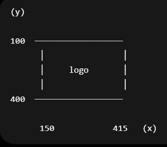
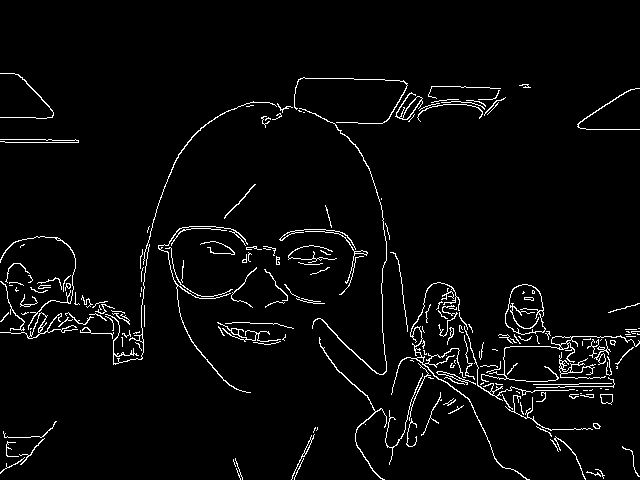
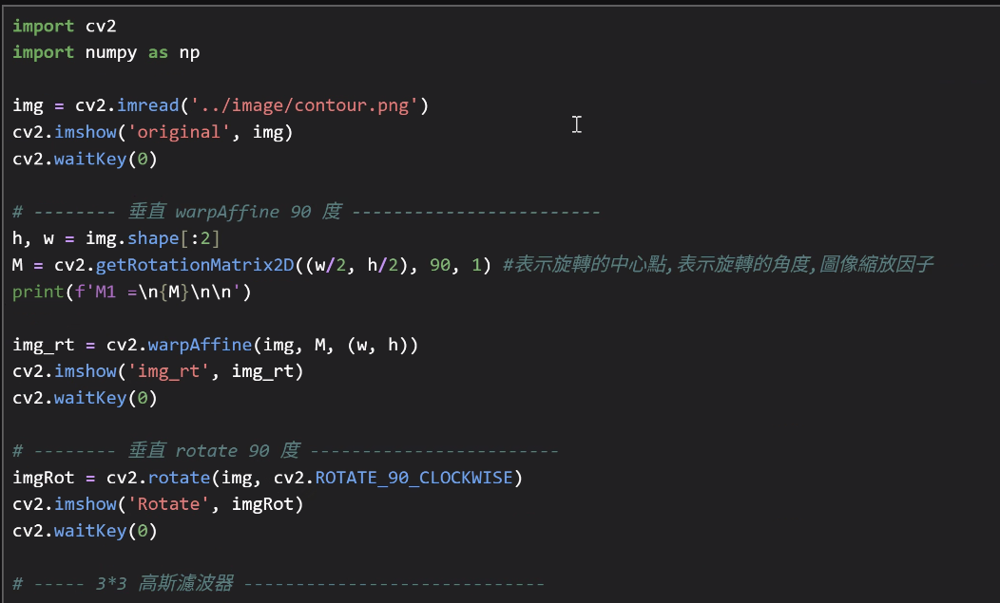

## **彩色、灰階照片讀取 / 寫入**
#### **read image file**
<table header-row="true">
<tr>
<td>**數值**</td>
<td>**含意**</td>
<td>**語法**</td>
</tr>
<tr>
<td>-1</td>
<td>保持原格式不便</td>
<td>cv2.IMREAD_UNCHANGED</td>
</tr>
<tr>
<td>0</td>
<td>單通道灰階</td>
<td>cv2.IMREAD_GRAYSCALE</td>
</tr>
<tr>
<td>1</td>
<td>3通道BGR (`預設`)</td>
<td>cv2.IMREAD_COLOR</td>
</tr>
</table>
```python
#讀取灰階
img0 = cv2.imread('./image/SpongeBob.jpg', cv2.IMREAD_GRAYSCALE)
img0 = cv2.imread('./image/SpongeBob.jpg', 0)

#shape
(height, width)

#讀取彩色
img1 = cv2.imread('./image/SpongeBob.jpg', cv2.IMREAD_COLOR)
img1 = cv2.imread('./image/SpongeBob.jpg', 1)

#shape
(height, width, 3)

```
#### **imshow**
- 如果圖像是 8 位無符號，則按原樣顯示。
- 如果圖像是 32 位或 64 位浮點，則像素值乘以 255。即值範圍 \[0, 1\] 映射到 \[0, 255\]。
```python
#unit8 0~255
cv2.imshow('SpongBob Color uint8', img1)

#float 0.0~1.0
cv2.imshow('SpongBob Color 1/256 float', img1/256)
```
#### waitKey()
- 等待任意按鍵
- 單位是 ms
```python
cv2.waitKey(0)

#等三秒
cv2.waitKey(3000)

cv2.destroyAllWindows()
#刷新視窗
cv2.waitKey(1)
```

#### destroyAllWindows()
```python
#關閉所有 OpenCV 視窗。
cv2.destroyAllWindows()
```
```javascript
import cv2
from matplotlib import pyplot as plt

img0 = cv2.imread('./image/SpongeBob.jpg', cv2.IMREAD_GRAYSCALE)  # same
# img0 = cv2.imread('./image/SpongeBob.jpg', 0)    # 0 灰階

img1 = cv2.imread('./image/SpongeBob.jpg', cv2.IMREAD_COLOR)    # 1 BGR,  1 可省略(原圖)
# img1 = cv2.imread('./image/SpongeBob.jpg', 1)                 # 1 BGR,  1 可省略(原圖)

cv2.imshow('SpongeBob Gray uint8', img0)  # cv2.imshow(視窗名稱, 圖片變數) 視窗名稱不能重複
# cv2.waitKey(0)
cv2.imshow('SpongBob Color uint8', img1)             # unit8
# cv2.imshow('SpongBob Color *256', img1*256)          # unit16
cv2.imshow('SpongBob Color 1/256 float', img1/256)   # floating 0.0 ~ 1.0

cv2.waitKey(0)                                       # 0 wait for anykey任意按鍵, try 3000 ms
cv2.destroyAllWindows()  #釋放記憶體 
cv2.waitKey(1)  # 打給ios系統看的
```
## numpy
#### **Data Types for ndarrays**
<table header-row="true">
<tr>
<td>**名稱**</td>
<td>**描述**</td>
<td>**簡寫**</td>
</tr>
<tr>
<td>np.bool</td>
<td>用一個位元組儲存的布爾型別（True或False）</td>
<td>'b'</td>
</tr>
<tr>
<td>np.int8</td>
<td>一個位元組大小，-128 至 127</td>
<td>'i'</td>
</tr>
<tr>
<td>np.int16</td>
<td>整數，-32768 至 32767</td>
<td>'i2'</td>
</tr>
<tr>
<td>np.int32</td>
<td>整數， 至</td>
<td>'i4'</td>
</tr>
<tr>
<td>np.int64</td>
<td>整數， 至</td>
<td>'i8'</td>
</tr>
<tr>
<td>`np.uint8`</td>
<td>`無符號整數，0 至 255`</td>
<td>'u'</td>
</tr>
<tr>
<td>np.uint16</td>
<td>無符號整數，0 至 65535</td>
<td>'u2'</td>
</tr>
<tr>
<td>np.uint32</td>
<td>無符號整數，0 至</td>
<td>'u4'</td>
</tr>
<tr>
<td>np.uint64</td>
<td>無符號整數，0 至</td>
<td>'u8'</td>
</tr>
<tr>
<td>np.float16</td>
<td>半精度浮點數：16位元，正負號1位，指數5位，精度10位</td>
<td>'f2'</td>
</tr>
<tr>
<td>np.float32</td>
<td>單精度浮點數：32位元，正負號1位，指數8位元，精度23位</td>
<td>'f4'</td>
</tr>
<tr>
<td>np.float64</td>
<td>雙精度浮點數：64位元，正負號1位，指數11位，精度52位</td>
<td>'f8'</td>
</tr>
<tr>
<td>np.complex64</td>
<td>複數，分別用兩個32位元浮點數表示實部和虛部</td>
<td>'c8'</td>
</tr>
<tr>
<td>np.complex128</td>
<td>複數，分別用兩個64位元浮點數表示實部和虛部</td>
<td>'c16'</td>
</tr>
<tr>
<td>np.object_</td>
<td>python物件</td>
<td>'O'</td>
</tr>
<tr>
<td>np.string_</td>
<td>字串</td>
<td>'S'</td>
</tr>
<tr>
<td>np.unicode_</td>
<td>unicode型別</td>
<td>'U'</td>
</tr>
</table>
#### opencv vs python
```python
#opencv 
img = cv2.imread(...)

#ndarray 多維度陣列
type(img) = numpy.ndarray

#陣列的shape(形狀)
arr = np.array([[1,2,3],
                [4,5,6]])

print(arr.shape)
print(arr.ndim)
print(arr.size)
result
-> 二列三行 shape
(2, 3)
-> 維度 二維 ndim
2
-> 元素數量 size
6
```
#### 從 NumPy 的角度看圖片
1. 灰階圖
```python
#讀取灰階圖 ->每一個元素代表像素亮度
img = cv2.imread('a.jpg', 0)

#2D ndarrays
[
 [  0  10 255]
 [ 30 100 200]
]

#shape
(height, width)
(1080, 1920) -> 1080列 1920行
```
2. 彩色圖
```python
#讀取彩色圖
img = cv2.imread('a.jpg')

#3D ndarrays
[[[123  52  11]
  [255 255 255]
  [  0   0   0]]

 [[ 66  88 100]
  [ 50  70  90]
  [255   0   0]]]

#shape
(height, width, channel)
(1080, 1920, 3)
-> 高:1080 寬:1920 通道:BGR 三通道

#每一格代表一個像素
img[0, 0] 在座標(0, 0)->左上角的位置
[123 52 11] -> [B, G, R]
```
#### 查詢語法
```python
#查型別
type(img)
<class 'numpy.ndarray'>

#查大小
img.shape
(1080, 1920) ->灰階圖片大小
(1080, 1920, 3) -> 彩色圖片大小

#查資料型態
img.dtype

uint8 -> 像素範圍 0~155
```
#### 範例 1 —查詢資料結構
```python
import cv2
from matplotlib import pyplot as plt

img0 = cv2.imread('./image/SpongeBob.jpg', cv2.IMREAD_GRAYSCALE)  # same
# img0 = cv2.imread('./image/SpongeBob.jpg', 0)    # 0 灰階

img1 = cv2.imread('./image/SpongeBob.jpg', cv2.IMREAD_COLOR)    # 1 BGR,  1 可省略(原圖)

# 0 灰階
print(f'{"="*15} {"gray"} {"="*15}\nshape\t: {img0.shape}\n'
      f'ndim\t: {img0.ndim}\n'
      f'size\t: {img0.size}\n'
      f'dtype\t: {img0.dtype}\n'
      f'type\t: {type(img0)}\n')

# 1 RGB
print(f'{"="*15} {"color"} {"="*14}\nshape\t: {img1.shape}\n'
      f'ndim\t: {img1.ndim}\n'
      f'size\t: {img1.size}\n'
      f'dtype\t: {img1.dtype}\n'
      f'type\t: {type(img1)}')
      
      
result ->
=============== gray ===============
shape	: (560, 840)
ndim	: 2
size	: 470400
dtype	: uint8
type	: <class 'numpy.ndarray'>

=============== color ==============
shape	: (560, 840, 3)
ndim	: 3
size	: 1411200
dtype	: uint8
type	: <class 'numpy.ndarray'>
```
#### 範例2 —OpenCV 與 Matplotlib 的色彩通道差異 (BGR和RGB互轉)
```python
#cvtColor()
#color convert（顏色空間轉換）

cv2.cvtColor()
img_rgb = cv2.cvtColor(img_bgr, cv2.COLOR_BGR2RGB)

#BGR → RGB
COLOR_BGR2RGB 

#BGR → 灰階
COLOR_BGR2GRAY

#BGR → HSV
COLOR_BGR2HSV

#另解
img_rgb = img_bgr[:,:,::-1]
用翻轉的方式
第一維全部 和 第二維全部 和 第三維翻轉通道
```
#### 範例程式
```python
##用MATPLOTLIB 顯示圖片
plt.figure(figsize=(16, 9))   # 先畫一張畫布 16英吋 x 9 英吋           
#plt.subplot(1,2,1) 將畫布分割成 1列 2欄 指定第一張圖
#plt.imshow(img_rgb) 把img_rgb 畫到第一張圖中 
#plt.title('plt rgb') 給這個視窗title
plt.subplot(1,2,1), plt.imshow(img_rgb), plt.title('plt rgb')
#plt.subplot(122) 指的是 1列 2欄 第二張圖
plt.subplot(122), plt.imshow(img_bgr), plt.title('cv2 bgr in matplotlib')
plt.imshow
```
```python
import numpy as np
import cv2
from matplotlib import pyplot as plt

#用OPENCV 讀圖檔
img_bgr = cv2.imread('./image/baby.jpg', 1)      # 使用 OpenCV 讀取圖檔

img_rgb = cv2.cvtColor(img_bgr, cv2.COLOR_BGR2RGB)    # 將 BGR 圖片轉為 RGB 圖片
# img_rgb = img_bgr[:,:,::-1]                         # 或是這樣亦可

#用MATPLOTLIB 顯示圖片
plt.figure(figsize=(16, 9))   # 先畫一張畫布 16英吋 x 9 英吋           
plt.subplot(1,2,1), plt.imshow(img_rgb), plt.title('plt rgb')

plt.subplot(122), plt.imshow(img_bgr), plt.title('cv2 bgr in matplotlib')
plt.imshow

cv2.imshow('bgr', img_bgr)                     # cv2 show bgr
cv2.waitKey(0)                                 # 0 wait for anykey任意按鍵, try 3000
cv2.destroyAllWindows()
cv2.waitKey(1)
```
#### extra
<table header-row="true">
<tr>
<td>語法</td>
<td>用途</td>
</tr>
<tr>
<td>`cv2.imshow('name', img)`</td>
<td>視窗名稱</td>
</tr>
<tr>
<td>`plt.title('title')`</td>
<td>圖片標題</td>
</tr>
<tr>
<td>`plt.figure(num='window')`</td>
<td>Matplotlib 視窗名稱</td>
</tr>
</table>
## 把ndarray 存成圖檔
#### cv2.imwrite() 存檔
```python
import cv2

#讀圖檔
img0 = cv2.imread('./image/baby.jpg', 0)    # 0 灰階
#存圖檔 把 img0 存成 baby01.jpg
cv2.imwrite('./image/baby01.jpg', img0)

# 設定 JPEG 圖片品質為 90（可用值為 0 ~ 100）
cv2.imwrite('./image/baby02.jpg', img0, [cv2.IMWRITE_JPEG_QUALITY, 90])

# 設定 PNG 壓縮層級為 5（可用值為 0 ~ 9）
cv2.imwrite('./image/baby03.jpg', img0, [cv2.IMWRITE_PNG_COMPRESSION, 5])
```
## **OpenCV 影像基礎操作**
#### 確認讀取的檔案有讀取成功
sys.exit() 立即結束程式
```python
import cv2
import sys

img = cv2.imread('./image/lenaColor.png')    #調用cv2.imread()讀取影像

#確定有讀取成功
if img is None:
sys.exit('無法讀取影像...')
else :
    print(f'img shape : {img.shape}')
    cv2.imshow('Image Show', img)           #調用cv2.imshow() 顯示讀取進來的影像
cv2.waitKey(0)
cv2.destroyAllWindows() 
cv2.waitKey(1)
```
#### 指定座標位置
```python
#指定index找座標位置 x, y 找到該位置的像素
a=100
px = img[a, a]             # RGB 100, 100 的值 取得 (100,100) 位置的像素
print(px)                  #顯示BGR顏色數值
#顯示
[ 78  68 178]

#第三個位置是指bgr通道 可以指定
# 0:Blue, 1:Green, 2:Red
blue = img[a, a, 0]        # 0:Blue, 1:Green, 2:Red 指定 x, y座標上 0 通道到數值 第三欄是0所以指定的是藍色
print(blue)

#指定img[a, a]這個位置的像素顏色 [0, 0, 0] -> 黑色
img[a, a] = [0, 0, 0]      # 指定圖片像素值[B, G, R] 給 0 值 改三個通道改成藍色
print(img[a, a])
```
#### numpy資料格式指定物件
```python
# 基於numpy的資料格式指定物件
img = cv2.imread('./image/lenaColor.png')    #調用cv2.imread()讀取影像

print(f'(10, 10, 2)像素的紅色數值\t: {img[10, 10, 2]}\n')        # 0:Blue, 1:Green, 2:Red

#修改像素值 itemset 
#img[10, 10, 2] 第十列 第十欄 的紅色圖層 的那一個點
#原本紅色值 226 改成 120 顏色改變
img[10, 10, 2] = 120          # set (10, 10, 2) = 120

print(f'after img[10,10,2]\t\t: {img[10, 10, 2]} \n')  # 120

print(f'img.shape\t\t\t: {img.shape}\n'   # 行、列、通道;圖像長寬與通道數(channels),可以判斷灰階或彩圖
      f'img.size\t\t\t: {img.size:,}\n'   # 像素總量 w*h*c
      f'img.dtype\t\t\t: {img.dtype}')    # 像素資料型態 uint8(0~255)
      
      
# result
"""
(10, 10, 2)像素的紅色數值	: 226

after img[10,10,2]		: 120 

img.shape			: (512, 512, 3)  #彩色
img.size			: 786,432   # 512X512X3 = 786,432
img.dtype			: uint8 

"""

#重要概念釐清
img[y,x] -> 取得這個位置的像素顏色  
[B,G,R]

img[y,x,2] -> 指定圖層 0:B 1:G 2:R
```
#### 分割圖象區域

```python
#分割圖像區域
#img[y1:y2, x1:x2] -> [row, col]
logo = img[100:400, 150:415]    # x1, x2, : y1, y2
print(f'logo size : {logo.shape}')

cv2.imshow('Image Show', logo)
cv2.waitKey(0)
cv2.destroyAllWindows()
cv2.waitKey(1)
```
圖片裁切（cropping）
```python
import numpy as np
import cv2

#讀取圖片
img = cv2.imread('./image/assassin.jpg')

#NumPy slicing
cropped = img[100:400, 200:500] 

cv2.imshow('Original', img)
cv2.imshow('cropped', cropped)
print(f'cropped size : {cropped.shape}')

cv2.waitKey(0)
cv2.destroyAllWindows()
cv2.waitKey(1)
```
分割與合併，彩色通道
```python
img = cv2.imread('./image/assassin.jpg')

#把三個通道分割開來 shape會改變 (1033, 3432, 3) ->(1033, 3432)
b, g, r = cv2.split(img)     # 分割通道 
# b = img[:,:,0];  g = img[:,:,1];  r = img[:,:,2]  #也可以陣列指定通道分割

print(f'{b.shape}\n\n'
      f'r =\n{r}')

#分割後，各個通道都會是灰階圖
#色彩圖就是三個灰階圖
cv2.imshow('b', b)
cv2.imshow('g', g)
cv2.imshow('r', r)

#merge([0通道,1通道,2通道])
cv2.imshow('rgb', cv2.merge([r,g,b]))   #把三個通道黏回去
cv2.imshow('bgr', cv2.merge([b,g,r]))

cv2.waitKey(0)
cv2.destroyAllWindows()
cv2.waitKey(1)
```

#### 灰階影像視覺化成 3D 高度圖
像素亮度 = 高度
散點圖函式（Scatter Plot） 畫多點座標 (立體)
```python
ax.scatter(X, Y, img1, c=img1, cmap='rainbow', marker='.')

img -> z軸 就是用灰階的亮度來去擬定3D圖的高度
c=img1 -> 點的顏色用img1來表示
cmap='rainbow' -> 使用彩虹色盤
marker='.' -> 點的形狀

```
```python
import matplotlib.pyplot as plt
import numpy as np
import cv2

img1 = cv2.imread('./image/contour.png', 0)  # queryImage
# img1 = cv2.imread('./image/blackhat.bmp', 0)  # queryImage

w, h = img1.shape
#建立座標
X = np.arange(0, h, 1)
Y = np.arange(0, w, 1)

#把x y 組合成一個座標平面
X, Y = np.meshgrid(X, Y)

#建立3D畫布
fig = plt.figure(figsize=(12, 8))
#建立3D座標系
ax = plt.axes(projection='3d')

data=ax.scatter(X, Y, img1, c=img1, cmap='rainbow', marker='.')# 繪製 3D 座標點
ax.view_init(10, 20)
ax.set_xlabel(f'w : {h}');   ax.set_ylabel(f'h : {w}');   ax.set_zlabel('gray value :255');
ax.set_zlim(0,255)
fig.colorbar(data, ax = ax)
plt.show()

cv2.imshow('bgr', cv2.imread('./image/contour.png', 1))
cv2.waitKey(0)
cv2.destroyAllWindows()
cv2.waitKey(1)
```
## **OpenCV 繪圖**
#### line
**cv2.line ( 影像, 開始座標, 結束座標, 顏色, 線條寬度 )**
```python
import cv2 
import numpy as np

#產生一個全黑的畫布 大小是512 X 512 X 3
gc = np.zeros((512, 512, 3), dtype='uint8')

#cv2.line ( 畫布, 開始座標, 結束座標, 顏色, 線條寬度 )
cv2.line(gc, (10, 50), (400, 300), (255, 0, 0), 15)
cv2.line(gc, (100, 50), (400, 500), (0, 0, 255), 3)
cv2.imshow('draw', gc) 

cv2.waitKey(0)
cv2.destroyAllWindows()
cv2.waitKey(1)
```
#### arrow line 箭頭
** cv2.arrowedLine ( 影像, 開始座標, 結束座標, 顏色, 線條寬度\[.....\] )**
```python
import cv2 
import numpy as np

gc = np.zeros((512, 512, 3), dtype='uint8')

#tipLength 箭頭比例大小
cv2.arrowedLine(gc, (10, 50), (400, 300), (255, 0, 0), 5, tipLength = 0.05)
cv2.arrowedLine(gc, (100, 50), (400, 500), (0, 0, 255), 3, tipLength = 0.2)
cv2.imshow('draw', gc) 

cv2.waitKey(0)
cv2.destroyAllWindows()
cv2.waitKey(1)
```
#### rectangle 方形
**cv2.rectangle(影像, 頂點座標, 對向頂點座標, 顏色, 線條寬度)**
```python
gc = np.zeros((512, 512, 3), dtype='uint8')

cv2.rectangle(gc, (30, 50), (200, 280), (0, 0, 255), 5)
cv2.rectangle(gc, (100, 200), (296, 376), (234, 151, 102), -5)   # -1 : 實心框
cv2.imshow('draw', gc) 

cv2.waitKey(0)
cv2.destroyAllWindows()
cv2.waitKey(1)
```
#### circle
**cv2.circle ( 影像, 圓心座標, 半徑, 顏色, 線條寬度 )**
```python
gc = np.zeros((512, 512, 3), dtype='uint8')

cv2.circle(gc, (200, 100), 80, (255, 255, 0), 2)
cv2.circle(gc, (280, 180), 60, (147, 147, 147), -3)
cv2.imshow('draw', gc) 

cv2.waitKey(0)
cv2.destroyAllWindows()
cv2.waitKey(1)
```
#### ellipse 橢圓
**cv2.ellipse ( 影像, 中心座標, (長軸, 短軸), 旋轉角度, 起始角度, 結束角度, 顏色, 線條寬度 )**
```python
gc = np.zeros((512, 512, 3), dtype='uint8')

cv2.ellipse(gc, (200, 100), (80, 40), 45, 0, 360, (80, 127, 255), 5)
cv2.ellipse(gc, (250, 300), (90, 50), 0, 0, 270, (44, 141, 108), -1)
cv2.imshow('draw', gc) 

cv2.waitKey(0)
cv2.destroyAllWindows()
cv2.waitKey(1)
```
#### polylines 不規則線段 非密閉
**cv2.polylines ( 影像, 頂點座標, 封閉型, 顏色, 線條寬度 )**
```python
gc = np.zeros((512, 512, 3), dtype='uint8')

#設定頂點座標
pts = np.array(((100,50), (100,200), (170,300), (300,50)))

cv2.polylines(gc, [pts], 0, (105, 105, 255), 2)  #True:頭尾相連; False:頭尾不相連 #0改1，就變封閉圖形
cv2.imshow('draw', gc) 

cv2.waitKey(0)
cv2.destroyAllWindows()
cv2.waitKey(1)
```
#### 影像疊加 - 產生問題
```python
import numpy as np
import cv2
from matplotlib import pyplot as plt

#隨機建立矩陣
img1 = np.random.randint(0, 256, size=[3,3], dtype=np.uint8)
img2 = np.random.randint(0, 256, size=[3,3], dtype=np.uint8)

print(f'img1 :\n{img1}\n\n'
      f'img2 :\n {img2}\n\n'
      #numpy加法，會產生overflow（溢位）-> 0~255循環 ->無法預測顏色
      f'np : img1+img2 :\n {img1+img2}\n\n'
      #opencv 飽和運算:超過就顯示255 -> 過曝
      f'cv2.add :\n{cv2.add(img1, img2)}')
```
```python
import cv2
#對兩張一樣的圖做疊加
img1=cv2.imread('./image/cat.jpg')
img2=img1.copy()

cv2.imshow('np :　img1 + img2', img1+img2)
cv2.imshow('cv2.add(img1, img2)', cv2.add(img1,img2))

plt.figure(figsize=(16, 5))

plt.subplot(131), plt.title('original')
plt.imshow(cv2.cvtColor(img1, cv2.COLOR_BGR2RGB))

plt.subplot(132), plt.title('np : img1+img2')
plt.imshow(cv2.cvtColor(img1+img2, cv2.COLOR_BGR2RGB))   # same as img*2

plt.subplot(133), plt.title('cv2.add(img1, img2)')
plt.imshow(cv2.cvtColor(cv2.add(img1, img2), cv2.COLOR_BGR2RGB))  # same as add(img1, img2)
plt.show()

cv2.waitKey(0) 
cv2.destroyAllWindows()
cv2.waitKey(1)
```

#### 影像疊加 - 解決辦法 →權重相加
影像加權融合（Weighted Blending）
```python
cv2.addWeighted()
cv2.addWeighted(
    src1, alpha,
    src2, beta,
    gamma
)
```
<table header-row="true">
<tr>
<td>參數</td>
<td>意思</td>
</tr>
<tr>
<td>src1</td>
<td>第一張圖</td>
</tr>
<tr>
<td>alpha</td>
<td>第一張圖權重</td>
</tr>
<tr>
<td>src2</td>
<td>第二張圖</td>
</tr>
<tr>
<td>beta</td>
<td>第二張圖權重</td>
</tr>
<tr>
<td>gamma</td>
<td>亮度偏移值<br>(改變亮度)</td>
</tr>
</table>
```python
import numpy as np
import cv2
#隨機建立兩個矩陣
img1 = np.random.randint(0, 256, size=[3,3], dtype=np.uint8)
img2 = np.random.randint(0, 256, size=[3,3], dtype=np.uint8)

result = cv2.addWeighted(img1, 0.2, img2, 0.8, 0)  # img1*0.2 + img2*0.8 + 0
print(f'img1 :\n{img1}\n\n'
f'img2 :\n {img2}\n\n'
f'np : img1*0.2 + img2*0.8 + 0 :\n{img1*0.2+img2*.8+0}\n\n'
f'cv2.addWeight :\n{result}')
```
```python
import cv2

img1=cv2.imread('./image/cat.jpg', 1)
img2=cv2.imread('./image/lenaColor.png', 1)

img1 = cv2.resize(img1, (450, 450)) #重新拉好畫布的大小
img2 = cv2.resize(img2, (450, 450))

result = cv2.addWeighted(img1, 0.8, img2, 0.2, 0)  # img1*0.2 + img2*0.8 + 0 # 透明度的概念

cv2.imshow('weighted image', result)

cv2.waitKey(0) 
cv2.destroyAllWindows()
cv2.waitKey(1)
```
#### 影像疊加 - 遮罩概念

```python
# AND 重疊才保留
bitwiseAnd = cv2.bitwise_and(rectangle, circle)

#OR 只要有人有就保留
bitwiseOr = cv2.bitwise_or(rectangle, circle)

#xor 不同時才保留，重疊的部分消失
bitwiseXor = cv2.bitwise_xor(rectangle, circle)

#not 黑白反轉
bitwiseNot = cv2.bitwise_not(circle)

```

```python
import numpy as np
import cv2
# import matplotlib.pyplot as plt

#建立畫布
rectangle = np.zeros((300, 300), dtype = 'uint8')          # zero 黑色畫布
#畫方形, 從左上(25, 25), 畫到右下(275, 275) , 白色 , 實心塗滿
cv2.rectangle(rectangle, (25, 25), (275, 275), 255, -1)   # Draw filled rectangle
cv2.imshow('Rectangle', rectangle)
cv2.waitKey(0)

circle = np.zeros((300, 300), dtype = 'uint8')
#畫圓形, 圓心在(150, 150), 半徑150, 白色, 填滿
cv2.circle(circle, (150, 150), 150, 255, -1)              # Draw filled circle
cv2.imshow('Circle', circle)
cv2.waitKey(0)

# 都白才保留
bitwiseAnd = cv2.bitwise_and(rectangle, circle)           # and expression
cv2.imshow('AND', bitwiseAnd)
cv2.waitKey(0)

#有白就保留
bitwiseOr = cv2.bitwise_or(rectangle, circle)             # or expression
cv2.imshow('OR', bitwiseOr)
cv2.waitKey(0)

#一黑一白才保留
bitwiseXor = cv2.bitwise_xor(rectangle, circle)          # xor expression
cv2.imshow('XOR', bitwiseXor)
cv2.waitKey(0)

#黑變白 白變黑
bitwiseNot = cv2.bitwise_not(circle)                     # not expression
cv2.imshow('NOT', bitwiseNot)

cv2.waitKey(0) 
cv2.destroyAllWindows()
cv2.waitKey(1)
```

#### 補充字型
<table header-row="true">
<tr>
<td>**文字格式**</td>
<td>**代碼**</td>
</tr>
<tr>
<td>FONT_HERSHEY_SIMPLEX</td>
<td>0</td>
</tr>
<tr>
<td>FONT_HERSHEY_PLAIN</td>
<td>1</td>
</tr>
<tr>
<td>FONT_HERSHEY_DUPLEX</td>
<td>2</td>
</tr>
<tr>
<td>FONT_HERSHEY_COMPLEX</td>
<td>3</td>
</tr>
<tr>
<td>FONT_HERSHEY_TRIPLEX</td>
<td>4</td>
</tr>
<tr>
<td>FONT_HERSHEY_COMPLEX_SMALL</td>
<td>5</td>
</tr>
<tr>
<td>FONT_HERSHEY_SCRIPT_SIMPLEX</td>
<td>6</td>
</tr>
<tr>
<td>FONT_HERSHEY_SCRIPT_COMPLEX</td>
<td>7</td>
</tr>
</table>
```python
import numpy as np
import cv2

#建立 540 * 1180 的白色畫布
gc = np.full((540, 1180, 3), 255, dtype='uint8')  # 用(B, G, R) = (255, 255, 255): 白色填滿畫布
# gc = cv2.imread('./image/baby.jpg')    # 0 灰階

font = [cv2.FONT_HERSHEY_SIMPLEX,
        cv2.FONT_HERSHEY_PLAIN,
        cv2.FONT_HERSHEY_DUPLEX,
        cv2.FONT_HERSHEY_COMPLEX,
        cv2.FONT_HERSHEY_TRIPLEX,
        cv2.FONT_HERSHEY_COMPLEX_SMALL,
        cv2.FONT_HERSHEY_SCRIPT_SIMPLEX,
        cv2.FONT_HERSHEY_SCRIPT_COMPLEX ]

for idx, f in enumerate(font):  #for idx, f in enumerate(font):
    cv2.putText(gc, 'OpenCV_AA', (20, 60*(idx+1)), f, 1.5, (0,0,255), 3, cv2.LINE_AA)
    cv2.putText(gc, 'OpenCV_8', (440, 60*(idx+1)), f, 1.5, (255,0,0), 3, cv2.LINE_8)
    cv2.putText(gc, 'OpenCV_4', (820, 60*(idx+1)), f, 1.5, (0,255,0), 3, cv2.LINE_4, True)  # True

cv2.imshow('draw', gc)
cv2.waitKey(0)
cv2.destroyAllWindows()
cv2.waitKey(1)
```
<table header-row="true">
<tr>
<td>**線條格式**</td>
<td>**代碼**</td>
</tr>
<tr>
<td>FILLED</td>
<td>-1</td>
</tr>
<tr>
<td>LINE_4</td>
<td>4</td>
</tr>
<tr>
<td>LINE_8</td>
<td>8</td>
</tr>
<tr>
<td>LINE_AA</td>
<td>16</td>
</tr>
</table>
#### **滑鼠交互**
**onmouse(event, x, y, flags, param)**
事件代號 (int event), 座標 (int x,int y), 旗標代號 (int flag), 滑鼠事件的代號名稱 (param)
- event : 代表的是滑鼠回傳的事件號碼，每當滑鼠有動作，event就會回傳訊息到 onMouse()，也順便回傳滑鼠移動的座標
- flag : 代表的是拖曳事件
- param : 則是自己定義 onMouse() 事件的ID，就跟 GUI 介面的視窗介面 ID 一樣 (cvGetWindowHandle())，不過這邊是自己給的編號，而視窗介面的 ID 則是系統自動隨機分配的 ID，而滑鼠事件的執行可以細分為：
> **event :**
<table header-row="true">
<tr>
<td>**事件 event**</td>
<td>**值**</td>
<td>**動作**</td>
</tr>
<tr>
<td>CV_EVENT_MOUSEMOVE</td>
<td>0</td>
<td>滑動</td>
</tr>
<tr>
<td>CV_EVENT_LBUTTONDOWN</td>
<td>1</td>
<td>左鍵點擊</td>
</tr>
<tr>
<td>CV_EVENT_RBUTTONDOWN</td>
<td>2</td>
<td>右鍵點擊</td>
</tr>
<tr>
<td>CV_EVENT_MBUTTONDOWN</td>
<td>3</td>
<td>中鍵點擊</td>
</tr>
<tr>
<td>CV_EVENT_LBUTTONUP</td>
<td>4</td>
<td>左鍵放開</td>
</tr>
<tr>
<td>CV_EVENT_RBUTTONUP</td>
<td>5</td>
<td>右鍵放開</td>
</tr>
<tr>
<td>CV_EVENT_MBUTTONUP</td>
<td>6</td>
<td>中鍵放開</td>
</tr>
<tr>
<td>CV_EVENT_LBUTTONDBLCLK</td>
<td>7</td>
<td>左鍵雙擊</td>
</tr>
<tr>
<td>CV_EVENT_RBUTTONDBLCLK</td>
<td>8</td>
<td>右鍵雙擊</td>
</tr>
<tr>
<td>CV_EVENT_MBUTTONDBLCLK</td>
<td>9</td>
<td>中鍵雙擊</td>
</tr>
</table>
**Flag :**
<table header-row="true">
<tr>
<td>**旗標 flag**</td>
<td>**值**</td>
<td>**動作**</td>
</tr>
<tr>
<td>CV_EVENT_FLAG_LBUTTON</td>
<td>1</td>
<td>左鍵拖曳</td>
</tr>
<tr>
<td>CV_EVENT_FLAG_RBUTTON</td>
<td>2</td>
<td>右鍵拖曳</td>
</tr>
<tr>
<td>CV_EVENT_FLAG_MBUTTON</td>
<td>4</td>
<td>中鍵拖曳</td>
</tr>
<tr>
<td>CV_EVENT_FLAG_CTRLKEY</td>
<td>8</td>
<td>(8\~15)按Ctrl不放事件</td>
</tr>
<tr>
<td>CV_EVENT_FLAG_SHIFTKEY</td>
<td>16</td>
<td>(16\~31)按Shift不放事件</td>
</tr>
<tr>
<td>CV_EVENT_FLAG_ALTKEY</td>
<td>32</td>
<td>(32\~39)按Alt不放事件</td>
</tr>
</table>

```python
import cv2

def onmouse(event, x, y, flags, param):   #標準滑鼠互動函式
    if event == 1:                          #當滑鼠移動時
        print(f'BGR : {img[y, x]}, x:{x}, y:{y},', end='     ')  #顯示滑鼠所在畫素的數值，注意畫素表示方法和座標位置的不同
#========= main =====================
img= cv2.imread('./image/mybaby.jpg')       #定義圖片位置

cv2.namedWindow('img')                     #構建視窗
cv2.setMouseCallback('img', onmouse)       #回撥繫結視窗

while True:                                #無限迴圈
    cv2.imshow('img', img)                # 圖框與圖形綁定
    if cv2.waitKey() == 27:               #按下‘ESC'鍵，退出
        break                      

cv2.destroyAllWindows()                    #關閉視窗
cv2.waitKey(1)
```
**長方形拖曳**
```python
import cv2
import numpy as np

drawing = False
ix, iy = 5, 5

def draw_rect(event, x, y, flags, param):
    global ix, iy, drawing, mode

    if flags == 1:
        cv2.rectangle(img, (ix,iy), (x,y), (0,255,0), 1)

img = np.zeros((512, 512, 3), np.uint8)
cv2.namedWindow('image')
cv2.setMouseCallback('image', draw_rect)

while True:
    cv2.imshow('image', img)
    if cv2.waitKey(1) == 27:
        break
        
cv2.destroyAllWindows()
cv2.waitKey(1)
```

#### **滾動條**

```python
cv2.createTrackbar(
    trackbarName,
    windowName,
    value,
    count,
    onChange
)
```
<table header-row="true">
<tr>
<td>參數</td>
<td>意思</td>
</tr>
<tr>
<td>trackbarName</td>
<td>滑桿名稱</td>
</tr>
<tr>
<td>windowName</td>
<td>放在哪個視窗</td>
</tr>
<tr>
<td>value</td>
<td>初始值</td>
</tr>
<tr>
<td>count</td>
<td>最大值</td>
</tr>
<tr>
<td>onChange</td>
<td>callback函式</td>
</tr>
</table>
```python
import cv2
import numpy as np

def nothing(x):
    pass

img = np.zeros((512, 512, 3), np.uint8)  # empty image
cv2.namedWindow('Track Bar')

# creat track bars
cv2.createTrackbar('R', 'Track Bar', 0, 255, nothing)   # in 'Track Bar' windows
cv2.createTrackbar('G', 'Track Bar', 0, 255, nothing)
cv2.createTrackbar('B', 'Track Bar', 0, 255, nothing)
cv2.createTrackbar('1:ON\n0:OFF', 'Track Bar', 0, 1, nothing)  # need nothing to call function

while True :
    R = cv2.getTrackbarPos('R', 'Track Bar')
    G = cv2.getTrackbarPos('G', 'Track Bar')
    B = cv2.getTrackbarPos('B', 'Track Bar')
    F = cv2.getTrackbarPos('1:ON\n0:OFF', 'Track Bar')

    if F == 1:
        img[:]=[B, G, R]
    else:
        img[:]=[0,0,0]
        
    cv2.imshow('Track Bar', img)
    if cv2.waitKey(1) == 27:
        break

cv2.destroyAllWindows()
cv2.waitKey(1)
```

HSV trackbar
```python
import numpy as np
import cv2

def nothing(x):
    # print('ddd')
    pass

pic = cv2.imread('./image/lenaColor.png')
pic = cv2.cvtColor(pic, cv2.COLOR_BGR2HSV)  # 將 BGR圖像轉化為 HSV 圖像

# cv2.namedWindow('old', cv2.WINDOW_NORMAL) 
cv2.imshow('old', pic)     # 顯示原圖像做對比

# cv2.namedWindow('new', cv2.WINDOW_AUTOSIZE) 
cv2.imshow('new', pic)    # 新圖像窗口

#初始化滾動條
cv2.createTrackbar('H', 'new', 10, 15, nothing)
cv2.createTrackbar('S', 'new', 10, 15, nothing)
cv2.createTrackbar('V', 'new', 10, 15, nothing)

while True:
    if cv2.waitKey(1) == 27:          # ESC按下退出
        print('finish !!!')
        break
# 讀取滚動條現在的滾動條的 HSV 信息
    h_value = float(cv2.getTrackbarPos('H', 'new')/10)  # 1 ~ 1.5
    s_value = float(cv2.getTrackbarPos('S', 'new')/10)  # 1 ~ 1.5
    v_value = float(cv2.getTrackbarPos('V', 'new')/10)  # 1 ~ 1.5
# 拆分、讀入新數據後，重新合成調整後的圖片
    H, S, V = cv2.split(pic)
    new_pic = cv2.merge([np.uint8(H*h_value) , np.uint8(S*s_value) , np.uint8(V*v_value)])
    cv2.imshow('new', new_pic)

cv2.destroyAllWindows()
cv2.waitKey(1)
```
## 圖片幾何轉換
#### 線性代數

```python
# Element wise Multiplication 
x = np.array([[1., 2.], [4., 5.]])
y = np.array([[6., 23.], [-1, 7]])
print(f'x =\n{x}\n\n'
      f'y =\n{y}\n\n'
      f'x + y =\n{x+y}\n\n'
      f'x * 2 =\n{x*2}\n\n'
      f'x * y =\n{x*y}') 
```
#### **dot 矩陣和矩陣 (向量) 相乘**
#### element wise
#### transpose
#### **幾何變換不改變影像的畫素值，只是在影像平面上進行畫素的重新安排。**
跟隔壁借
#### **OpenCV 圖片幾何轉換**

#### interpolation
<table header-row="true">
<tr>
<td>插值法</td>
<td>原理</td>
<td>優點</td>
<td>缺點</td>
<td>適用情境</td>
<td>程式碼</td>
</tr>
<tr>
<td>**INTER_NEAREST**</td>
<td>直接取最近的像素值</td>
<td>速度最快、耗費資源最少</td>
<td>鋸齒明顯、畫質差</td>
<td>像素風圖片、影像遮罩(Mask)、即時處理</td>
<td>`cv2.INTER_NEAREST`</td>
</tr>
<tr>
<td>**INTER_LINEAR**</td>
<td>利用周圍 4 個像素計算</td>
<td>平滑、速度快</td>
<td>稍微模糊</td>
<td>一般圖片縮放、影片處理</td>
<td>`cv2.INTER_LINEAR`</td>
</tr>
<tr>
<td>**INTER_AREA**</td>
<td>利用區域平均值計算</td>
<td>縮小品質佳、減少鋸齒</td>
<td>放大效果普通</td>
<td>圖片縮小、縮圖製作、資料集預處理</td>
<td>`cv2.INTER_AREA`</td>
</tr>
<tr>
<td>**INTER_CUBIC**</td>
<td>利用周圍 16 個像素計算</td>
<td>放大品質佳、邊緣自然</td>
<td>計算較慢</td>
<td>人像放大、照片放大</td>
<td>`cv2.INTER_CUBIC`</td>
</tr>
<tr>
<td>**INTER_LANCZOS4**</td>
<td>利用更多鄰近像素計算</td>
<td>畫質最佳、細節保留最多</td>
<td>最慢、最耗資源</td>
<td>高品質影像放大、專業影像處理</td>
<td>`cv2.INTER_LANCZOS4`</td>
</tr>
</table>
```python
import cv2
import numpy as np
from matplotlib import pyplot as plt

img = np.uint8(np.random.randint(0, 256, size=(5,5,3)))
height, width, _= img.shape

new_dimension = (250, 250)
plt.figure(figsize=(12, 8))

plt.subplot(231)
plt.title('Original Image'), plt.imshow(img)

plt.subplot(232)
resized = cv2.resize(img, new_dimension, interpolation = cv2.INTER_NEAREST)
plt.title('INTER_NEAREST'), plt.imshow(resized)

plt.subplot(233)
resized = cv2.resize(img, new_dimension, interpolation = cv2.INTER_LINEAR)
plt.title('INTER_LINEAR'), plt.imshow(resized)

plt.subplot(234)
resized = cv2.resize(img, new_dimension, interpolation = cv2.INTER_AREA)
plt.title('INTER_AREA'), plt.imshow(resized)

plt.subplot(235)
resized = cv2.resize(img, new_dimension, interpolation = cv2.INTER_CUBIC)
plt.title('INTER_CUBIC'), plt.imshow(resized)

plt.subplot(236)
resized = cv2.resize(img, new_dimension, interpolation = cv2.INTER_LANCZOS4)
plt.title('INTER_LANCZOS4'), plt.imshow(resized)

plt.show()
```
<table header-row="true">
<tr>
<td>需求</td>
<td>建議插值法</td>
<td>原因</td>
</tr>
<tr>
<td>一般圖片縮放</td>
<td>`INTER_LINEAR`</td>
<td>OpenCV 預設，速度與品質平衡</td>
</tr>
<tr>
<td>圖片縮小</td>
<td>`INTER_AREA`</td>
<td>可有效降低鋸齒與失真</td>
</tr>
<tr>
<td>圖片放大</td>
<td>`INTER_CUBIC`</td>
<td>放大後較平滑自然</td>
</tr>
<tr>
<td>高品質放大</td>
<td>`INTER_LANCZOS4`</td>
<td>保留最多細節</td>
</tr>
<tr>
<td>像素風格圖片</td>
<td>`INTER_NEAREST`</td>
<td>保留像素塊效果</td>
</tr>
<tr>
<td>AI 分割 Mask</td>
<td>`INTER_NEAREST`</td>
<td>避免類別值被平均</td>
</tr>
</table>
<table header-row="true">
<tr>
<td>**插值方式**</td>
<td>**名稱**</td>
<td>**說明**</td>
</tr>
<tr>
<td>INTER_NEAREST</td>
<td>最近鄰插值</td>
<td>邊緣不會出現緩慢的漸慢過度區域，這也導致放大的圖像`容易出現鋸齒的現像`</td>
</tr>
<tr>
<td>INTER_LINEAR</td>
<td>線性插值（預設)</td>
<td>線性插值是以距離為權重的一種插值方式。</td>
</tr>
<tr>
<td>INTER_AREA</td>
<td>區域插值</td>
<td>使用圖元區域關係進行重採樣。它可能是圖像抽取的首選方法，因為它會產生無雲紋理的結果。但是當圖像縮放時，它`類似於INTER_NEAREST`方法</td>
</tr>
<tr>
<td>INTER_CUBIC</td>
<td>三次樣條插值</td>
<td>`是用某種3次方函數差值`, 可以有效避免出現鋸齒的現像, 4x4圖元鄰域的雙三次插值</td>
</tr>
<tr>
<td>INTER_LANCZOS4</td>
<td>Lanczos插值</td>
<td>是跟`傅立葉轉換`有關的三角函數的方法, 8x8圖元鄰域的Lanczos插值</td>
</tr>
</table>
### **速度比較 :**
> INTER_NEAREST（最近鄰插值) \> INTER_LINEAR(線性插值) \> INTER_CUBIC(三次樣條插值) \> INTER_AREA (區域插值)
> OpenCV推薦 :
- `縮小`: 通常推薦使用 `INTER_AREA` 插值效果最好，
- `放大`: 通常使用 `INTER_CUBIC` (速度較慢，但效果最好)，或者使用 `INTER_LINEAR` (速度較快，效果還可以)。
> 至於最近鄰插值 INTER_NEAREST，一般不推薦使用

#### resize()
### **縮放只是調整影像大小**
調整到特定`尺寸`
```python
import cv2

img = cv2.imread('./image/cat.jpg')
resized_img = cv2.resize(img, (600, 300))
cv2.imshow("Resized Image", resized_img)
cv2.waitKey(0)
cv2.destroyAllWindows()
```
按`比例因子`調整大小
```python
import cv2

img = cv2.imread('./image/cat.jpg')
resized_img = cv2.resize(img, None, fx=0.5, fy=1.5)
cv2.imshow("Resized Image", resized_img)
cv2.waitKey(0)
cv2.destroyAllWindows()
```

#### flip
src ：原始影像。
flipCode ：翻轉方向
- flipCode = 0 ，則以 X (水平) 軸為對稱軸翻轉
- flipCode \> 0 ，則以 Y (垂直) 軸為對稱軸翻轉
- flipCode \< 0 ，則在 X (水平) 軸、 Y (垂直) 軸方向同時翻轉
```python
import cv2
img = cv2.imread('./image/cat.jpg')

flip_x = cv2.flip(img, 0)
flip_y = cv2.flip(img, 2)
flip_xy = cv2.flip(img, -1)

cv2.imshow('original', img)
cv2.imshow('flip x', flip_x)
cv2.imshow('flip y', flip_y)
cv2.imshow('flip xy', flip_xy)

cv2.waitKey(0) 
cv2.destroyAllWindows()
cv2.waitKey(1)
```
#### flip image

翻轉影像
```python
import numpy as np
import cv2

image = cv2.imread('./image/mybaby.jpg')
cv2.imshow('Original', image)
cv2.waitKey(0)

flipped = cv2.flip(image, 1)
cv2.imshow('Flipped Horizontally left side right : 1', flipped)
cv2.waitKey(0)

flipped = cv2.flip(image, 0)
cv2.imshow('Flipped vertical upside down : 0', flipped)
cv2.waitKey(0)

flipped = cv2.flip(image, -1)
cv2.imshow('Flipped (left side right) and (upside down) : -1', flipped)

cv2.waitKey(0)
cv2.destroyAllWindows()
cv2.waitKey(1)
```
#### translation 平移
在影像平移中我們會用到前三個引數：
- src 對像，表示此操作的源（輸入圖像）。
- dst 表示此操作的目標（輸出圖像）的對像。
- 表示轉換矩陣的 tranformMatrix 對像。
- size−整數類型的變量，表示輸出圖像的大小。

```python
dst = cv2.warpAffine(
    src,
    M,
    dsize
)
```
<table header-row="true">
<tr>
<td>參數</td>
<td>說明</td>
</tr>
<tr>
<td>`src`</td>
<td>原始圖片</td>
</tr>
<tr>
<td>`M`</td>
<td>2×3 轉換矩陣</td>
</tr>
<tr>
<td>`dsize`</td>
<td>輸出圖片大小 `(width, height)`</td>
</tr>
<tr>
<td>`dst`</td>
<td>轉換後圖片</td>
</tr>
</table>

```python
import cv2
import numpy as np
origin = cv2.imread('./image/cat.jpg')

trans_x = 80;  trans_y = 60
h, w = origin.shape[:2]
print(f'origin size : h: {h} / w: {w}\n')

#建立一個矩陣
M = np.float32([[1, 0, trans_x], 
                [0, 1, trans_y]])
print('M =\n', M)

# cv2.warpAffine()函數的第三個參數是輸出圖片的大小，應該是（width, height）的形式，記住width=列數，height=行數
#cv2.warpAffine(圖檔, 矩陣, 畫布)
trans_img = cv2.warpAffine(origin, M, (w+100, h+100))
cv2.imshow('origin', origin)
cv2.imshow('trans_img', trans_img)

cv2.waitKey(0) 
cv2.destroyAllWindows()
cv2.waitKey(1)
```

```python
# import numpy as np
import cv2

img = cv2.imread('./image/mybaby.jpg')

h, w, _ = img.shape
# M = np.float32([[1,0,100], 
#                 [0,1,50]])
M = np.array([[1., 0., 100.], 
              [0., 1., 50.]])
print('M =\n', M)

dst = cv2.warpAffine(img, M, (w+150, h+100))

cv2.imshow('translation image',dst)
cv2.waitKey(0)
cv2.destroyAllWindows()
cv2.waitKey(1)
```

#### rotation
計算出一個二維旋轉的仿射矩陣
- center ：旋轉中心座標
- angle ：旋轉角度，正值意味著逆時針旋轉，座標原點為左上角
- scale ：縮放比例
```python
M = cv2.getRotationMatrix2D(
    center,
    angle,
    scale
)
```
<table header-row="true">
<tr>
<td>參數</td>
<td>說明</td>
<td>範例</td>
</tr>
<tr>
<td>`center`</td>
<td>旋轉中心點</td>
<td>`(200, 150)`</td>
</tr>
<tr>
<td>`angle`</td>
<td>旋轉角度（度）</td>
<td>`45`</td>
</tr>
<tr>
<td>`scale`</td>
<td>縮放倍率</td>
<td>`1`</td>
</tr>
</table>

```python
import cv2
import numpy as np
origin = cv2.imread('./image/cat.jpg')

h, w = origin.shape[:2]

#getRotationMatrix2D = 產生旋轉規則 只有矩陣，沒有真的轉圖
#以畫布中心點旋轉，並建立矩陣
M1 = cv2.getRotationMatrix2D((w/2, h/2), 45, 0.5) #表示旋轉的中心點,表示旋轉的角度,圖像縮放因子
#以畫布上面中心點旋轉
M2 = cv2.getRotationMatrix2D((w/2, 0), 45, 0.9)
#以畫布左邊中心點旋轉
M3 = cv2.getRotationMatrix2D((0, h/2), -45, 0.6)
print(f'M1 =\n{M1}\n\n'
      f'M2 =\n{M2}\n\n'
      f'M3 =\n{M3}')

#對影像作平移
#warpAffine = 根據矩陣規則變換成圖片 
rotate_img1 = cv2.warpAffine(origin, M1, (w, h))
rotate_img2 = cv2.warpAffine(origin, M2, (w, h))
rotate_img3 = cv2.warpAffine(origin, M3, (w, h))

cv2.imshow('origin', origin)
cv2.imshow('rotate_img1', rotate_img1)
cv2.imshow('rotate_img2', rotate_img2)
cv2.imshow('rotate_img3', rotate_img3)

cv2.waitKey(0) 
cv2.destroyAllWindows()
cv2.waitKey(1)
```
```python
import numpy as np
import cv2

img = cv2.imread('./image/mybaby.jpg')

rows, cols, _ = img.shape

# cols-1 and rows-1 are the coordinate limits
M = cv2.getRotationMatrix2D((cols/2.0, rows/2.0), 90, 1)  # certer 是中心
dst = cv2.warpAffine(img, M, (cols, rows))

cv2.imshow('Rotate image dst', dst)

#cv2.rotate() 只能固定角度，但可以自動產出矩陣
img90 = cv2.rotate(img, cv2.ROTATE_90_CLOCKWISE)
img180 = cv2.rotate(img, cv2.ROTATE_180)
img270 = cv2.rotate(img, cv2.ROTATE_90_COUNTERCLOCKWISE)

cv2.imshow('Rotate 90', img90)
cv2.imshow('Rotate 180', img180)
cv2.imshow('Rotate 270', img270)

cv2.waitKey(0)
cv2.destroyAllWindows()
cv2.waitKey(1)
```

#### affine transformation
在`仿射`變換中，原始影像中的所有平行線在輸出影像中`仍然是平行的(平行四邊形的概念`)。為了找到變換矩陣，我們需要從輸入影像中得到三個點，以及它們在輸出影像中的對應位置。然後 cv2.getAffineTransform 將會建立一個 2x3 矩陣，它將被傳遞給 cv2.warpAffine。
平行四邊形要給3個點
任意四邊形要給4個點

```python
import cv2
import numpy as np

img = cv2.imread('./image/cat.jpg')
h, w, ch = img.shape

pts1 = np.float32([[0,0], [0,h], [w,0]])
pts2 = np.float32([[100,30], [0,h], [w+100,30]])

#找三個點 建立矩陣
M = cv2.getAffineTransform(pts1, pts2)
print(f'M =\n{M}')
#轉換成nbarray 產生圖片
affine_img = cv2.warpAffine(img, M, (w+100,h+100))

cv2.imshow('origin', img)
cv2.imshow('affine_img', affine_img)

cv2.waitKey(0) 
cv2.destroyAllWindows()
cv2.waitKey(1)
```
<br><br>
#### 透視變換
> 要完成透視變換，你需要一個 3x3 的對映矩陣，直線會在對映之後保持筆直。要找到這個對映矩陣，你需要`四個原圖上的點`，以及它們在轉換後圖像上對應的位置。在這四個點中，`其中任意三個不能共線`。
> 然後 cv2.getPerspectiveTransform 函數就能得到轉換矩陣了，再用 cv2.warpPerspective 來接收這個 3x3 的轉換矩陣。
```python
M = cv2.getPerspectiveTransform(
    src_pts,
    dst_pts
)
```
<table header-row="true">
<tr>
<td>參數</td>
<td>說明</td>
</tr>
<tr>
<td>`src`</td>
<td>原圖</td>
</tr>
<tr>
<td>`M`</td>
<td>3×3透視矩陣</td>
</tr>
<tr>
<td>`dsize`</td>
<td>輸出大小(width, height)</td>
</tr>
<tr>
<td>`result`</td>
<td>校正後圖片</td>
</tr>
</table>
```python
import cv2
import numpy as np

img = cv2.imread('./image/cat.jpg')
h, w, ch = img.shape

pts1 = np.float32([[0, 0], [w, 0], [0, h], [w, h]])
# pts2 = np.float32([[0+10, 0+10], [50, w-10] ,[h/2, 0], [h-50, w-10]])
pts2 = np.float32([[0+100, 0+10], [w-100, 50] ,[50, h-200], [w-20, h-10]])

#用四個點建立矩陣，
M = cv2.getPerspectiveTransform(pts1, pts2)
print(f'M =\n{M}')
affine_img = cv2.warpPerspective(img, M, (w+100, h+100))    # 3 * 3 Matrix
# affine_img = cv2.warpAffine(img, M, (w+100, h+100))       # error

cv2.imshow('origin', img)
cv2.imshow('affine_img', affine_img)

cv2.waitKey(0) 
cv2.destroyAllWindows()
cv2.waitKey(1)
```
## 濾波器
#### 卷積運算介紹
卷積運算是將一個 **小矩陣（Kernel / Filter）** 在大矩陣（影像）上滑動，並計算**加權和**的操作。
- **輸入**：一張影像（矩陣）
- **卷積核**：一個小矩陣，例如 3×3、5×5
- **輸出**：特徵圖（Feature Map），每個值代表卷積核與影像局部的匹配程度
可以想像成：
> 用小濾鏡掃描整張圖片，濾鏡的數值會「挑出」影像中的特定特徵，例如邊緣或紋理。
# **卷積的用途**
1. **邊緣檢測**：Sobel、Laplacian
2. **模糊 / 銳化**：均值濾波、Gaussian、銳化核
3. **深度學習**：
- CNN（卷積神經網路）自動學習卷積核，提取圖像特徵
- 可以學會邊緣、紋理、圖案、甚至高階物體特徵
---
# **卷積運算特性**
- **局部性**：每次只看小區域（卷積核大小）
- **參數共享**：同一個卷積核在整張圖滑動 → 減少參數
- **平移不變性**：相同特徵在不同位置也能被檢測到

#### **步伐 (stride) 和 填充 (padding)**
因為卷積做完之後，圖形會變小，所以可以在原圖的外圍做填補放大，再做卷積，就可以得到和原圖一樣大的圖。
#### **卷積運算物理意義**
我們計算系統輸出時就必須考慮現在時刻的信號輸入的響應以及之前若干時刻信號輸入的響應之「殘留」影響的一個疊加效果。再拓展點，某時刻的系統響應往往不一定是由當前時刻和前一時刻這兩個響應決定的，也可能是再加上前前時刻，前前前時刻，前前前前時刻，等等
影像平滑模糊化是透過使用低通濾波器進行影像卷積來實現的。這對於消除雜訊很有用。實際上使用此濾波器時，它會從影像中去除高頻內容（例如，雜訊，邊緣），也會導致影像邊緣變得模糊（也有其他濾波器不會造成影像邊緣模糊）。OpenCV主要提供四種類型的平滑模糊化技術
#### **平均濾波器、高斯濾波器、中值濾波器、雙邊濾波器**
#### **blur & boxFilter with ****`border type`**
`cv2.blur()` 是 **均值模糊（Mean Blur）**，也稱為 **平均濾波（Average Filter）**。
降低雜訊<br>讓圖片變平滑<br>讓細節變模糊
```python
dst = cv2.blur(src, ksize)

dst = cv2.boxFilter(
    src,
    ddepth,
    ksize
)
```
<table header-row="true">
<tr>
<td>參數</td>
<td>說明</td>
</tr>
<tr>
<td>`src`</td>
<td>原始圖片</td>
</tr>
<tr>
<td>`ksize`</td>
<td>核心大小(kernel size)</td>
</tr>
<tr>
<td>`dst`</td>
<td>模糊後圖片</td>
</tr>
</table>
<table header-row="true">
<tr>
<td>參數</td>
<td>說明</td>
</tr>
<tr>
<td>`src`</td>
<td>原始圖片</td>
</tr>
<tr>
<td>`ddepth`</td>
<td>輸出影像深度</td>
</tr>
<tr>
<td>`ksize`</td>
<td>Kernel大小</td>
</tr>
<tr>
<td>`dst`</td>
<td>處理後圖片</td>
</tr>
</table>
```python
import cv2

img = cv2.imread('./image/lenaNoise.png')
result_blur = cv2.blur(img, (3, 3), borderType=cv2.BORDER_REPLICATE)    # border type
result_box = cv2.boxFilter(img, -1, (5, 5), normalize=1)    # change 3, 3 to 5, 5 which is same as blur

cv2.imshow('original', img)
cv2.imshow('result_blur',result_blur)
cv2.imshow('result_box', result_box)  
cv2.waitKey(0)
cv2.destroyAllWindows()
cv2.waitKey(1)
```

#### **Blur diff. kernel**
```python
import cv2
o = cv2.imread('./image/lenaNoise.png')
r5 = cv2.blur(o, (5,5))      
r10 = cv2.blur(o, (10,10))      
r15 = cv2.blur(o, (15,15))   

cv2.imshow('original', o)
cv2.imshow('result5', r5)
cv2.imshow('result10', r10)
cv2.imshow('result15', r15)

cv2.waitKey(0) 
cv2.destroyAllWindows()
cv2.waitKey(1)
```
#### **Define other Filter**
filter2D()
```python
dst = cv2.filter2D(
    src,
    ddepth,
    kernel
)
```
<table header-row="true">
<tr>
<td>參數</td>
<td>說明</td>
</tr>
<tr>
<td>`src`</td>
<td>原始圖片</td>
</tr>
<tr>
<td>`ddepth`</td>
<td>輸出影像深度</td>
</tr>
<tr>
<td>`kernel`</td>
<td>卷積核</td>
</tr>
<tr>
<td>`dst`</td>
<td>處理後圖片</td>
</tr>
</table>
#### **Boundary Padding 不常用**
<table header-row="true">
<tr>
<td>Padding</td>
<td>說明</td>
<td>範例</td>
</tr>
<tr>
<td>BORDER_CONSTANT</td>
<td>固定值填充</td>
<td>0 0 0</td>
</tr>
<tr>
<td>BORDER_REPLICATE</td>
<td>複製邊界</td>
<td>1 1 1</td>
</tr>
<tr>
<td>BORDER_REFLECT</td>
<td>鏡射</td>
<td>2 1 2</td>
</tr>
<tr>
<td>BORDER_REFLECT_101</td>
<td>鏡射不重複邊界</td>
<td>2 1 2</td>
</tr>
<tr>
<td>BORDER_WRAP</td>
<td>循環</td>
<td>3 1 2</td>
</tr>
</table>

```python
import numpy as np
import cv2

img = cv2.imread('./image/cat.jpg', 1)
img = cv2.cvtColor(img, cv2.COLOR_BGR2RGB)    # 將 BGR 圖片轉為 RGB 圖片

top = bottom = left = right = 50

replicate = cv2.copyMakeBorder(img, top, bottom, left, right, cv2.BORDER_REPLICATE)
reflect = cv2.copyMakeBorder(img, top, bottom, left, right, cv2.BORDER_REFLECT)
reflect101 = cv2.copyMakeBorder(img, top, bottom, left, right, cv2.BORDER_REFLECT_101)
wrap = cv2.copyMakeBorder(img, top, bottom, left, right, cv2.BORDER_WRAP)
constant = cv2.copyMakeBorder(img, top, bottom, left, right, cv2.BORDER_CONSTANT, value=(255,255,255))

plt.figure(figsize=(14, 9))
plt.subplot(231), plt.imshow(img), plt.title('original');
plt.subplot(232), plt.imshow(replicate), plt.title('replicate')
plt.subplot(233), plt.imshow(reflect), plt.title('reflect')
plt.subplot(234), plt.imshow(reflect101), plt.title('reflect101')
plt.subplot(235), plt.imshow(wrap), plt.title('wrap')
plt.subplot(236), plt.imshow(constant), plt.title('constant'), plt.show()

cv2.waitKey(0) 
cv2.destroyAllWindows()
cv2.waitKey(1)
```

```python
import cv2
import numpy as np

o = cv2.imread('./image/lenaNoise.png')

# kernel = np.ones((5, 5), np.float32)/25   # how about /10
kernel = np.full((5,5), 1/25, dtype='float32')
print(kernel)

r = cv2.filter2D(o, -1, kernel)  # -1 是影像深度 -1 表示與原圖相同, anchor:以中心為準, delta:offset
# r = cv2.blur(o,(5,5))  
cv2.imshow('original',o)
cv2.imshow('fliter2D',r) 
cv2.waitKey()
cv2.destroyAllWindows()
cv2.waitKey(1)
```

#### **sharpen image 影像銳化**
**Sharpen（銳化）** 的目的是讓圖片的：
- 邊緣更清楚
- 細節更明顯
- 輪廓更突出
```python
import numpy as np
import cv2

# img = cv2.imread('./image/mybaby.jpg')
img = cv2.imread('./image/LenaColor.png')

# generating the kernels
#Sharpening
kernel_sharp1 = np.array([[0,-1,0],
                          [-1,5,-1],
                          [0,-1,0]])

#More Sharpening
kernel_sharp2 = np.array([[-1,-1,-1],
                          [-1,9,-1],
                          [-1,-1,-1]])

#Excessive Sharpening
kernel_sharp3 = np.array([[1,1,1],
                          [1,-7,1],
                          [1,1,1]])

#Edge Enhancement 邊緣增強
kernel_sharp4 = np.array([[-1,-1,-1,-1,-1],
                          [-1,2,2,2,-1],
                          [-1,2,8,2,-1],
                          [-1,2,2,2,-1],
                          [-1,-1,-1,-1,-1]]) / 8.0

# applying different kernels to the input image
#cv_64F
out1 = cv2.filter2D(img, cv2.CV_64F, kernel_sharp1)
out2 = cv2.filter2D(img, cv2.CV_64F, kernel_sharp2)
out3 = cv2.filter2D(img, cv2.CV_64F, kernel_sharp3)
out4 = cv2.filter2D(img, cv2.CV_64F, kernel_sharp4)

cv2.imshow('Original', img)
cv2.imshow('1. Sharpening', cv2.convertScaleAbs(out1))
cv2.imshow('2. More Sharpening', cv2.convertScaleAbs(out2))
cv2.imshow('3. Excessive Sharpening', cv2.convertScaleAbs(out3))
cv2.imshow('4. Edge Enhancement', cv2.convertScaleAbs(out4))

cv2.waitKey(0)
cv2.destroyAllWindows()
cv2.waitKey(1)
```
#### **Gaussian Filter**
它的運作方式與 Averaging Filter 類似，但差別在於中間那個點的計算方式不同，Gaussian Filter 的作法是將給予各點不同的權值，`愈靠近中央點的權值愈高`，最後再以平均方式計算出中央點，因此，Gaussia Filter 的模糊化效果比起 Averaging 會比較明顯，但是效果卻更為自然。
**Get Gaussian Kerne**
```python
import matplotlib.pyplot as plt
import numpy as np
import cv2

ksize=9;    sigma=[0.75, 1.5, 2.25, 3]   # sigma = -1
X = Y = np.arange(-(ksize//2), ksize//2+1)
X, Y = np.meshgrid(X, Y);#    ax.set_box_aspect((1, 1, 1))

fig= plt.figure(figsize=(9,7))

for idx, s in enumerate(sigma) :
    k1d = cv2.getGaussianKernel(ksize, s)
    k2d = k1d * k1d.T

    ax = fig.add_subplot(2, 2, idx+1, projection='3d')
    ax.set_xlabel('x');  ax.set_ylabel('y');  ax.set_zlabel('z');  ax.set_title(fr'$\sigma$={s}')
    ax.set_zlim(0, .2)
    p=ax.plot_surface(X, Y, k2d, cmap=plt.get_cmap('rainbow'), linewidth=0, antialiased=False)
    # plt.colorbar(p)
plt.suptitle(r'$\sigma$   variance')# ; plt.tight_layout()
plt.show()             
```

sigma diif.
```python
import cv2
o = cv2.imread('image/lenaNoise.png')
sigma0 = cv2.GaussianBlur(o, (5,5), 0, 0)   #標準差取 0 時 OpenCV 會根據高斯矩陣的尺寸自己計算
sigma22 = cv2.GaussianBlur(o, (5,5), 2, 2) #標準差取 2

cv2.imshow('original', o)
cv2.imshow('sigma0', sigma0)
cv2.imshow('sigma22', sigma22)

cv2.waitKey(0)
cv2.destroyAllWindows()
cv2.waitKey(1)
```

**GaussianBlur kernal diff.**
```python
import numpy as np
import cv2

image = cv2.imread('./image/mybaby.jpg')
cv2.imshow('Original', image)

# stack output images together, kernal size 越大, sigma 愈大, 圖像愈模糊 
blurred = np.hstack([cv2.GaussianBlur(image, (3, 3), 0), 
                     cv2.GaussianBlur(image, (5, 5), 0),
                     cv2.GaussianBlur(image, (7, 7), 0)])

cv2.imshow('Gaussian 3*3, 5*5, 7*7', cv2.resize(blurred, None, fx=0.75, fy=0.75))
cv2.waitKey(0)
cv2.destroyAllWindows()
cv2.waitKey(1)
```

#### **Median Filter 中位數**
計算內核窗口下所有像素的中位數，並將中心像素替換為該中位數而`不是平均值`
把極值拿掉
**blur vs. medianBlur**
```python
import cv2
o=cv2.imread('image/lenaNoise.png')

blur = cv2.blur(o, (3,3))
med_blur = cv2.medianBlur(o, 3)

cv2.imshow('original', o)
cv2.imshow('blur', blur)
cv2.imshow('median_blur', med_blur)

cv2.waitKey()
cv2.destroyAllWindows()
cv2.waitKey(1)
```
**medianBlur : diff kernel**
```python
import numpy as np
import cv2
image =cv2.imread('image/lenaNoise.png')
# image = cv2.imread('./image/mybaby.jpg')

cv2.imshow('Original', image)

# stack output images together
blurred = np.hstack([cv2.medianBlur(image, 3),
                     cv2.medianBlur(image, 5),
                     cv2.medianBlur(image, 7)])

cv2.imshow('MedianBlue 3, 5, 7', cv2.resize(blurred, None, fx=0.75, fy=0.75))
cv2.waitKey(0)
cv2.destroyAllWindows()
cv2.waitKey(1)
```

#### **Bilateral Filter 雙邊濾波器**
#留住邊界
> Bilateral Filter 結合了兩個權重：
> • 空間權重 (Spatial Gaussian)根據像素距離給權重<br>越遠的像素 → 權重越小
> • 強度權重 (Intensity / Range Gaussian)根據像素值差給權重<br>與中心像素差異越大 → 權重越小
> 此種方法的好處是，它不但擁有 Median filter 的除噪效果，又能保留圖片中的不同物件的邊緣 (其它三種方式均會造成邊緣同時被模糊化）, 但缺點是，Bilateral Filter執行的效率較差，運算需要的時間較長。
> cv2.bilateralFilter( src, d, σ_Color, σ_Space\[, dst\[, borderType\]\])
- src ：影像矩陣
- d ：鄰域直徑
- sigmaColor ：顏色標準差，愈大代表在計算時需要考慮更多的顏色
- sigmaSpace ：空間標準差, 這個參數與Gaussian filter使用的相同，數值越大，代表越遠的像素有較大的權值。
簡單起見，可以令2個sigma的值相等
> `如果他們很小（小於10），濾波器幾乎沒有什麼效果`
`如果他們很大（大於150），濾波器的效果會很強，使圖像顯得非常卡通化`
```python
dst = cv2.bilateralFilter(
    src,
    d,
    sigmaColor,
    sigmaSpace
)
```
<table header-row="true">
<tr>
<td>參數</td>
<td>說明</td>
</tr>
<tr>
<td>`src`</td>
<td>原始圖片</td>
</tr>
<tr>
<td>`d`</td>
<td>鄰域直徑</td>
</tr>
<tr>
<td>`sigmaColor`</td>
<td>顏色差異權重</td>
</tr>
<tr>
<td>`sigmaSpace`</td>
<td>空間距離權重</td>
</tr>
<tr>
<td>`dst`</td>
<td>處理後圖片</td>
</tr>
</table>
```python
import cv2
o = cv2.imread('./image/lenaNoise.png')
r1 = cv2.bilateralFilter(o, 5, 100, 100)
r2 = cv2.bilateralFilter(o, 5, 200, 200)

cv2.imshow('original', o)
cv2.imshow('bif : 5_100*100', r1)
cv2.imshow('bif : 5_200*200', r2)

cv2.waitKey()
cv2.destroyAllWindows()
cv2.waitKey(1)
```
**bilateralFilter 對雜訊處裡效果不好, 對邊界處理較佳**
GaussianBlur vs. BilaterFilter
```python
import cv2
o = cv2.imread('./image/bilTest.bmp')

g=r=cv2.GaussianBlur(o, (55, 55), 0, 0)
b=cv2.bilateralFilter(o, 55, 100, 100)

cv2.imshow('original',o)
cv2.imshow('Gaussian',g)
cv2.imshow('bilateral',b)

cv2.waitKey(0)
cv2.destroyAllWindows()
cv2.waitKey(1)
```
**bilateralFilter : diff parameters**
```python
import numpy as np
import cv2

image = cv2.imread('./image/mybaby.jpg')
cv2.imshow('Original', image)

image=cv2.resize(image,(500, 280))

# stack output images together
blurred = np.hstack([cv2.bilateralFilter(image, 5, 20, 20),
                     cv2.bilateralFilter(image, 7, 40, 40),
                     cv2.bilateralFilter(image, 9, 60, 60)])

cv2.imshow('Bilateral', blurred)
cv2.waitKey(0)
cv2.destroyAllWindows()
cv2.waitKey(1)
```

## **設定值處理**
#### **什麼是 Threshold 二值化處理**
> threshold 是`門檻值`的意思，OpenCV 提供的 threshold 工具包裡面有影像門檻值的功能，當畫素值高於門檻值時，我們給這個畫素賦予一個新值（可能是白色），否則我們給它賦予另一種顏色（也許是黑色）。這個函式就是 cv2.threshold()
> 圖像的二值化就是將圖像上的圖元點的`灰度值`設置為 0 或 255，這樣將使整個圖像呈現出明顯的黑白效果。在數位影像處理中，二值圖像佔有非常重要的地位，圖像的二值化使圖像中資料量大為減少，從而能凸顯出`目標的輪廓`。
```python
ret, dst = cv2.threshold(
    src,
    thresh,
    maxval,
    type
)
```
<table header-row="true">
<tr>
<td>參數</td>
<td>說明</td>
</tr>
<tr>
<td>`src`</td>
<td>輸入影像（通常是灰階圖）</td>
</tr>
<tr>
<td>`thresh`</td>
<td>門檻值（Threshold）</td>
</tr>
<tr>
<td>`maxval`</td>
<td>滿足條件時指定的新值</td>
</tr>
<tr>
<td>`type`</td>
<td>二值化方式</td>
</tr>
<tr>
<td>`ret`</td>
<td>實際使用的門檻值</td>
</tr>
<tr>
<td>`dst`</td>
<td>二值化後影像</td>
</tr>
</table>
<table header-row="true">
<tr>
<td>**語法 type**</td>
<td>**值**</td>
<td>**說明**</td>
</tr>
<tr>
<td>THRESH_BINARY</td>
<td>0</td>
<td>即二值化，將大於門檻值的灰度值設為最大灰度值，小於門檻值的值設為0</td>
</tr>
<tr>
<td>THRESH_BINARY_INV</td>
<td>1</td>
<td>將大於門檻值的灰度值設為0，其他值設為最大灰度值</td>
</tr>
<tr>
<td>THRESH_TRUNC</td>
<td>2</td>
<td>將大於門檻值的灰度值設為門檻值，小於門檻值的值保持不變。(灰黑)</td>
</tr>
<tr>
<td>THRESH_TOZERO</td>
<td>3</td>
<td>將小於門檻值的灰度值設為0，大於門檻值的值保持不變。(黑灰白對比)</td>
</tr>
<tr>
<td>THRESH_TOZERO_INV</td>
<td>4</td>
<td>將大於門檻值的灰度值設為0，小於門檻值的值保持不變。(黑灰強烈)</td>
</tr>
</table>
gray
```python
import cv2
import numpy as np

# img = cv2.resize(cv2.imread('./image/thresh.jpg', 0), (300,200))
img = cv2.resize(cv2.imread('./image/lenaColor.png', 0),(400, 300))
    
ret, thresh1 = cv2.threshold(img, 127, 255, cv2.THRESH_BINARY)  # 1=255, 0=0
ret, thresh2 = cv2.threshold(img, 127, 255, cv2.THRESH_BINARY_INV)
ret, thresh3 = cv2.threshold(img, 127, 255, cv2.THRESH_TRUNC)   # 1=127 Thresh, 0=value
ret, thresh4 = cv2.threshold(img, 127, 255, cv2.THRESH_TOZERO)  # 1=value,  0=0
ret, thresh5 = cv2.threshold(img, 127, 255, cv2.THRESH_TOZERO_INV)

titles = ['Original Image', 'BINARY', 'BINARY_INV', 'TRUNC', 'TOZERO', 'TOZERO_INV']
images = [img, thresh1, thresh2, thresh3, thresh4, thresh5]

plt.figure(figsize=(16, 8))

for idx, (t, i) in enumerate(zip(titles, images)):
    plt.subplot(2, 3, idx + 1)
    plt.setp(plt.title(t), color='k')
    plt.xticks([]), plt.yticks([])
    plt.imshow(i, cmap='gray', vmin=0, vmax=255)
```
color
```python
import cv2
import numpy as np

img = cv2.cvtColor(cv2.resize(cv2.imread('./image/lenaColor.png', 1),(400, 300)), cv2.COLOR_BGR2RGB)
    
ret, thresh1 = cv2.threshold(img, 127, 255, cv2.THRESH_BINARY)  # 1=255, 0=0
ret, thresh2 = cv2.threshold(img, 127, 255, cv2.THRESH_BINARY_INV)
ret, thresh3 = cv2.threshold(img, 127, 255, cv2.THRESH_TRUNC)   # 1=127 Thresh, 0=value
ret, thresh4 = cv2.threshold(img, 127, 255, cv2.THRESH_TOZERO)  # 1=value,  0=0
ret, thresh5 = cv2.threshold(img, 127, 255, cv2.THRESH_TOZERO_INV)

titles = ['Original Image', 'BINARY', 'BINARY_INV', 'TRUNC', 'TOZERO', 'TOZERO_INV']
images = [img, thresh1, thresh2, thresh3, thresh4, thresh5]

plt.figure(figsize=(16, 8))

for idx, (t, i) in enumerate(zip(titles, images)):
    plt.subplot(2, 3, idx + 1)
    plt.setp(plt.title(t), color='k')
    plt.xticks([]), plt.yticks([])
    plt.imshow(i)
```

#### **自我調節設定**
**threshold adaptive ****`局部`**** 自我調節設定**
自我調整門檻,閾值二值化函數根據圖片一小塊區域的值來計算對應區域的門檻, 閾值，從而得到也許更為合適的圖片。
- thresh_type ： 門檻, 閾值的計算方法，包含以下2種類型：
> ◦ cv2.ADAPTIVE_THRESH_MEAN_C : 鄰域`面積的平均值`<br>    ◦ cv2.ADAPTIVE_THRESH_GAUSSIAN_C : 高斯窗口的鄰域值的`加權和`
- Block Size ： 圖片中分塊的大小
- C ：閾值計算方法中的常數項src−類的對像表示源（輸入）圖像。offset ( thresh - c )
```python
import cv2
import numpy as np

img=np.random.randint(0, 256, size=[6, 8], dtype=np.uint8)

print(f'img :\n{img}\n')

t1, thd = cv2.threshold(img, 127, 255, cv2.THRESH_BINARY)   # try 127 → 125
print(f'threshHold : {t1}\n\n'
      f'thd :\n{thd}\n')

# blockSize=3, C=0 (mean - C)
Ad_thd_mean = cv2.adaptiveThreshold(img, 255, cv2.ADAPTIVE_THRESH_MEAN_C, cv2.THRESH_BINARY, 3, 0) 
print(f'Ad_thd_mean :\n{Ad_thd_mean}\n')

Ad_thd_gauss = cv2.adaptiveThreshold(img, 255, cv2.ADAPTIVE_THRESH_GAUSSIAN_C, cv2.THRESH_BINARY, 3, 0)
print(f'Ad_thd_gauss :\n{Ad_thd_mean}')
```
```python
import numpy as np
import cv2

image = cv2.imread('./image/mybaby.jpg', 0)
cv2.imshow('Original', image)

ret, thresh = cv2.threshold(image, 127, 255, cv2.THRESH_BINARY)  # 1 : 255, 0 : 0
cv2.imshow(f'Thresh hold {ret}, 255', thresh)

thresh = cv2.adaptiveThreshold(image, 255, cv2.ADAPTIVE_THRESH_MEAN_C, cv2.THRESH_BINARY, 5, 4)
cv2.imshow('adaptive / Mean Thresh', thresh)

thresh = cv2.adaptiveThreshold(image, 255, cv2.ADAPTIVE_THRESH_GAUSSIAN_C, cv2.THRESH_BINARY, 5, 4)
cv2.imshow('adaptive / Gaussian Thresh', thresh)

cv2.waitKey(0)
cv2.destroyAllWindows()
cv2.waitKey(1)
```
#### **otsu 處理**
改善一刀切
**Otsu 演算法假設這副圖片由前景色和背景色組成，通過統計學方法（****`最大類間方差`****）選取一個閾值，將前景和背景盡可能分開。也就是說這還是一個全域門檻, 閾值問題。**
**threshold otsu : 是一種自動門檻值決定法則**
### **Otsu 過程 ：**
> • 計算圖像長條圖<br>• 設定一門檻, 閾值，把長條圖強度大於門檻, 閾值的圖元分成一組，把小於閾值的圖元分成另外一組<br>• 分別計算兩組內的偏移數，`並把偏移數相加`<br>• 把 0 \~ 255 依照順序多為閾值，重複 1-3 的步驟，`直到得到最大偏移數`，其所對應的值即為結果門檻, 閾值。
```python
import cv2
import numpy as np

img=np.random.randint(0, 256, size=[6, 8], dtype=np.uint8)
print(f'img : \n{img}\n')

th2, img2 = cv2.threshold(img, 0, 255, cv2.THRESH_OTSU)  # type
print(f'THRESH_OTSU th2 : {th2}\n\n'
      f'img2 :\n{img2}')
```
```python
# using cv2 module
import numpy as np
from matplotlib import pyplot as plt
import cv2

image = cv2.imread('./image/mybaby.jpg', 0)
# image = cv2.imread('./image/lenaColor.png', 0)

cv2.imshow('original', image)

ret, thresh = cv2.threshold(image, 127, 255, cv2.THRESH_BINARY)  # 1 : 255, 0 : 0
cv2.imshow('Thresh hold : 127', thresh)

# Otsu threshold
th2, img2 = cv2.threshold(image, 0, 255,  cv2.THRESH_OTSU)

print(f"Otsu's threshold : {th2}")
cv2.imshow(f'Otsu : {th2}', img2)

fig=plt.figure(figsize=(10, 4))
ax0 = fig.add_axes([0.1, 0.1, 0.8, 0.8])  # main axes

ax0.hist(image.flatten(), 256)   # 畫直方圖
ax0.axvline(x=th2, color='r', lw=1)
# print(plt.ylim()[1])
ax0.text(th2+5, plt.ylim()[1]*.9, f'Otsu : {th2}', fontsize=10, color='r')

ax1 = fig.add_axes([0.12, 0.6, 0.25, 0.25])  # inside axes
ax1.imshow(cv2.cvtColor(image, cv2.COLOR_BGR2RGB))
ax1.axis('off')
cv2.waitKey(0)
cv2.destroyAllWindows()
cv2.waitKey(1)
```

## **邊緣檢測**
#### **什麼是邊緣檢測**
> Edge detection 邊緣偵測是 Computer Vision 中最重要的步驟，它讓電腦能準確的抓取圖中的物體，這項技術運用到相當複雜的數學運算，以檢查影像中各像素點的顏色變化程度來區分邊界。有了邊緣之後，這些交錯的線段中會有所謂的`輪廓`，而這也是電腦取得影像中物件的依據。
> openCV 提供三種邊緣檢測方式來處理 `Sobel、Canny 及 Laplacian`，這些技術皆是使用 `灰階` 的影像，基於每個像素灰度的不同，利用不同物體在其邊界處會`有明顯的邊緣特徵來分辨`。這三種方法皆使用了`一維甚至於二維的微分`，嚴格來說，若依其使用技術原理的不同可分為兩種：
> • 而 Sobel 和 Canny 使用的則是 Gradient methods（梯度原理），它是透過計算像素光度的`一階導數差異`（detect changes in the first derivative of intensity）來進行邊緣檢測。<br>• Laplacian 原稱為 Laplacian method，透過計算零交越點上光度的`二階導數`（detect zero crossings of the second derivative on intensity changes）
#### ** Sobel、Scharr、Laplacian**
**絕對值**
```python
import cv2
import numpy as np
img=np.random.randint(-256, 256, size=[4, 5], dtype=np.int16)   # –32768 ~ 32767,  0 ~ 65535
rst=cv2.convertScaleAbs(img)                                    # 絕對值
print(f'img =\n{img}\n\n'
      f'rst =\n{rst}\n\n'
      f'np.abs()\n{np.abs(img)}')    # numpy 也可以
```
#### **Sobel : 是一種過濾器，只是其是帶有****`方向`****的**
> 結合了`高斯平滑與微分運算`的結合方法, 所以它的抗噪聲能力很強
> Sobel 與 Canny 兩者雖然使用`相同的底層技術`，但執行方式有些差異。Sobel 以簡單的卷積過濾器（convolutional filter）偵測圖像上`水平及縱向`光度的改變，以`加權平均方式計算`各點的數值來決定邊緣。 光影變化，這光影變化在術語上就是所謂`「梯度」(gradient)`
```python
dst = cv2.Sobel(
    src,
    ddepth,
    dx,
    dy,
    ksize=3,
    scale=1,
    delta=0,
    borderType=cv2.BORDER_DEFAULT
)
```
<table header-row="true">
<colgroup>
<col>
<col width="258.2916717529297">
</colgroup>
<tr>
<td>參數</td>
<td>說明</td>
</tr>
<tr>
<td>src</td>
<td>輸入影像</td>
</tr>
<tr>
<td>ddepth</td>
<td>輸出影像深度</td>
</tr>
<tr>
<td>dx</td>
<td>x方向微分階數</td>
</tr>
<tr>
<td>dy</td>
<td>y方向微分階數</td>
</tr>
<tr>
<td>ksize</td>
<td>Sobel Kernel大小</td>
</tr>
<tr>
<td>scale</td>
<td>縮放倍率</td>
</tr>
<tr>
<td>delta</td>
<td>結果加上的常數</td>
</tr>
<tr>
<td>borderType</td>
<td>邊界處理方式</td>
</tr>
<tr>
<td>dst</td>
<td>輸出影像</td>
</tr>
</table>
<table header-row="true">
<tr>
<td>**種 類**</td>
<td>**說 明**</td>
</tr>
<tr>
<td>CV_8U</td>
<td>8-bit unsigned integers ( 0\~255 )</td>
</tr>
<tr>
<td>CV_8S</td>
<td>8-bit signed integers ( -128\~127 )</td>
</tr>
<tr>
<td>CV_16U</td>
<td>16-bit unsigned integers ( 0\~65535 ) → 大小相當於short</td>
</tr>
<tr>
<td>CV_16S</td>
<td>16-bit signed integers ( -32768\~32767 ) → 大小相當於short</td>
</tr>
<tr>
<td>CV_32S</td>
<td>32-bit signed integers ( -2147483648\~2147483647 ) → 大小相當於long</td>
</tr>
<tr>
<td>CV_32F</td>
<td>32-bit floating-point numbers</td>
</tr>
<tr>
<td>CV_64F</td>
<td>64-bit floating-point numbers</td>
</tr>
</table>
<table header-row="true">
<tr>
<td>**src.depth()**</td>
<td>**ddepth**</td>
</tr>
<tr>
<td>CV_8U</td>
<td>CV_16S, CV_32F, CV_64F</td>
</tr>
<tr>
<td>CV_16U / CV_16S</td>
<td>CV_32F, CV_64F</td>
</tr>
<tr>
<td>CV_32F</td>
<td>CV_32F, CV_64F</td>
</tr>
<tr>
<td>CV_64F</td>
<td>CV_64F</td>
</tr>
</table>
> • dx 和 dy 表示的是求導的階數，`0 表示這個方向上沒有求導`，一般為 0、1。<br>• ksize : 是 Sobel 運算元的大小，`必須為 1、3、5、7`。<br>• scale : 是縮放導數的比例常數，預設情況下`沒有`伸縮係數<br>• delta : 是一個可選的增量，將會加到最終的dst中，同樣，預設情況下`沒有`額外的值加到dst中<br>• borderType : 是判斷影像邊界的模式。這個引數預設值為 cv2.BORDER_DEFAULT。
**ddepth = -1, uint8 單邊解譯**
```python
img = np.zeros((7, 7), dtype=np.uint8)
img[1:6, 1:6] = 10  # padding problem = 10
print(f'img :\n{img}\n')

sobelx = cv2.Sobel(img, -1, 1, 0, ksize=-1)  # ddepth = -1, dx=1, dy=0
sobely = cv2.Sobel(img, -1, 0, 1, ksize=-1)  # ddepth = -1, dx=0, dy=1
sobelxy = cv2.addWeighted(sobelx, 0.5, sobely, 0.5, 0)  # dst = src1*alpha + src2*beta + gamma;

print(f'sobelx uint8 :\n{sobelx}\n\n'
      f'sobely uint8 :\n{sobely}\n\n'
      f'sobelxy :\n{sobelxy}\n')
```
**ddepth = cv2.CV_64F 雙邊解譯**
```python
img = np.zeros((7, 7), dtype=np.uint8)
img[1:6, 1:6] = 10
print(f'img :\n{img}\n')

sobelx = cv2.Sobel(img, cv2.CV_64F, 1, 0)   # ddepth = cv2.CV64F
sobely = cv2.Sobel(img, cv2.CV_64F, 0, 1)   # ddepth = cv2.CV64F

sobelx = cv2.convertScaleAbs(sobelx)        # 絕對值, 轉換為cv2.CV_8U  
sobely = cv2.convertScaleAbs(sobely)        # 絕對值, 轉換為cv2.CV_8U  
sobelxy = cv2.addWeighted(sobelx, 0.5, sobely, 0.5, 0)  

print(f'sobelx CV_64F :\n{sobelx}\n\n'
      f'sobely CV_64F :\n{sobely}\n\n'
      f'sobelxy :\n{sobelxy}\n')
```
**ddepth = -1, 原圖是 CV_8U, 因 kernel 有負值, CV_8U ****`無法處理負值`**
```python
# 只處理了一邊
import cv2
# o = cv2.imread('./image/sobel.bmp')
o = cv2.imread('./image/contour.png')
sobelx = cv2.Sobel(o, -1, 1, 0, ksize=-1)   # o, ddepth=-1, dx=1, dy=0, ksize = -1(default)
sobely = cv2.Sobel(o, -1, 0, 1, ksize=-1)   # o, ddepth=-1, dx=0, dy=1, ksize = -1(default)
# fg1 = cv2.bitwise_and(sobelx, sobely)

cv2.imshow('original', o)
cv2.imshow('dx, CV_U8', sobelx)
cv2.imshow('dy, CV_U8', sobely)
# cv2.imshow('y',fg1)

cv2.waitKey()
cv2.destroyAllWindows()
cv2.waitKey(1)
```
### **如果影像的深度資訊是 np.uint8, 負值全部會變成 0, 這樣會丟掉邊界資訊。**
### **如果想要兩種邊界都檢測到, 最好的辦法就是將輸出資料型別設定更高, ****`cv2.CV_16S, cv2.CV_64F`****等等。然後取****`絕對值`****, 轉換為cv2.CV_8U**
**dx = 1 or dy = 1**
```python
import cv2
# o = cv2.imread('./image/sobel.bmp')
# o = cv2.imread('./image/contour.png')
o = cv2.imread('./image/road1.jpg')

sobelx = cv2.Sobel(o, cv2.CV_16S, 1, 0)     # ddepth = cv2.CV_16S, dx=1, dy=0, 
# sobelx = cv2.Sobel(o, cv2.CV_64F, 1, 0)   # ddepth = cv2.CV64V
sobelx = cv2.convertScaleAbs(sobelx)        # 絕對值, 轉換為cv2.CV_8U  

sobely = cv2.Sobel(o, cv2.CV_64F, 0, 1)     # ddepth = cv2.CV_64V, dx=0, dy=1, 
sobely = cv2.convertScaleAbs(sobely)        # 絕對值, 轉換為 cv2.CV_8U 

sobelxy_or = cv2.bitwise_or(sobelx, sobely)
# sobelxy_and = cv2.bitwise_and(sobelx, sobely)

cv2.imshow('original', o)
cv2.imshow('x CV_16S', sobelx)
cv2.imshow('y CV_16S', sobely)
cv2.imshow('xy_or', sobelxy_or)
# cv2.imshow('xy_and', sobelxy_and)

cv2.waitKey()
cv2.destroyAllWindows()
cv2.waitKey(1)
```
**dx=1 and dy=1 方向, get intersection**
```python
import cv2
o = cv2.imread('./image/sobel.bmp')
# o = cv2.imread('./image/contour.png')

# sobelxy=cv2.Sobel(o, cv2.CV_16S, 1, 1)  # dx=1, dy=1
sobelxy=cv2.Sobel(o, cv2.CV_64F, 1, 1)
sobelxy=cv2.convertScaleAbs(sobelxy) 

cv2.imshow('original', o)
cv2.imshow('xy', sobelxy)

cv2.waitKey()
cv2.destroyAllWindows()
cv2.waitKey(1)
```
#### **Scharr 濾波器**
放大訊號，雜訊也會放大
> Scharr 濾波器是對 Sobel 運算元差異性的增強，兩者之間的在檢測圖像邊緣的原理和使用方式上相同。而 Scharr 濾波器的主要思路是通過將模版中的`權重係數放大來增大圖元值間的差異`。
> Scharr 濾波器，也是計算 x 或 y 方向上的圖像差分，在 OpenCV 中主要是配合 Sobel 運算元的運算而存在的，其濾波器的濾波係數如下：
**scharr : dx , dy**
```python
import cv2
import numpy as np
# o = cv2.imread('./image/sobel.bmp')
o = cv2.imread('./image/lenaColor.png')  # 微分更敏感

scharrx = cv2.Scharr(o, cv2.CV_64F, 1, 0)    # try dx=1, dy=1
scharry = cv2.Scharr(o, cv2.CV_64F, 0, 1)

# scharrx = cv2.Scharr(o, cv2.CV_16S, 1, 0)    # try dx=1, dy=1
# scharry = cv2.Scharr(o, cv2.CV_16S, 0, 1)

# scharrx = cv2.Scharr(o, -1, 1, 0)    # try dx=1, dy=1
# scharry = cv2.Scharr(o, -1, 0, 1)

scharrx = cv2.convertScaleAbs(scharrx)   # 轉回uint8 
scharry = cv2.convertScaleAbs(scharry)   # 轉回uint8 
scharrxy = cv2.addWeighted(scharrx, 0.5, scharry, 0.5, 0)  

cv2.imshow('original',o)

cv2.imshow('scharr x', scharrx)
cv2.imshow('scharr y', scharry)
cv2.imshow('xy',scharrxy)

cv2.waitKey()
cv2.destroyAllWindows()
cv2.waitKey(1)
```
**Sobel vs. Scharr**
```python
import cv2
o = cv2.imread('./image/lenaColor.png')

# =========== Sobel ======================
sobelx = cv2.Sobel(o, cv2.CV_64F, 1, 0, ksize=3)
sobely = cv2.Sobel(o, cv2.CV_64F, 0, 1, ksize=3)

sobelx = cv2.convertScaleAbs(sobelx) 
sobely = cv2.convertScaleAbs(sobely)  
sobelxy = cv2.addWeighted(sobelx, 0.5, sobely, 0.5, 0) 

# ========== Scharr ======================
scharrx = cv2.Scharr(o, cv2.CV_64F,1,0)
scharry = cv2.Scharr(o, cv2.CV_64F,0,1)

scharrx = cv2.convertScaleAbs(scharrx)
scharry = cv2.convertScaleAbs(scharry)  
scharrxy = cv2.addWeighted(scharrx, 0.5,scharry, 0.5, 0) 

cv2.imshow('original', o)
cv2.imshow('sobel_xy', sobelxy)
cv2.imshow('scharr_xy', scharrxy)

cv2.waitKey()
cv2.destroyAllWindows()
cv2.waitKey(1)
```
#### **Laplacian : 先用 Sobel 運算元計算二階 x 和 y 導數**
Laplacianfilter是一種空間二階導數的運算子，它對於影像中`快速變化`的區域(包含edge)具有很大的強化作用
Laplacian對於雜訊（Noise）非常敏感，因此在實用上都會將影像先模糊化後再處理 (LoG Laplacian of Gaussian)。
使用 Laplacian 找出邊緣。注意使用此函數除了傳入灰階影像之外，亦須指定輸出的影像浮點格式CV_64F
```python
import numpy as np
img=np.array([
[30 ,30 ,30 ,30 ,30 ,30 ,30 ,20 ,10 ,10 ,10 ,10],
[30 ,30 ,30 ,30 ,30 ,30 ,20 ,20 ,10 ,10 ,10 ,10],
[30 ,30 ,30 ,30 ,30 ,20 ,20 ,20 ,10 ,10 ,10 ,10],
[30 ,30 ,30 ,30 ,20 ,20 ,20 ,20 ,10 ,10 ,10 ,10],
[30 ,30 ,30 ,20 ,20 ,20 ,20 ,20 ,10 ,10 ,10 ,10],
[30 ,30 ,20 ,20 ,20 ,20 ,20 ,20 ,10 ,10 ,10 ,10]])/1.
Laplacian = cv2.Laplacian(img, cv2.CV_64F)
# Laplacian = cv2.Laplacian(img, cv2.CV_16S)  # error
Laplacian = cv2.convertScaleAbs(Laplacian)
Laplacian
```

```python
import cv2
# o = cv2.imread('./image/sobel.bmp')
o = cv2.imread('./image/lenaColor.png',1)
o=cv2.blur(o, (3,3))
# cv2.imshow('blur', o)

Laplacian = cv2.Laplacian(o, cv2.CV_64F, ksize=3)   # ksize=1 default
Laplacian = cv2.convertScaleAbs(Laplacian)

cv2.imshow('original', o)
cv2.imshow('Laplacian', Laplacian)

cv2.waitKey()
cv2.destroyAllWindows()
cv2.waitKey(1)
```

#### **Canny**
> 預處理圖片，轉換成`灰階`，並利用 Gaussian Blur 去除雜訊, 取得圖片每個 pixel 的`梯度值和梯度方向`, 利用非極大值抑制（Non-maximum suppression）尋找可能的邊緣
> 傳入影像參數並指定兩個門檻參數 lower 與 upper，意思是，圖形的任一點像素，
- `若其值大於 upper，則認定它屬於邊緣像素`
- `若小於 lower 則不為邊緣像素`
- `介於兩者之間則由程式依其像素強度值運算後決定`
> 根據兩個閾值選取 strong edge（確定的） 和 weak edge（進一步判斷）, 選取和 strong edge 相連的 weak edge 當作確定的 edge, 。
### **上圖中 C 要保留, B 要捨棄**
> Canny 邊緣檢測，其實 Canny 不能被單獨稱為一種方法，因為它是一連串的過程加上其它方法，`先模糊化`去除不必要的像素、再使用`類似 Sobel` 方式取得XY軸邊緣。它先將影像模糊化再進行非極大值抑制（non-maxima suppression），因此 Canny 比起 Sobel 較能處理雜訊問題，但是需要花費較多的硬體資源來處理。在下方的實作中我們可以看到它們輸出的差異。不過這部份技術原理已超出本人能力範圍無法深入解釋，若您對其技術原理有興趣，可再詳查其相關技術文件。

```python
import numpy as np
import cv2
img = np.zeros((8, 8), dtype=np.uint8)
img[1:7, 1:7] = 10  # padding problem = 10
print(f'img :\n{img}\n')

sobelx = cv2.Sobel(img, cv2.CV_32F, 1, 0, ksize=-1)  # ddepth = -1, dx=1, dy=0
sobely = cv2.Sobel(img, cv2.CV_32F, 0, 1, ksize=-1)  # ddepth = -1, dx=0, dy=1
mag, angle = cv2.cartToPolar(sobelx, sobely, angleInDegrees=True)
sobelxy = cv2.addWeighted(sobelx, 0.5, sobely, 0.5, 0)  

print(f'sobelx :\n{sobelx}\n\n'
      f'sobely :\n{sobely}\n\n'
      f'mag :\n{mag.round(0)}\n\n'
      f'angle 0, 45, 90, 135.... :\n{angle.round(0)}\n\n'
      f'sobelxy :\n{sobelxy}\n')
```

```python
img=np.array([
[30 ,30 ,30 ,30 ,30 ,30 ,30 ,20 ,10 ,10 ,10 ,10],
[30 ,30 ,30 ,30 ,30 ,30 ,20 ,20 ,10 ,10 ,10 ,10],
[30 ,30 ,30 ,30 ,30 ,20 ,20 ,20 ,10 ,10 ,10 ,10],
[30 ,30 ,30 ,30 ,20 ,20 ,20 ,20 ,10 ,10 ,10 ,10],
[30 ,30 ,30 ,20 ,20 ,20 ,20 ,20 ,10 ,10 ,10 ,10],
[30 ,30 ,20 ,20 ,20 ,20 ,20 ,20 ,10 ,10 ,10 ,10]], dtype='uint8')
canny = cv2.Canny(img, 15, 30)
# Laplacian = cv2.Laplacian(img, cv2.CV_16S)  # error
# Laplacian = cv2.convertScaleAbs(Laplacian)
canny
```

**Canny vs. Sobel**
```python
import cv2
o = cv2.imread('./image/lenaColor.png', 0)
# o = cv2.imread('./image/contour.png', 1)
# o = cv2.imread('./image/coins.jpg',0)
    
r1=cv2.Canny(o, 50, 150)   # different threshold
r2=cv2.Canny(o, 32, 96)    # different threshold

sobelx = cv2.Sobel(o, cv2.CV_64F, 1, 0, ksize=3)
sobely = cv2.Sobel(o, cv2.CV_64F, 0, 1, ksize=3)

sobelx = cv2.convertScaleAbs(sobelx)   # 轉回 Uint8 
sobely = cv2.convertScaleAbs(sobely)  
sobelxy = cv2.addWeighted(sobelx, 0.5, sobely, 0.5, 0) 

cv2.imshow('original', o)
cv2.imshow('Canny r50_150', r1)
cv2.imshow('Canny r32_96', r2)
cv2.imshow('sobel_xy', sobelxy)

cv2.waitKey()
cv2.destroyAllWindows()
cv2.waitKey(1)
```
**Canny : road edge detect**
```python
import numpy as np
import cv2

image = cv2.imread('./image/road1.jpg', 1)
image = cv2.resize(image, (750, 450), interpolation=cv2.INTER_AREA)
# image = cv2.GaussianBlur(image, (5, 5), 0)
cv2.imshow('Blurred', image)

# Canny edge detection
canny = cv2.Canny(image, 30, 150, apertureSize=3, L2gradient=0) # threshold1=39, threshhold2=150, sobel size=3
cv2.imshow('Canny', canny)

cv2.waitKey(0)
cv2.destroyAllWindows()
cv2.waitKey(1)
```
**Video with Canny**
```python
### import numpy as np
import cv2

cap = cv2.VideoCapture(0)

## Define the codec and create VideoWriter object
fourcc = cv2.VideoWriter_fourcc(*'XVID')
# out = cv2.VideoWriter('./video/output.avi',fourcc, 20.0, (640,480))  # 20 FPS, size=640, 480

while(cap.isOpened()):
    ret, frame = cap.read()
    frame = cv2.Canny(frame, 100, 200)
    if ret==True:
        frame = cv2.flip(frame,1)

# write the flipped frame
#         out.write(frame)
        cv2.imshow('frame', frame)
        
        if cv2.waitKey(1) == 27:
            break
    else:
        break

## Release everything if job is finished
cap.release()
# out.release()
cv2.destroyAllWindows()
cv2.waitKey(1)
```


#### **Sobel vs. Laplacian vs. Canny**

```python
import numpy as np
import cv2

# image = cv2.imread('./image/coins.jpg', 1)
image = cv2.imread('./image/road1.jpg', 0)       # road edge detection

cv2.imshow('Original', image)

# ===== Sobel edge detection ============
sobelX = cv2.Sobel(image, cv2.CV_64F, 1, 0)
sobelY = cv2.Sobel(image, cv2.CV_64F, 0, 1)

sobelX = cv2.convertScaleAbs(sobelX)
sobelY = cv2.convertScaleAbs(sobelY)
sobelXY = cv2.addWeighted(sobelX, 0.5, sobelY, 0.5, 0)
th2, sobelXY = cv2.threshold(sobelXY, 0, 255,  cv2.THRESH_OTSU)

# ===== Laplacian edge detection ========
lap = cv2.Laplacian(image, cv2.CV_64F)
lap = cv2.convertScaleAbs(lap)
th2, lap = cv2.threshold(lap, 0, 255,  cv2.THRESH_OTSU)

# ===== Canny edge detection ============
canny=cv2.Canny(image, 32, 128)    # different threshold

cv2.imshow('Sobel X', sobelX)
cv2.imshow('Sobel Y', sobelY)
cv2.imshow('Sobel XY after threshold', sobelXY)
cv2.imshow('Laplacian after threshold', lap)
cv2.imshow('canny', canny)

cv2.waitKey(0)
cv2.destroyAllWindows()
cv2.waitKey(1)
```

#### **DoG (Difference of Gaussian)**
DoG (Difference of Gaussian) 是灰度圖像增強和角點檢測的方法，其做法較簡單，證明較複雜，具體講解如下: Difference of Gaussian(DOG) 是`高斯函數的差分`。我們已經知道可以通過將圖像與高斯函數進行卷積得到一幅圖像的低通濾波結果，即去噪過程，這裡的 Gaussian 和高斯低通濾波器的高斯一樣，是一個函數，即為常態分佈函數。
**diff. sigma x & sigma y**
```python
import numpy as np
import cv2

# img = cv2.imread('./image/lenaColor.png',0)
img = cv2.imread('./image/opencv.jpg',1)
d=5
img_D03 = cv2.GaussianBlur(img, (d, d), 0.3)
img_D05 = cv2.GaussianBlur(img, (d, d), 0.5)   
img_D07 = cv2.GaussianBlur(img, (d, d), 0.7)   
img_D09 = cv2.GaussianBlur(img, (d, d), 0.9)   
img_D11 = cv2.GaussianBlur(img, (d, d), 1.1)   
img_D13 = cv2.GaussianBlur(img, (d, d), 1.3)   

img_D05_03 = img_D05 - img_D03   
img_D09_07 = img_D09 - img_D07   
img_D11_13 = img_D11 - img_D13   

cv2.imshow('img', img)
cv2.imshow('DoG05_03', img_D05_03)
cv2.imshow('DoG09_07', img_D09_07)
cv2.imshow('DoG11_13', img_D11_13)
cv2.waitKey(0)
cv2.destroyAllWindows()
cv2.waitKey(1)
```
**diff. filter size**
```python
import numpy as np
import cv2
  
# img = cv2.imread('./image/lenaColor.png')
img = cv2.imread('./image/opencv.jpg',1)

img_G0 = cv2.GaussianBlur(img, (3, 3),1)      # 𝜎𝑥 = 𝜎𝑦 = 0.8
img_G1 = cv2.GaussianBlur(img, (5, 5),1)      # 𝜎𝑥 = 𝜎𝑦 = 1.1

img_DoG = img_G0 - img_G1   # try img_G0 + img_G1

cv2.imshow('img', img)
cv2.imshow('DoG', img_DoG)
cv2.waitKey(0)
cv2.destroyAllWindows()
cv2.waitKey(1)
```
**img → imgG0 → img_G1 with same filter**
```python
import numpy as np
import cv2
  
# img = cv2.imread('./image/lenaColor.png')
img = cv2.imread('./image/opencv.jpg',1)

img_G0 = cv2.GaussianBlur(img, (3, 3),1)      # img  => img_G0
img_G1 = cv2.GaussianBlur(img_G0, (3, 3),1)   

img_DoG = img_G0 - img_G1   # try img_G0 + img_G1

cv2.imshow('img', img)
cv2.imshow('DoG', img_DoG)
cv2.waitKey(0)
cv2.destroyAllWindows()
cv2.waitKey(1)
```
## **輪廓偵測 (contours)**
> 若 Edge 線條頭尾相連形成`封閉的區塊`，那麼它就是 Contour，否則就只是 Edge。Contours 是由一連串沒有間斷的點所組成的曲線，我們在針對影像進行分析及識別時，Contours 的使用是很重要的一個步驟。
> `結構簡單物體`且背景色單純的圖片，我們可以直接使用灰階圖形取得該物體的 Contour，但如果是一張**複雜背景**的圖片，就需要先透過 edge detection 或 threshold 預處理才行
> 一般在對圖像取 contour 前, 都會`先轉黑白`, 做 threshold, canny 等 edge detection 處理, 能提高 contour 的辨識效果. 物件必須是白色, 背景必須是黑色
#### **cv2.findContours函數 -- 獲取輪廓**
> • contour 返回值 : cv2.findContours() 函式首先返回一個 list，list 中每個元素都是影像中的一個輪廓，用 numpy 中的 ndarray 表示。
> • hierarchy 返回值 : 該函式還可返回一個可選的 hiararchy 結果，這是一個 ndarray，其中的元素個數和輪廓個數相同，每個輪廓 contours\[i\] 對應 4 個 hierarchy 元素 hierarchy\[i\]\[0\] \~hierarchy\[i\]\[3\]，分別表示 :<br>    ◦ 後一個輪廓、<br>    ◦ 前一個輪廓、<br>    ◦ 子輪廓、<br>    ◦ 父輪廓
> 如果沒有對應項，則該值為負數。
```python
contours, hierarchy = cv2.findContours(
    image,
    mode,
    method
)
```
mode:
<table header-row="true">
<tr>
<td>**parameter**</td>
<td>**說明**</td>
</tr>
<tr>
<td>cv2.RETR_EXTERNAL</td>
<td>則表示只取外輪廓的 Contour（如果有其它 Contour 包在內部）所有`孩子輪廓都不要`</td>
</tr>
<tr>
<td>cv2.RETR_LIST</td>
<td>這是最簡單的一個，它獲取`所有輪廓`，但是`不建立父子關係`，他們都是一個層級。所以，層級屬性第三個和第四個欄位（父子）都是-1，但是Next和Previous還是有對應值</td>
</tr>
<tr>
<td>cv2.RETR_TREE</td>
<td>建立一個等級`樹結構的輪廓`</td>
</tr>
</table>
method:
<table header-row="true">
<tr>
<td>**parameter**</td>
<td>**說明**</td>
</tr>
<tr>
<td>cv2.CHAIN_APPROX_NONE</td>
<td>儲存`所有的輪廓點`，相鄰的兩個點的畫素位置差不超過1，即，</td>
</tr>
<tr>
<td>cv2.CHAIN_APPROX_SIMPLE</td>
<td>壓縮水平方向，垂直方向，對角線方向的元素，只`保留該方向的終點座標`，例如一個矩形輪廓只需4個點來儲存輪廓資訊</td>
</tr>
<tr>
<td>cv2.CHAIN_APPROX_TC89_L1，CV_CHAIN_APPROX_TC89_KCOS</td>
<td>使用 teh-Chinl chain 近似演算法</td>
</tr>
</table>
#### **cv.drawContours函數 -- 繪出輪廓**
```python
cv2.drawContours(
    image,
    contours,
    contourIdx,
    color,
    thickness
)
```
<table header-row="true">
<tr>
<td>參數</td>
<td>說明</td>
</tr>
<tr>
<td>image</td>
<td>要畫圖的影像</td>
</tr>
<tr>
<td>contours</td>
<td>`findContours()` 找到的輪廓</td>
</tr>
<tr>
<td>contourIdx</td>
<td>要畫第幾個輪廓</td>
</tr>
<tr>
<td>color</td>
<td>顏色 (B,G,R)</td>
</tr>
<tr>
<td>thickness</td>
<td>線條粗細</td>
</tr>
</table>
```python
import numpy as np
import cv2
im = cv2.imread('./image/contour.png')
imgray = cv2.cvtColor(im, cv2.COLOR_BGR2GRAY)
ret, thresh = cv2.threshold(imgray, 127, 255, cv2.THRESH_BINARY_INV)
# ret, thresh = cv2.threshold(imgray, 0, 255,  cv2.THRESH_OTSU)  # type
print(ret)
# cnts, hierarchy = cv2.findContours(thresh, cv2.RETR_EXTERNAL, cv2.CHAIN_APPROX_SIMPLE)
cnts, hierarchy = cv2.findContours(thresh, cv2.RETR_LIST, cv2.CHAIN_APPROX_NONE)
# cnts, hierarchy = cv2.findContours(thresh, cv2.RETR_TREE, cv2.CHAIN_APPROX_NONE)
print(f'Next, Previous, First_Child, Parent\n {hierarchy}\n')        # [next, previous, First_Child, Parent]

img_1 = cv2.drawContours(im.copy(), cnts, -1, (0, 255, 0), 2)  # image, contour, contouridx, (color), thickness
img0 = cv2.drawContours(im.copy(), cnts, 0, (0, 255, 0), 2)  # image, contour, contouridx, (color), thickness
img1 = cv2.drawContours(im.copy(), cnts, 1, (0, 255, 0), 2)  # image, contour, contouridx, (color), thickness
img2 = cv2.drawContours(im.copy(), cnts, 2, (0, 255, 0), 2)  # image, contour, contouridx, (color), thickness
img3 = cv2.drawContours(im.copy(), cnts, 3, (0, 255, 0), 2)  # image, contour, contouridx, (color), thickness

print (f'contours 型別\t\t: {type(cnts)}\n'
       f'第 0 個contours\t\t: {type(cnts[0])}\n'
       f'contours 數量\t\t: {len(cnts)}\n')

for i in range(len(cnts)):
    print (f'contours[{i}]儲存點的個數\t: {len(cnts[i])}')

cv2.imshow('imgray', imgray)
cv2.imshow('thresh', thresh)
cv2.imshow('img_1', img_1)
cv2.imshow('img0', img0)
cv2.imshow('img1', img1)
cv2.imshow('img2', img2)
cv2.imshow('img3', img3)   # 第三個不見了

cv2.waitKey(0)
cv2.destroyAllWindows()
cv2.waitKey(1)
```
#### 配合 THRESH 檢測
```python
import numpy as np
import cv2
im = cv2.imread('./image/contour.png')
imgray = cv2.cvtColor(im, cv2.COLOR_BGR2GRAY)
ret, thresh = cv2.threshold(imgray, 127, 255, cv2.THRESH_BINARY_INV)
# ret, thresh = cv2.threshold(imgray, 0, 255,  cv2.THRESH_OTSU)  # type
print(ret)
# cnts, hierarchy = cv2.findContours(thresh, cv2.RETR_EXTERNAL, cv2.CHAIN_APPROX_SIMPLE)
# cnts, hierarchy = cv2.findContours(thresh, cv2.RETR_LIST, cv2.CHAIN_APPROX_NONE)
cnts, hierarchy = cv2.findContours(thresh, cv2.RETR_TREE, cv2.CHAIN_APPROX_NONE)
print(f'Next, Previous, First_Child, Parent\n {hierarchy}\n')        # [next, previous, First_Child, Parent]

img_1 = cv2.drawContours(im.copy(), cnts, -1, (0, 255, 0), 2)  # image, contour, contouridx, (color), thickness
img0 = cv2.drawContours(im.copy(), cnts, 0, (0, 255, 0), 2)  # image, contour, contouridx, (color), thickness
img1 = cv2.drawContours(im.copy(), cnts, 1, (0, 255, 0), 2)  # image, contour, contouridx, (color), thickness
img2 = cv2.drawContours(im.copy(), cnts, 2, (0, 255, 0), 2)  # image, contour, contouridx, (color), thickness
img3 = cv2.drawContours(im.copy(), cnts, 3, (0, 255, 0), 2)  # image, contour, contouridx, (color), thickness

print (f'contours 型別\t\t: {type(cnts)}\n'
       f'第 0 個contours\t\t: {type(cnts[0])}\n'
       f'contours 數量\t\t: {len(cnts)}\n')

for i in range(len(cnts)):
    print (f'contours[{i}]儲存點的個數\t: {len(cnts[i])}')

cv2.imshow('imgray', imgray)
cv2.imshow('thresh', thresh)
cv2.imshow('img_1', img_1)
cv2.imshow('img0', img0)
cv2.imshow('img1', img1)
cv2.imshow('img2', img2)
cv2.imshow('img3', img3)   # 第三個不見了

cv2.waitKey(0)
cv2.destroyAllWindows()
cv2.waitKey(1)
```
#### **cv2.RETR_TREE : 建立一個等級樹結構的輪廓**
import numpy as np<br>import cv2<br>im = cv2.imread('./image/contour.png')<br>imgray = cv2.cvtColor(im, cv2.COLOR_BGR2GRAY)<br>ret, thresh = cv2.threshold(imgray, 127, 255, cv2.THRESH_BINARY_INV)
cnts, hierarchy = cv2.findContours(thresh, cv2.RETR_TREE, cv2.CHAIN_APPROX_SIMPLE)
# cnts, hierarchy = cv2.findContours(thresh, cv2.RETR_LIST, cv2.CHAIN_APPROX_NONE)
print(f'Next, Previous, First_Child, Parent\\n \{hierarchy\}\\n')        # \[next, previous, First_Child, Parent\]
for i in range(-1, len(cnts)) :<br>img = cv2.drawContours(im.copy(), cnts, i, (0, 255, 0), 2) # image, contour, contouridx, (color), thickness<br>cv2.imshow(f'img\{i\}', img)<br>if i \>=0 : print (f'contours\[\{i\}\]儲存點的個數\\t: \{len(cnts\[i\])\}')
print (f'\\ncontours 型別\\t\\t: \{type(cnts)\}\\n'<br>f'第 0 個contours\\t\\t: \{type(cnts\[0\])\}\\n'<br>f'contours 數量\\t\\t: \{len(cnts)\}\\n')
cv2.imshow('imgray', imgray)<br>cv2.imshow('thresh', thresh)
cv2.waitKey(0)<br>cv2.destroyAllWindows()<br>cv2.waitKey(1)
#### **boundingRect**
```python
import cv2

src = cv2.imread("./image/contour.png")
cv2.imshow("src", src)
src_gray = cv2.cvtColor(src,cv2.COLOR_BGR2GRAY)     # 影像轉成灰階

ret, dst_binary = cv2.threshold(src_gray, 127, 255, cv2.THRESH_BINARY_INV)  # 二值化處理影像
# 找尋影像內的輪廓
contours, hierarchy = cv2.findContours(dst_binary, cv2.RETR_LIST, cv2.CHAIN_APPROX_SIMPLE)  
lt = 16
for i in range(len(contours)):
    x, y, w, h = cv2.boundingRect(contours[i])        # 建構矩形
    print(f'contour[{i}]左上角\t\tx = {x}\n'
          f'contour[{i}]左上角\t\ty = {y}\n'
          f'contour[{i}]矩形寬度\tw = {w}\n'
          f'contour[{i}]矩形高度\th = {h}\n')

    dst = cv2.rectangle(src,(x, y),(x+w, y+h),(0,0,255),2)
    cv2.putText(dst, f'w/h : {w/h:.2f}', (x, y-5), 2, .6, (0,0,255), 1, lt)
cv2.imshow("dst",dst)

cv2.waitKey(0)
cv2.destroyAllWindows()
cv2.waitKey(1)
```
## **矩的計算 moment()**
> 影像識別的一個核心問題是影像的特徵提取，簡單描述即為用一組簡單的資料(資料描述量)來描述整個影像，這組資料愈簡單越有代表性越好。`良好的特徵不受光線、噪點、幾何形變的干擾`，影像識別技術的發展中，不斷有新的描述影像特徵提出，而影像不變 `矩` 就是其中一個。
> 從影像中計算出來的 `矩` 通常描述了影像不同種類的幾何特徵如：`大小、灰度、方向、形狀`等，影像矩廣泛應用於模式識別、目標分類、目標識別與防偽估計、影像編碼與重構等領域。
<table header-row="true">
<tr>
<td>**類別**</td>
<td>**說明**</td>
<td>**代碼**</td>
</tr>
<tr>
<td>空間矩</td>
<td>實質為面積或者質量。可以通過一階矩計算`質心/重心`</td>
<td>m : m00, m10, m01, m20, m11, m02, m30, m21, m12, m03</td>
</tr>
<tr>
<td>中心矩</td>
<td>體現的是影像強度的最大和最小方向（中心矩可以構建影像的協方差矩陣），其只具有平移不變性，所以用中心矩做匹配效果不會很好</td>
<td>mu : mu20, mu11, mu02, mu30, mu21, mu12, mu03</td>
</tr>
<tr>
<td>歸一化中心矩</td>
<td>歸一化後具有尺度不變性</td>
<td>Hu nu : nu20, nu11, nu02, nu30, nu21, nu12, nu03</td>
</tr>
</table>
```python
import numpy as np
import cv2

im = cv2.imread("./image/contour.png")
cv2.imshow('original', im)

imgray = cv2.cvtColor(im, cv2.COLOR_BGR2GRAY)
ret, thresh = cv2.threshold(imgray, 225, 255, cv2.THRESH_BINARY)  # try cv2.THRESH_BINARY

cnts, hierarchy = cv2.findContours(thresh, cv2.RETR_LIST, cv2.CHAIN_APPROX_SIMPLE)
print(f'next, previous, First_Child, Parent\n {hierarchy}\n')        # [next, previous, First_Child, Parent]

cntsImg=cv2.drawContours(im.copy(), cnts, -1, (0,255,0), 3)
cv2.imshow('contours', cntsImg)

print('觀察各輪廓的矩(moments) :\n')
for i in range(len(cnts)):
    print(f'輪廓 {i} 的矩 :\n{cv2.moments(cnts[i])}\n')
    
print('觀察各輪廓的面積 :\n')
for i in range(len(cnts)):
    print(f"輪廓 {i} 的面積\t: {cv2.moments(cnts[i])['m00']:>10,.1f}")
    
cv2.waitKey()
cv2.destroyAllWindows()
cv2.waitKey(1)
```
#### **contourArea (), arcLength(cnts\[i\], True)**

```python

area = cv2.contourArea(cnt)

#TURE 表示是封閉輪廓
perimeter = cv2.arcLength(cnt, True)
```

```python
import numpy as np
import cv2
im = cv2.imread('./image/contour2.png')
cv2.imshow('original', im)

imgray = cv2.cvtColor(im, cv2.COLOR_BGR2GRAY)
ret, thresh = cv2.threshold(imgray, 225, 255, cv2.THRESH_BINARY)  # try cv2.THRESH_BINARY

cnts, hierarchy = cv2.findContours(thresh, cv2.RETR_LIST, cv2.CHAIN_APPROX_SIMPLE)
print(f'next, previous, First_Child, Parent\n {hierarchy}\n')        # [next, previous, First_Child, Parent]

cv2.imshow('original', im)

cntsImg=[]
for i in range(len(cnts)):
    M = cv2.moments(cnts[i])
    cx = int(M['m10'] / M['m00'])  # 中心點 x 座標
    cy = int(M['m01'] / M['m00'])  # 中心點 y 座標
    
    area = cv2.contourArea(cnts[i])                              # 面積
    round_len = cv2.arcLength(cnts[i], True)               # 週長, True means closed
    
    print(f'輪廓 {i} 的中心點 ({cx}, {cy}),\t面積 : {area:10,.2f},\t週長 :{round_len:9,.2f}')
    # temp=np.zeros(im.shape, np.uint8)
    temp=np.zeros_like(im, np.uint8)
    cntsImg=cv2.drawContours(temp, cnts, i, (255,255,255), 3)
    cv2.imshow(f'outlook {i}, area : {area:.2f}  outlook_len :{round_len:.2f}', cntsImg)
    
cv2.waitKey()
cv2.destroyAllWindows()
cv2.waitKey(1)
```

## **形態學**
#### 形態學介紹
> 影像處理中指的形態學，往往表示的是數學形態學。
> 數學形態學（Mathematical morphology） 是一門建立在格論和拓撲學基礎之上的影像分析學科，是數學形態學影像處理的基本理論。其基本的運算包括：`二值侵蝕和膨脹、二值開閉運算、骨架抽取、極限侵蝕、擊中擊不中變換、形態學梯度、Top-hat變換、顆粒分析、流域變換、灰值侵蝕和膨脹、灰值開閉運算、灰值形態學梯度等`。
> 簡單來講，形態學操作就是基於形狀的一系列影像處理操作。OpenCV為進行影像的形態學變換提供了快捷、方便的函式。最基本的形態學操作有二種，他們是：`侵蝕與膨脹` ( Erosion 與 Dilation )。
> 侵蝕與膨脹能實現多種多樣的功能，主要如下：
> • 消除噪聲<br>• 分割 ( isolate ) 出獨立的影像元素，在影像中連線(join)相鄰的元素。<br>• 尋找影像中的明顯的極大值區域或極小值區域<br>• 求出影像的梯度
#### **什麼是形態學**
> 形態學操作是根據影像形狀進行的簡單操作,一般情況下對`二值化影像`進行的操作。需要輸入兩個引數，一個是原始影像，第二個被稱為結構化元素或核，它是用來決定操作的性質的。
> 兩個基本的形態學操作是侵蝕和膨脹。他們的變體構成了開運算，閉運算，梯度等。
#### **侵蝕、膨脹、開運算、閉運算**
侵蝕跟膨脹只對白色訊號
#### **Erode 侵蝕 : 以 Kernel 中心點移動**
> 卷積核沿著圖像滑動，如果與卷積核對應的原圖像的`所有圖元值與 Kernel 相同, 那麼中心元素就給 1，否則就變為零`。根據卷積核的大小靠近前景的所有圖元都會被侵蝕掉（變為0），所以`前景物體會變小`，整幅圖像的白色區域會減少。這對於`去除白色雜訊很有用`，也可以用來斷開兩個連在一塊的物體等。
> cv2.erode(img, kernel=None, iterations =1)
```python
cv2.erode(img, kernel=None, iterations =1)
```
> • img : 指需要侵蝕的圖<br>• kernel : 指侵蝕操作的內核，默認是一個簡單的 3X3 全 1 的矩陣，我們也可以利用 getStructuringElement（）函數指明它的形狀<br>• iterations : 指的是侵蝕次數，省略是默認為1
> 在進行侵蝕和膨脹的講解之前，首先需要注意，侵蝕和膨脹是對白色部分（高亮部分）而言的，不是黑色部分。膨脹就是影像中的高亮部分進行膨脹，`領域擴張`，效果圖擁有比原圖更大的高亮區域。侵蝕就是原圖中的高亮部分被侵蝕，`領域被蠶食`，效果圖擁有比原圖更小的高亮區域
```python
import cv2
import numpy as np
img=np.zeros((7, 7), np.uint8)
img[1:6, 1:6]=1

kernel = np.ones((3, 3),np.uint8)  # try  [3, 3]
erosion = cv2.erode(img, kernel, iterations = 1)     # 調整 iteration 試一試
print(f'img =\n{img}\n\n'
      f'kernel =\n{kernel}\n\n'
      f'erosion =\n{erosion}')
```
#### **Dilate 膨脹**
> 與侵蝕相反，與卷積核對應的原圖像的圖元值中`只要有一個是 1`，中心元素的圖元值就是 1。所以這個操作會增加圖像中的白色區域（前景）。一般在去雜訊時先用侵蝕再用膨脹。因為侵蝕在去掉白色雜訊的同時，也會使前景對像變小。所以我們再對他進行膨脹。這時雜訊已經被去除了，不會再回來了，但是前景還在並會增加。
> 膨脹也可以用來連接兩個分開的物體。其實，膨脹就是求區域性最大值的操作。按數學方面來說，膨脹或者侵蝕操作就是將影像（或影像的一部分割槽域，我們稱之為 A）與核（我們稱之為 B）進行卷積。
> 核可以是任何的形狀和大小，它擁有一個單獨定義出來的參考點，我們稱其為錨點（anchorpoint）。多數情況下，核是一個小的中間帶有參考點和實心正方形或者圓盤，其實，我們可以把核視為模板或者掩碼。
> 而膨脹就是求區域性最大值的操作，核B與圖形卷積，即計算核B覆蓋的區域的畫素點的最大值，並把這個最大值賦值給參考點指定的畫素。這樣就會使影像中的高亮區域逐漸增長。如下圖所示，這就是膨脹操作的初衷。
```python
import cv2
import numpy as np

img=np.zeros((5, 5),np.uint8)
img[2:3, 1:4]=1

kernel = np.ones((3,1), np.uint8)
dilation = cv2.dilate(img, kernel)

print(f'img=\n{img}\n\n'
      f'kernel=\n{kernel}\n\n'
      f'dilation\n{dilation}')
```
**不同大小的 Kernel 膨脹 dilate**
```python
import cv2
import numpy as np
o=cv2.imread('./image/dilation.bmp')

kernel55 = np.ones((5, 5), np.uint8)
kernel99 = np.ones((9 ,9), np.uint8)

dilation55 = cv2.dilate(o, kernel55)
dilation99 = cv2.dilate(o, kernel99)

cv2.imshow('original',o)
cv2.imshow('dilation55', dilation55)
cv2.imshow('dilation99', dilation99)

cv2.waitKey()
cv2.destroyAllWindows()
cv2.waitKey(1)
```
**erode & dilate**
```python
import numpy as np
import argparse
import cv2

image = cv2.imread('./image/coins.jpg')
cv2.imshow('Original', image)

gray = cv2.cvtColor(image, cv2.COLOR_BGR2GRAY)
# cv2.imshow('Gray', gray)

th, thresh = cv2.threshold(gray, 225, 255, cv2.THRESH_BINARY_INV)  # 先二值 0, 255
cv2.imshow(f'Thresh : {th}', thresh)

# we apply erosions to reduce the size of foreground objects
mask = cv2.erode(thresh.copy(), None, iterations=1)    # None : kernel  default is a simple 3x3 matrix
cv2.imshow('Eroded', mask)

# similarly, dilations can increase the size of the ground objects
mask = cv2.dilate(thresh.copy(), None, iterations=1)   # None : kernel  default is a simple 3x3 matrix
cv2.imshow('Dilated', mask)

cv2.waitKey(0)
cv2.destroyAllWindows()
cv2.waitKey(1)
```
**Open : MORPH_OPEN**
先 erode 再 dilate 叫 open 運算，作用能消除圖片上的小標點降噪, 計數
```python
import cv2
import numpy as np
img1=cv2.imread('./image/opening.bmp')
img2=cv2.imread('./image/opening2.bmp')

k=np.ones((10,10),np.uint8)

r1=cv2.morphologyEx(img1, cv2.MORPH_OPEN, k)   # MORPH_OPEN
r2=cv2.morphologyEx(img2, cv2.MORPH_OPEN, k)

cv2.imshow('img1', img1)
cv2.imshow('result1', r1)
cv2.imshow('img2', img2)
cv2.imshow('result2', r2)

cv2.waitKey()
cv2.destroyAllWindows()
cv2.waitKey(1)
```
### **Close : MORPH_CLOSE**
> 先 dilate, 再 erode : 它經常被用來填充前景物體中的小洞，或者前景物體上的小黑點。不同前景影像連接
```python
import cv2
import numpy as np
img=cv2.imread('./image/closing.bmp')

k=np.ones((11, 11),np.uint8)

r=cv2.morphologyEx(img, cv2.MORPH_CLOSE, k, iterations=1)

cv2.imshow('img1',img)
cv2.imshow('result1',r)

cv2.waitKey()
cv2.destroyAllWindows()
cv2.waitKey(1)
```
**opening vs. closing**
```python
import cv2
import numpy as np

img1 = cv2.imread('./image/opening.png', 0)
img2 = cv2.imread('./image/closing.png', 0)

kernel = np.ones((5, 5), np.uint8)

opening = cv2.morphologyEx(img1, cv2.MORPH_OPEN, kernel)
cv2.imshow('img1', cv2.resize(img1, (360, 240)))
cv2.imshow('img1 Opening', cv2.resize(opening, (360, 240)))

closing = cv2.morphologyEx(img2, cv2.MORPH_CLOSE, kernel)
cv2.imshow('img2', cv2.resize(img2, (360, 240)))
cv2.imshow('img2 Closing', cv2.resize(closing, (360, 240)))

cv2.waitKey(0)
cv2.destroyAllWindows()
cv2.waitKey(1)
```
