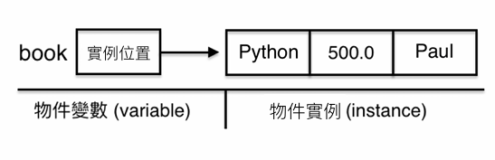
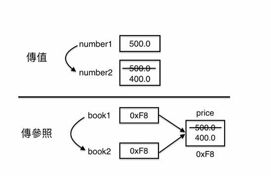

## 簡介
✤ Python 誕⽣<br>     • 1991 年<br>✤ Python 創始⼈<br>     • Guido Van Rossum<br>✤ Python ⽬前屬於<br>    • Python 軟體基⾦會 (Python Software Foundation, PSF)，2001 年成立<br>✤ Python 屬於開源 (open source)<br>   • 由社群治理、PSF 法律持有、全球開發者共同維護
## 特色
✤ Python 是直譯式、⾼階、通⽤型程式語⾔<br>✤ 可以在 Windows, Mac OS, Linux 上執⾏<br>✤ 語法簡潔並強調可讀性<br>✤ 具有物件導向功能
## language
### ✤ 直譯式語言 (interpreted language)
- 一邊讀一邊執行
-  寫完一小段程式可立即執行與除錯，調整方向，靈活度高
-  Python, JavaScript
### ✤ 編譯式語言 (compiled language)
- 使用編譯器 (compiler) 將程式碼先行翻譯成機器碼 (machine code) 後再執行
- 編譯式語言在執行速度，通常比直譯式語言快
- C, C++, Swift
## 函式庫概論
- 函式庫 (libraries) 是一組預先編寫好的程式碼，開發者在開發應用程<br>式 (app) 時可以直接使用它們，而無需從零開始撰寫所有程式碼
- 函式庫目的是為了提高重複利用性和開發效率
- 函式庫可分成
1.  標準函式庫 (Standard Libraries)
2.  第三方函式庫 (Third-Party Libraries)
✤ Python 有很龐⼤的第三⽅函式庫及其眾多的套件<br>✤ PyPI (Python Package Index) 是 Python 官⽅提供的套件平台，儲存<br>著⼤量第三⽅套件，供 Python 開發者下載使⽤<br>• PyPI 採「⾃由上傳 + 形式檢查 (非⼈⼯) + 社群事後監管」模式，⽽不採<br>App Store 事先審核<br>✤ pip 是 Python 官⽅的套件管理⼯具，⽽下載的套件預設就是來⾃<br>於 PyPI<br>• pip 指令說明
## IDE
✤ IDE (Integrated Development Environment)
• 整合開發上所需要的諸多功能於⼀個⼯具軟體上<br>• 可開發 Python 的 IDE ⼯具眾多，擇⼀安裝即可<br>✦<br>VS Code, Jupyter Notebook, Spyder, PyCharm<br>✤ VS Code (Visual Studio Code)<br>• Microsoft 提供的開源、免費且⽀援多平台、多語⾔的 IDE ⼯具<br>• 插件完整，現在已是 Python 開發的熱⾨ IDE ⼯具
## UV 建立虛擬環境 - 沒有設定檔
- 建立 UV 專案並進入該目錄
1. uv init myproj
2. cd myproj
- 安裝 Python (若已安裝，可跳過)
1. 先查看已安裝的 Python →  uv python list
- 安裝 Python
1.  uv python install
✴ Windows 會安裝至 "\~\\AppData\\Roaming\\uv\\python\\"<br>✴ MacOS 會安裝至 "\~/.local/share/uv/python/"
- 移除指定 Python (只要輸入版本號碼即可)
1. uv python uninstall 3.13 (移除 3.13 版)
- 建立預設虛擬環境 (會產生 .venv 目錄)
1. uv venv 啟用虛擬環境<br>deactivate 解除虛擬環境
2. snyc 就會自動掃到
## 變數宣告
✤ 電腦計算前必須將值先存入記憶體內，開發者必須想好該值<br>• 類型：整數、⽂字 (類似單位，不同類型屬於不同單位)<br>• 空間：給予確切類型就等於指定空間⼤⼩<br>• 變數名稱：⽅便之後識別⽤

✤ 宣告 (declare)<br>• 透過資料類型告知變數佔⽤的空間⼤⼩<br>✦<br>a: int  # 宣告 a 為 int 類型<br>✤ 類型推定<br>• 系統會依照值⾃動推定該變數屬於何種資料類型<br>✦ b = 20  # 因為 20 為整數，⾃動推定 b 為 int，所以可省略型別宣告
變數宣告
```javascript
# 可將型別宣告與值指派分開寫
a1: int  #型別宣告:先給類型，讓電腦設好儲存空間
a1 = 35  #指派35到a1這個空間
print(a1)

# 也可將宣告與值指派合併寫
a2: int = 35
print(a2)

# 因為 20 為整數，自動推定 b 為 int，所以可省略型別宣告
b = 20
print(b)

# 變數可以改指派新的值
a2 = 40
print(a2)
```
print 輸出方式
```javascript
num1 = 1
num2 = 2
sum1 = num1 + num2

# print() 列印完畢會換行
print(num1)
print(num2)

#會印出
# 1
# 2

# 列印完不想換行，使用 end 參數指定結束字串
print(num1, num2, end=", ")  #end = "  " 表示空白  end = "\n" 表示換行
print(sum1)

#會印出
# 1 2, 3

print(num1, num2, sum1)
# 會印出
# 1 2 3 因為預設為空白

print(num1, num2, sum1, sep="|")
# 會印出 
# 1 | 2 | 3

# 列印多個參數可使用 sep (separator) 指定分隔符號，
# 沒有使用 end 參數則列印完後仍會換行
print(num1, num2, sep=", ")
print(sum1)

# 1, 2
# 3

# 既指定分隔符號，也指定列印完的結果
print(num1, num2, sep=" + ", end=" = ")
print(sum1)

#會印出
# 1 + 2 = 3
```
## 程式代碼
✤ 程式內容由⼀個個程式代碼 (token) 組成，可分成<br>• 識別字 (identifier)
✦<br>✦<br>可⾃訂的名稱，例如變數、函式、類別名稱<br>num1 = 1<br>• 值 (literal)<br>✦<br>⽤來指派給變數，例如整數值 2 或⽂字值 "Hello"<br>✦ num2 = 2<br>• 符號 (symbol)<br>✦ 對直譯器有特殊意義的符號，不可⽤做識別字，最常⾒的就是運算符號<br>✦ num1 + num2<br>• 關鍵字 (keyword)<br>✦ 對直譯器有特殊意義的⽂字，不可⽤做識別字，例如 def<br>• 註解 (comment)<br>✦<br>「#」是註解，註解的內容不會被執⾏

✤ 識別字命名規則<br>• 區別⼤⼩寫 (case sensitive)<br>• 第 1 個字元不可為數字，其後字元⽅可為數字<br>✦<br>x1 (正確) ，1x (不正確)
• 不可為關鍵字 (例如 def) 或含有特殊功能的符<br>號 (例如加減符號)
✦ 底線不具特殊功能，所以變數名可以含有底線<br>✦ my_number = 20<br>• 有 snake case 與 camel case 命名法<br>✦ my_number = 20  # snake case
✦ myNumber = 20  # camel case
## Print
✤ 呼叫 Print() 可以⽂字模式輸出在螢幕上<br>• 輸出⽅式為：由上⾄下，由左⾄右，如同列表機⼀樣<br>✤ 列印完不想換⾏，使⽤ end 指定要取代換⾏的字串<br>• print(num1, end=", ")<br>黃彬華編撰<br>✤ 列印多個參數可使⽤ sep (separator) 指定分隔符號，但沒有使⽤<br>end 則列印完後仍舊會換⾏<br>• print(num1, num2, sep=", ")<br>✤ 既指定分隔符號，也指定列印完的結果<br>• print(num1, num2, sep=" + ", end=" = ")
## ⽂字類型與跳脫字元
✤ ⽂字類型：str<br>• 儲存多個字元，預設使⽤ Unicode
• 可以使⽤單引號 (single quotes) 或雙引號 (double quotes) 來包覆單⾏內容<br>✦ 「'Hello'」、「"Hello"」<br>• 可以使⽤三引號，「'''」(triple single quotes) 或「"""」(triple double<br>quotes) 來包覆多⾏內容<br>✤ 跳脫字元 (escaped character) 功能特殊，詳列如下<br>• \\n  換⾏ (line feed)<br>• \\t  相當於按tab鍵 (horizontal tab)<br>• \\r	 相當於按return鍵 (carriage return)<br>• \\’	 取消單引號原有功能，成為單純的單引號⽂字 (single quote)<br>• \\"	 取消雙引號原有功能，成為單純的雙引號⽂字 (double quote)<br>黃彬華編撰<br>• \\\\	 取消反斜線原有功能，成為單純的反斜線⽂字 (backslash)
### 文字串接
✤ 「+」串接 (concatenation)<br>• text1 = "Hello " + "World!"<br>• "a = " + str(a)  # 需呼叫 str() 將數字轉成⽂字後⽅能串接<br>✤ f-strings (formatted string literals) 串接<br>• Python 3.6 開始⽀援，字串中利⽤「\{\}」內嵌變數或程式碼<br>• f"a = \{a\}, b = \{b\}; a x b = \{a \* b\}"
### 格式化
✤ 可使⽤下列⽅式格式化 (format)<br>• f-strings<br>• str.format()
## 數字類型與算術運算符號
✤ 整數類型：int<br>• i  = 1<br>✤ 浮點數類型：float<br>• f = 3.14<br>✤ 常⽤算術運算符號<br>• + ：  加 (addition)
•-  ：  減 (subtraction)
• \*  ：  乘 (multiplication)
• /  ：  除法 - 取商 (division)
• // ：  整數除法 - 取商 (integer division，商為整數，不為⼩數)
• %：  除法 - 取餘數 (remainder)
黃彬華編撰<br>• \*\*：  次⽅
## 類型檢查與轉換
✤ type() ⽤於檢查型別<br>• type(1)：\<class 'int'\><br>✤ 整數與浮點數運算會⾃動轉為浮點數<br>• 1 + 11.1 會得到 12.1<br>✤ 型別轉換函式<br>• int(value) ⽤於轉成整數<br>• float(value) ⽤於轉成浮點數<br>• str(value) ⽤於轉成⽂字<br>✤ ⽂字轉數字有可能錯誤<br>黃彬華編撰<br>• int("18a")
## 擷取使⽤者輸入
✤ input(prompt) 可以提供提⽰⽂字讓使⽤者輸入，並於輸入完畢後擷<br>取使⽤者輸入的值<br>✤ 擷取到的是⽂字值，如需轉成數字，可搭配前述 int(value)、<br>float(value)，將⽂字轉成數字
## 複合指派運算符號
✤ 指派運算符號可以和其他運算符號結合，成為複合指派運算符號<br>(compound assignment operator)<br>• += ：   x += y 相當於 x = x + y<br>•-=  ：   x -= y 相當於 x = x - y<br>• \*=  ：   x \*= y 相當於 x = x \* y<br>• /=  ：   x /= y 相當於 x = x / y<br>• %=：   x %= y 相當於 x = x % y
## 布林類型與比較運算符號
✤ 布林類型 (bool)，只有下列 2 種值<br>• True (成立)<br>• False (不成立)<br>✤ 比較運算符號 (comparison operator) 如下，比較結果為布林類型<br>• \>  ： ⼤於 (greater than, a \> b)
• \>=： ⼤於或等於 (greater than or equal to, a \>= b)
• \<  ： ⼩於 (less than, a \< b)
• \<=： ⼩於或等於 (less than or equal to, a \<= b)
• ==： 等於 (equal to, a == b)
黃彬華編撰<br>• != ： 不等於 (not equal to, a != b)
## 邏輯運算符號
### AND
✤ AND 運算符號<br>• 所有條件為 True，最後結果才會為 True<br>• AND 速算 (short-circuit evaluation)<br>✦<br>只要任⼀條件為 False，其後條件式皆不予判斷，結果直接為 False
### OR
✤ OR 運算符號<br>• 只要有 1 個條件為 True，最後結果就為 True<br>• OR 速算：只要有任⼀條件為 True，直接得到結果為 True
### NOT
✤ NOT 運算符號<br>• 會讓布林值反轉，就是會讓 True 變成 False，False 變成 True<br>• ⼀般為了處理反向邏輯會使⽤ NOT
## 運算符號優先順序
✤ 當⼀個運算式有多個運算符號時，必須依照運算符號的優先順序 (operator<br>precedence) 來計算。優先順序⾼ \> 低如下：<br>• ( )：⼩括號 (parentheses)<br>• \*\*：次⽅、指數 (exponentiation)<br>• +x, -x, \~x：正、負、非 (unary positive, unary negative, bitwise not)<br>黃彬華編撰<br>• \*, /, //, %：乘、除、整數除法、取餘數 (multiplication, division, floor division, and modulus)<br>• +, -：加、減 (addition and subtraction)<br>• \<, \>, \<=, \>=, ==, !=, is, is not, in, not in：比較運算符號 (comparison operators)<br>• Boolean not：邏輯運算 非<br>• Boolean and：邏輯運算 且<br>• Boolean or：邏輯運算 或
## 流程控制導論
✤ 程式語⾔ 2 ⼤流程控制<br>• 條件控制 (conditional control)
✦ if 敘述句 (if statement)
✦ 條件運算式 (conditional expression)
✦ match-case 條列式比對<br>• 迴圈控制 (loop control)
✦ while 迴圈 (while loop)<br>✦ for 迴圈 (for loop)<br>✤ 要追蹤流程走向，可開啟 debug 模式觀察<br>• 程式⾏號旁加上中斷點<br>黃彬華編撰<br>• 點擊右上⾓執⾏按鈕旁的下拉圖⽰會跳出列表 \> Debug Python File
## 條件句
### if-else 敘述句
✤ if-else 是⼀種⼆分法<br>if 條件式:<br># 條件式為 True，執⾏此內容（需要內縮 4 格，才屬於 if 區塊）<br>else:<br># 條件式為 False，執⾏此內容（需要內縮 4 格，才屬於 else 區塊）
### if-else if-else 敘述句
✤ 可以加入 else if 來增加需要判斷的條件<br>if 條件式:<br># 條件式為 True，執⾏此內容（需要內縮 4 格）<br>elif 條件式:<br># elif（else if）條件式為 True，執⾏此內容（需要內縮 4 格）<br>else:<br># 以上條件式皆為 False，執⾏此內容（需要內縮 4 格）
### if-else 巢狀敘述句
✤ if-else 區塊內可以再置入 if-else 區塊，⽽形成所謂的 if-else 巢狀架構<br>if 條件式:<br>if 條件式:<br>#<br>程式內容<br>else:<br>#<br>程式內容<br>else:<br># 程式內容
### 單獨 if 敘述句
✤ 在某些邏輯判斷情況下，需要「多重選擇題」的架構，⽽非 if-else<br>的「單選題架構」。這個時候要改⽤單獨的 if 架構 (single if<br>statement)
if 條件式:<br># 程式內容<br>if 條件式:<br># 程式內容
### 條件運算式
✤ 邏輯觀念與 if-else 敘述句相同<br>• text = "\$10000" if score \>= 85 else "Nothing"<br>黃彬華編撰<br>✤ 條件運算式運算後會直接得到 1 個值，所以是運算式 (expression)
✤ if-else 條件判斷後不會得到⼀個值，⽽是⼀個程式區塊，稱為 if<br>else 敘述句 (statement)
### match-case 條列式比對
✤ Python 3.10 開始⽀援 match-case
✤ 適合⽤於列舉資料上<br>✤ 由上⾄下順序與 case 的值比對是否相同<br>• 值相同，就執⾏該 case 內容<br>• 值都不相同，就會執⾏ "case _" 內容<br>• 可以使⽤ "\|" (or) 功能
## 迴圈
### while 迴圈
✤ while 迴圈條件式為 True 時會執⾏該迴圈區塊的程式內容，直到條<br>件式為 False，才會結束 while 迴圈<br>while 條件式:<br># 程式內容
### for 迴圈
✤ for 利⽤ range() 函式設定控制變數的初始值、終⽌值和變化量<br>• 初始值與變化量都省略代表初始值為 0，變化量為遞增 1
### 巢狀迴圈
✤ 迴圈內再加入迴圈<br>for i in range(5):<br>for j in range(1, 11):<br>#<br>程式內容
### 特殊流程處理
✤ if + break 可以在特定條件時強制結束迴圈<br>✤ if + continue 可以強制結束該次迴圈執⾏，直接進入下次迴圈執⾏
## 集合導論
### 集合(collection)
專⾨⽤來儲存⼤量資料的容器
<table header-row="true">
<colgroup>
<col width="82">
<col width="85">
<col width="81">
<col width="91">
<col>
<col width="137.23959350585938">
</colgroup>
<tr>
<td>資料型態</td>
<td>是否有序</td>
<td>是否可變</td>
<td>是否可重複</td>
<td>特點說明</td>
<td>範例</td>
</tr>
<tr>
<td>tuple</td>
<td>有序</td>
<td>不可變</td>
<td>可重複</td>
<td>建立後不可修改，速度較快</td>
<td>(1, 2, 2, 3)</td>
</tr>
<tr>
<td>list</td>
<td>有序</td>
<td>可變</td>
<td>可重複</td>
<td>可新增刪除修改元素，最常用</td>
<td>\[1, 2, 2, 3\]</td>
</tr>
<tr>
<td>dict</td>
<td>無序</td>
<td>可變</td>
<td>鍵不可重複</td>
<td>以鍵值對儲存資料，查詢速度快</td>
<td>\{"id": 1, "name": "John", "age": 18\}</td>
</tr>
<tr>
<td>set</td>
<td>無序</td>
<td>可變</td>
<td>不可重複</td>
<td>會自動去除重複元素</td>
<td>\{1, 2, 3\}</td>
</tr>
</table>
### Tuple→( )
唯讀:  建立一個空間儲存元素(element)或是項目(item)，元素要事先設定好，並且在後續不能更正，但可以透過索引(idex)去取值。
<table header-row="true">
<tr>
<td>類別</td>
<td>說明</td>
<td>範例</td>
</tr>
<tr>
<td>基本特性</td>
<td>可儲存多個元素，可用索引取值</td>
<td>names = ("Python", "MySQL", "JS", "Python")</td>
</tr>
<tr>
<td>索引取值</td>
<td>使用 index 存取指定位置的元素</td>
<td>print(names\[0\])</td>
</tr>
<tr>
<td>常用函式 index</td>
<td>搜尋指定元素所在位置</td>
<td>names.index("Python")</td>
</tr>
<tr>
<td>常用函式 count</td>
<td>計算指定元素出現次數</td>
<td>names.count("Python")</td>
</tr>
<tr>
<td>常用函式 len</td>
<td>回傳元素個數</td>
<td>len(names)</td>
</tr>
<tr>
<td>迴圈取值</td>
<td>可用 for in 逐一取出元素</td>
<td>for name in names</td>
</tr>
<tr>
<td>元素型態</td>
<td>可存放不同資料型態</td>
<td>book = ("Python", 500, "Paul")</td>
</tr>
<tr>
<td>運算操作</td>
<td>支援相加與重複</td>
<td>tuple1 + tuple2 或 tuple1 \* 2</td>
</tr>
<tr>
<td>限制</td>
<td>無法新增修改刪除元素</td>
<td>不可變特性</td>
</tr>
<tr>
<td>使用建議</td>
<td>複雜資料處理建議使用 list</td>
<td>list 較彈性</td>
</tr>
</table>
```javascript
# tuple 可儲存多個值
names = ("Python", "MySQL", "JS", "Python")
print("names:", names)

-- names: ('Python', 'MySQL', 'JS', 'Python')

# 透過 index 取值
print("names[0]:", names[0])

-- names[0]: Python
# index(value)搜尋指定元素所在位置
print("names.index('Python'):", names.index('Python'))

-- names.index('Python'): 0

# count(value)計算指定元素出現幾次
print("names.count('Python'):", names.count('Python'))

-- names.count('Python'): 2

# len(tuple)回傳元素個數
print("len(names):", len(names))

-- len(names): 4

# 取出所有元素值
text = "所有書名: "
for name in names:
    text += name + " "
print(text)

-- 所有書名: Python MySQL JS Python

# tuple 可以加、乘
books01 = ("Python", "Java", "JS")
books02 = ("MySQL", "MongoDB")
print("books01 + books02:", books01 + books02)
print("books01 * 2:", books01 * 2)

-- books01 + books02: ('Python', 'Java', 'JS', 'MySQL', 'MongoDB')
-- books01 * 2: ('Python', 'Java', 'JS', 'Python', 'Java', 'JS')

# 元素類型可以不同
book = ("Python", 500, "Paul")
print("book1[1]:", book[1])

-- book1[1]: 500

# tuple 不支援值指派，會執行失敗
# names[2] = "Java"
```
### List→\[ \]
建立一個可以隨時修改的清單
#### 建立與取值
<table header-row="true">
<tr>
<td>類別</td>
<td>說明</td>
<td>範例</td>
</tr>
<tr>
<td>基本特性</td>
<td>與 tuple 類似，但 list 可以修改內容</td>
<td>list 可增刪改，tuple 不行</td>
</tr>
<tr>
<td>建立 list</td>
<td>可用中括號或 list 函式建立空 list</td>
<td>names = \[\] 或 names = list()</td>
</tr>
<tr>
<td>取得長度</td>
<td>使用 len 計算元素數量</td>
<td>len(names)</td>
</tr>
<tr>
<td>索引取值</td>
<td>用索引取得元素，超出範圍會出現 IndexError</td>
<td>names\[0\]</td>
</tr>
<tr>
<td>正索引</td>
<td>從前面開始計算位置</td>
<td>names\[0\]</td>
</tr>
<tr>
<td>負索引</td>
<td>從後面開始計算位置</td>
<td>names\[-1\]</td>
</tr>
<tr>
<td>區間索引</td>
<td>一次取得一段範圍的元素</td>
<td>names\[0:2\]</td>
</tr>
<tr>
<td>迴圈取值</td>
<td>使用 for in 逐一取得元素</td>
<td>for name in names</td>
</tr>
</table>
```javascript
# 建立好 list，但未存放元素
# names = []
# names = list()
# 使用 range() 建立 list 所需的數字值
numbers = list(range(1, 10, 2))
print("numbers:", numbers)

-- numbers: [1, 3, 5, 7, 9]

# 建立 list 並同時給予初始值
names = ["Python", "Java", "JS", "Swift", "C#"]
print("names:", names)

-- names: ['Python', 'Java', 'JS', 'Swift', 'C#']

# 取得 list 長度
print("len(names):", len(names))

--len(names): 5

# 取出索引為 0 的元素
print("names[0]:", names[0])

-- names[0]: Python

# 取後面數來第一個元素
print("names[-1]:", names[-1])

-- names[-1]: C#

# 索引超過界線會產生錯誤 IndexError: list index out of range
# print("names[5]:", names[5])
-- 
# 取索引 0 (含) 到 5 (不含) 的元素
print("names[0:5]:", names[0:5])
print("names[0:]:", names[0:])
print("names[:5]:", names[:5])
print("names[:]:", names[:])

--
names[0:5]: ['Python', 'Java', 'JS', 'Swift', 'C#']
names[0:]: ['Python', 'Java', 'JS', 'Swift', 'C#']
names[:5]: ['Python', 'Java', 'JS', 'Swift', 'C#']
names[:]: ['Python', 'Java', 'JS', 'Swift', 'C#']
--

# [start:stop:step]
print("names[0:5:2]:", names[0:5:2])

-- names[0:5:2]: ['Python', 'JS', 'C#']

# 取後面數來第 5 個 (含) 到第 1 個 (不含) 元素
print("names[-5:-1]:", names[-5:-1])

-- names[-5:-1]: ['Python', 'Java', 'JS', 'Swift']

# [3:0] 如同 range(3, 0, 1)，所以不會產生任何數字
print("names[3:0]:", names[3:0])

-- names[3:0]: []

# [3:0:-1] 如同 range(3, 0, -1)，可以反向取值
print("names[3:0:-1]:", names[3:0:-1])

-- names[3:0:-1]: ['Swift', 'JS', 'Java']

# 取出所有元素
print("for迴圈取出所有元素: ", end=" ")
for name in names:
    print(name, end=" ")
print()

-- for迴圈取出所有元素:  Python Java JS Swift C#
```

#### 切割輸入並轉成 List
```python
# 擷取使用者輸入的長寬高後，轉成數字並計算體積
cuboid = []
inputs = input("請輸入長寬高 (空白分隔): ").split()
for text in inputs:
    cuboid.append(int(text))

## 也可改成下列寫法
# 類似 for-in 迴圈
# cuboid = [int(number_str) for number_str in input("請輸入長寬高: ").split()]

# 使用 map(func, iterable)，func 參數為 int，會將每個元素轉成整數
# cuboid = list(map(int, input("請輸入長寬高: ").split()))

volume = 1
for number in cuboid:
    volume *= number
print("體積:", volume)

--
請輸入長寬高 (空白分隔): 12 14 16
體積: 2688
--
```
#### 內容異動
<table header-row="true">
<tr>
<td>類別</td>
<td>說明</td>
<td>範例</td>
</tr>
<tr>
<td>設定值</td>
<td>修改指定索引位置的元素</td>
<td>nums\[0\] = "new value"</td>
</tr>
<tr>
<td>附加值 append</td>
<td>在 list 最後加入一個元素</td>
<td>nums.append(10)</td>
</tr>
<tr>
<td>插入值 insert</td>
<td>在指定索引位置插入元素</td>
<td>nums.insert(1, 100)</td>
</tr>
<tr>
<td>移除指定值 remove</td>
<td>刪除指定的元素，若不存在會出現 ValueError</td>
<td>nums.remove(2)</td>
</tr>
<tr>
<td>移除指定索引 pop</td>
<td>刪除指定位置元素，若超出範圍會出現 IndexError</td>
<td>nums.pop(1)</td>
</tr>
<tr>
<td>移除末端值 pop</td>
<td>刪除最後一個元素，若為空會出現 IndexError</td>
<td>nums.pop()</td>
</tr>
<tr>
<td>清除內容 clear</td>
<td>清空整個 list</td>
<td>nums.clear()</td>
</tr>
<tr>
<td>複製 copy</td>
<td>建立一個新的 list，不是參照原本的</td>
<td>new_nums = nums.copy()</td>
</tr>
<tr>
<td>合併 list</td>
<td>將兩個 list 合併成一個新的</td>
<td>nums1 + nums2</td>
</tr>
</table>
```javascript
names = ["Python", "Java", "JS", "Swift", "C#"]
print("names:", names)
print("-" * 30)

# 設定值
names[0] = "Python 3"
print("修改索引 0 的值:\n", names)
print("-" * 30)

# 附加值
names.append("Ruby")
print("附加 Ruby:\n", names)
print("-" * 30)

# 插入值到指定索引
names.insert(5, "Go")
print("插入 Go 到索引 5 位置:\n", names)
print("-" * 30)

# 移除指定值，若無該值，產生ValueError
names.remove("Go")
print("移除 Go:\n", names)
print("-" * 30)

# 可先確定有值，然後再移除，以避免ValueError
if "Go" in names:
    names.remove("Go")
    print("移除 Go:\n", names)
else:
    print("找不到 Go，無法移除")
print("-" * 30)

# 移除指定索引的值，若list為空或索引超過界線，產生IndexError
print("移除索引 5 的值:", names.pop(5))
print("names:", names)
print("-" * 30)

# 移除末端值，若list為空，產生IndexError
print("移除末端值:", names.pop())
print("names:", names)
print("-" * 30)

# 複製一個新的 list，並非參照
names_copy = names.copy()
names_copy.pop()
print("複製 list:", names_copy)
print("-" * 30)

# 合併2個list
others = ["Go", "Ruby"]
list_combined = names + others
print("合併 list:", list_combined)
print("-" * 30)

# 清空list內容
names.clear()
print("清空 list:", names)

```
#### 排序
<table header-row="true">
<tr>
<td>類別</td>
<td>說明</td>
<td>範例</td>
</tr>
<tr>
<td>排序概念</td>
<td>將資料依照大小順序排列，通常由小到大</td>
<td>將 \[3, 1, 2\] 排成 \[1, 2, 3\]</td>
</tr>
<tr>
<td>sort 升冪排序</td>
<td>將 list 由小到大排序，會改變原本 list</td>
<td>nums.sort()</td>
</tr>
<tr>
<td>sort 降冪排序</td>
<td>將 list 由大到小排序</td>
<td>nums.sort(reverse=True)</td>
</tr>
<tr>
<td>reverse 反轉</td>
<td>只將元素順序反過來，不做大小比較</td>
<td>nums.reverse()</td>
</tr>
</table>
```python
import bisect

print("循序搜尋:")
numbers = [9, 1, 3, 7, 5, 6, 2, 8, 10, 4]
print("原始數列:", numbers)
target = int(input("欲搜尋的值: "))

# list 搭配 in 或 index() 都是使用循序搜尋法
if target in numbers:
    # 回傳搜尋到元素的索引，搜尋不到產生ValueError
    firstIndex = numbers.index(target)
    print(f"{target} 的索引: {firstIndex}")
else:
    print(f"{target} 不存在")

print("-" * 30)

print("二元搜尋:")
# 使用二元搜尋法一定要先排序
numbers.sort()
print("數列排序完:", numbers)
# bisect_left()不會判斷元素是否存在，它只是回傳「插入位置」
index = bisect.bisect_left(numbers, target)
print(f"{target} 的插入索引: {index}")

# 利用bisect_left()判斷元素是否存在
index = bisect.bisect_left(numbers, target)
if index < len(numbers) and numbers[index] == target:
    print(f"{target} 存在，索引: {index}")
else:
    print(f"{target} 不存在")

--
循序搜尋:
原始數列: [9, 1, 3, 7, 5, 6, 2, 8, 10, 4]
欲搜尋的值: 9
9 的索引: 0
------------------------------
二元搜尋:
數列排序完: [1, 2, 3, 4, 5, 6, 7, 8, 9, 10]
9 的插入索引: 8
9 存在，索引: 8
--
```
#### 關係運算符號
<table header-row="true">
<tr>
<td>類別</td>
<td>說明</td>
<td>範例</td>
</tr>
<tr>
<td>in</td>
<td>判斷元素是否存在於資料中，存在回傳 True</td>
<td>3 in \[1, 2, 3\]</td>
</tr>
<tr>
<td>not in</td>
<td>判斷元素是否不存在於資料中，不存在回傳 True</td>
<td>4 not in \[1, 2, 3\]</td>
</tr>
</table>
```python
names = ["Python AI", "Java", "JS", "Swift", "C#"]
# 檢查元素是否存在於 list
if "Python" in names:
    print("Element found.")
else:
    print("Element not found.")

# 檢查字串是否存在於另一個字串內
if "Python" in "Python AI":
    print("Substring found.")
else:
    print("Substring not found.")

# 應用：關鍵字搜尋
keyword = input("搜尋書名: ")
for name in names:
    if keyword.lower() in name.lower():
        print(name)

```
### Dictionary→\{ \}
dictionary 特⾊：內容為 key-value 資料、key 不可重複、value 可以重複
<table header-row="true">
<tr>
<td>類別</td>
<td>說明</td>
<td>範例</td>
</tr>
<tr>
<td>建立空 dictionary</td>
<td>建立一個沒有資料的 dictionary</td>
<td>book_dict = \{\} 或 book_dict = dict()</td>
</tr>
<tr>
<td>建立含資料 dictionary</td>
<td>建立同時放入多組鍵值對</td>
<td>\{"name": "Python", "price": 500, "author": "Paul"\}</td>
</tr>
<tr>
<td>取得 keys</td>
<td>取得所有鍵</td>
<td>book_dict.keys()</td>
</tr>
<tr>
<td>取得 values</td>
<td>取得所有值</td>
<td>book_dict.values()</td>
</tr>
<tr>
<td>資料存取</td>
<td>透過 key 存取對應的 value</td>
<td>book_dict\["name"\]</td>
</tr>
<tr>
<td>資料新增修改</td>
<td>使用 key 指定值，若 key 不存在則新增</td>
<td>book_dict\["price"\] = 600</td>
</tr>
<tr>
<td>資料刪除</td>
<td>刪除指定 key 的資料</td>
<td>del book_dict\["price"\]</td>
</tr>
<tr>
<td>特性</td>
<td>key 不可重複</td>
<td>\{"a": 1, "a": 2\} 最後只會保留一個</td>
</tr>
<tr>
<td>對比 list</td>
<td>key 類似 index，但可以自訂名稱</td>
<td>list 用數字 index，dict 用自訂 key</td>
</tr>
</table>
```python
# 建立好 dictionary，但未存放元素
book_dict = {}
book_dict = dict()

# 建立並同時存放資料
book_dict = {
    "name": "Python",
    "price": 500,
    "author": "Paul"
}
print("book_dict:", book_dict)

--book_dict: {'name': 'Python', 'price': 500, 'author': 'Paul'}

# 透過 key 取 value，若無該 key 會產生 KeyError
print("name:", book_dict["name"])

--name: Python

# 也可呼叫 get() 取值
# print("name:", book_dict.get("name"))

# 取得 dictionary 長度
print("len(book_dict):", len(book_dict))
print("-" * 30)

-- len(book_dict): 3

# 取得 keys
print("keys:", end=" ")
for key in book_dict.keys():
    print(key, end=" ")
print()
print("-" * 30)

--keys: name price author

# 取得 values
print("values:", end=" ")
for value in book_dict.values():
    print(value, end=" ")
print()
print("-" * 30)

--values: Python 500 Paul 

# 使用 items() 取得 keys 與 values
print("items:")
for key, value in book_dict.items():
    print(f"{key} - {value}")
print("-" * 30)

--
items:
name - Python
price - 500
author - Paul
--

# 檢查 key 是否存在
key = "price"
if key in book_dict:
    print(f"{key} 這個 key 已存在")
print("-" * 30)

--price 這個 key 已存在

# 改變指定 key 的 value
book_dict["author"] = "Peter"
print("author 值改為 Peter:\n", book_dict)
print("-" * 30)

--
author 值改為 Peter:
 {'name': 'Python', 'price': 500, 'author': 'Peter'}
--

# 新增 key - value
book_dict["isbn"] = "123456789012"
print("新增 isbn 資料:\n", book_dict)
print("-" * 30)

--
新增 isbn 資料:
 {'name': 'Python', 'price': 500, 'author': 'Peter', 'isbn': '123456789012'}
-- 

# 移除 key 代表的資料，若沒有該 key，產生 KeyError
book_dict.pop("isbn")
print("移除 isbn 資料:\n", book_dict)
print("-" * 30)

--
移除 isbn 資料:
 {'name': 'Python', 'price': 500, 'author': 'Peter'}
--

# 複製 dictionary
book_dictCopy = book_dict.copy()
print("複製 dictionary:\n", book_dictCopy)
print("-" * 30)

--
複製 dictionary:
 {'name': 'Python', 'price': 500, 'author': 'Peter'}
--

# 清空 dictionary 內容
book_dict.clear()
print("清空 dictionary 內容:", book_dict)

--
清空 dictionary 內容: {}
(venv) PS C:\Users\TMP-214\Desktop\python>
--
```
### Set
set 特⾊<br>• 不允許elemet元素值重複、不使⽤索引(沒有index)
#### 基本特性

<table header-row="true">
<tr>
<td>類別</td>
<td>說明</td>
<td>範例</td>
</tr>
<tr>
<td>基本特性</td>
<td>不允許重複元素，不使用索引</td>
<td>\{1, 2, 3\}</td>
</tr>
<tr>
<td>建立空 set</td>
<td>使用 set 函式建立空集合</td>
<td>names = set()</td>
</tr>
<tr>
<td>錯誤建立方式</td>
<td>使用大括號會變成 dictionary</td>
<td>names = \{\}</td>
</tr>
<tr>
<td>建立含資料 set</td>
<td>建立同時放入多個元素</td>
<td>\{"Python", "Java", "JS"\}</td>
</tr>
<tr>
<td>無索引特性</td>
<td>無法用位置存取元素</td>
<td>不可使用 names\[0\]</td>
</tr>
<tr>
<td>資料操作</td>
<td>可新增刪除元素，但不能用索引</td>
<td>names.add("C")</td>
</tr>
<tr>
<td>轉成 list</td>
<td>將 set 轉成 list</td>
<td>my_list = list(mySet)</td>
</tr>
<tr>
<td>list 轉 set</td>
<td>將 list 轉成 set，會自動去除重複</td>
<td>my_set = set(myList)</td>
</tr>
</table>
```python
# 建立好 set，但未存放元素
# names = set()
# 不可使用此方式建立 set，會被誤以為 dictionary
# names = {}
# 建立並同時存放文字元素
names = {"Python", "Java", "JS", "Swift", "C#"}

-- len(names): 5

# 取得 set 長度
print(f"len(names): {len(names)}")

-- len(names): 5

# 取出所有元素
print(f"for 迴圈走訪:", end=" ")
for name in names:
    print(name, end=" ")
print()

--for 迴圈走訪: JS Python Java C# Swift

# 檢查 set 是否存在指定值，沒有則新增
name = "Python"
if name in names:
    print(f"{name} 在其內")
else:
    names.add(name)

--Python 在其內
# 欲加入的元素如果與 set 內既存的元素值相同，則無法加入
names.add("Go")
print(f"新增 Go: {names}")

--新增 Go: {'JS', 'Python', 'Go', 'Java', 'C#', 'Swift'}

names.remove("Go")
# 使用 discard() 移除元素，即使沒有該元素也不會產生 KeyError
# names.discard("Go")
print(f"移除元素 Go: {names}")

--移除元素 Go: {'JS', 'Python', 'Java', 'C#', 'Swift'}

# 複製set
names_copy = names.copy()
print(f"複製 set: {names_copy}")

--複製 set: {'JS', 'Python', 'Java', 'C#', 'Swift'}

# set 轉成 list
my_list = list(names)
print(f"set 轉成 list: {my_list}")

--set 轉成 list: ['JS', 'Python', 'Java', 'C#', 'Swift']

# list 轉成 set (list 元素值如有重複會被去除)
my_set = set(my_list)
print(f"list 轉成 set: {my_set}")

--list 轉成 set: {'Java', 'C#', 'JS', 'Python', 'Swift'}

# 清空 set 內容
names.clear()
print(f"清空 set: {names}")

--清空 set: set()

```

#### 數學集合功能
intersection 是「重疊的」<br>union 是「全部加起來」<br>symmetric_difference 是「不重疊的」
subset 是「小的在大的裡面」<br>superset 是「大的包含小的」<br>disjoint 是「完全沒交集」
<table header-row="true">
<tr>
<td>類別</td>
<td>說明</td>
<td>範例</td>
</tr>
<tr>
<td>intersection</td>
<td>取兩個集合的交集（共同元素）</td>
<td>\{1, 2, 3\}.intersection(\{2, 3, 4\}) → \{2, 3\}</td>
</tr>
<tr>
<td>union</td>
<td>取兩個集合的聯集（全部元素不重複）</td>
<td>\{1, 2\}.union(\{2, 3\}) → \{1, 2, 3\}</td>
</tr>
<tr>
<td>symmetric_difference</td>
<td>取聯集減交集（只保留不重複的部分）</td>
<td>\{1, 2, 3\}.symmetric_difference(\{2, 3, 4\}) → \{1, 4\}</td>
</tr>
<tr>
<td>issubset</td>
<td>判斷是否為子集合</td>
<td>\{1, 2\}.issubset(\{1, 2, 3\}) → True</td>
</tr>
<tr>
<td>issuperset</td>
<td>判斷是否為父集合</td>
<td>\{1, 2, 3\}.issuperset(\{1, 2\}) → True</td>
</tr>
<tr>
<td>isdisjoint</td>
<td>判斷兩集合是否完全沒有共同元素</td>
<td>\{1, 2\}.isdisjoint(\{3, 4\}) → True</td>
</tr>
</table>
```python
# set數學集合運算
a = {1, 2, 3, 4, 5}
b = {4, 5, 6, 7, 8}
c = {1, 2}
d = {1, 2}
print(f"a: {a}")
print(f"b: {b}")
print(f"c: {c}")
print(f"d: {d}")
print(f"a.intersection(b): {a.intersection(b)}")
print(f"a.union(b): {a.union(b)}")
print(f"a.symmetric_difference(b): {a.symmetric_difference(b)}")
print(f"c.issubset(a): {c.issubset(a)}")
print(f"c.issubset(d): {c.issubset(d)}")
print(f"a.issuperset(c): {a.issuperset(c)}")
print(f"b.isdisjoint(c): {b.isdisjoint(c)}")
print(f"c == d: {c == d}")
print(f"c is d: {c is d}")

--
a: {1, 2, 3, 4, 5}
b: {4, 5, 6, 7, 8}
c: {1, 2}
d: {1, 2}
a.intersection(b): {4, 5}
a.union(b): {1, 2, 3, 4, 5, 6, 7, 8}
a.symmetric_difference(b): {1, 2, 3, 6, 7, 8}
c.issubset(a): True
c.issubset(d): True
a.issuperset(c): True
b.isdisjoint(c): True
c == d: True #值相同
c is d: False #值相同，不同人
--

```
## 函式 (function)
### 定義
✤ 函式 (function)<br>• ⾃成⼀個程式區塊 (block)<br>• 執⾏特定功能或特定計算<br>✤ 函式有<br>• 名稱<br>✦ ⽅便被呼叫<br>• 參數 (parameter)<br>✦ 可以不定義參數；有定義參數則⽅便傳遞不同的變量，處理不同情況<br>• 回傳值 (return value)<br>黃彬華編撰<br>✦ 可以沒有回傳值；但有定義回傳值可將計算完畢結果回傳
### 引數打包與拆解
✤ 函式呼叫⽀援 list / tuple 與 dictionary 引數⾃動打包 (packing) 與拆<br>解 (unpacking)<br>• list / tuple：使⽤「\*」<br>• dictionary：使⽤「\*\*」
### 遞迴函式概論
✤ 重複不斷做同樣的事情，可以透過重複不斷呼叫同⼀個函式以達到<br>程式重複利⽤⽬的，此為遞迴函式 (recursive function) 的應⽤<br>✤ 需要有終⽌條件，否則會⼀直遞迴下去無法中⽌<br>✤ 遞迴函式功能通常也可使⽤迴圈功能取代
遞迴函數: 每一次執行都會產生一層stack
Stack: 每次呼叫函式<br>Python 都要記住：
- 目前變數
- 執行位置
- return 點
<table header-row="true">
<tr>
<td>比較</td>
<td>遞迴</td>
<td>迴圈</td>
</tr>
<tr>
<td>記憶體</td>
<td>高</td>
<td>低</td>
</tr>
<tr>
<td>速度</td>
<td>較慢</td>
<td>較快</td>
</tr>
<tr>
<td>stack</td>
<td>會一直增加</td>
<td>不會</td>
</tr>
<tr>
<td>深度限制</td>
<td>有</td>
<td>幾乎沒有</td>
</tr>
</table>
### 指派
✤ 定義<br>• def divide(dividend, divisor):<br>✤ 指派<br>• 像變數指派⼀樣，將⼀個函式指派給其他函式<br>✦ op_func = divide<br>✤ 呼叫<br>• 呼叫被指派的函式就等於呼叫原來的函式<br>✦ op_func(10, 2)
### 函式當參數 函式型參數（function parameter）
✤ 定義<br>• def calculate(num1, num2, op_func):<br>✤ 呼叫<br>• calculate(10, 2, divide)<br>✦ 將 divide 函式指派給 op_func 參數
### lambda
✤ lambda 是⼀個沒有名字、極其簡化的函式<br>• 必須是運算式，所以無需加上return<br>✦<br>• 定義：<br>lambda parameters : expression<br>✴ parameters：參數，可以多個<br>✴<br>expression：運算式<br>✤ 可以將 lambda 指派給變數<br>✤ 常⽤於函式型參數的傳遞

## 物件導向
類似表格觀念<br>黃彬華編撰<br>✤ 如果以傳統⽅式來記錄書籍資料，最直覺的⽅式就是建立表格來儲存<br>✤ 物件導向的觀念，就是將⼀本書以⼀個物件來表⽰，也同樣要將該物<br>件所儲存的資訊填到表格內，只不過這張表格是放在記憶體裡

建立過程<br>✤ 建立物件的過程非常類似建立表格內的⼀筆資料<br>✤ 建立表格<br>• 定義標題與欄位<br>• 建立⼀筆資料以記錄⼀本書籍資訊<br>✤ 建立物件<br>• 定義類別與屬性<br>• 建立⼀個物件以儲存⼀本書籍資訊

類別與物件<br>✤ 定義類別 (class)<br>• 定義建構函式 (官⽅稱為 constructor，也可稱為 initializer)
✦ ⽅便建立並初始化物件<br>• 定義屬性 (官⽅稱為 attribute，也可稱為 instance variable)<br>黃彬華編撰<br>✦ Python 屬性定義在建構函式內：Python 物件本質上是 dictionary，所以屬性可以動態新增⽽<br>無需事先定義<br>✤ 建立物件 (object)<br>• 呼叫建構函式會建立物件及其實例 (instance)<br>• book = Book("Python", 500, "Paul")


⽅法<br>✤ 類別定義的函式稱作⽅法 (method)<br>• 提供給物件呼叫的⽅法第⼀個參數代表現⾏物件，名稱習慣為 self<br>• 類別內不能重複定義⽅法 (名稱不可相同)

建構函式與⽅法<br>✤ 建構函式雖然很像⽅法，但是有 3 個不同點<br>• 建構函式有固定名稱，⼀般⽅法則無<br>✦<br>✦<br>建構函式名稱必須為「 **init**() 」<br>⼀般⽅法可隨意取名，只要符合識別字命名規則即可<br>• 建構函式無回傳值，⼀般⽅法可有可無<br>✦ 建構函式主要⽬的在設定屬性初始值，所以不需要回傳值<br>• 呼叫時機不同<br>✦ 建立物件時才會呼叫建構函式；每次呼叫建構函式都會產⽣不同物件<br>✦ 物件產⽣後才會呼叫⽅法，⽽且同⼀個物件可以呼叫多次

傳值與傳參照有什麼差別？<br>✤ 傳值 (pass by value)
• 以複製值的⽅式做指派<br>• int, float 等基本類型屬之<br>✤ 傳參照 (pass by reference)
• 以複製位置⽅式做指派<br>• list, 物件指派時屬於傳參照


## 常⽤資料處理函式
#### 數學運算函式
<table header-row="true">
<tr>
<td>類型</td>
<td>函式 / 屬性</td>
<td>功能</td>
<td>範例</td>
<td>結果</td>
</tr>
<tr>
<td>builtins</td>
<td>`abs(x)`</td>
<td>絕對值</td>
<td>`abs(-1.1)`</td>
<td>`1.1`</td>
</tr>
<tr>
<td>builtins</td>
<td>`pow(x, y)`</td>
<td>次方</td>
<td>`pow(2, 3)`</td>
<td>`8`</td>
</tr>
<tr>
<td>builtins</td>
<td>`max()`</td>
<td>最大值</td>
<td>`max(1.1, 2.1)`</td>
<td>`2.1`</td>
</tr>
<tr>
<td>builtins</td>
<td>`min()`</td>
<td>最小值</td>
<td>`min(1.1, 2.1)`</td>
<td>`1.1`</td>
</tr>
<tr>
<td>builtins</td>
<td>`round(x)`</td>
<td>四捨五入</td>
<td>`round(1.67)`</td>
<td>`2`</td>
</tr>
<tr>
<td>builtins</td>
<td>`round(x, n)`</td>
<td>保留小數位數</td>
<td>`round(1.37, 1)`</td>
<td>`1.4`</td>
</tr>
<tr>
<td>builtins</td>
<td>`sum()`</td>
<td>加總</td>
<td>`sum([1,2,3])`</td>
<td>`6`</td>
</tr>
<tr>
<td>math module</td>
<td>`math.pi`</td>
<td>圓周率</td>
<td>`math.pi`</td>
<td>`3.14159...`</td>
</tr>
<tr>
<td>math module</td>
<td>`math.ceil(x)`</td>
<td>無條件進位</td>
<td>`math.ceil(1.37)`</td>
<td>`2`</td>
</tr>
<tr>
<td>math module</td>
<td>`math.floor(x)`</td>
<td>無條件捨去</td>
<td>`math.floor(1.67)`</td>
<td>`1`</td>
</tr>
<tr>
<td>math module</td>
<td>`math.sqrt(x)`</td>
<td>平方根</td>
<td>`math.sqrt(9)`</td>
<td>`3.0`</td>
</tr>
<tr>
<td>math module</td>
<td>`math.log(x, b)`</td>
<td>對數</td>
<td>`math.log(1024, 2)`</td>
<td>`10.0`</td>
</tr>
<tr>
<td>math module</td>
<td>`math.radians(x)`</td>
<td>角度 → 弧度</td>
<td>`math.radians(60)`</td>
<td>`1.047...`</td>
</tr>
<tr>
<td>math module</td>
<td>`math.degrees(x)`</td>
<td>弧度 → 角度</td>
<td>`math.degrees(1)`</td>
<td>`57.29...`</td>
</tr>
<tr>
<td>math module</td>
<td>`math.sin(x)`</td>
<td>正弦值</td>
<td>`math.sin(math.radians(60))`</td>
<td>`0.866...`</td>
</tr>
</table>
<table header-row="true">
<tr>
<td>函式</td>
<td>功能</td>
<td>範例</td>
<td>範圍 / 特點</td>
</tr>
<tr>
<td>`random.randint(a, b)`</td>
<td>產生整數亂數</td>
<td>`random.randint(1, 100)`</td>
<td>`[1,100]`，包含 100</td>
</tr>
<tr>
<td>`random.randrange(a, b)`</td>
<td>產生整數亂數</td>
<td>`random.randrange(1, 100)`</td>
<td>`[1,100)`，不包含 100</td>
</tr>
<tr>
<td>`random.randrange(a, b, step)`</td>
<td>指定間隔亂數</td>
<td>`random.randrange(2,100,2)`</td>
<td>偶數亂數</td>
</tr>
<tr>
<td>`random.choices(data, k=n)`</td>
<td>可重複抽樣</td>
<td>`random.choices(range(1,100), k=6)`</td>
<td>可重複</td>
</tr>
<tr>
<td>`random.sample(data, k=n)`</td>
<td>不重複抽樣</td>
<td>`random.sample(range(1,100), k=6)`</td>
<td>不重複</td>
</tr>
<tr>
<td>`random.uniform(a, b)`</td>
<td>浮點數亂數</td>
<td>`random.uniform(1,100)`</td>
<td>浮點數</td>
</tr>
<tr>
<td>`random.choice(data)`</td>
<td>隨機取 1 個元素</td>
<td>`random.choice(books)`</td>
<td>從集合中取一個</td>
</tr>
<tr>
<td>`random.shuffle(data)`</td>
<td>隨機洗牌</td>
<td>`random.shuffle(books)`</td>
<td>原 list 直接改變</td>
</tr>
</table>
#### 字串運算函式
<table header-row="true">
<tr>
<td>語法</td>
<td>功能</td>
<td>結果</td>
</tr>
<tr>
<td>`len(text)`</td>
<td>長度</td>
<td>`5`</td>
</tr>
<tr>
<td>`text[1]`</td>
<td>取值</td>
<td>`'e'`</td>
</tr>
<tr>
<td>`text[2:5]`</td>
<td>切片</td>
<td>`'llo'`</td>
</tr>
<tr>
<td>`index()`</td>
<td>找索引</td>
<td>`2`</td>
</tr>
<tr>
<td>`startswith()`</td>
<td>判斷開頭</td>
<td>`True`</td>
</tr>
<tr>
<td>`endswith()`</td>
<td>判斷結尾</td>
<td>`True`</td>
</tr>
<tr>
<td>`in`</td>
<td>判斷存在</td>
<td>`True`</td>
</tr>
<tr>
<td>`upper()`</td>
<td>大寫</td>
<td>`"HELLO"`</td>
</tr>
<tr>
<td>`lower()`</td>
<td>小寫</td>
<td>`"hello"`</td>
</tr>
<tr>
<td>`strip()`</td>
<td>去空白</td>
<td>`"Hello"`</td>
</tr>
<tr>
<td>`replace()`</td>
<td>取代</td>
<td>`"Heooo"`</td>
</tr>
</table>
#### 日期運算函式
<table header-row="true">
<tr>
<td>語法</td>
<td>功能</td>
<td>範例</td>
</tr>
<tr>
<td>`datetime.now()`</td>
<td>現在日期時間</td>
<td>`2026-05-22 14:30:15`</td>
</tr>
<tr>
<td>`date.today()`</td>
<td>今天日期</td>
<td>`2026-05-22`</td>
</tr>
<tr>
<td>`datetime(...)`</td>
<td>指定日期時間</td>
<td>`datetime(2000,1,1,23)`</td>
</tr>
<tr>
<td>`date(...)`</td>
<td>指定日期</td>
<td>`date(2000,1,1)`</td>
</tr>
<tr>
<td>`.year`</td>
<td>年</td>
<td>`2026`</td>
</tr>
<tr>
<td>`.month`</td>
<td>月</td>
<td>`5`</td>
</tr>
<tr>
<td>`.day`</td>
<td>日</td>
<td>`22`</td>
</tr>
<tr>
<td>`.hour`</td>
<td>小時</td>
<td>`14`</td>
</tr>
<tr>
<td>`.minute`</td>
<td>分鐘</td>
<td>`30`</td>
</tr>
<tr>
<td>`.second`</td>
<td>秒</td>
<td>`15`</td>
</tr>
<tr>
<td>`.weekday()`</td>
<td>星期幾</td>
<td>`0~6`</td>
</tr>
<tr>
<td>`timestamp()`</td>
<td>轉時間戳記</td>
<td>秒數</td>
</tr>
</table>
日期時間計算
<table header-row="true">
<tr>
<td>主題</td>
<td>功能</td>
<td>常用寫法</td>
<td>重點</td>
</tr>
<tr>
<td>`datetime`</td>
<td>表示日期與時間</td>
<td>`datetime.now()`</td>
<td>表示「某個時間點」</td>
</tr>
<tr>
<td>`timedelta`</td>
<td>固定時間差</td>
<td>`timedelta(days=1)`</td>
<td>支援天、小時、分鐘</td>
</tr>
<tr>
<td>`relativedelta`</td>
<td>曆法時間差</td>
<td>`relativedelta(years=1)`</td>
<td>支援年、月、日</td>
</tr>
</table>
datetime 重點
<table header-row="true">
<tr>
<td>功能</td>
<td>寫法</td>
<td>說明</td>
</tr>
<tr>
<td>取得現在時間</td>
<td>`datetime.now()`</td>
<td>取得目前日期時間</td>
</tr>
<tr>
<td>建立指定時間</td>
<td>`datetime(2026, 5, 22)`</td>
<td>建立日期物件</td>
</tr>
<tr>
<td>比較時間</td>
<td>`now > birthday`</td>
<td>回傳 `True/False`</td>
</tr>
</table>
timedelta 重點
<table header-row="true">
<tr>
<td>功能</td>
<td>寫法</td>
<td>說明</td>
</tr>
<tr>
<td>建立一天</td>
<td>`timedelta(days=1)`</td>
<td>建立 1 天時間差</td>
</tr>
<tr>
<td>加一天</td>
<td>`now + timedelta(days=1)`</td>
<td>往後一天</td>
</tr>
<tr>
<td>減一天</td>
<td>`now - timedelta(days=1)`</td>
<td>往前一天</td>
</tr>
<tr>
<td>算相差時間</td>
<td>`now - birthday`</td>
<td>得到 timedelta</td>
</tr>
<tr>
<td>取得天數</td>
<td>`delta.days`</td>
<td>取得相差幾天</td>
</tr>
</table>
relativedelta 重點
<table header-row="true">
<tr>
<td>功能</td>
<td>寫法</td>
<td>說明</td>
</tr>
<tr>
<td>建立一年</td>
<td>`relativedelta(years=1)`</td>
<td>增加 1 年</td>
</tr>
<tr>
<td>建立月份</td>
<td>`relativedelta(months=2)`</td>
<td>增加 2 個月</td>
</tr>
<tr>
<td>加減年月</td>
<td>`now + relativedelta(years=1)`</td>
<td>支援年/月</td>
</tr>
<tr>
<td>算年齡</td>
<td>`relativedelta(now, birthday)`</td>
<td>自動算年月日</td>
</tr>
</table>
<table header-row="true">
<tr>
<td>比較項目</td>
<td>timedelta</td>
<td>relativedelta</td>
</tr>
<tr>
<td>天</td>
<td>✅</td>
<td>✅</td>
</tr>
<tr>
<td>小時</td>
<td>✅</td>
<td>✅</td>
</tr>
<tr>
<td>月</td>
<td>❌</td>
<td>✅</td>
</tr>
<tr>
<td>年</td>
<td>❌</td>
<td>✅</td>
</tr>
<tr>
<td>適合算年齡</td>
<td>❌</td>
<td>✅</td>
</tr>
<tr>
<td>適合固定時間差</td>
<td>✅</td>
<td>✅</td>
</tr>
</table>
# 常考重點
<table header-row="true">
<tr>
<td>問題</td>
<td>答案</td>
</tr>
<tr>
<td>為什麼 `timedelta` 不支援月份？</td>
<td>每月天數不同</td>
</tr>
<tr>
<td>算年齡要用什麼？</td>
<td>`relativedelta`</td>
</tr>
<tr>
<td>`datetime` 是什麼？</td>
<td>某個時間點</td>
</tr>
<tr>
<td>`timedelta` 是什麼？</td>
<td>固定時間差</td>
</tr>
<tr>
<td>`relativedelta` 是什麼？</td>
<td>曆法時間差</td>
</tr>
</table>
# 超常用範例
<table header-row="true">
<tr>
<td>功能</td>
<td>程式</td>
</tr>
<tr>
<td>現在時間</td>
<td>`datetime.now()`</td>
</tr>
<tr>
<td>加一天</td>
<td>`now + timedelta(days=1)`</td>
</tr>
<tr>
<td>算天數差</td>
<td>`(now - birthday).days`</td>
</tr>
<tr>
<td>算年齡</td>
<td>`relativedelta(now, birthday)`</td>
</tr>
<tr>
<td>加一年</td>
<td>`now + relativedelta(years=1)`</td>
</tr>
</table>
